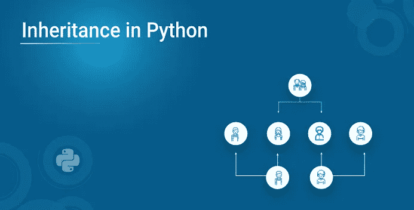
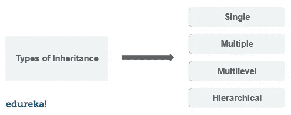

# Python 中的继承

> 原文：<https://medium.com/edureka/inheritance-in-python-eab5c0456b7?source=collection_archive---------2----------------------->



Python 编程语言很容易学习，并且适用于过程式和面向对象的编程方法。继承是面向对象编程中的一个概念。代码可重用性是继承的强项，当我们在 Python 上工作时，它在很多应用程序中都有帮助。以下是本文中讨论的概念:

1.  什么是继承？

2.初始化功能

3.继承的类型

*   单一遗传
*   多重遗传
*   多级遗传
*   分层继承
*   混合遗传

4.Python super()函数

5.Python 方法覆盖

# 什么是继承？

将父类的属性继承到子类的方法称为继承。这是一个面向对象的概念。以下是继承的好处。

1.  代码可重用性——我们不必一次又一次地编写相同的代码，我们可以在子类中继承我们需要的属性。
2.  它表示父类和子类之间的真实关系。
3.  它在本质上是可传递的。如果子类从父类继承属性，那么子类的所有其他子类也将继承父类的属性。

下面是 Python 中一个简单的继承例子。

```
**class** Parent():
**def** first(self):
print('first function')**class** Child(Parent):
**def** second(self):
print('second function')ob **=** Child()
ob.first()
ob.second()
```

**输出:** 第一功能
第二功能

在上面的程序中，您可以使用子类对象来访问父类函数。

## 子分类

通过在子类的声明中提到父类名来调用父类的构造函数称为子类化。子类通过子类化来识别它的父类。

# __init__()函数

__init__()函数在每次使用类创建对象时被调用。当我们在父类中添加 __init__()函数时，子类将不再能够继承父类的 __init__()函数。子类的 __init__()函数覆盖父类的 __init__()函数。

```
**class** Parent:
    **def** __init__(self , fname, fage):
        self.firstname **=** fname
        self.age **=** fage
   **def** view(self):
       print(self.firstname , self.age)
**class** Child(Parent):
      **def** __init__(self , fname , fage):
      Parent.__init__(self, fname, fage)
       self.lastname **=** "edureka"
     **def** view(self):
     print("course name" , self.firstname ,"first came",  self.age ,     " years ago." , self.lastname, " has courses to master python")
ob **=** Child("Python" , '28')
ob.view()
```

# 继承的类型

根据所涉及的子类和父类的数量，python 中有四种类型的继承。



## 单一遗传

当子类只继承一个父类时。

```
**class** Parent:
      **def** func1(self):
           print("this is function one")
**class** Child(Parent):
      **def** func2(self):
            print(" this is function 2 ")
ob **=** Child()
ob.func1()
ob.func2()
```

## 多重遗传

当子类从多个父类继承时。

```
**class** Parent:
     **def** func1(self):
         print("this is function 1")
**class** Parent2:
      **def** func2(self):
           print("this is function 2")
**class** Child(Parent , Parent2):
     **def** func3(self):
          print("this is function 3")ob **=** Child()
ob.func1()
ob.func2()
ob.func3()
```

## 多级遗传

当一个子类成为另一个子类的父类时。

```
**class** Parent:
      **def** func1(self):
           print("this is function 1")
**class** Child(Parent):
      **def** func2(self):
      print("this is function 2")
**class** Child2(Child):
      **def** func3("this is function 3")
ob **=** Child2()
ob.func1()
ob.func2()
ob.func3()
```

## 分层继承

分层继承涉及来自同一个基类或父类的多重继承。

```
**class** Parent:
      **def** func1(self):
          print("this is function 1")
**class** Child(Parent):
      **def** func2(self):
          print("this is function 2")
**class** Child2(Parent):
     **def** func3(self):
         print("this is function 3")
ob **=** Child()
ob1 **=** Child2()
ob.func1()
ob.func2()
```

## 混合遗传

混合继承涉及发生在单个程序中的多个继承。

```
**class** Parent:
      **def** func1(self):
          print("this is function one")**class** Child(Parent):
      **def** func2(self):
           print("this is function 2")**class** Child1(Parent):
      **def** func3(self):
       print(" this is function 3"):**class** Child3(Parent , Child1):
      **def** func4(self):
           print(" this is function 4")
ob **=** Child3()
ob.func1()
```

# Python Super()函数

超级函数允许我们从父类调用一个方法。

```
**class** Parent:
      **def** func1(self):
          print("this is function 1")
**class** Child(Parent):
      **def** func2(self):
          Super().func1()
          print("this is function 2")
ob **=** Child()
ob.func2()
```

# Python 方法覆盖

**方法覆盖** 你可以在 python 中覆盖一个方法。看看下面的例子。

```
**class** Parent:
**def** func1(self):
print("this is parent function")**class** Child(Parent):
**def** func1(self):
print("this is child function")ob **=** Child()
ob.func1()
```

父类方法的功能通过在子类中重写相同的方法来改变。

继承是面向对象的最重要的概念之一。它提供了代码的可重用性、可读性和属性转换，这有助于优化和高效的代码构建。Python 编程语言加载了继承等概念。在最近的市场上，巨大的 python 应用程序需要越来越多的 python 程序员。

如果你想查看更多关于人工智能、DevOps、道德黑客等市场最热门技术的文章，你可以参考 Edureka 的官方网站。

请留意本系列中的其他文章，它们将解释 Python 和数据科学的各个方面。

> *1。*[*Python 中的机器学习分类器*](/edureka/machine-learning-classifier-c02fbd8400c9)
> 
> *2。*[*Python Scikit-Learn Cheat Sheet*](/edureka/python-scikit-learn-cheat-sheet-9786382be9f5)
> 
> *3。* [*机器学习工具*](/edureka/python-libraries-for-data-science-and-machine-learning-1c502744f277)
> 
> *4。* [*用于数据科学和机器学习的 Python 库*](/edureka/python-libraries-for-data-science-and-machine-learning-1c502744f277)
> 
> *5。*[*Python 中的聊天机器人*](/edureka/how-to-make-a-chatbot-in-python-b68fd390b219)
> 
> *6。* [*Python 集合*](/edureka/collections-in-python-d0bc0ed8d938)
> 
> *7。* [*Python 模块*](/edureka/python-modules-abb0145a5963)
> 
> *8。* [*Python 开发者技能*](/edureka/python-developer-skills-371583a69be1)
> 
> *9。* [*哎呀面试问答*](/edureka/oops-interview-questions-621fc922cdf4)
> 
> *10。*[*Python 开发者简历*](/edureka/python-developer-resume-ded7799b4389)
> 
> *11。*[*Python 中的探索性数据分析*](/edureka/exploratory-data-analysis-in-python-3ee69362a46e)
> 
> *12。* [*蛇与蟒蛇的游戏*](/edureka/python-turtle-module-361816449390)
> 
> 13。 [*Python 开发者工资*](/edureka/python-developer-salary-ba2eff6a502e)
> 
> 14。 [*主成分分析*](/edureka/principal-component-analysis-69d7a4babc96)
> 
> *15。*[*Python vs c++*](/edureka/python-vs-cpp-c3ffbea01eec)
> 
> *16。* [*刺儿头教程*](/edureka/scrapy-tutorial-5584517658fb)
> 
> 17。[*Python SciPy*](/edureka/scipy-tutorial-38723361ba4b)
> 
> 18。 [*最小二乘回归法*](/edureka/least-square-regression-40b59cca8ea7)
> 
> 19。 [*Jupyter 笔记本小抄*](/edureka/jupyter-notebook-cheat-sheet-88f60d1aca7)
> 
> *20。* [*Python 基础知识*](/edureka/python-basics-f371d7fc0054)
> 
> *21。* [*Python 模式程序*](/edureka/python-pattern-programs-75e1e764a42f)
> 
> *22。* [*网页抓取用 Python*](/edureka/web-scraping-with-python-d9e6506007bf)
> 
> *23。* [*Python 装饰器*](/edureka/python-decorator-tutorial-bf7b21278564)
> 
> *24。*[*Python Spyder IDE*](/edureka/spyder-ide-2a91caac4e46)
> 
> *25。*[*Python 中使用 Kivy 的移动应用*](/edureka/kivy-tutorial-9a0f02fe53f5)
> 
> *26。* [*十大最佳学习书籍&练习 Python*](/edureka/best-books-for-python-11137561beb7)
> 
> *27。* [*机器人框架与 Python*](/edureka/robot-framework-tutorial-f8a75ab23cfd)
> 
> *28。*[*Python 中的贪吃蛇游戏*](/edureka/snake-game-with-pygame-497f1683eeaa)
> 
> *29。* [*Django 面试问答*](/edureka/django-interview-questions-a4df7bfeb7e8)
> 
> *三十。* [*十大 Python 应用*](/edureka/python-applications-18b780d64f3b)
> 
> *31。*[*Python 中的哈希表和哈希表*](/edureka/hash-tables-and-hashmaps-in-python-3bd7fc1b00b4)
> 
> 32。 [*Python 3.8*](/edureka/whats-new-python-3-8-7d52cda747b)
> 
> 33。 [*支持向量机*](/edureka/support-vector-machine-in-python-539dca55c26a)
> 
> 34。 [*Python 教程*](/edureka/python-tutorial-be1b3d015745)

*原载于 2019 年 7 月 19 日 https://www.edureka.co**T21*[。](https://www.edureka.co/blog/inheritance-in-python/)