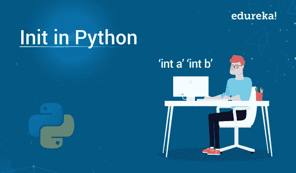

# Python 中的 Init:您需要知道的一切

> 原文：<https://medium.com/edureka/init-in-python-39c14afb2986?source=collection_archive---------1----------------------->



Python *是当今业界最流行的编码平台之一。从业余爱好者到专业人士，每个人都使用 Python 来编写和制作移动和 web 应用程序。作为一个如此多功能的平台，有些方面并不为用户所熟知。其中最重要的是 Python 中的 Init。本文将帮助您探索这一概念，并详细遵循以下要点，*

*   Python 中的初始化
*   Init 函数介绍
*   Python 中 Init 的使用

那么让我们开始吧，

# Python 中的初始化

## Init 函数介绍

如果你使用 Python 已经有一段时间了，你会很清楚 Python 是一种面向对象的编程语言。这基本上意味着您在 Python 环境中创建的所有东西都被称为对象。现在，在我们开始探索 Python 中的 __init__ 函数之前，让我们先了解一下基础知识。

**级**

Python 中的类是由不同元素组成的类别或集合，这些元素彼此之间有一个或多个相似之处，但在类型、质量和种类上与其他类不同。在技术术语中，我们可以将 Python 中的类定义为具有相同或精确行为的单个对象的蓝图。

**对象**

Python 中的对象是类的一个实例，它可以被编程来执行类中定义的功能。

**自我**

Python 中关键字中的 self 用于一个类中的所有实例。通过使用 self 关键字，可以很容易地访问一个类中定义的所有实例，包括它的方法和属性。

**初始化**

__init__ 是 Python 中的保留方法之一。在面向对象编程中，它被称为构造函数。从类创建对象时，可以调用 __init__ 方法，并且需要访问权限来初始化类的属性。

继续这篇关于 Python 中的 Init 的文章，

# Python 中 init 的使用

从上面分享的 __init__ 的定义中，您现在对这个方法到底做什么有了一些概念。为了进一步明确这个概念，我们来看一个例子。

**#1 示例**

**目的:**用 Python 编写一个名为“NFS”的赛车游戏

**解决方案:**如果你想用 Python 创建一个名为“NFS”的赛车游戏，你需要创建的基本对象之一就是一辆辆赛车。你在游戏中创造的每辆车都有不同的属性，例如颜色、速度等。以及像换挡、加速、刹车等方法。

当您将这个概念编码到 Python 解释器中时，它应该是这样的。

```
class Car(object):
"""
blueprint for car
"""
def __init__(self, model, color, company, speed_limit):
self.color = color
self.company = company
self.speed_limit = speed_limit
self.model = model
def start(self):print("started")
def stop(self):
print("stopped")
def accelarate(self):
print("accelarating...")
"accelarator functionality here"
def change_gear(self, gear_type):
print("gear changed")
" gear related functionality here"
Now that we have created the objects, let’s move on to create the individual cars in the game.maruthi_suzuki = Car("ertiga", "black", "su
```

在上面的例子中，我们创建了两个不同的汽车模型；一辆是铃木 Ertiga，另一辆是奥迪 A6。一旦成功创建了这些对象，我们就可以利用 __init__ 方法进行初始化，从而为接下来的步骤做准备。

在这个例子中，我们还可以利用 self 方法来表示类的不同实例，并使用给定的参数绑定属性。使用 self 方法将允许我们基本上访问我们在类中创建的属性和方法。

继续这篇关于 Python 中的 Init 的文章，

**#2 示例**

**目的:**求一个具有维度、宽度(b=120)、长度(l=160)的矩形区域的开发成本。1 平方米的成本是 2000 印度卢比。

**解决方案:**记住前面示例中共享的步骤，这个特定示例的代码将如下所示。

```
class Rectangle:
def __init__(self, length, breadth, unit_cost=0):
self.length = length
self.breadth = breadth
self.unit_cost = unit_cost
def get_perimeter(self):
return 2 * (self.length + self.breadth)
def get_area(self):
return self.length * self.breadth
def calculate_cost(self):
area = self.get_area()
return area * self.unit_cost
# breadth = 120 cm, length = 160 cm, 1 cm^2 = Rs 2000
r = Rectangle(160, 120, 2000)
print("Area of Rectangle: %s cm^2" % (r.get_area()))
print("Cost of rectangular field: Rs. %s " %(r.calculate_cost()))
```

正如前面的例子中所讨论的，self 方法表示类的实例和属性。如果您仔细观察一下，就会发现我们使用了 self.length 方法来导出属性 length 的值。属性 length 已经绑定在类中，我们使用 self 方法在同一个类中表示对象。

我们还使用了方法 def get_area(self):作为上面代码中的参数。每次我们调用这个方法时，它都会自动传递第一个参数和方法中的其他参数。虽然这种自动化乍看起来很小，但从长远来看，它将节省大量时间并提高效率。

为了进一步阐明这个讨论，请看下面的例子。

r =矩形(160，120，2000)

注意:“r”是类外对象的表示，“self”是类内对象的表示。

这就把我们带到了这篇关于 Python 中的 Init 的文章的结尾。

如果你想查看更多关于人工智能、DevOps、道德黑客等市场最热门技术的文章，你可以参考 Edureka 的官方网站。

请留意本系列中的其他文章，它们将解释 Python 和数据科学的各个方面。

> *1。*[*Python 中的机器学习分类器*](/edureka/machine-learning-classifier-c02fbd8400c9)
> 
> *2。*[*Python Scikit-Learn Cheat Sheet*](/edureka/python-scikit-learn-cheat-sheet-9786382be9f5)
> 
> *3。* [*机器学习工具*](/edureka/python-libraries-for-data-science-and-machine-learning-1c502744f277)
> 
> *4。* [*用于数据科学和机器学习的 Python 库*](/edureka/python-libraries-for-data-science-and-machine-learning-1c502744f277)
> 
> *5。*[*Python 中的聊天机器人*](/edureka/how-to-make-a-chatbot-in-python-b68fd390b219)
> 
> *6。* [*蟒蛇收藏*](/edureka/collections-in-python-d0bc0ed8d938)
> 
> 7。 [*Python 模块*](/edureka/python-modules-abb0145a5963)
> 
> *8。* [*Python 开发者技能*](/edureka/python-developer-skills-371583a69be1)
> 
> *9。* [*哎呀面试问答*](/edureka/oops-interview-questions-621fc922cdf4)
> 
> *10。* [*一个 Python 开发者的简历*](/edureka/python-developer-resume-ded7799b4389)
> 
> *11。*[*Python 中的探索性数据分析*](/edureka/exploratory-data-analysis-in-python-3ee69362a46e)
> 
> *12。* [*蛇与 Python 的游戏*](/edureka/python-turtle-module-361816449390)
> 
> *13。* [*Python 开发者工资*](/edureka/python-developer-salary-ba2eff6a502e)
> 
> *14。* [*主成分分析*](/edureka/principal-component-analysis-69d7a4babc96)
> 
> *15。*[*Python vs c++*](/edureka/python-vs-cpp-c3ffbea01eec)
> 
> *16。* [*刺儿头教程*](/edureka/scrapy-tutorial-5584517658fb)
> 
> *17。*[*Python SciPy*](/edureka/scipy-tutorial-38723361ba4b)
> 
> *18。* [*最小二乘回归法*](/edureka/least-square-regression-40b59cca8ea7)
> 
> *19。* [*Jupyter 笔记本小抄*](/edureka/jupyter-notebook-cheat-sheet-88f60d1aca7)
> 
> *20。* [*Python 基础知识*](/edureka/python-basics-f371d7fc0054)
> 
> *21。* [*Python 模式程序*](/edureka/python-pattern-programs-75e1e764a42f)
> 
> 22。 [*用 Python 进行网页抓取*](/edureka/web-scraping-with-python-d9e6506007bf)
> 
> *23。* [*Python 装饰器*](/edureka/python-decorator-tutorial-bf7b21278564)
> 
> *24。*[*Python Spyder IDE*](/edureka/spyder-ide-2a91caac4e46)
> 
> 25。 [*移动应用使用 Python 中的 Kivy*](/edureka/kivy-tutorial-9a0f02fe53f5)
> 
> *二十六。* [*十大最佳学习书籍&练习 Python*](/edureka/best-books-for-python-11137561beb7)
> 
> 27。 [*机器人框架与 Python*](/edureka/robot-framework-tutorial-f8a75ab23cfd)
> 
> *28。*[*Python 中的贪吃蛇游戏*](/edureka/snake-game-with-pygame-497f1683eeaa)
> 
> *29。* [*Django 面试问答*](/edureka/django-interview-questions-a4df7bfeb7e8)
> 
> 30。 [*十大 Python 应用*](/edureka/python-applications-18b780d64f3b)
> 
> *31。*[*Python 中的哈希表和哈希表*](/edureka/hash-tables-and-hashmaps-in-python-3bd7fc1b00b4)
> 
> *32。*[*Python 3.8*](/edureka/whats-new-python-3-8-7d52cda747b)
> 
> *33。* [*支持向量机*](/edureka/support-vector-machine-in-python-539dca55c26a)
> 
> *34。* [*Python 教程*](/edureka/python-tutorial-be1b3d015745)

*原载于 2019 年 9 月 16 日*[*https://www.edureka.co*](https://www.edureka.co/blog/init-in-python/)*。*