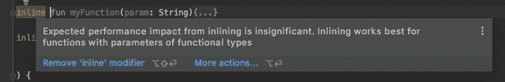
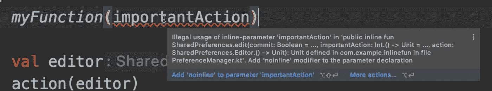

# 嵌入式功能—在引擎盖下

> 原文：<https://medium.com/androiddevelopers/inline-functions-under-the-hood-12ddcc0b3a56?source=collection_archive---------0----------------------->


## 科特林词汇

你知道你用各种各样的小函数创建的所有那些 Util 文件，你最终在你的应用程序中使用了很多？如果你的效用函数得到其他函数作为参数，你可以通过保存一些额外的对象分配来提高你的应用程序的性能，你可能甚至不知道你在做什么，用一个关键字:`[inline](https://kotlinlang.org/docs/reference/inline-functions.html)`。让我们看看当您传递这些短函数时会发生什么，内联在幕后做什么，以及在使用内联函数时应该注意什么。

# 函数调用—在引擎盖下

假设您在应用程序中经常使用`SharedPreferences`，那么您创建这个实用函数来减少每次在您的`SharedPreferences`中写东西时的样板文件:

```
fun SharedPreferences.edit(
    commit: Boolean = false,
    action: SharedPreferences.Editor.() -> Unit
) {
    val editor = edit()
    action(editor)
    if (commit) {
        editor.commit()
    } else {
        editor.apply()
    }
}
```

然后，你可以用它来保存一个`String`令牌:

```
private const val KEY_TOKEN = “token”class PreferencesManager(private val preferences: SharedPreferences){
    fun saveToken(token: String) {
        preferences.edit { putString(KEY_TOKEN, token) }
    }
}
```

现在让我们看看当`preferences.edit`被调用时，在引擎盖下发生了什么。如果我们查看 Kotlin 字节码(Tools > Kotlin >将 Kotlin 反编译成 Java ),我们会看到调用了一个`NEW`,因此创建了一个新对象，即使在我们的代码中我们没有调用任何对象构造函数:

```
NEW com/example/inlinefun/PreferencesManager$saveToken$1
```

让我们检查反编译的代码，使它更友好一些。我们的`saveToken`反编译函数如下(注释和格式化我的):

> 我们创建的每个高阶函数都会导致一个`Function`对象的创建和内存分配，从而引入运行时开销。

# 嵌入式功能—引擎盖下

为了提高应用程序的性能，我们可以使用 inline 关键字来避免创建新的函数对象:

```
**inline** fun SharedPreferences.edit(
    commit: Boolean = false,
    action: SharedPreferences.Editor.() -> Unit
) { … }
```

现在 Kotlin 字节码不包含任何`NEW`调用，下面是我们的`saveToken`方法的反编译后的 java 代码(注释和格式化我的):

因为有了`inline`关键字，编译器将内联函数的内容复制到调用点，避免了创建新的`Function`对象。

# 将什么标记为内嵌

⚠️如果你试图将一个不接受另一个函数作为参数的函数标记为内联函数，你不会获得显著的性能优势，IDE 甚至会告诉你，建议你删除它:



⚠️因为内联可能会导致生成的代码增长，所以请确保您**避免内联大型函数**。例如，如果您查看 Kotlin 标准库，您会发现大多数内联函数只有 1-3 行。

> ⚠️ **避免内联大型函数！**

⚠️当使用内联函数时，你不允许保留对作为参数传递的函数的引用，或者将它传递给不同的函数——你会得到一个编译器错误提示`Illegal usage of inline-parameter`。

例如，让我们修改一下`edit`方法和`saveToken`方法。`edit`方法获取另一个参数，然后传递给不同的函数。`saveToken`使用在新函数中更新的虚拟变量:

```
fun myFunction(importantAction: Int.() -> Unit) {
    importantAction(-1)
}inline fun SharedPreferences.edit(
    commit: Boolean = false,
    **importantAction: Int.() -> Unit = { },**
    action: SharedPreferences.Editor.() -> Unit
) {
    **myFunction(importantAction)
    ...**
}
...
fun saveToken(token: String) {
    var dummy = 3
    preferences.edit(**importantAction = { dummy = this}**) {
         putString(KEY_TOKEN, token)
    }
}
```

我们可以看到`myFunction(importantAction)`产生了一个错误:



下面是解决这个问题的方法，取决于您的函数看起来是什么样的:

**情况 1** :如果你有多个函数作为参数，而你只需要保留对其中一个的引用，那么你可以将其标记为`[noinline](https://kotlinlang.org/docs/reference/inline-functions.html#noinline)`。

通过使用`noinline`，编译器将只为那个特定的函数创建一个新的`Function`对象，但是其余的将被内联。

我们的`edit`功能现在将是:

```
inline fun SharedPreferences.edit(
    commit: Boolean = false,
    **noinline** importantAction: Int.() -> Unit = { },
    action: SharedPreferences.Editor.() -> Unit
) {
    myFunction(importantAction)
    ...
}
```

如果我们检查字节码，我们会看到出现了一个`NEW`调用:

```
NEW com/example/inlinefun/PreferencesManager$saveToken$1
```

在反编译的代码中，我们可以看到以下内容(我的评论):

**情况二**:如果你的函数只有一个函数作为参数，干脆不要用`inline`。如果您确实想使用内联，您必须用`noinline`标记您的参数，但是像这样，您将通过内联方法获得较低的性能收益。

要减少 lambda 表达式导致的内存分配，请使用`inline`关键字！确保您将它应用于将一个**λ作为参数**的**小函数**。如果你需要保存一个对 lambda 的引用或者将它作为参数传递给另一个函数，那么使用`noinline`关键字。开始内联开始保存！