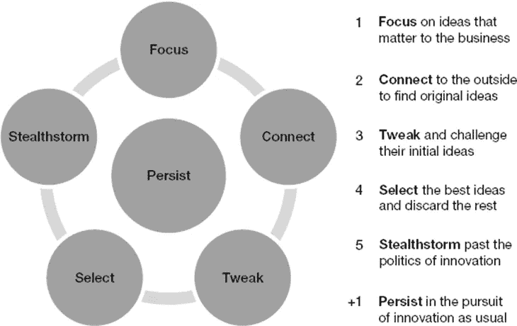

# 一如既往的创新

> 原文：<https://medium.com/version-1/innovation-as-usual-7853316f39b4?source=collection_archive---------5----------------------->

继我上一篇关于创新者困境的[博客文章](/version-1/the-innovators-dilemma-6de68da8fabc)之后，这一次我想分享我对另一本有趣的书的一些想法:Paddy Miller 和 Thomas Wedell-Wedellsborg (2013)的《一如既往的创新》。

什么是创新？这是“创造性的选择”，背离简单道路的简单事实:规范。它是“通过做新的事情来创造结果”(第 187 页)。它是行动，创造结果。达到目的的手段，没有影响，就没有创新。

个人和企业都可以从创新中受益，这本书是关于帮助人们在组织中发挥创造力的。怎么会？通过创新架构师:领导者本身不是创新者，而是创新推动者，允许任何人在日常工作中成为创新者。创新不应该是一种特殊的行为，而是任何人都应该遵循的日常模式。因此，这本书的标题也是这篇博文的主题:一如既往的创新。

这是革命性的，因为太多的组织通过“创新岛”推动创新。小而专注的团队成功地实现了创新的想法，但是在向他们更广泛的受众(整个组织)传达和推动创新方面经常失败。

帮助人们成为天生的创新者是塑造他们工作环境的问题。人们的行为是环境中个性的结果，研究证明，对后一个变量采取行动比对前一个变量采取行动更容易！正如作者所说:“从逻辑上讲，系统地*改变行为的唯一方法是通过改变系统”(第 9 页)。*

*说起来容易做起来难，创新建筑师“间接地”塑造行为，通过“系统、惯例、习惯和过程”塑造环境。所有这些都应该与更广泛的公司生态系统相集成，以便当前的流程和系统可以尽可能无缝地拥抱创新。*

*作者提出了 6 个步骤，总结如下图 1 所示。*

**

*Figure 1 — The 5 + 1 keystone behaviour of innovation to promote in others (p. 13)*

*我们现在将很快详细了解每一步。*

# *焦点*

*简单地说“*专注胜过自由*”(第 14 页)。要取得成功，任何创新都应该与业务目标相一致。这些想法应该被引导，以便人们可以在更广泛的目标范围内发挥创造力。然后，创新战略应该与更广泛的组织战略保持一致。如今，许多公司(2013 年为 42%,而且这一数字还在增长)将这一战略具体化。*

*If 目标和约束(时间范围、利益相关者、技术、可接受的风险水平等。)对任何人来说都很清楚，选择仅限于将商业目标最大化的创新想法，最终使任何相关人员受益。*

# *连接*

*当多种想法和观点结合在一起时，创新会更有效。这被称为*重组创新*，当来自不同角色和部门的知识混合在一起时，可以更好地实现。*

*例如，营销人员和工程师经常有不同的观点，但真正的突破可能来自他们之间的空间，即交叉点。这也是为什么“创新岛”并不总是非常有效的另一个原因:更广泛的知识必须结合起来，而这样做的唯一方式是将不同学科和观点的人联系起来。*

*实习生、轮换、头脑风暴、趋势识别会议...都是帮助人们内部联系的方式。但是客户也扮演着重要的角色！很有可能，一个创新的想法可能仅仅来自于倾听一个客户的问题。*

# *扭*

*尽管许多想法在理论上看起来很完美，但绝大多数在实践中是行不通的。因此，对它们进行适当的测试是至关重要的，最好的方法是通过快速的原型制作。目标是获得快速的反馈来改进解决方案，再次测试，迭代，直到它的潜在价值被证明。*

*人们可能会天真地认为，很多伟大的想法从一开始就是完美的。这个过于简化的视图如下面的图 2 所示。*

**

*Figure 2 — Innovation model (oversimplified) (p. 84)*

*现实要比这复杂得多，在*尤里卡*时刻之后还需要许多调整。下面的图 3 更准确地展示了这个过程。*

**

*Figure 3 — Innovation model (in reality) (p. 84)*

*正如作者所说，“创新[……]是找不到的；它们是发达的”(第 85 页)。这意味着反复重构问题并测试解决方案，直到它足够成功。框定问题是关键:错误问题的完美解决方案仍然是错误的解决方案。但是，当正确的问题被发现并得到正确的分析时，建议的解决方案必须在尽可能接近生产环境的环境中进行适当的测试。也就是说，“会议讨论的中心是实物原型，而不是幻灯片”(第 109 页)。*

# *挑选*

*一旦创意被创新团队内部评估，就必须做出进一步推动创意的决定:将其投入生产、投资、大规模实施等。在这种情况下，可能会建立一个具有不同技能和目标的决策委员会。决策标准应该明确，并定期审查。*

# *秘密风暴*

*Stealthstorm 与政治有关:让组织力量相信创造创新环境的价值。为了实现这一目标，必须尽快确定潜在的经纪人和高级赞助商。他们的建议可能是非常宝贵的，如果想法被恰当地“推销”给他们，他们将有助于进一步推动这些想法。*

# *坚持*

*“与创新者所做的事情同样重要的是，他们(T2)让创新者(T3)继续做下去”(第 154 页)。用托马斯·爱迪生的话说:“天才是百分之一的灵感，百分之九十九的汗水”。*

*动机是关键:如果人们天生就有创新能力，创新架构就会起作用。也就是说，如果他们一遍又一遍地寻找创新。*

*领导者可以通过两种方式利用激励。*

*   *本质上:它们为人们实际选择创造性道路铺平了道路，原因有很多。因为他们喜欢它，因为它符合他们自己的兴趣，为了社会认可，等等。自主性也有帮助，但它不是关于目标或目的(见焦点下)，而是关于方法(微观管理被证明在创新中效果不佳)。*
*   *外在的:奖励、奖金、晋升等等。尽管对于外部激励的必要性还没有达成共识，但作者是这样说的:“创新是一项艰苦的工作[……]。内在动机是为了开始做事。完成工作的外部动机[……]”(第 166 页)*

# *结论*

*创新并不容易。许多利益相关者的不同观点，有时是相互冲突的，使事情变得更加复杂。米勒和韦德尔-韦德尔斯堡在他们的书中提供了一些关于从一个小团队到整个组织推动创新的见解，即组织中的任何人每天都以一种自然的方式创新。*

*这在实践中行得通吗？*

*听起来像是另一篇博文的好主题…*

**

***关于作者** 菲利普·萨希是 Version 1 的 IT 顾问。*