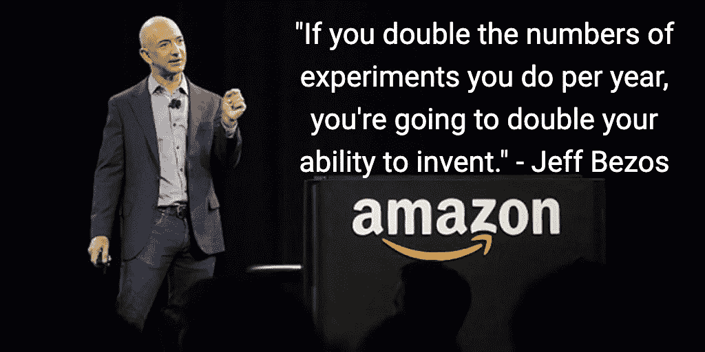
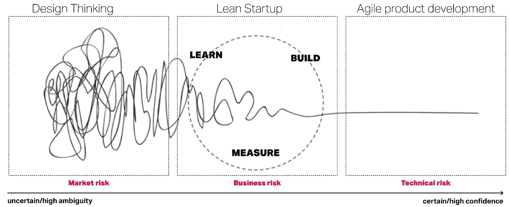
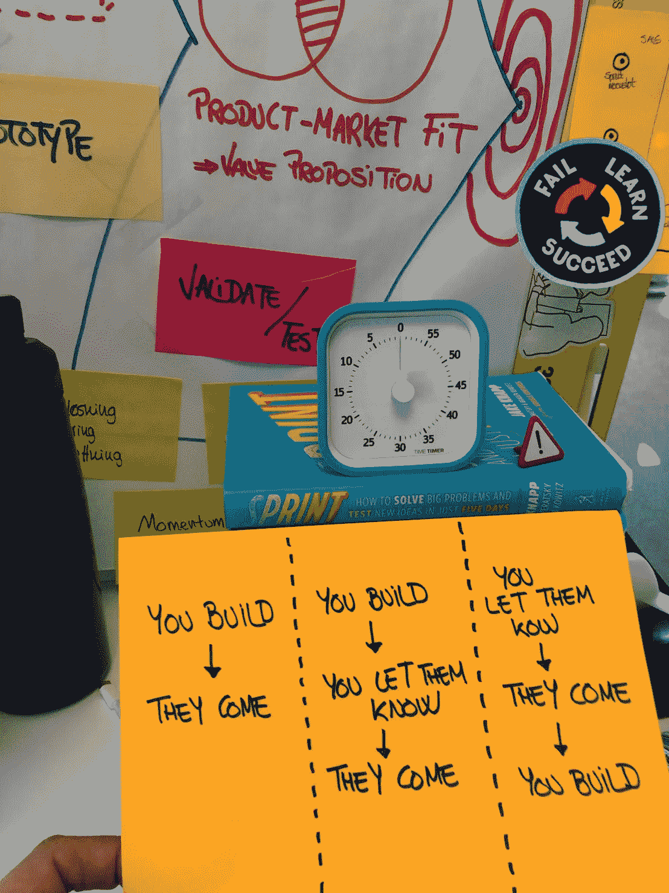
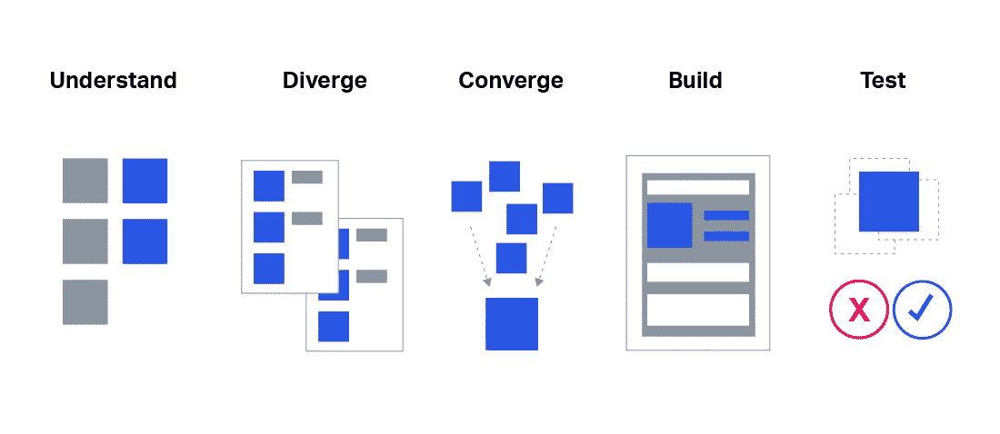
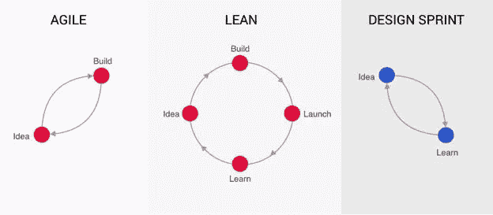

# 创新？设计冲刺:为什么和如何开始的路线图

> 原文：<https://medium.com/compendium/innovation-design-sprint-a-road-map-on-why-and-how-to-start-183d4719d720?source=collection_archive---------2----------------------->

Jeff Bezos quote of the importance of continuous experimentation and iterations

使用设计思维原则和思维模式——好奇心、同理心、以人为本、偏向行动、展示不说、沉浸、彻底合作、构思、原型和测试——并利用跨职能环境的创建，Design Sprint 正在成为加速创新的新途径，速度和创新携手并进。

# 敏捷？精益创业？设计思维？设计冲刺？

From Design Thinking to Agile product development

有一个“术语丛林”,有许多相互竞争的框架和过程，它们主要导致了 C-suite 中的疲劳和混乱。最高管理层不关心*如何*(如果公司使用敏捷、设计思维或精益创业)，但他们关心*结果*和底线结果。

设计冲刺是在降低风险的同时验证新的重大问题和解决方案的最快方式，因为许多业务和组织干扰都被消除了:缺乏重点、缺乏时间、无休止的讨论、缺乏承诺、缺乏实验、缺乏方向、缺乏用户反馈、错位…

敏捷专注于快速构建产品并从那里迭代。旧的“*你建，他们来*”范式。

精益启动流程验证产品的更多方面，包括产品/市场适合度、MVP，当然还有与技术上构建解决方案相关的方面。你建立了不那么古老的“*，你让他们知道，他们来了*范式。

设计思维是一种*心态*，用于从以人为中心的角度处理业务和组织挑战，它专注于定义问题空间和寻找以用户为中心的解决方案。

当你想找到独特而复杂问题的创新解决方案时，敏捷、精益和设计思维方法都有可能导致开发时间和资源的浪费。

设计冲刺是一种快速简单的方法，可以让设计思维从思维到行为，并开始建立一种以人为中心、迭代和快速创新的文化。新的“你让他们知道，他们来了，你建立”范式。

在设计冲刺阶段，一个跨职能团队在设计或发布之前，与真实用户一起原型化、测试和验证想法。团队从用户测试反馈中获得第一手信息，然后在一周时间内迭代:没有浪费时间和资源，只有学习。

Design Sprint process: from Monday to Friday

设计冲刺为团队提供了一条学习的捷径，无需构建和启动。在做出任何昂贵的承诺之前，你可以快进到未来，看看你的成品和客户的反应。

设计冲刺无疑不仅是创新的明智助推器，可以为公司带来巨大的价值，而且是在组织中注入和创造自下而上的可持续和可扩展的创新文化的病毒式方式。

下次你想创新产品、流程或功能时，看看设计冲刺是否能帮助你更快地推出更有效的产品或流程。

冲刺好，祝你成功！！

想知道如何以及从哪里开始在你的公司实施设计冲刺？一起喝杯咖啡，分享一些有趣的想法和创意(共创！).

***对设计冲刺感兴趣，想了解更多，与志同道合的专业人士分享经验和知识？***

加入我们的 Meetup group " **奥斯陆设计冲刺 Meetup** "并参加我们在奥斯陆(挪威)的专业聚会:[https://www.meetup.com/Oslo-Design-Sprint-Meetup/](https://www.meetup.com/Oslo-Design-Sprint-Meetup/)

加入我们的 LinkedIn 群组" **Norway Design Sprint** "让自己了解设计 Sprint 领域的最新动态:[https://www.linkedin.com/groups/13697504/](https://www.linkedin.com/groups/13697504/)