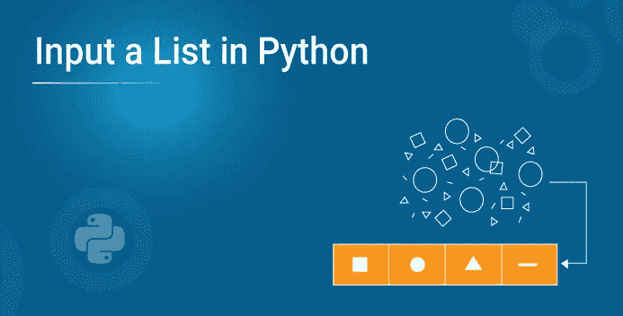
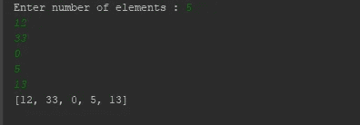
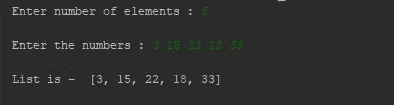
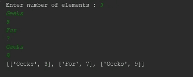

# 如何在 Python 中输入列表？

> 原文：<https://medium.com/edureka/input-a-list-in-python-f1f3ae32be9f?source=collection_archive---------0----------------------->



有时在用 Python 编码时，你需要做一个列表作为输入。虽然这一开始听起来很简单，但对于初学者来说，这通常被认为是一项复杂的任务。这篇文章将告诉你如何用 Python 输入一个列表。

本文将涉及以下几点，

*   用 Python 输入一个列表
*   在 Python 中接受一列数字作为输入
*   接受来自用户的字符串列表
*   例子

那么让我们开始吧，

# 用 Python 输入一个列表

您可能已经知道，为了在 Python 中接受用户的输入，我们可以使用 input()函数。使用时，它使程序员能够接受一个字符串、整数，甚至一个字符作为用户的输入。但是在接受列表作为输入时，我们遵循的方法略有不同。

这篇如何在 Python 中输入列表的文章将解决主要的问题

# 在 Python 中接受一列数字作为输入

看看下面的示例程序，它接受一列数字作为 Python 中的输入。

```
input_string **=** input("Enter a list element separated by space ")
list  **=** input_string.split()
print("Calculating sum of element of input list")
sum **=** 0
**for** num **in** list:
sum **+=** int (num)
print("Sum = ",sum)
```

当上面的程序运行时，输出将如下所示。

**输出** 输入一个由空格分隔的列表元素 2 4 6 9

计算输入列表元素的总和

总和= 20

**分析**

现在让我们分解这个程序，看看它背后的工作原理。

1.  正如您已经知道的，每当我们在 Python 中使用 input()函数时，它都会将用户输入转换成一个字符串。因此，在上面的程序中，我们从用户那里接受了一个由空格分隔的字符串形式的列表元素。
2.  这里需要注意的一点是，您也可以接受由逗号(，)分隔的字符串。但是在这种情况下，您需要使用 split()函数，以便在 Python 程序中传递参数和分隔符。
3.  如果仔细观察，您会发现我们使用了函数 input_string.split()来拆分用户输入的由空格分隔的字符串，并将它们转换为要添加到列表中的单个元素。
4.  我们还利用了 For 循环，将每个元素转换成一个整数来计算其总和。

转到本文的下一个主题，让我们看看如何在 python 中输入包含字符串的列表，

# 接受来自用户的字符串列表

与上面的程序类似，我们能够用 Python 创建一个程序来接受用户的字符串列表。为了更好地理解这一点，请看下面的例子。

```
input_string **=** input("Enter family members separated by comma ")
family_list  **=** input_string.split(",")
print("Printing all family member names")
**for** name **in** family_list:
    print(name)
```

当上面的程序运行时，**输出**看起来像这样。

输入用逗号分隔的家庭成员:朱利叶斯、马克、约翰

打印所有家庭成员的姓名

朱利叶斯

标记

约翰

**分析**

让我们把上面的程序分解成指针，更好地理解它。

1.  与前面的例子类似，我们从用户那里接受一个输入列表，以逗号分隔的字符串的形式。
2.  我们使用了 input_string.split("，")函数来拆分由逗号分隔的字符串，并将其转换为程序中使用的字符串列表。
3.  我们使用了一个 for 循环，并按顺序打印出所有的姓氏，正如您在上面共享的输出中所看到的。

接下来让我们从编程的角度来看看这个概念是如何发展的，

**例题**

让我们看几个其他的例子来理解如何在 Python 中输入一个列表。

**例一**

```
# creating an empty list
lst **=** []
# number of elemetns as input
n **=** int(input("Enter number of elements : "))
# iterating till the range
**for** i **in** range(0, n):
else **=** int(input())
lst.append(ele) # adding the element
print(lst)
```

**输出**



让我们看下一个例子，

**例 2**

```
# try block to handle the exception
**try**:
my_list **=** []
**while** True:
my_list.append(int(input()))
# if input is not-integer, just print the list
**except**:
print(my_list)
```

**输出**



## 示例 3

```
# number of elements
n **=** int(input("Enter number of elements : "))
# Below line read inputs from user using map() function
a **=** list(map(int,input("nEnter the numbers : ").strip().split()))[:n]
print("nList is - ", a)
```

这将是本文的最后一个例子，

## 实例 4

```
lst **=** [ ]
n **=** int(input("Enter number of elements : "))
**for** i **in** range(0, n):
ele **=** [input(), int(input())]
lst.append(ele)
print(lst)
```

**输出**



伙计们，这就把我们带到了这篇关于如何用 Python 输入列表的文章的结尾。如果你想查看更多关于人工智能、DevOps、道德黑客等市场最热门技术的文章，你可以参考 [Edureka 的官方网站。](https://www.edureka.co/blog/?utm_source=medium&utm_medium=content-link&utm_campaign=input-a-list-in-python)

请留意本系列中的其他文章，它们将解释 Python 和数据科学的各个方面。

> *1。*[*Python 中的机器学习分类器*](/edureka/machine-learning-classifier-c02fbd8400c9)
> 
> *2。*[*Python Scikit-Learn Cheat Sheet*](/edureka/python-scikit-learn-cheat-sheet-9786382be9f5)
> 
> *3。* [*机器学习工具*](/edureka/python-libraries-for-data-science-and-machine-learning-1c502744f277)
> 
> *4。* [*用于数据科学和机器学习的 Python 库*](/edureka/python-libraries-for-data-science-and-machine-learning-1c502744f277)
> 
> *5。*[*Python 中的聊天机器人*](/edureka/how-to-make-a-chatbot-in-python-b68fd390b219)
> 
> *6。* [*Python 集合*](/edureka/collections-in-python-d0bc0ed8d938)
> 
> *7。* [*Python 模块*](/edureka/python-modules-abb0145a5963)
> 
> *8。* [*Python 开发者技能*](/edureka/python-developer-skills-371583a69be1)
> 
> *9。* [*哎呀面试问答*](/edureka/oops-interview-questions-621fc922cdf4)
> 
> 10。 [*一个 Python 开发者的简历*](/edureka/python-developer-resume-ded7799b4389)
> 
> 11。[*Python 中的探索性数据分析*](/edureka/exploratory-data-analysis-in-python-3ee69362a46e)
> 
> *12。* [*蛇与蟒蛇的游戏*](/edureka/python-turtle-module-361816449390)
> 
> *13。* [*Python 开发者工资*](/edureka/python-developer-salary-ba2eff6a502e)
> 
> 14。 [*主成分分析*](/edureka/principal-component-analysis-69d7a4babc96)
> 
> 15。[*Python vs c++*](/edureka/python-vs-cpp-c3ffbea01eec)
> 
> 16 岁。 [*刺儿头教程*](/edureka/scrapy-tutorial-5584517658fb)
> 
> *17。*[*Python SciPy*](/edureka/scipy-tutorial-38723361ba4b)
> 
> *18。* [*最小二乘回归法*](/edureka/least-square-regression-40b59cca8ea7)
> 
> *19。* [*Jupyter 笔记本小抄*](/edureka/jupyter-notebook-cheat-sheet-88f60d1aca7)
> 
> *20。* [*Python 基础知识*](/edureka/python-basics-f371d7fc0054)
> 
> *21。* [*Python 模式程序*](/edureka/python-pattern-programs-75e1e764a42f)
> 
> *22。*[*Python 中的*](/edureka/generators-in-python-258f21e3d3ff) 生成器
> 
> *23。* [*Python 装饰器*](/edureka/python-decorator-tutorial-bf7b21278564)
> 
> *24。*[](/edureka/spyder-ide-2a91caac4e46)*[*什么是 Python 中的套接字编程*](/edureka/socket-programming-python-bbac2d423bf9)*
> 
> **25。*[*Python 中使用 Kivy 的移动应用*](/edureka/kivy-tutorial-9a0f02fe53f5)*
> 
> **26。* [*十大最佳学习书籍&练习 Python*](/edureka/best-books-for-python-11137561beb7)*
> 
> **27。* [*机器人框架与 Python*](/edureka/robot-framework-tutorial-f8a75ab23cfd)*
> 
> **28。* [*蟒蛇游戏中使用 PyGame*](/edureka/snake-game-with-pygame-497f1683eeaa)*
> 
> *29。 [*Django 面试问答*](/edureka/django-interview-questions-a4df7bfeb7e8)*
> 
> **三十。* [*十大 Python 应用*](/edureka/python-applications-18b780d64f3b)*
> 
> **31。*[*Python 中的哈希表和哈希表*](/edureka/hash-tables-and-hashmaps-in-python-3bd7fc1b00b4)*
> 
> *32。[*Python 3.8*](/edureka/whats-new-python-3-8-7d52cda747b)*
> 
> **33。* [*支持向量机*](/edureka/support-vector-machine-in-python-539dca55c26a)*
> 
> *34。 [*Python 教程*](/edureka/python-tutorial-be1b3d015745)*
> 
> **35。*[*Python Spyder*](/edureka/spyder-ide-2a91caac4e46)*

**原载于 2019 年 9 月 27 日*[*https://www.edureka.co*](https://www.edureka.co/blog/input-a-list-in-python/)*。**