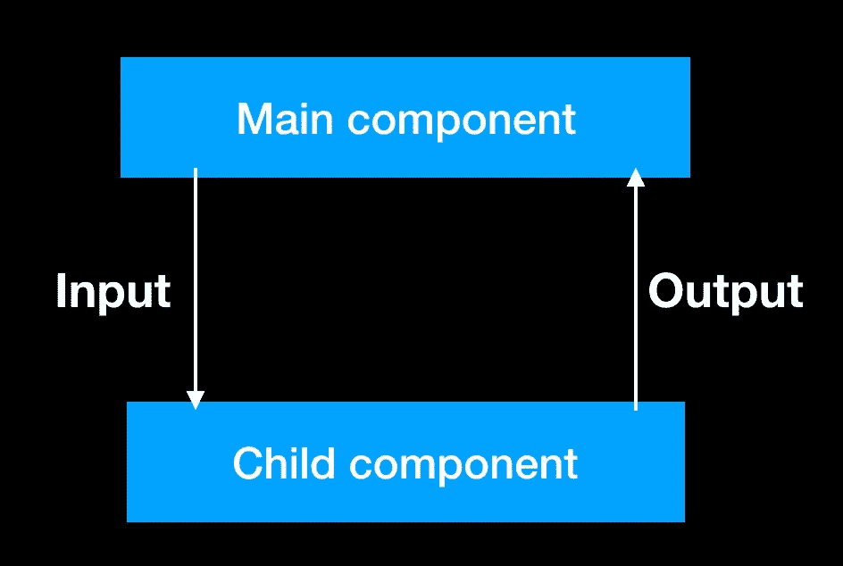
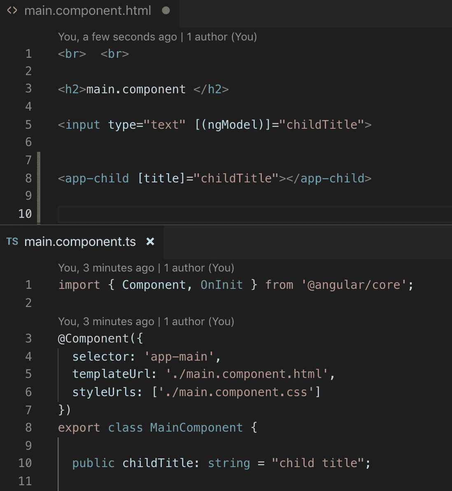
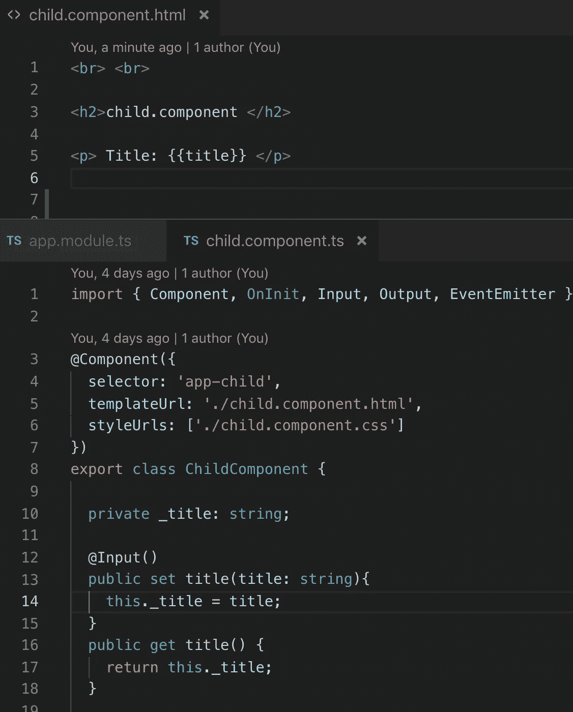
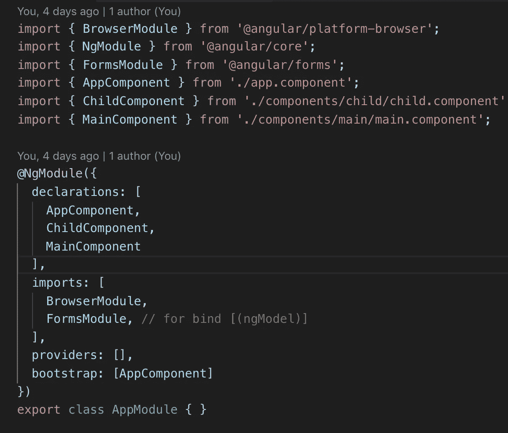
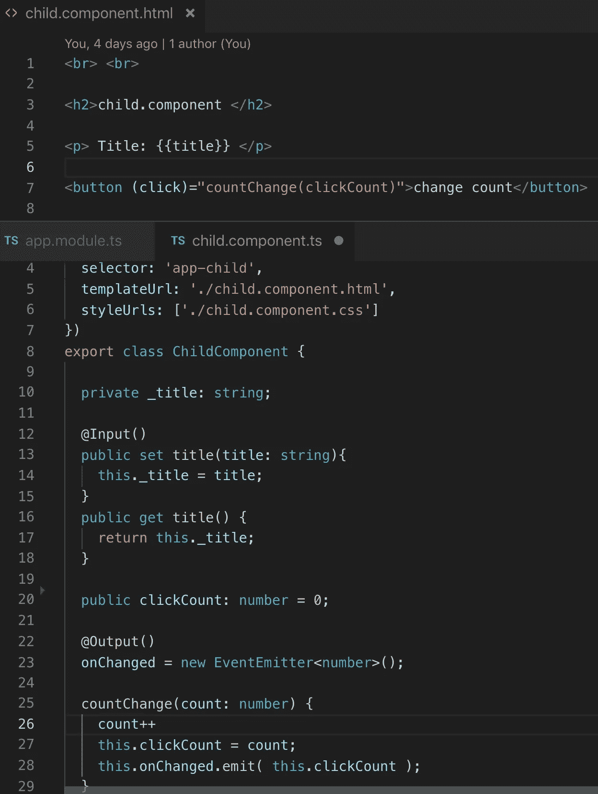
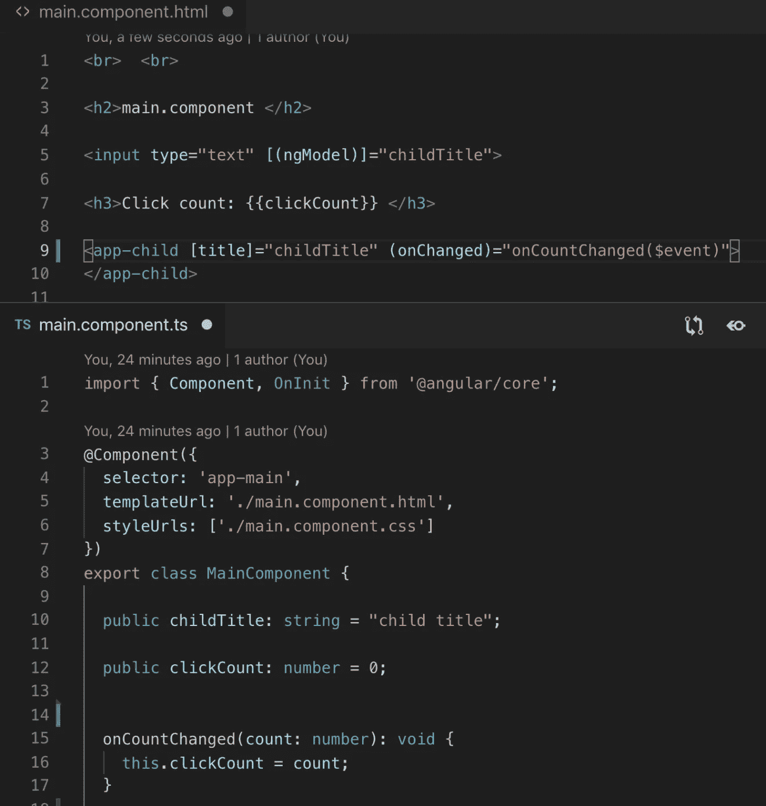

# 角度输入和输出

> 原文：<https://medium.com/quick-code/input-output-in-angular-4550c8fea6da?source=collection_archive---------0----------------------->

## 角度指南

## 我们为什么需要“输入”和“输出”

对“**输入**”和“**输出**做什么的简短描述显示在图片上。

Short description

我们有两个组件“主组件”和内部组件“子组件”。“子组件”中定义了“**输入**”和“**输出**”。有时我们需要将初始化的信息或对象放在“子组件”中，为此我们使用“**输入**”。

基本上，这就是 Angular 在组件之间共享数据的方式。

为了更好地理解它，我们需要用角度来举例说明输入和输出。

想象“子组件”有一个按钮，当用户点击按钮时，“主组件”必须知道，为此我们使用“**输出**”。因此，如果“子组件”包含值可以更改的元素，或者我们需要通知“主组件”一些事情，我们使用“**输出**”。

让我们仔细看看代码。

Main component

Child component

“Main component”包含绑定到属性“ **childTitle** ”的输入，我们将该属性放在“Child component”中，注意我们使用了输入装饰器。让我们动态更改“子组件”的标题，这就是为什么我们将在“主组件”中使用双向绑定— **[(ngModel)]** ，对于“ **ngModel** ”，我们需要在 AppModule 的导入部分添加“ **FormsModule** ”。

在 Html 的第 8 行“主组件”中，我们创建了输入属性[title](在“子组件”中的属性)，作为输入值，我们使用“childTitle”(在“主组件”中的属性)。这就是我们如何使用角度输入装饰器绑定子组件和父组件。

FormsModule in AppModule

在“子组件”中，我使用了 getter 和 setter，因为我想向你展示我们如何找到组件接收数据的时刻，在 setter 中，我们可以定义一些我们需要的动作。

现在让我们使用角度输出装饰。

“子组件”现在包含按钮，click 被绑定到“ **countChange** ”方法，main 部分是 event emitter“**onChange**”，当用户单击按钮时我们调用它，那么“Main component”将如何被通知。在 EventEmitter 中，我们可以传递一个参数，它可以是任何字符串或我们的类，在我们的例子中，它将是一个计数。

Angular 中的 EventEmitter 是一种订阅类型。EventEmitter 帮助我们通知其他组件一些变化。

Child component with Output

此外，我们需要改变一点点“主要组成部分”。我们需要创建将被通知的方法，并将其绑定到“子组件”中的事件发射器，为此，我们创建了带参数的方法“ **onCountChanged** ”，并在 HTML 文件中编写了此绑定关系。

Main component with event handler

这就是我们如何用**输入**和**输出**的角度。你可以在我的 [GitHub](https://github.com/8Tesla8/input-output-angular) 库下载这个例子。

*原载于 2019 年 2 月 16 日*[*tomorrowmeannever.wordpress.com*](https://tomorrowmeannever.wordpress.com/2019/02/16/input-output-in-angular-2/)*。*