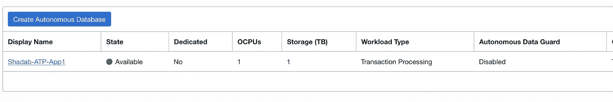
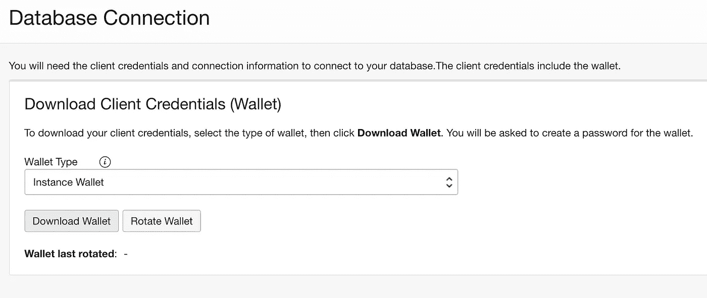
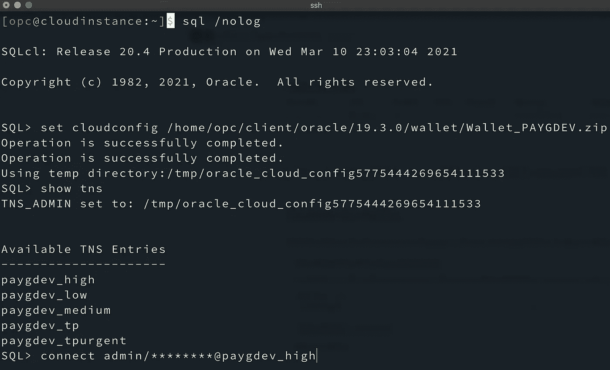
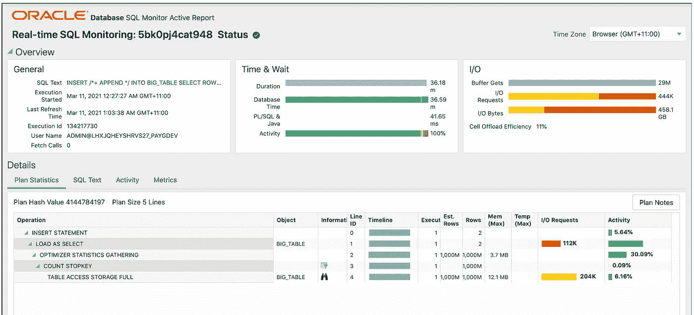

# 在 Oracle 自治数据库中插入 10 亿行

> 原文：<https://medium.com/oracledevs/inserting-1-billion-rows-in-an-oracle-autonomous-database-f9519902c9db?source=collection_archive---------0----------------------->

在 2020 年 Gartner " [运营用例云数据库管理系统的关键功能](https://www.oracle.com/au/database/gartner-dbms.html)"报告中，Oracle 的自主数据库最近在所有四个用例中得分最高。Oracle 的全云原生自治数据库有三种风格——自治事务处理(ATP)、自治数据仓库(ADW) &自治 JSON 数据库(AJD)。ATP 是类似事务性 OLTP 系统的数据库选择。

在这篇博文中，我们将通过从 *ALL_OBJECTS* 表中选择记录，使用插入 10 亿行的 PL/SQL 循环来测试事务处理自治实例。我们的测试将向自治数据库的最低可能形状中插入大约半 TB 的事务数据。即使在如此低的规格下，该实例也几乎没有任何压力，并在工作负载中闪耀。所以让我们开始吧…

**设置**

1.  **首先** [**从 OCI 控制台创建**](https://docs.oracle.com/en-us/iaas/Content/Database/Tasks/adbcreating.htm) **一个自治的事务处理数据库。**

使用 [Always Free](https://www.oracle.com/au/cloud/free/) 层，您有资格创建一个自由事务处理和一个具有 20G 存储空间的自由数据仓库实例。

**2。从“数据库连接”选项卡下载 ATP 实例的钱包**

**3。** [**下载**](https://www.oracle.com/au/tools/downloads/sqlcl-downloads.html) **和** [**在您的客户端机器或云实例上安装**](https://oracle-base.com/articles/misc/sqlcl-installation)**SQL，您将从那里运行这个测试**

**4。复制钱包文件并连接到您的自治数据库**

**5。在 ATP 实例中创建测试表。**

我在测试中使用了默认的管理模式，但是建议创建一个新的模式并从那里运行它。

**6。运行 PL/SQL 块以插入 10 亿行**

出现两次提示时，请确保输入 100000000

等待块的执行完成。这可能需要一些时间，具体取决于您的实例大小。对我来说，大约需要 36 分钟才能完成。因此，如果您认为您的会话可能会断开，建议将 PL/SQL 块保存为一个**。sql** 文件；硬编码 ***l_rows*** 和 ***rownum*** 然后在 nohup 模式下运行。

**在 Linux 上后台运行**

**结果**

只有 1 个 ocpu 和 1TB 的存储，它在工作负载中表现出色。完成对 10 亿行 Select 的插入大约需要 36 分钟。让我们深入研究一下来自自治数据库性能中心的 SQL 监控报告，以查看 SQL 统计数据。

SQL Monitoring Report

看看这些数字:

**处理的行数:**1000 米(1B)

**完成时间:**36 分钟

**IO 请求:** 444K

**IO 字节:** 458GB

**结论**

这是一个快速简单的概念验证，展示了最小的自治 OLTP 模型的功能。Oracle 自治数据库被 Gartner 云数据库管理系统魔力象限的[评为 2020 年](https://www.oracle.com/database/gartner-dbms.html)领导者是有原因的。即使是快速测试，我们也能从中看出性能的提升。这是一项有远见的技术，它将在未来几年为企业和中小企业改变数据库的面貌。