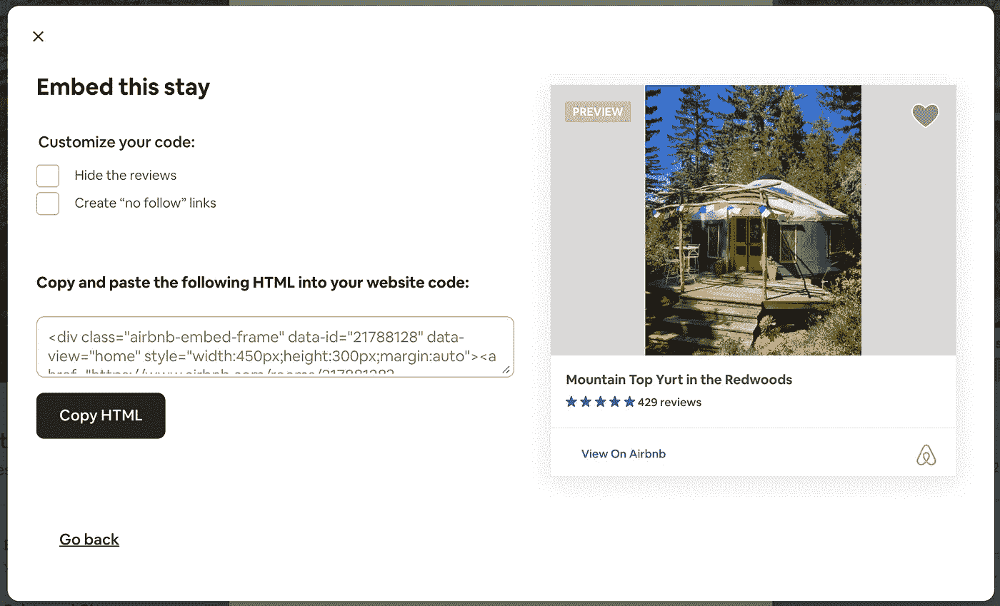

# Inside Connect: Airbnb 的工程学徒计划

> 原文：<https://medium.com/airbnb-engineering/inside-connect-airbnbs-engineering-apprenticeship-program-c26d6eb2768c?source=collection_archive---------0----------------------->

## 关于 Connect 的三部分博客系列的第一部分，这是一个为有志于 Airbnb 软件工程师提供的实习机会。

由[贝蒂](https://www.linkedin.com/in/betigathegi/)加特吉&T2【雅克瓦】

你好！我们很高兴您能来这里了解更多关于 Connect 计划的信息。在我们分享细节之前，我们想先自我介绍一下。我们是 Beti Gathegi 和 Jacqui Watts——一个两人团队，他们在 Airbnb 的目的是帮助实现这个项目。我们为迄今为止与我们一起工作的学徒感到无比自豪，这就是为什么我们希望分享更多，以便我们在未来能够继续吸引更多令人惊叹的软件工程人才。

在这篇文章中，我们将关注这个项目的目标和结构。然后，在接下来的帖子中，除了支持学徒的工程经理之外，你还将有机会直接听取我们 2020 年团队中的一名学徒(现为全职工程师)的意见。我们希望这一系列文章能让您清楚地了解 Connect 计划是什么，它与其他计划有何不同，并希望激励您向那些可能有兴趣以某种方式加入或支持该计划的人传播这一信息。

# **关于连接**

Connect engineering 学徒计划是一个为期六个月的计划，为来自非传统技术背景的个人提供在 Airbnb 的潜在职业发展机会。在 Airbnb，我们相信自我激励者，并且知道无论背景如何，人们都可以在科技领域取得成功。但现实是，非传统技术背景的人很难进入专业工程领域。因此，我们开始创造一个新的机会，专门针对这群人才。最终，Connect 是我们实现 Airbnb 使命的另一种方式，即创造一个任何人都可以属于任何地方的世界。

最初于 2016 年试行的 Connect 由一个专门的团队带回，以帮助发展该计划，并加倍努力扩大软件工程职位的准入。怀着这个目标，我们精心设计了一个计划，将于 2020 年 1 月推出。我们一点也不知道这一年将会发生什么！

尽管存在这些挑战，但我们很自豪地分享，该计划的首轮活动是成功的，我们希望通过 Connect 计划继续引进新的非传统工程人才。

# **我们的合作伙伴**

我们很荣幸能与许多当地湾区组织合作，例如 [TechSF](https://oewd.org/tech-sf) 、Kapor Center 的[技术创新之路](https://ourcollective.us/pathways-to-tech/)(以前的 TechHire Oakland)、 [Code Tenderloin](https://www.codetenderloin.org/) 、 [dev/mission](https://devmission.org/) 、 [The Hidden Genius Project](https://www.hiddengeniusproject.org/) 以及 Hack Reactor 的 [Telegraph Track](https://www.hackreactor.com/telegraph-track) 。这些组织在支持来自非传统培训背景的人才方面做得非常好，他们非常适合我们的学徒角色。随着我们继续发展 Connect，我们也很高兴能够发展我们的合作伙伴关系，并向美国各地的候选人开放这一机会。

# **程序结构**

在六个月的时间里，Connect 计划旨在培养学徒为整个公司的工程团队做出贡献。我们知道刚过渡到软件工程的人们仍在学习和提高他们的技术技能，所以我们在他们加入团队之前投入时间进行培训和指导。但是那看起来像什么呢？

## 培养

学习技术技能有许多非传统的途径——从编码训练营到社区大学再到自学方案。即使在不同的软件开发训练营中，学习的语言和技术也不可避免地会有所不同。我们在项目的前几个月帮助学徒们快速掌握 Airbnb 的首选工具和技术，我们称之为“铺路”。此外，这个培训阶段可以让你接触到大规模的代码库。任何走过非传统道路的人——或者实际上任何进入软件工程的道路——都可以告诉你，浏览一个拥有数百万行代码的大型生产代码库是最具挑战性的部分之一！

培训期间非常强调项目和动手编程任务，同时也融入了一些更传统的课堂学习。虽然学徒在整个培训期间都有技术讲师指导，但他们也可以从公司的几十名工程师那里学习，这些工程师非常乐意支持他们发展技术技能。

## 师徒制

技术支持不是我们在 Connect 期间关注的唯一事情。对许多人来说，这可能是第一次在科技行业工作，所以有一个导师来帮助他们渡过难关非常有帮助。Connect 导师是 Airbnb 工程团队中的一名资深成员，作为一名非评估性的合作伙伴，提供从技术技能到如何在公司周围建立关系的一切指导。导师是学徒经历的巨大财富。

## 团队安置

在为期六个月的 Connect 计划的后半部分，学徒们将加入公司不同的工程团队。在这个团队安置期间，他们在一个专门的团队伙伴的支持下，处理实际的任务和项目工作。学徒有机会参与的项目可能因团队而异，可能包括前端 UI 特性、后端 API 变化或内部工具。在所有情况下，团队安排为学徒提供了一个机会，与 Airbnb 工程师并肩磨练他们的技术技能，并展示他们为团队做出贡献的能力。

**Figure 1\.** An example of an apprentice’s project — implementing design changes for an embed modal.

## 全职工作的机会

那么六个月结束时会发生什么呢？学徒可能有机会全职加入团队！这一决定考虑了学徒期间的业务需求和表现。这不仅仅是一个教育接触的项目，Airbnb Connect 项目有潜力成为一个全职的工程师角色。我们很高兴能够看到 Connect alum 在 Airbnb 继续发展他们的职业生涯，培养他们的软件工程人才。

# 走向

我们很高兴能够继续提供和发展 Connect 计划，并迫不及待地想看到我们的学徒能够完成的所有事情。此外，我们对为实现这一目标而建立的合作伙伴关系感到兴奋。Connect 2023 轮的申请预计将于 2 月 13 日(星期一)上午 9:00(太平洋标准时间)开始，并于 2 月 21 日(星期二)上午 9:00(太平洋标准时间)结束。请查看 [Airbnb 职业](https://careers.airbnb.com/)页面进行申请。

查看本系列的[第 2 部分](/airbnb-engineering/inside-connect-an-apprentice-perspective-c9f299e11e51)，从一位前学徒那里一窥 Connect 的世界，或者[第 3 部分](/airbnb-engineering/inside-connect-supporting-apprentices-as-an-engineering-leader-the-third-of-a-three-part-blog-ef2e631b4899)，从 Airbnb 的一位工程领导者的角度了解更多信息。