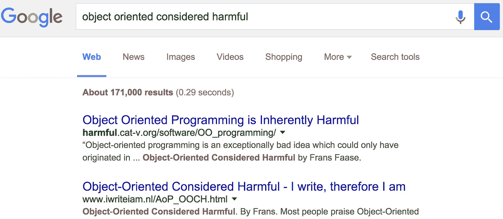

# 开发团队死亡螺旋内部

> 原文：<https://medium.com/javascript-scene/inside-the-dev-team-death-spiral-6a7ea255467b?source=collection_archive---------1----------------------->

Al King — Confused (CC-BY-2.0)

不久前，我开始写一篇关于[如何面试 JavaScript 开发人员](/javascript-scene/10-interview-questions-every-javascript-developer-should-know-6fa6bdf5ad95)的文章。随着我的深入研究，我不禁越来越深地陷入避免经典继承的重要性。我建议人们不要雇佣坚持使用经典继承的开发者[。](/javascript-scene/how-to-build-a-high-velocity-development-team-4b2360d34021)

GPO no. 746 telephone — James Potts (CC-BY-SA-2.0)

**这不是教条**，一些理论上的信仰认为我的方式是**唯一的方式**。如果说有什么不同的话，这是对普遍接受的观念的反驳，即 *`class`* 只是另一个工具，一切都在于你如何使用它。

事实是，有些工具比其他工具更好，当更好的工具出现时，我们就不再使用旧工具了。

嗯，有时候我们会停下来。除非 ***教条在拖我们后腿*** 。我认为[教条耗尽了编程的生命力](/javascript-scene/a-simple-challenge-to-classical-inheritance-fans-e78c2cf5eead):

## 为什么我一直在说这个？

我建议人们避免上课，因为它会在真实的项目中引起真实的问题，影响真实的生活。我是一名企业家。我在几个项目上全力以赴，却眼睁睁地看着它们失败。这不是夸张，这是事实:

一个失败的创业公司会让人们身无分文，失业，并且负债累累。我去过那里。我见过。今天我与你分享它，所以当我告诉你 ***`class`* 遗传会毁灭生命时，你会知道…**

我不是指着某个想象中的魔鬼大喊“邪恶，邪恶！”我在告诉你我的遭遇。我朋友的遭遇。我职业生涯初期效忠的 CEO 怎么了？

我在讲述我所经历的真实经历。讲述我熟悉并与之密切合作的真实人物的故事。我不会仅仅为了在网上与匿名人士的争论中获得几分而侮辱那些受到这些问题影响的人和成千上万的其他人。

我也不认为支持 *`class`* 的人是愚蠢的，如果你是那些已经看到我所说的人之一，仅仅因为别人不同意你就贬低他们是没有用的。

不，他们不傻。是的，他们中的一些人已经建立了“真正的生产应用程序”事实是，没有类*，你也可以构建真正的、高质量的生产应用 ***。只是没有他们 ***工作少了*** ，继续看我就告诉你为什么。****

*一些真正聪明的人致力于制定规范，更多真正聪明的人正在使用它，写关于它的文章，并鼓励其他人使用它。*

*但是有时候真正聪明的人没有意识到这种情况的全部范围，或者看不到更好的选择… 就像所有那些在 90 年代——在非常好的高级语言问世 40 年后— **仍然坚持汇编语言是编写高质量软件的最佳方式的人一样。***

## *那么为什么要争论呢？*

*我职业生涯的前半部分是在应用咨询上度过的。我已经做了上百个了。我见过各种形状和大小。我知道课程。我来自传统的 OO 语言。我知道 JavaScript 的替代品。自 90 年代以来，我一直在用 JS 构建严肃的应用程序。*

*我这样做是因为也许某个新的人，或者某个有经验且思想开放的人会看到这些警告，并意识到，“这个人经历过我现在的处境。两条路他都走过。他知道两条路通向哪里，很多人都赞同他的建议……***也许这是有道理的。”****

**

*我不想在网上赢得辩论。信不信由你，我不在乎那个。 ***这是关于你的*** 。如果你看到这个警告信号，并意识到前面有悬崖……**如果你的项目成功了，而不是失败了，*那就是成功了。****

> *我希望你成功。*

*我将留给你们两个小故事，和一些我今天看到的评论:*

*几年前，我在一个非常优秀的团队中工作，开发一个非常酷的产品。我们与业内最大的公司合作，我们的应用程序拥有数千万用户，大约有 10 万行代码。*

*有一天，一件很棒的事情发生了。我们听说了 *Backbone.js* 。这是在我们在 JS 中都有很棒的工作模块之前(AMD 是全新的)，所以 Backbone 给我们的代码带来的组织是一件很棒的事情。我喜欢它，还有那个 *`.extend()`* 特性。我知道那是什么意思，但只要我们小心，一切都会好的…*

*直到我们的一个同事开始了一场遗产狂欢。这个东西从那个继承而来，另一个从那个继承而来，如此循环……有一天，我发现自己正在处理一个叶子组件中的一个 bug，这个叶子组件位于类层次结构的第六层。每个组件都运行一些初始化代码来启动事件监听器等等。所以我沿着 *`super`* 构造器树一行一行地遍历代码，检查每个变量的每个值，试图找出哪里出了问题。*

*在花了太多时间之后，我发现了基类中的问题**，**，如果不改变基类，根本没有办法解决这个问题。但是很多小部件都依赖于这个特殊的基类。我修复问题的时候， ***都坏了*** 。*

*我别无选择，只能把它们都修好。几个小时的挫败感本应在五分钟内解决。这个问题如此普遍，它有一个众所周知的名字:“脆弱的基类问题。”*

*三个月后，我们有了为整个应用程序提供服务的各种模块，所以我们开始使用依赖注入容器，它抽象了我们模块的实例化细节，为我们提供了一个统一的服务实例化接口——类似于 Angular 中的 DI 容器，它有四种不同的方式来创建服务。终究还是没好。*

*倒带。很久以前，在 SaaS 诞生之前，我在一家开发教育软件的公司工作。建造它是轻而易举的事。有一系列你可以继承的模块，它们中的每一个都会为用户创造不同的教育体验，它们都继承了一个基类来提供模块接口。*

*只有一个问题:我们为完全不同的行业开发了完全不同的教育应用程序，每个应用程序都很重要，因为它们所服务的合同保证了正常运行。*

*但是新的模块带来了新的用例，这是在类设计时没有人想到的。这些新的用例需要对基类进行修改才能工作——但是许多模块依赖于这个基类，以及基类和新模块类之间的各种类。*

*我几乎能听到你在想……”但那是愚蠢的。每个人都知道你应该保持你的继承树浅，并使用复合。我的团队绝不会这么做。*

*是的，我看见你了，推特。我知道你在一个优秀的团队里，他们都知道正确的做事方法。但是当你不注意的时候，阶级阶层有增长的趋势。如果你没有保持警惕，在房间的另一边或国家的另一边的新家伙正忙着扩展你从未打算扩展的类。*

***因为 *`class`* 供得起 *`extends`*** *，*像椅子供得起坐，球供得起扔。那个 *`extends`* 关键词就在那里，诱惑着忙碌的程序员，他面临着紧迫的截止日期和压力，要在昨天关闭这张票*。**

> *“我知道这是不对的，但就这一次……我明天会把它修好的。”*

*但是明天你有另一个截止日期，你忘了。*

*阶级等级就像你两周前准备修补的挡风玻璃上的裂缝，或者你甚至看不到的水龙头下的霉菌。他们通过要求用户用 *`new`* 关键字来实例化它们来挖掘自己的钩子。使用 *`new`* 获得足够多的客户端，即使你想退出构造函数实现，也不能退出，**因为如果你尝试**的话，你不拥有的代码会崩溃。*

*所以我们扩展了。新的用例出现了。代码变得越来越脆弱。虫子越积越多。当我们修复一个时，99 个会像魔法一样出现。我们一直错过承诺的发货日期。 ***这是个死亡螺旋。****

*一天，我正在办公桌前开发一个插件，这时两个警长和一个穿西装的年轻人匆匆走过。他们闯进了首席执行官的办公室。门响亮地关上了。5 分钟后，老板出来告诉我们:*

> *“这是恶意收购。投资者要解雇我，他们要卖掉我在过去 25 年建立的公司。养活我家人的公司。还有你的家人。他们要把它从我们身边夺走！”*

*他们做到了。我看到他们解雇了所有从事新开发项目的人。我看着他们关闭一切，榨干维持公司运转的老摇钱树。有一天他们也解雇了我。我以为我的工作很安全。我错了。裁员 3、4 波之后，终于轮到我了。*

*然后生意就消失了，就像从未存在过一样。*

*我再也没见过那个首席执行官。*

## *其他观点*

*我将给你们留下一些最近关于这个话题的讨论:*

**

*阿克塞尔·劳施迈尔*

 *[## 我从不认为 ES6 类“显然是比组合、模块或……更好的选择”

### ES6 类有几个好处:

medium.com](/p/891e462da85b)* 

***而我的反驳:***

 *[## 我们不需要单一继承的标准。单一继承分类法是一种反模式。

### 它可以是一路向下的组合，在工厂功能中使用各种非常简单的技术。

medium.com](/p/5d58ad7107d0)* **

*丹·阿布拉莫夫*

 *[## 如何利用上课和晚上睡觉

### JavaScript 社区中有越来越多的人认为 ES6 类并不出色:

medium.com](/p/9af8de78ccb4)* * [## 贾斯汀·洛维里(@脑瘤)|推特

### 贾斯汀·洛维里的最新推文。JS 应用工程师；UI 架构师；业余舞者…

twitter.com](https://twitter.com/cerebralideas) 

令人沮丧的是，JS 中有几个 [更好的选项](/javascript-scene/introducing-the-stamp-specification-77f8911c2fee)**(从长远来看)比 *`class`* 更容易使用。**

## 最后一句话

对我来说，关于 *`class`* 的底线很简单:**如果你认为 *`class`* 是可管理的，那还不够。** *为了证明成本和风险的合理性，必须有一个真正令人信服的用例。* [阿发克，**没有任何**](/javascript-scene/a-simple-challenge-to-classical-inheritance-fans-e78c2cf5eead) 。

> “如果一个特性有时是危险的，
> 并且有更好的选择，那么
> 总是使用更好的选择。”
> ~道格拉斯·克洛克福特* 

*[*了解原型 oo
&对象构成*](https://ericelliottjs.com/product/lifetime-access-pass/) *。**

****埃里克·艾略特*** *著有* [*【编程 JavaScript 应用】*](http://pjabook.com) *(奥赖利)，以及* [*【学习 JavaScript 通用 App 开发用节点，ES6，&*](https://leanpub.com/learn-javascript-react-nodejs-es6/)*。他为 Adobe Systems****Adobe Systems*******Zumba Fitness*******华尔街日报*******ESPN*******BBC********

**他大部分时间都在旧金山湾区和世界上最美丽的女人在一起。**