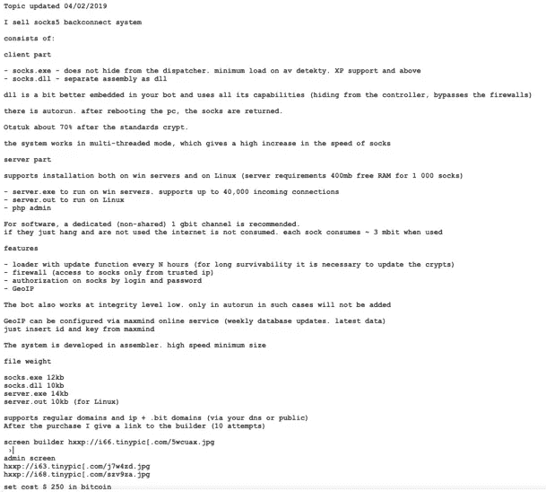
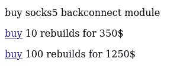
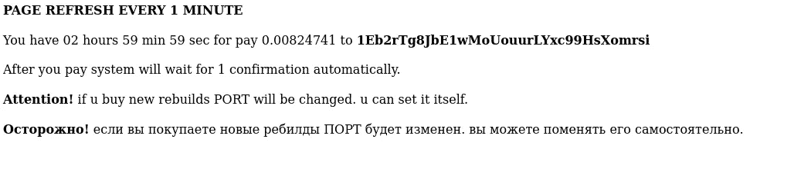
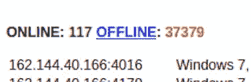

# 在系统内部，恶意软件即服务

> 原文：<https://medium.com/walmartglobaltech/inside-the-systembc-malware-as-a-service-9aa03afd09c6?source=collection_archive---------0----------------------->

作者:约书亚·普拉特和杰森·里维斯


SystemBC 历史上一直是一个代理机器人，至少从 2019 年 4 月开始出售[1]。



From: [https://www.proofpoint.com/us/threat-insight/post/systembc-christmas-july-socks5-malware-and-exploit-kits](https://www.proofpoint.com/us/threat-insight/post/systembc-christmas-july-socks5-malware-and-exploit-kits)

SystemBC 也被 TrickBot 成员利用，特别是参与敲诈和勒索活动的高调 Ryuk 子群[2，3]。

```
2020-02-25: 
Ryuk Sample MD5:6a3b792208bd433a2ceff4f8321561a0 
Cert: [Digital Leadership Solutions Limited]  
Crypter as Emotet & TrickBot w/ Political/CoronaVirus Word Gen Meta 2020-03-03:  
MD5: dceece60dcee5fd4d47755d6b3a85a75 
Private Crypter - TrickBot Group  
Cert: [Digital Leadership Solutions Limited] 
C2: 149.248.34[.]200
```

该恶意软件本身非常简单，虽然有效，但自从首次发布以来，它已经演变为后门和代理机器人。客户现在通过 TOR(socks5v7v2snlwr7[)访问支付系统。]onion)，它显示了一个构建构建的屏幕，随着时间的推移，您可以购买的构建数量以及价格会发生变化，当前的购买选项涉及 10 个或 100 个重建。



在选择你想要的包裹后，你会看到一个屏幕，上面有一个计时器和一个钱包，你可以向里面付款。



构建完成后，您会得到一个包含您的 bot、服务器和 PHP 组件的压缩档案:

```
Name
------------------------
install.txt
dll
www
www/systembc
www/systembc/geoip
server.exe
server.out
socks.exe
dll/socks32.dll
dll/socks64.dll
www/systembc/index.html
www/systembc/password.php
www/systembc/geoip/geoip2.phar
www/systembc/geoip/GeoLite2-City.mmdb
------------------------
```

参与者购买包的服务器实际上包含构建器和数据库，后者是与每个参与者购买和构建相关联的构建 id 的集合。建筑所需的树桩也存在。这种构建方法通常也用于加密程序，在这种情况下，您可以创建一个存根，它是一个已经编译好的可执行文件，通过使用基于标签的标识符或二进制文件中的偏移量来覆盖其中的某些部分。在这种情况下，它通过找到“BEGIN DATA”标记来覆盖存根文件中所需的配置数据，然后将它们打包到一个压缩的档案中，以便交付给买方。

```
BEGINDATA
HOST1:192.168.1.149
HOST2:192.168.1.149
PORT1:4001
TOR:
```

服务器只需要监听哪些端口来与 PHP 面板以及传入的机器人进行通信。

```
PORT0:4000
PORT1:4001
```

躲在 TOR 后面正成为网络犯罪分子越来越常见的策略，但这并不能使他们不被发现，在这种情况下，TOR 后面的服务器是 107.175.150[。]179.从那里，我们可以恢复跟踪销售恶意软件的参与者及其客户所需的大部分信息，包括用于构建以下内容的存根文件:

```
socks-null.exe
server-null.out
```

随着数据库的客户和他们的建设，使寻找演员和他们的小组相对容易。使用数据库中的当前定价结构，我们可以估计该行为者仅通过该服务器销售恶意软件构建(仅数据库中的当前列表)就赚了约 10 万美元。我们还发现，actors 的一些客户是网络犯罪领域的知名罪犯。

历史上，像 SystemBC 这样的代理机器人没有被密切跟踪，因为它没有被认为会在大规模攻击中被利用，但我们发现一些客户端面板包含大量的机器人。这位演员正在出售的一些团体包括 TrickBot、QBot 和 IcedID。



在发现大型面板的同时，我们还发现机器人正在下载 CobaltStrike 的一些面板，例如，一个面板正在推动以下任务:

```
hxxp://172.104.63[.]157/crypt_beacon.exe 
hxxp://172.104.63[.]157/crypt_artifact.exe
```

被一些大型网络犯罪集团利用作为提供 CobaltStrike 的后门，这使得 SystemBC 成为安装在您的环境中的又一个问题，甚至在清除其他相关感染后也可能会留下。

# IOCs

```
backupboxsite.com
infodialsxbz.com
data.servicestatus.one
185.61.138.59
s.avluboy.xyz
fmk7kux2dsxowkks.onion
5.188.60.166
proxyshmoxy.xyz
brabulco.ac.ug
adobeupd.host
panamontana.bit
aitchchewcdn.online
microsoftmirror.ac.ug
213.227.155.220
149.28.145.240
cheakendinner.xyz
fastconnectionbit.xyz
zghiexdgwfzi44b5.onion
gigabitsolutions.pw
217.8.117.42
ordercouldhost.com
upteambuilding.com
37.49.229.138
jjj2.rop.dev
asdasd08.com
ncordercreatetest.com
hcwakentent.com
kvarttet.com
amendingnoum.xyz
h4yk5u554epyhhen.onion
138.124.187.15
rar-archiver.ru
3q5d4sgdxdxkkzhl.onion
tvtmhltd.org
23.249.163.103
vpnstart.chickenkiller.com
hcwakententx2.com
62.77.156.147
hfbplsny55xcsgbn.onion
sweetcloud.link
199.19.225.233
system.proredirector.com
scserv1.info
proxybro.top
139.60.161.58
tik-tak.club
bc.fgget.top
185.254.121.121
scserv2.info
fahrrados.de
45.145.65.32
prorequestops.com
arbetfroll.pw
asdasd08.xyz
r55q2zj8sb89b33k.bit
37.1.220.248
gosigoji.bit
dealsbestcoupons.com
dfhg72lymw7s3d7b.onion
213.159.213.225
fresher.at
cp.nod32clients.com
predatorhidden.xyz
92.53.90.70
tdsstats.mooo.com
176.123.6.150
s2.avluboy.xyz
whatimnot.sc.ug
s1.freesocksvpn.xyz
kunkflok4ochg2m5.onion
soks5.icu
e6rldxwjc4jeb72c.onion
tik-tak-super-puper.xyz
usmostik.com
t6xhk2j3iychxc2n.onion
91.241.19.10
176.123.8.226
45.146.165.247
217.8.117.18
fragrant.digital
manillarout.com
63bwf6zdrgsmagpt.onion
5.79.124.201
138.197.141.150
generalnetworking.net
coinupdater.bit
arbetfrolli.pw
35.246.195.35
5.206.224.199
arhi-lab.com
185.119.57.126
31.44.184.186
you.bit
xxxxxxtnuhffpbep.onion
217.8.117.65
cashnet-server.com
4renewdmn.biz
137.74.151.42
35.246.186.86
84.38.129.162
ssl.virtualpoolnet.com
websitetbox.com
bmwsocksmozg.top
92.63.197.143
coinsdoctor.bit
systemhomeupdate.com
dragonfire.ac.ug
185.33.84.190
2y0y.l.time4vps.cloud
socks5.in
92.53.90.84
socks5.eu
masonksmith.me
s1.freevpnsocks.xyz
[www.wappallyzer.com](http://www.wappallyzer.com)
advertrex20.xyz
devstudiakomp.xyz
cleanerwors.com
188.212.22.165
5.188.60.95
maka.bit
194.61.24.117
shellcon.pro
dwuhpii.bit
dktigsgquxihyrik.onion
bitdesk.online
93.187.129.249
asdfghjkl.host
gentexman37.xyz
tbueguicsrwo64i7.onion
proxybum.xyz
217.8.117.24
core-networking.com
jlayxnzzin5y335h.onion
103.124.104.11
qtrader.club
185.125.230.131
protoukt.com
185.197.74.227
master-socks.cc
23hfdne.com
americalatina.club
jjj.rop.dev
45.77.65.71
45.77.65.72
149.28.201.253
efydniaemviuxkfo.onion
masonksmith.tech
194.5.250.151
devstudiakomp.com
23hfdne.xyz
93.187.129.252
mydomain47267.xyz
mydomain47294.xyz
huxere.xyz
dl-link.network
dl-link.club
88.198.147.80
78.47.64.46
```

# 参考

1:[https://www . proof point . com/us/threat-insight/post/system BC-Christmas-July-socks 5-malware-and-exploit-kits](https://www.proofpoint.com/us/threat-insight/post/systembc-christmas-july-socks5-malware-and-exploit-kits)

2:[https://news . sophos . com/en-us/2020/10/14/inside-a-new-ryuk-ransomware-attack/](https://news.sophos.com/en-us/2020/10/14/inside-a-new-ryuk-ransomware-attack/)

3:【https://twitter.com/vk_intel/status/1234891766924484609? lang=en