# 使用 Proxyman + apk-mitm 检查 Android 流量

> 原文：<https://medium.easyread.co/inspecting-android-traffic-using-proxyman-apk-mitm-a3e1fa6308c8?source=collection_archive---------0----------------------->


Photo by [pixabay.com](https://pixabay.com/photos/stock-iphone-business-mobile-phone-624712/)

# 介绍

大家好！还是跟我分享一些与软件工程领域技术相关的经验、想法或者看法吧。在这篇文章中，我想分享一下我检查移动应用程序网络请求的经验，尤其是对于 Android 平台！

如果我们在 web app 上聊天，检查对服务器的网络请求是非常容易的。对于 Chrome 或 Firefox，只需进入开发者工具，查看网络选项卡。我们可以监控请求类型，如方法、URL、标题、正文以及响应。

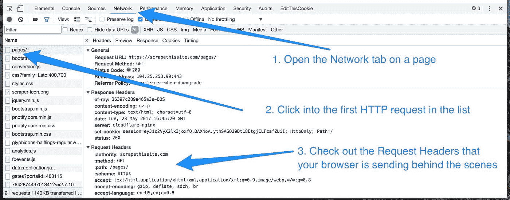

Source by [gohighbrow](https://gohighbrow.com/using-the-browsers-developer-tools-to-inspect-the-pages-you-visit/)

但是，如果我们想在移动设备上做同样的事情呢？因为对于手机浏览器，我们没有任何与开发者工具类似的选项。此外，当我们希望看到移动应用的网络时，这是不可能的。

# 代理人

答案是，我们可以使用代理等工具来帮助我们捕获设备和服务器之间的网络。这种方法叫做中间人，因为我们把代理放在中间连接。更多图片见下图。

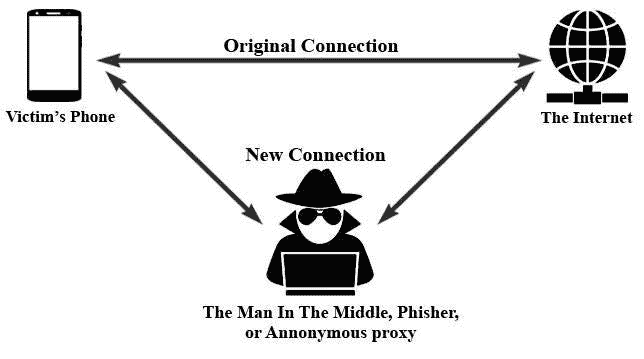

Source by [researchgate](https://www.researchgate.net/figure/An-illustration-of-the-MITM-attack_fig1_327034906)

例如，有许多代理服务:

*   代理人([https://代理人. io](https://proxyman.io/) )
*   米特普罗克(【https://mitmproxy.org】T2
*   查理(【https://www.charlesproxy.com】T4)
*   等等

我个人会选择 Proxyman，因为我是 Mac 用户，它是基于 GUI 的。如果您对基于 CLI 更感兴趣，可以尝试使用 mitmproxy。他们俩不是你最喜欢的吗？也许你可以用另一个适合你的代理人。谷歌一下就知道了。这是我提到的代理的一些外观。

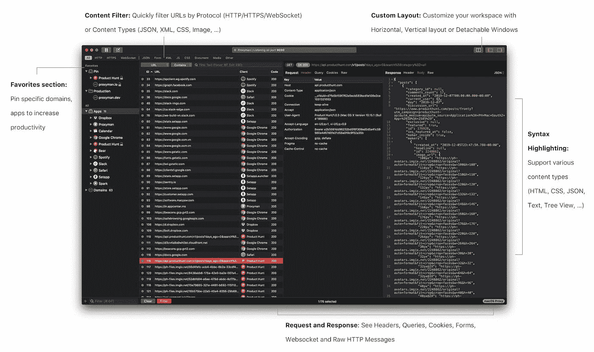

Source by [proxyman](https://proxyman.io)

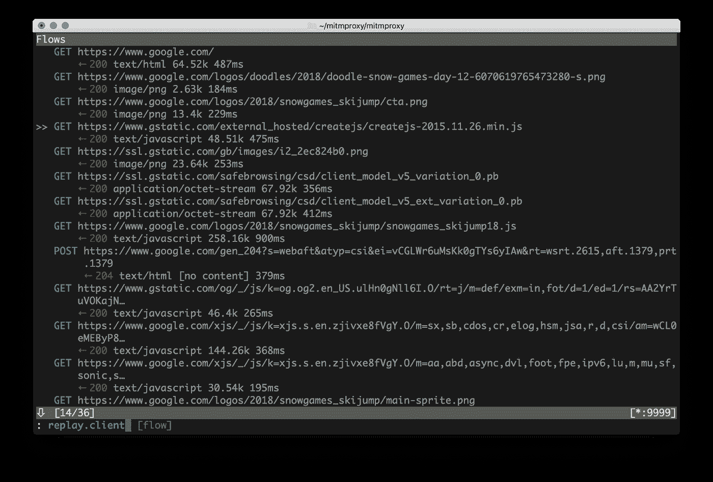

Source by [mitmproxy](https://mitmproxy.org)

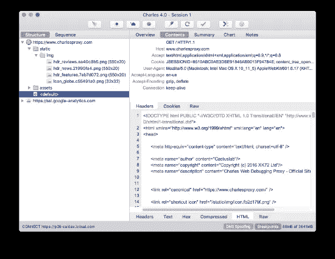

Source by [charles](https://www.charlesproxy.com)

完成安装并运行代理后，我们将得到监听端口。如果默认端口与系统上现有的端口冲突，也不用担心。我们可以很容易地换成另一个。下面是 Proxyman 如何运行并获得监听端口的图片。

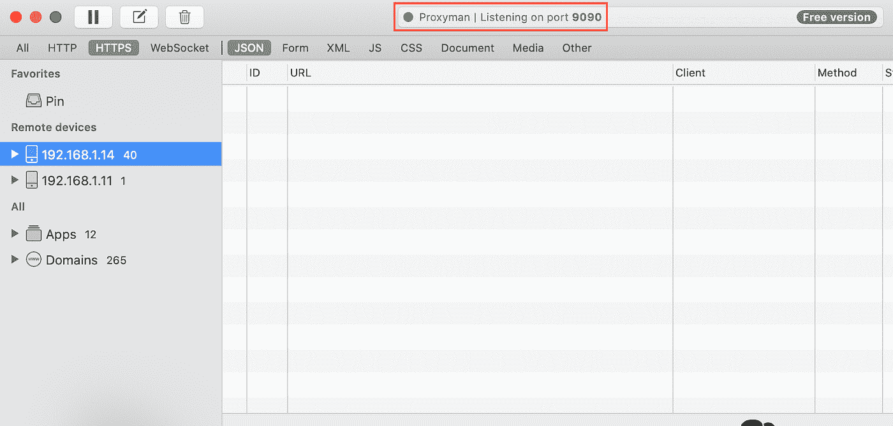

Picture 1 Proxyman Running Status

# Android 配置

之后，下一步就是在 Android 手机上进行配置。如果我们没有任何 Android 手机，我们可以使用类似 Genymotion([https://www.genymotion.com](https://www.genymotion.com/))的模拟器。

确保电话和代理服务器之间的网络在同一个网络上。转到 SSID 配置，选择手动代理并添加代理主机名+端口作为代理信息。

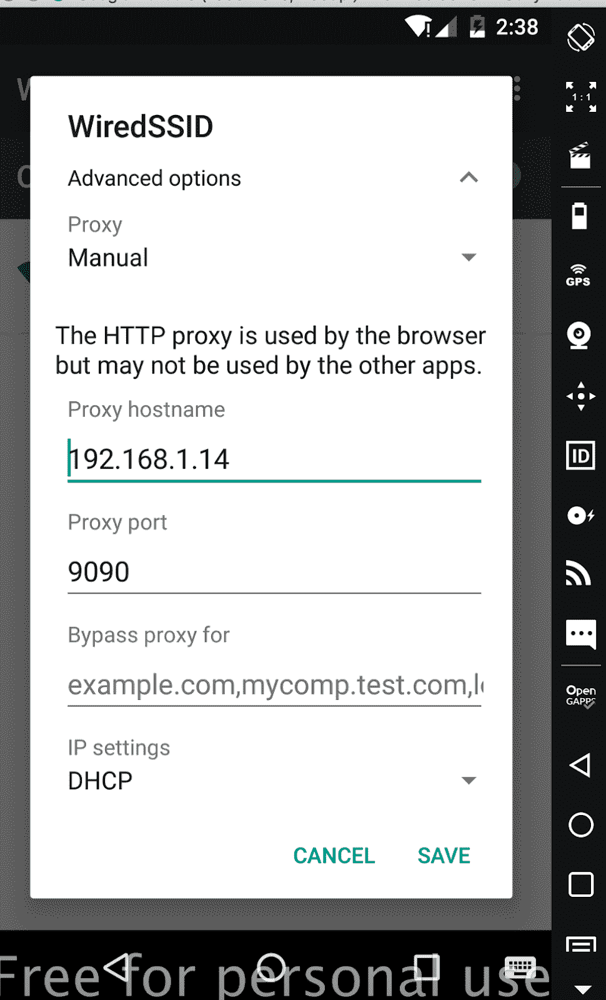

Picture 2 Android Proxy Configuration

代理配置完成后，我们需要为 Android 手机设置 SSL。因为我使用的是 Proxyman，我们需要打开[http://proxy.man/ssl](http://proxy.man/ssl)网址并下载证书。在真正的 Android 手机中，只需打开证书并按照安装即可。但是对于仿真器的情况，步骤有一点不同。我们需要从设置- >安全- >从 SD 卡安装。

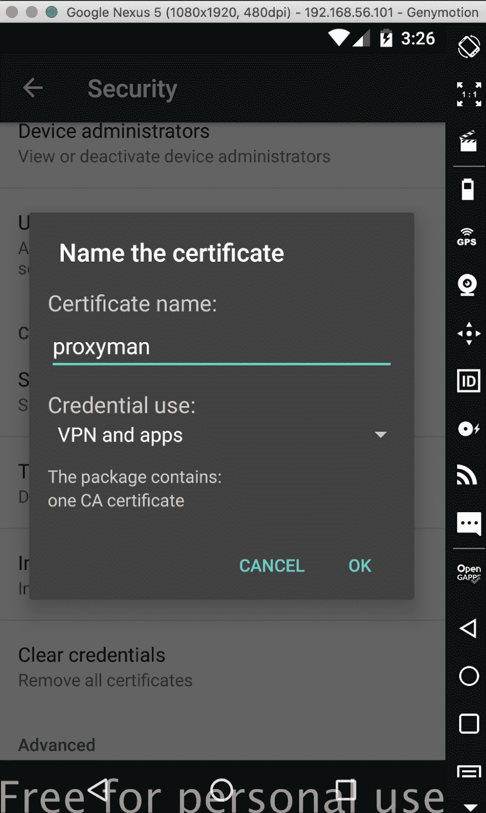

Picture 3 Android Certificate Installation

# 测试

尝试通过使用移动浏览器打开网站来捕获网络。在这种情况下，我试图捕捉雅虎网站的网络请求。正如我们在下图中看到的，网络将被捕获，如果我们需要查看响应，我们需要单击“**仅启用此域**”，并尝试应用相同的请求。详见图 4 & 5。

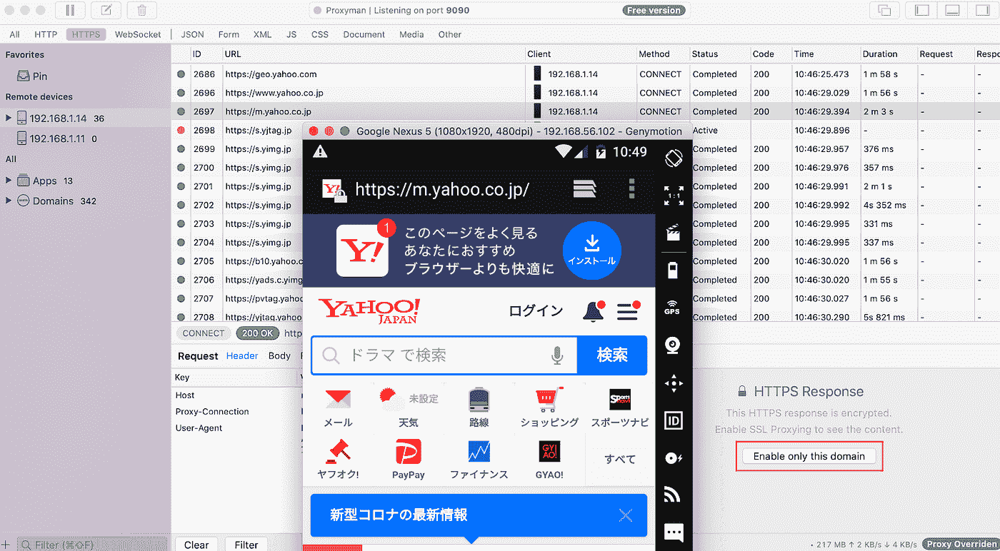

Picture 4 Mobile Browser Network Captured

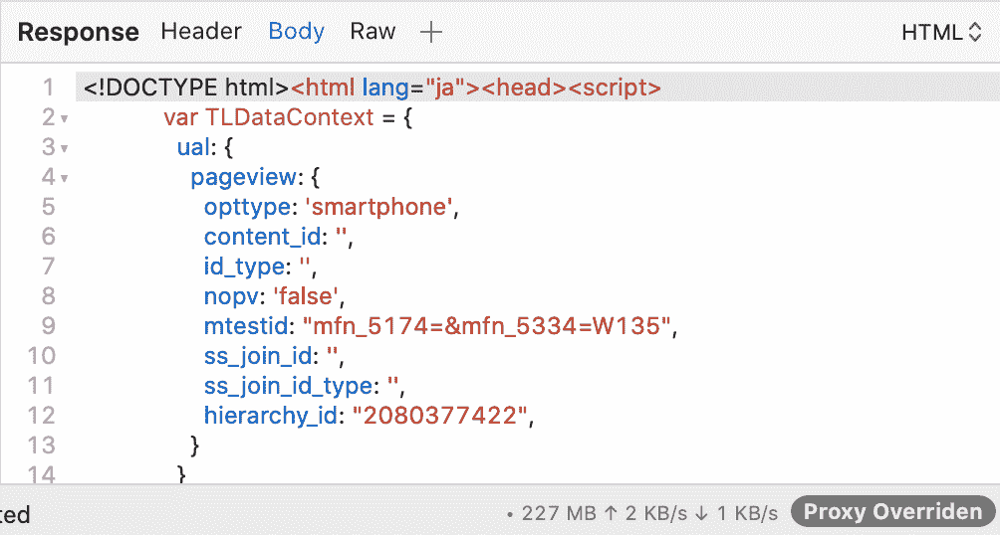

Picture 5 HTTPS Response

如果在浏览器中捕捉网络似乎没有任何问题，那么移动应用呢？嗯，我正在尝试用简单的应用程序获取货币信息。而且和“图 6”一样，还在工作！

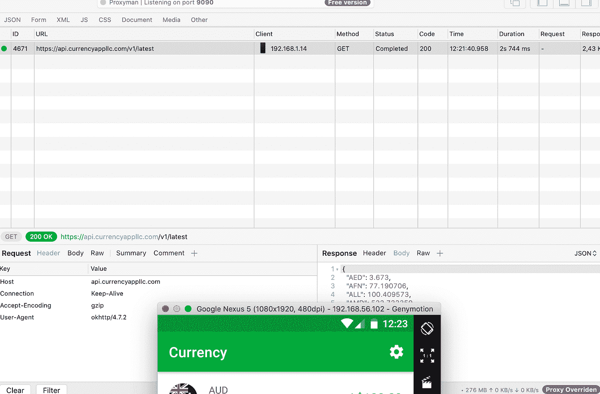

Picture 6 Mobile Application Network Captured

# 真实设备问题

对 Genymotion 执行的上一步。如果使用真实设备呢？因为在真实设备中做比在模拟器中做更舒服。但是，似乎真正的设备有一个关于 SSL 握手失败的问题。图 7 显示了网络如何由于一些错误而变红。

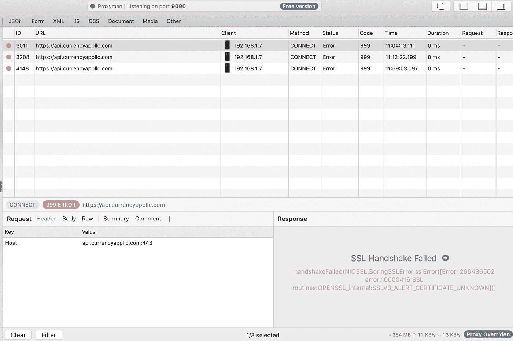

Picture 7 Real Device Issue on Network Captured

# apk-mitm

我们能做什么来解决 SSL 握手在真实设备上失败的问题？一个解决方案可能是使用这个叫做 apk-mitm([https://github.com/shroudedcode/apk-mitm](https://github.com/shroudedcode/apk-mitm))的工具

什么是 apk-mitm？从他们的官方 github 网站:

> 自动为 HTTPS 检查准备安卓 APK 文件的 CLI 应用程序

自动化整个过程。你只需要给它一个 APK 文件，`apk-mitm`就会:

*   使用 [Apktool](https://ibotpeaches.github.io/Apktool/) 解码 APK 文件
*   修改应用的`AndroidManifest.xml`使其成为`[debuggable](https://developer.android.com/guide/topics/manifest/application-element#debug)`
*   替换应用程序的[网络安全配置](https://developer.android.com/training/articles/security-config)以允许用户添加证书
*   [插入](https://mobile-security.gitbook.io/mobile-security-testing-guide/android-testing-guide/0x05c-reverse-engineering-and-tampering#patching-example-disabling-certificate-pinning) `[return-void](https://mobile-security.gitbook.io/mobile-security-testing-guide/android-testing-guide/0x05c-reverse-engineering-and-tampering#patching-example-disabling-certificate-pinning)` [操作码](https://mobile-security.gitbook.io/mobile-security-testing-guide/android-testing-guide/0x05c-reverse-engineering-and-tampering#patching-example-disabling-certificate-pinning)禁用[证书锁定](https://owasp.org/www-community/controls/Certificate_and_Public_Key_Pinning#what-is-pinning)逻辑
*   使用 [Apktool](https://ibotpeaches.github.io/Apktool/) 对打了补丁的 APK 文件进行编码
*   使用[超级签名者](https://github.com/patrickfav/uber-apk-signer)对打了补丁的 APK 文件进行签名

正如我们可以看到上面的描述，我们需要生 APK。我们可以从 [APKPure](https://apkpure.com/) 或类似地点获得，或使用 [SAI](https://github.com/Aefyr/SAI) 出口。然后，我们只需要运行这个安装+执行命令，整个过程将如图 8 所示。

```
$ npm install -g apk-mitm
$ npx apk-mitm <path-to-apk>
```

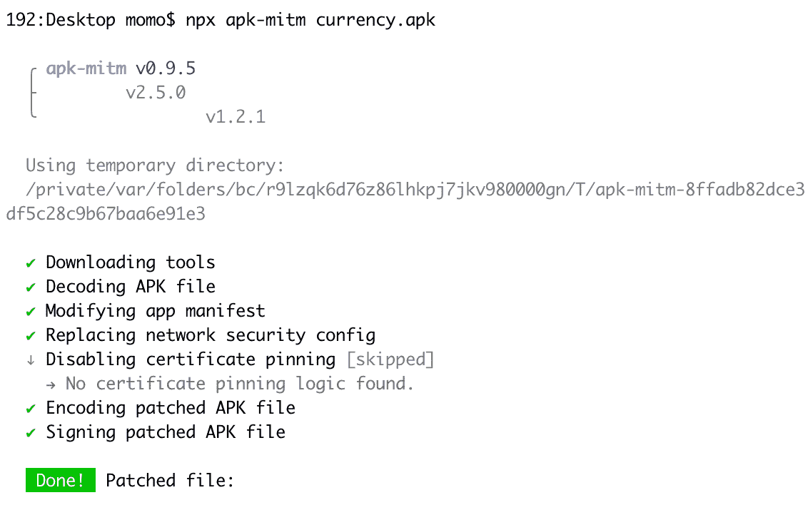

Picture 8 Patching APK

完成安装修补的 APK 后，尝试打开应用程序并查看捕获的请求。瞧啊。来自修补的 APK 的请求没有关于 SSL 握手失败的问题！

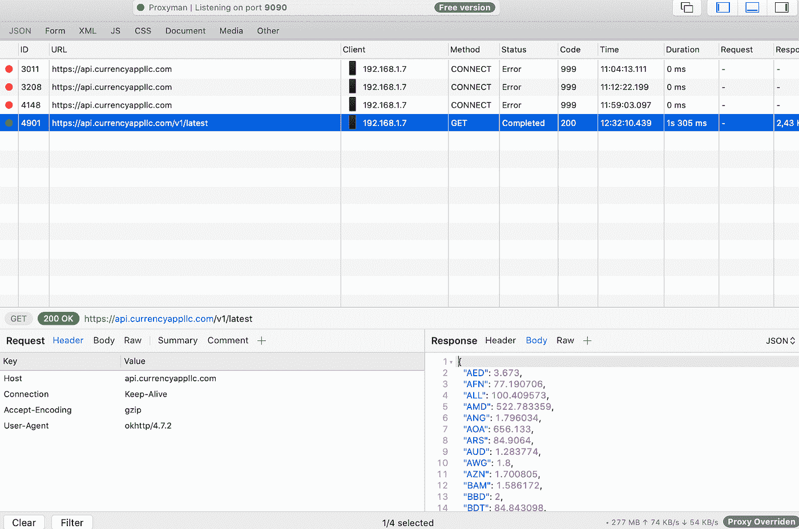

Picture 9 Real Device Issue Solved

# 证书锁定问题

不幸的是，在我的案例中，我遇到了一个关于实现证书锁定的应用程序的问题。如果你是第一次听说它，你可以参考这里的详细内容。虽然 apk-mitm 说他们有禁用证书锁定的逻辑，但这对我不起作用。代理控制台上仍然出现“SSL 握手失败”的错误。

# 结论

对这个实验的总结可以列举在下面几点上:

*   Proxyman 可以很好地捕捉 Android (Genymotion)的浏览器和应用程序网络请求。
*   在真正的 Android 设备上捕获网络应用程序需要使用`apk-mitm`进行额外处理。
*   Proxyman 可以很好地捕捉 iOS(真实设备)的浏览器和应用程序网络请求。由于主题区的原因，我没有分享 iOS 的细节，但我一直在尝试。
*   尽管我们使用的是打了补丁的 APK，但实现了证书锁定的 Android 应用程序可能会因为 SSL 握手失败而失败。

我希望这篇文章有用，并看到你对另一个主题！谢谢大家！