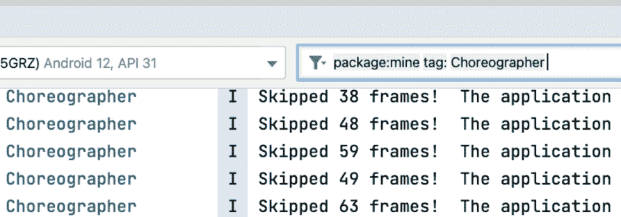
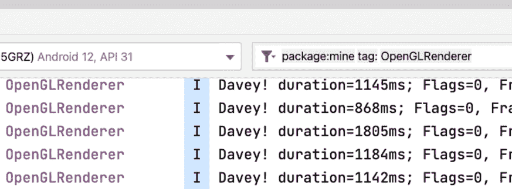
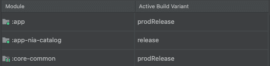

# 检查性能

> 原文：<https://medium.com/androiddevelopers/inspecting-performance-95b76477a3d7?source=collection_archive---------0----------------------->


Illustration by Claudia Sanchez

这篇关于**检查性能**的 MAD 技巧文章向您介绍了有助于提高代码性能的工具和方法。当您检查性能时，请确保您的应用程序中发生的事情与您预期的一致。

你也可以把这篇文章当做一个疯狂的技能视频来看。

MAD Skills — Inspecting Performance

检查性能是为了确保应用程序中发生的事情符合您的预期。

我们将绩效检查分为三个阶段:被动、手动和自动。每一个都有自己的发光的地方和被利用的理由。

# 被动性能检查

当我们谈到被动性能检查时，我们的意思是除了运行它并查看现有的输出之外，没有发现性能问题所必需的额外工作。在直接与应用程序交互时，可以看到一些问题，如冻结帧和缓慢的行为。这可以帮助您找到应用程序需要改进的地方，尤其是在 CPU 能力或 RAM 等规格较低的设备上运行应用程序时。

接下来运行应用程序并直接在屏幕上评估 jank，您可以使用 **logcat** 检查速度慢和掉帧的情况，这些情况会自动记录下来。

## 慢速帧

使用 Android Studio 中新的 **Logcat** 来过滤`Choreographer`标签，你可以在运行应用程序时看到丢帧。一旦跳过超过 30 帧，就会被记录下来。



## 冻结帧

渲染时间超过 700 毫秒的帧将用`OpenGLRenderer`标签和一些更详细的信息记录下来。



## 非响应活动

如果你的应用程序超过 5 秒钟没有响应，你会看到活动无响应(ANR)对话框。


## 应用发布

通过过滤`ActivityTaskManager`标签，你还可以在 logcat 中看到应用程序的启动持续时间。

初始显示时间(TTID)将用`Displayed`记录。

用`Fully Drawn`记录完全显示时间(TTFD)。

> 少于 500 毫秒(0.5 秒)的应用程序启动时间是可取的，因为用户会对较长的启动时间产生负面影响。

您可以在之前关于 [MAD 技能绩效指标](/androiddevelopers/important-performance-metrics-c7dacf018eb3?source=rss-------1)的文章中了解更多关于这些指标的信息。

[](/androiddevelopers/important-performance-metrics-c7dacf018eb3) [## 重要的绩效指标

### 在您开始有效地处理绩效之前，我们建议您熟悉关键绩效…

medium.com](/androiddevelopers/important-performance-metrics-c7dacf018eb3) 

被动检查是查看是否存在问题的一个很好的起点，可以帮助您大致指出问题的正确方向。要真正确定是应用程序的哪个部分导致了问题，被动检查很少是足够的。你需要主动检查你的应用程序代码。

# 人工性能检查

当你大致了解了应用程序的哪些部分没有按照你的预期执行时，是时候手动深入检查发生了什么。Android Studio 附带了一套分析器，可以帮助您检查应用程序中正在发生的事情。

Android Studio 的分析器与调试器有相似之处。调试器用于单步调试代码，查看参数和属性值，分析器用于检查 CPU、内存、网络使用情况以及邱建的可能来源。

> 分析器帮助您详细了解问题发生的位置。

当您开发应用程序时，调试器允许您在开发过程中附加到应用程序并深入检查问题，使用可调试的构建很可能会给出错误的性能数据。

# 总是在真实设备上检查发布版本

可调试版本提供了许多对开发有用的功能，如实时编辑，无需重新安装应用程序即可应用更改，或者检查属性值，更改数据以及使用 Android Studio 的调试功能。

标记为可调试的版本也会增加应用程序的性能开销。这使得性能指标不可靠。一些在可调试版本上看起来表现不佳的东西，实际上可以在发布版本上很好地工作。

要验证性能问题是存在于生产环境中还是仅存在于开发过程中，请确保在应用程序的发布构建发布版本中进行验证。

通过将构建变体切换到最像生产的构建，将您的构建变体设置为 release。Android 中的 Now 示例为此使用了“prodRelease”。



同样，在您的`AndroidManifest.xml`中，将应用程序标记为`profileable`。这允许分析器检查生产构建中发生了什么。

```
<!--AndroidManifest.xml--><manifest...
  <application...
    <profileable android:shell=”true” tools:targetApi=”q” /
  </application>
</manifest>
```


Always inspect release builds on a physical device

> 您需要在物理设备上检查发布版本。

Android 模拟器已经走过了漫长的道路。它启动迅速，运行流畅，并在应用程序开发过程中提供无缝体验。但是当谈到测量性能时，Android 模拟器并不是合适的工具。

当您在模拟器上检查性能时，您不是在用有物理限制的 Android 设备进行测量，而是在用主机的能力进行测量。如果主机系统负载过重，被检查的应用程序的性能会降低。

> 检查物理设备的性能将为您提供持续有用的数据。

# 手动性能检查的更多 MAD 技巧

因为手动性能检查本身就是一个完整的主题，所以我们制作了一个完整的系列，旨在帮助您深入理解手动性能调试。你可以在这里查看。

MAD Skills Performance Debugging playlist

# 自动化性能检查

在检查性能时，被动和手动检查是重要的步骤。检查性能的第三种方法，也可能是最可靠的方法，是自动性能检查。通过自动化的性能检查，您可以一次又一次地在流程中可靠地运行相同的步骤。

> 自动化检查有助于在交付给用户之前防止性能问题。

虽然自动化过程需要一些设置，但在确保应用性能一致时，您可以高枕无忧。我们提供 Jetpack Macrobenchmark 库来帮助您自动执行性能检查。这个库允许您自动检查整个用户流的性能。当使用 Jetpack Macrobenchmark 库时，您可以测量关键指标，如应用程序启动、帧计时和其他性能指标。

## Jetpack Macrobenchmark 入门

开始使用 Jetpack Macrobenchmark 所需要的只是 Android Studio 的最新版本。我们最近发布了一个 [codelab，引导你完成创建和运行你的第一个宏基准的过程](https://goo.gle/baseline-profiles-codelab)。

此外，关于如何创建宏基准的总体[指南](https://developer.android.com/topic/performance/benchmarking/macrobenchmark-overview)给了你最新的入门指导。

# 在您等待下一篇文章的时候

在下一篇文章中，我们将向您介绍一种使用[基线配置文件](https://developer.android.com/topic/performance/baselineprofiles)提高应用程序性能的快速方法。

去看看我们改进的开发者文档，我们已经用 MAD 指南更新了它。

要获得更多的实践经验，请查看 GitHub 上的[示例](http://github.com/android/performance-samples)。

或者参加[宏观基准测试代码实验室](https://goo.gle/baseline-profiles-codelab)或[基准配置文件代码实验室](https://goo.gle/baseline-profiles-codelab)以获得主题的实际指导。

此外，确保在视频评论或 Twitter 上提出你的问题，使用 [#MADPerfQA](https://twitter.com/search?q=%23MADPerfQA) 直接从致力于 Android 性能的工程师那里获得答案。