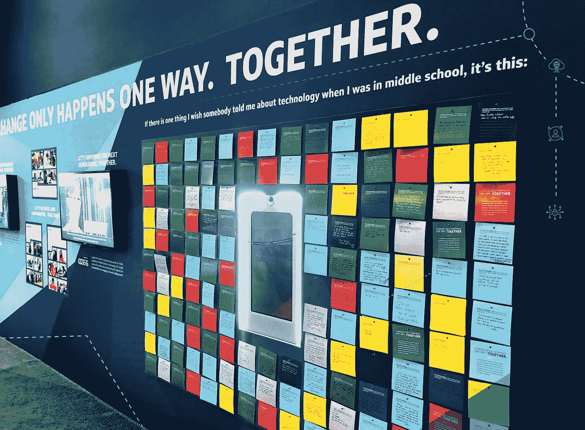

# 激励下一代科技女性

> 原文：<https://medium.com/capital-one-tech/inspiring-the-next-generation-of-women-in-tech-8af80d83c4ae?source=collection_archive---------0----------------------->

Coders’ Wall in the Capital One booth at GHC

*由 Capital One Tech*

在今年的格蕾丝·赫柏计算机界女性庆典(GHC)上，各行各业各种规模的组织齐聚一堂，共同庆祝和提升科技界的女性。Capital One 的出席人员包括 200 多名女性技术专家和盟友、几位演讲人，以及一次旨在吸引与会者并为他们提供激励下一代技术专家的机会的展位体验。

随着与会者分布在大学生和职业经历的各个阶段，整个 GHC 观众都有一种强烈的愿望，不仅要相互联系，还要为女孩和年轻学生树立榜样，向他们展示技术的面貌。Capital One Coders 是一个为期 10 周的项目，Capital One associates 在该项目中教授全国的中学生如何编程，这与 GHC 的观众有着天然的联系。

凭借与软件工程、机器学习、人工智能和数据科学等各种技术领域相关的色彩鲜艳的卡片，在 Capital One 展台驻足的与会者有机会亲自给一名程序员学生写一封信，以提高他们对 STEM 的兴趣和自信心。

每张卡片都将送给 Capital One Coders 的学生，以帮助激发他们热爱技术。提示很简单:

*亲爱的未来技术专家:如果有一件事我希望有人在我中学的时候告诉我，那就是:*

反应非常热烈，写了成百上千封信。

感谢每一位抽出时间给 Capital One Coders 的学生写信的与会者。您的话将对塑造技术的未来产生直接的积极影响。

要了解更多关于 Capital One Coders 的信息，请[点击此处](http://coders.capitalone.com/)。

这些是作者的观点。除非本帖中另有说明，否则 Capital One 不属于所提及的任何公司，也不被其认可。使用或展示的所有商标和其他知识产权都是其各自所有者的所有权。本文为 2018 首都一。