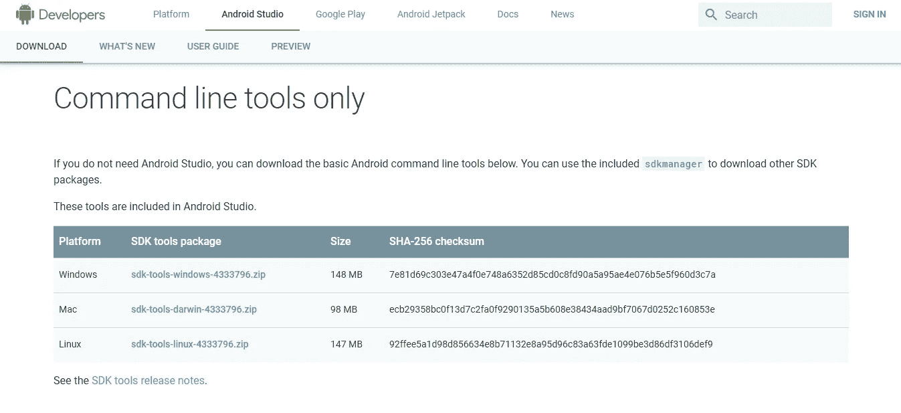
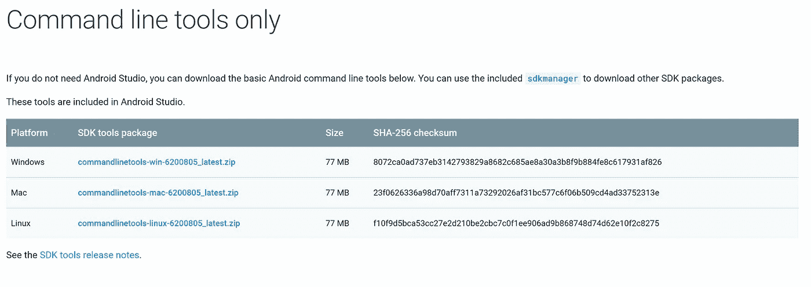
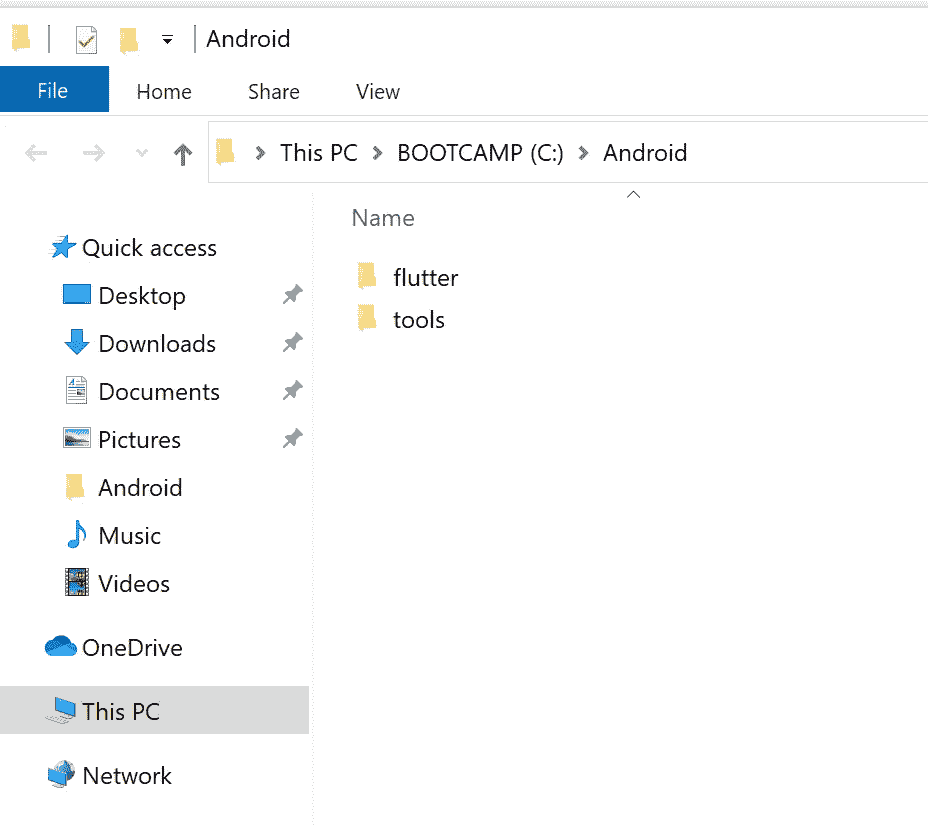
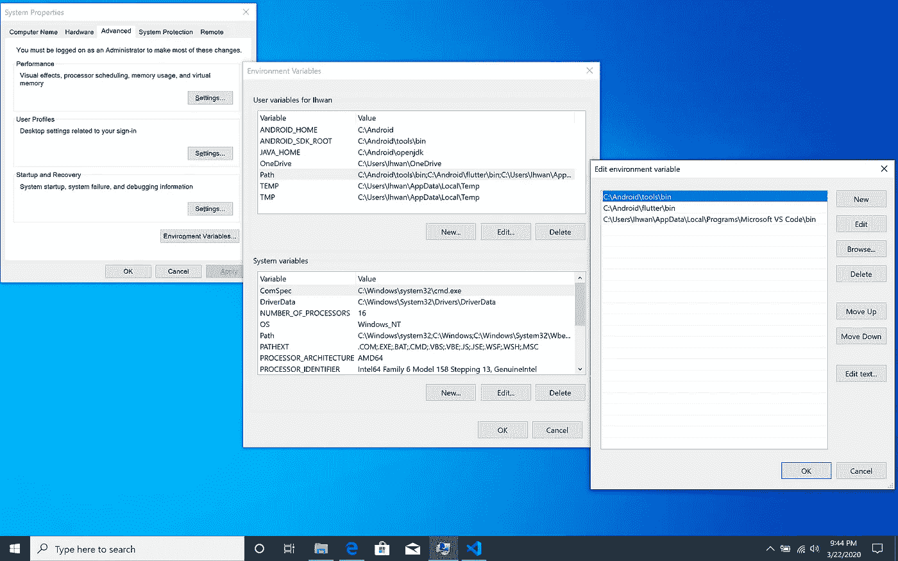
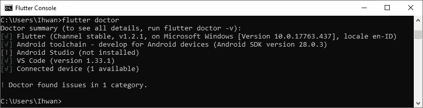
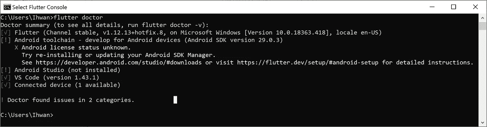
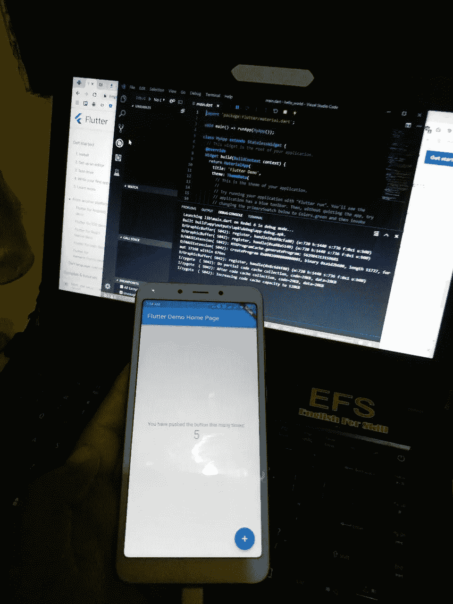
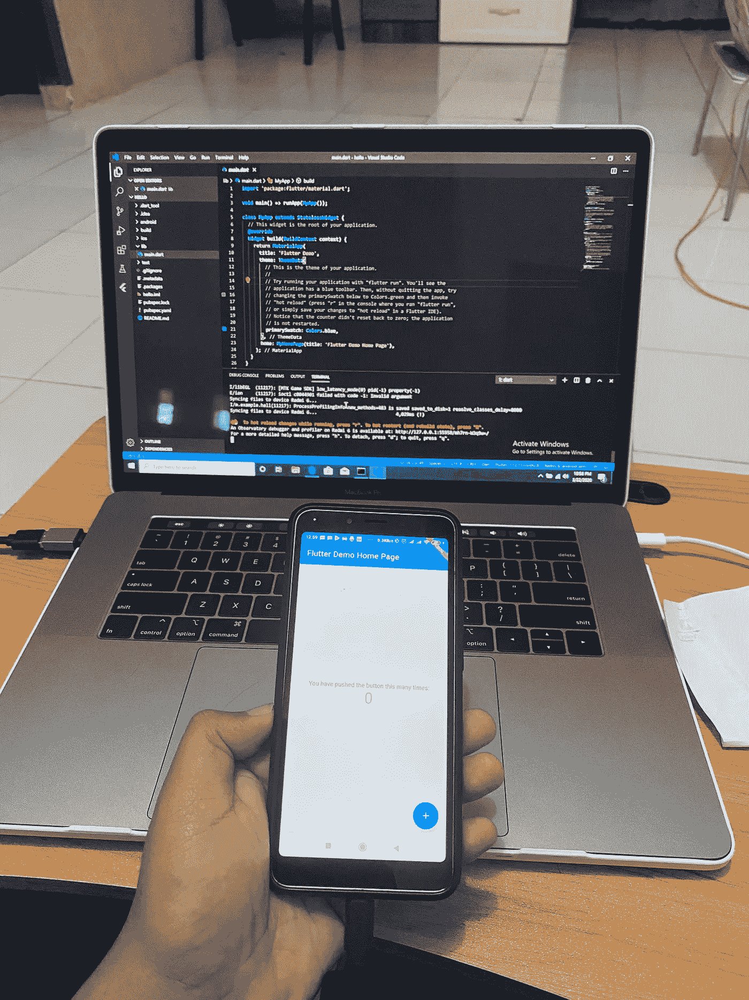

# [Update 2020] Instalasi Flutter Tanpa Android Studio

> 原文：<https://medium.easyread.co/instalasi-flutter-tanpa-android-studio-2a0876302a68?source=collection_archive---------0----------------------->

## Langkah-langkah untuk Install Flutter Workspace tanpa menggunakan Android Studio


flutter from google image search

Hai semuanya! Semoga sehat selalu.
Kali ini saya ingin berbagi pengalaman seputar instalasi *flutter* , tentunya dengan cara yang berbeda dari biasanya.

Untuk teman-teman yang belum tahu apa itu *flutter* , singkatnya :

```
Flutter adalah sebuah framework aplikasi mobil sumber terbuka yang diciptakan oleh Google. Flutter digunakan dalam pengembangan aplikasi untuk sistem operasi Android dan iOS. [Wikipedia]
```

Umumnya cara menginstal flutter dengan step-step berikut

1.  Download SDK Flutter
2.  Instalasi Android Studio
3.  Download plugin dart & flutter untuk VsCode atau Android Studio
4.  Buat Project dan Jalankan hello world

Sekilas memang terlihat mudah, namun akan sangat menjadi kendala untuk teman teman yang memiliki storage terbatas (#TimSSD120GB) ataupun spesifikasi laptop yang kurang mumpuni untuk membuka IDE Android Studio.

Maka saya dengan penuh percaya diri menawarkan alternatif yang membutuhkan *effort* sedikit lebih banyak namun bisa menghemat *storage* serta menjaga emosi teman-teman dalam menghadapi aplikasi *not responding* .

Jawabannya adalah Instalasi Flutter + Android SDK Only. Ya benar, teman teman tidak memerlukan Android Studio dan tidak perlu menginstalnya.

Berikut langkah-langkahnya.

1.Download SDK Flutter. Silahkan kunjungi halaman download [disini](https://flutter.dev/docs/development/tools/sdk/releases) , dan sesuaikan dengan sistem operasi teman teman. saat tulisan ini dibuat flutter dalam versi 1̵.̵2̵.̵1̵ ̵S̵t̵a̵b̵l̵e̵ 1.12.13-hotfix.8-stable

2\. Selanjutnya silahkan download Command Line Tools Only di [**halaman ini**](https://developer.android.com/studio) , penampakannya seperti berikut, sesuaikan dengan sistem operasi yang digunakan.



tampilan lawas



tampilan terupdate

di sdk terbaru mungkin akan terdapat error karena ada beberapa perubahan pada folder tools nya. jika ingin menggunakan command line tools yang lawas bisa download di [link ini.](https://dl.google.com/android/repository/sdk-tools-windows-4333796.zip)

3\. Silahkan Ekstrak kedua file tersebut dan letakkan di **C:\Android** untuk windows dan untuk sistem operasi yang lainnya bisa menaruh di root dan buat folder **Android.** Maka hasilnya akan ada 2 folder yaitu folder **flutter** dan **tools.**



begini loh maksudku gaes

4\. Selanjutnya silahkan download OpenJDK di [**github ini**](https://github.com/AdoptOpenJDK/openjdk8-binaries/releases) atau di [**halaman resmi**](https://adoptopenjdk.net/) , dan pilih yang berekstensi zip, msi atau dmg (jika menggunakan msi / dmg bisa auto add Path Java nya). sesuaikan dengan sistem operasi yang digunakan, saya menggunakan **versi** j̵d̵k̵8̵u̵2̵1̵2̵-̵b̵0̵3 jdk8u242-b08\. setelah di download jangan lupa untuk mengekstrak ke folder **Android** yang sudah kita punya sebelumnya dan rename nama folder menjadi **openjdk** . totalnya sekarang kita punya 3 folder yaitu **flutter** , **tools** dan **openjdk** .

Sebenarnya bebas untuk teman teman memilih openjdk atau jdk dari oracle. tapi saya **lebih prefer** untuk menggunakan openjdk. juga sebenarnya tidak mesi teman-teman untuk menaruh path nya ke dalam folder **Android** tapi ini untuk memudahkan saja.

5\. sampai sini kita harus menge-set **Environment Variable** dan **Path,** untuk windows silahkan buka command prompt dan ketikan command perbaris (jangan dicopas).

```
setx JAVA_HOME “C:\Android\openjdk”
setx ANDROID_HOME “C:\Android”
setx ANDROID_SDK_ROOT “C:\Android\tools”
setx path "C:\Android\tools\bin;C:\Android\flutter\bin”
```

atau teman teman juga bisa langsung menggunakan GUI **Environment Variables** dengan cara mengetik env pada start menu untuk menambahkan path nya. Untuk OS lainnya silahkan menyesuaikan.



6\. Buka terminal (Command Prompt) di `C:/Android/tools/bin` lalu ketikan beberapa perintah berikut.

```
sdkmanager “system-images;android-29;default;x86_64”
sdkmanager “platform-tools”
sdkmanager “platforms;android-29”
sdkmanager “build-tools;29.0.3”
```

jika proses ini tidak berhasil (dulu bisa) ada baiknya berkunjung ke [stackoverflow](https://stackoverflow.com/a/60600600)

jika ingin download platform-tools secara manual bisa [kesini](https://developer.android.com/studio/releases/platform-tools)

sehingga setelah mengikuti proses error diatas teman-teman bisa mengubah commandnya dengan menambah param — sdk_root menjadi

```
sdkmanager --sdk_root=%ANDROID_HOME% "system-images;android-29;default;x86_64"
```

untuk pengguna Mac silahkan jalankan dengan single qoute (petik satu) seperti berikut (ketik ulang ya).

```
 sdkmanager ‘system-images;android-29;default;x86_64’ 
```

untuk SDK sendiri, Flutter selalu memerlukan Android SDK yang terbaru. jadi silahkan update sdk dengan command :

```
sdkmanager —-update
```

Dokumentasinya ada [**disini**](https://developer.android.com/studio/command-line/sdkmanager)

E̵d̵i̵t̵e̵d̵ ̵:̵ ̵S̵a̵a̵t̵ ̵t̵u̵l̵i̵s̵a̵n̵ ̵i̵n̵i̵ ̵d̵i̵b̵u̵a̵t̵,̵ ̵F̵l̵u̵t̵t̵e̵r̵ ̵m̵e̵m̵e̵r̵l̵u̵k̵a̵n̵ ̵S̵D̵K̵ ̵t̵e̵r̵b̵a̵r̵u̵ ̵y̵a̵i̵t̵u̵ ̵P̵i̵e̵ ̵(̵A̵n̵d̵r̵o̵i̵d̵ ̵2̵8̵)̵,̵ ̵n̵a̵m̵u̵n̵ ̵s̵a̵a̵t̵ ̵i̵n̵i̵ ̵s̵u̵d̵a̵h̵ ̵m̵e̵m̵e̵r̵l̵u̵k̵a̵n̵ ̵S̵D̵K̵ ̵a̵n̵d̵r̵o̵i̵d̵-̵Q̵.̵ ̵s̵i̵l̵a̵h̵k̵a̵n̵ ̵t̵e̵m̵a̵n̵-̵t̵e̵m̵a̵n̵ ̵g̵a̵n̵t̵i̵ ̵c̵o̵m̵m̵a̵n̵d̵ ̵y̵a̵n̵g̵ ̵b̵e̵r̵i̵s̵i̵ ̵a̵n̵d̵r̵o̵i̵d̵-̵2̵8̵ ̵m̵e̵n̵j̵a̵d̵i̵ ̵a̵n̵d̵r̵o̵i̵d̵-̵Q̵.̵

Jangan lupa untuk menjalankan syntax accept licenses nya

```
flutter doctor --android-licenses
```

7\. Selanjutnya install [**Visual Studio Code**](https://code.visualstudio.com/) dan ekstension [**flutter**](https://marketplace.visualstudio.com/items?itemName=Dart-Code.flutter) serta [**dart**](https://marketplace.visualstudio.com/items?itemName=Dart-Code.dart-code) nya.

8\. Jika semuanya sudah selesai silahkan buka terminal (Command Prompt) di **Android/flutter** atau untuk pengguna windows bisa double klik di `C:\Android\Flutter\flutter_console.bat` dan jalankan perintah **flutter doctor,** maka hasilnya seperti gambar berikut.



flutter doctor versi lama



flutter doctor versi baru

noted : aku ga tahu kenapa ini lebih sulit dari biasanya untuk accept licenses androidnya. aku rasa ada perubahan pada android sdk terbaru dan belum menyesuaikan dengan flutter. tapi kita bisa accept lisense nya dengan command `sdkmanager --licenses`

9\. Step terakhir adalah buat project di VsCode dengan klik F1 dan mengetikan **Flutter: New Project** setelah project selesai di load, klik F5 / ketik `flutter run` untuk mendeploy ke android device teman-teman. dan hasilnya seperti gambar dibawah ini



foto lama



foto ter-update (aku sampe bela-belain install windows di mac loh, [subscribe channelku yah](https://youtube.com/codewithihwan))

*Nah,* itu dia cara yang agak ribet namun dapat membantu teman teman yang memiliki device dengan spek dan storage yang terbatas. sekian dulu sharing dari saya, apabila da kesulitan bisa dikonsultasikan lewat [discord server](https://discord.gg/q4YxMWy) saya. Terimakasih dan sampai jumpa .

oiya, tulisan ini sudah beberapa kali di update, terimakasih kepada teman teman yang sudah memberikan feedback terutama kepada [Abiyyu Daffa’ Alam](https://t.me/daffaalam) . feel free untuk memberikan masukan atau dan saran.