# 在 OpenShift 上安装 SFTP 服务器

> 原文：<https://medium.com/compendium/install-an-sftp-server-on-openshift-818ea30a4319?source=collection_archive---------0----------------------->

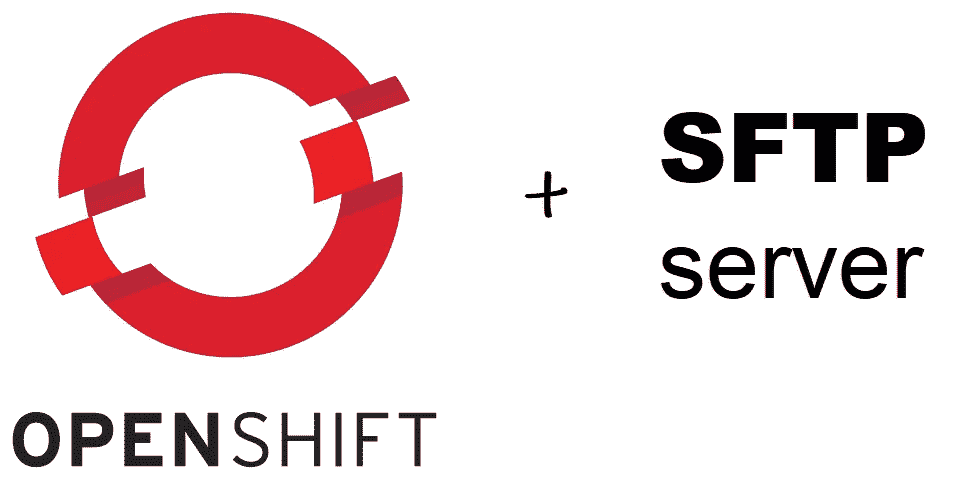

# 背景

在工作中，我们需要一台 SFTP 服务器来测试我们的软件。我自愿在我们的 OpenShift 测试环境中安装一个，但是遇到了很多正在进行的问题，并且在这个项目上花费了太多的时间。我是 OpenShift 新手，真的低估了这个任务。

我们用的是 open shift/okd 3.11 版本。作为我们的消息来源，我发现 https://github.com/atmoz/sftp 的[也在 Docker Hub 上，下载量超过 1 亿次。](https://github.com/atmoz/sftp)

GitHub 存储库包含几个分支，我选择使用 alpine-3.7 分支，因为它的大小只有 16 MB。

在试图修改 atmoz/sftp 项目以便能够以非 root 用户身份运行时，我很快就遇到了问题。进展不顺利，我放弃了这一尝试。

另一个问题是配置文件 CRLF (Windows)和 LF (Linux)中的换行符。

希望这篇安装日志能对你有所帮助。

# 安全考虑

你相信消息来源吗？SFTP 服务器必须以 root 身份运行，这违背了 OpenShift [的建议](https://docs.openshift.com/container-platform/3.11/install/prerequisites.html#security-warning)。我们只在内部使用这个服务器，不对外公开。制作 GitHub 源项目的一个分支(副本)并使用它。

# 安装概述

安装包括以下内容:

1.  来自 docker hub 或 GitHub 的容器源。
2.  用户的配置映射:
    /etc/sftp/users.conf
3.  ssh 密钥和配置的配置映射:
    /etc/ssh/ssh _ host _ ed 25519 _ key
    /etc/ssh/ssh _ host _ ed 25519 _ key . pub
    /etc/ssh/ssh _ host _ RSA _ key
    /etc/ssh/ssh/ssh _ host _ RSA _ key . pub
    /etc/ssh/sshd _ config
4.  允许外部流量到端口 30022 ->内部端口 22 的节点端口
5.  用户上传目录的永久卷(PV)存储:
    /home/user/upload

# 项目

登录到 OpenShift 服务器，为 SFTP 服务创建一个新的项目/名称空间，或者选择一个现有的项目/名称空间。

创建一个新项目:

```
oc new-project int-sftp --display-name="Internal sftp server"
```

或者选择一个现有项目:

```
oc project int-sftp
```

> 在整个安装过程中，假设您登录到同一个项目/名称空间。

# 新应用程序

创建新应用程序:

来自 docker hub:

```
oc new-app atmoz/sftp:alpine-3.7
```

或者从 GitHub 存储库中获得:

```
oc new-app [https://github.com/atmoz/sftp#alpine-3.7](https://github.com/atmoz/sftp#alpine-3.7)
```

看一下逃生舱的日志。预期错误消息:

```
mkdir: can't create directory '/var/run/sftp': Permission denied
```

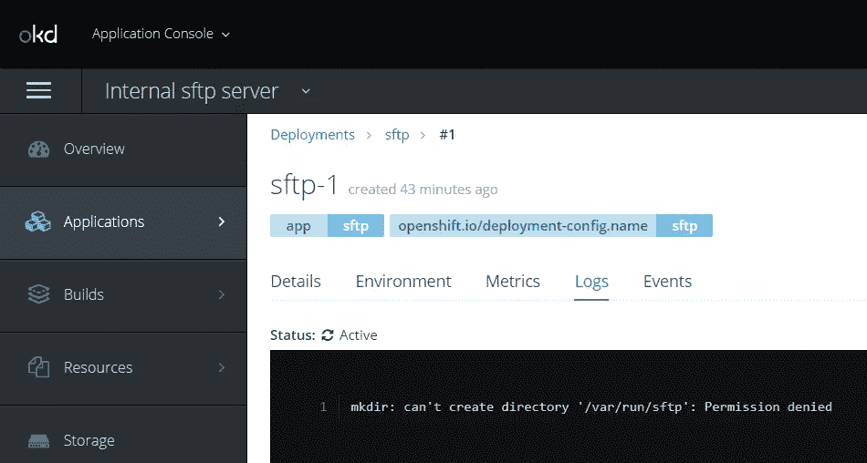

# 允许以 root 用户身份运行

将更改当前项目/命名空间(int-sftp)中默认用户的策略，以任何用户 ID (root)身份运行:

```
oc adm policy add-scc-to-user anyuid -z default
scc “anyuid” added to: [“system:serviceaccount:int-sftp:default”]
```

要检查哪些用户能够以 root 用户身份运行，请执行以下操作:

```
oc edit scc anyuidusers:- system:serviceaccount:int-sftp:default
```

要查看“以 root 用户身份运行”设置是否达到了预期的效果，请缩小并再次放大 sftp 部署。


请注意，您会得到预期的错误消息:

```
[entrypoint] FATAL: No users provided!
```

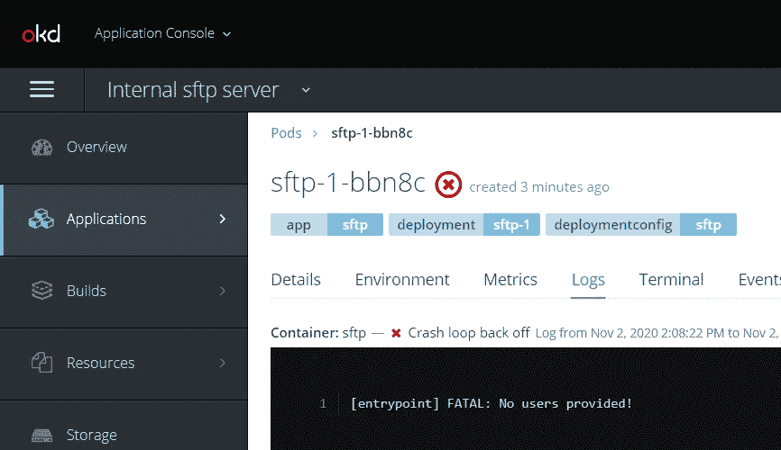

# SFTP 用户配置图

创建一个名为 sftp-etc-sftp 和 key users.conf 的新配置映射，内容如下:

```
foo:123:1001:100:upload
bar:abc:1002:100:upload
baz:xyz:1003:100:upload
```

用户配置文件的格式是用户名:密码:UID:GUI:目录。

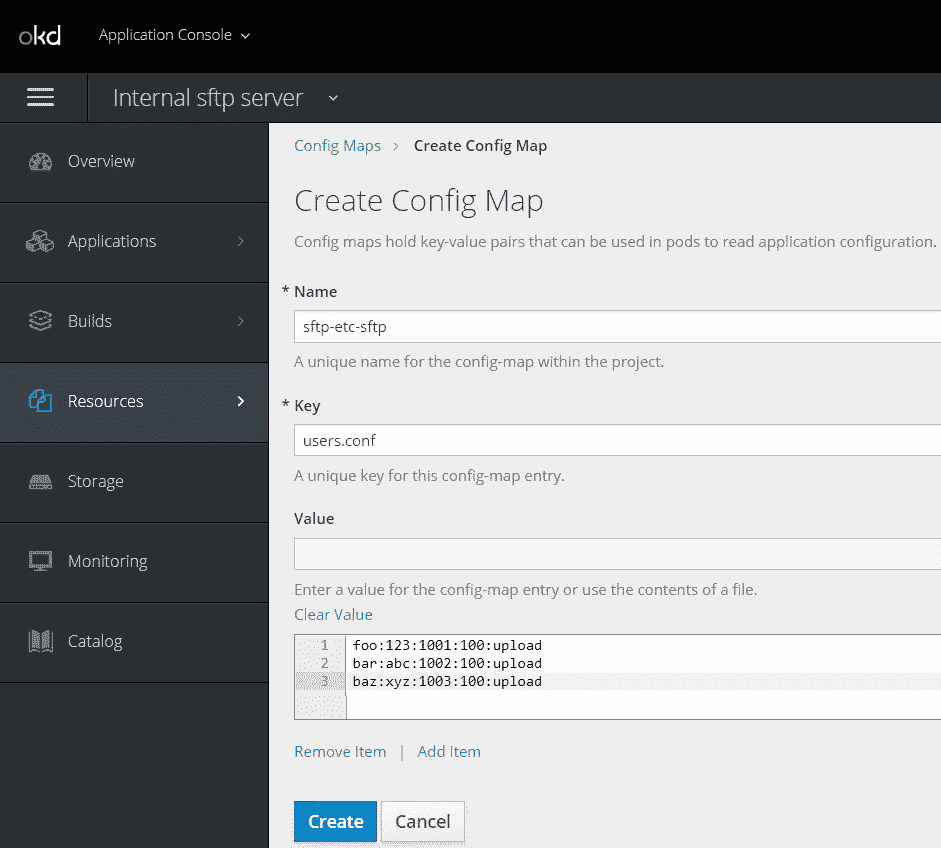

我在 Windows 上，每行末尾都有 CRLF，但是你必须去掉多余的 CR 字符。通过编辑 YAML 删除:

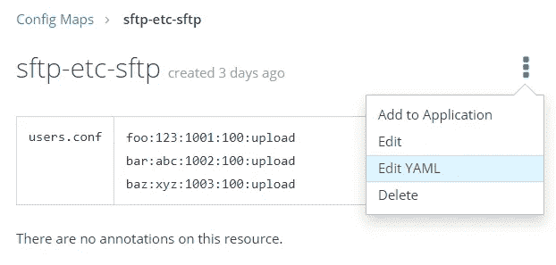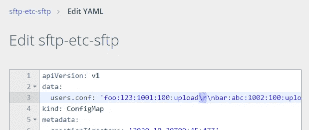

请删除“\r”字符，否则，它将成为上传目录名称的一部分，并会导致问题。

# 装载 sftp 配置图

通过转到您的部署> sftp >配置>添加配置文件，将 sftp-etc-sftp 配置映射挂载到文件系统路径/etc/sftp:

来源:sftp-etc-sftp
挂载路径:/etc/sftp

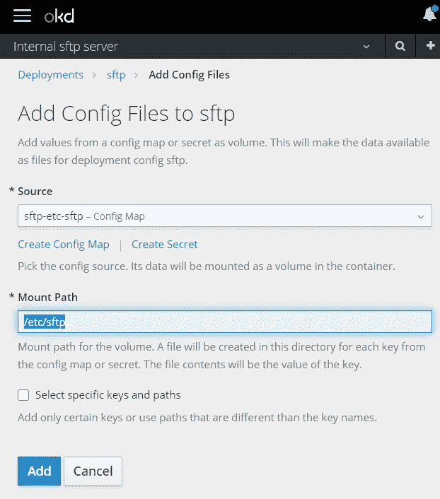

点击添加按钮。

# 测试配置映射

要测试新的配置图，请确保您的 pod 被重新部署并缩放到一个。如果打开了配置更改时自动重新部署，您可能不需要做任何事情。


启动日志:

```
[entrypoint] Parsing user data: "foo:123:1001:100:upload"
Creating mailbox file: No such file or directory
[entrypoint] Creating directory: /home/foo/upload
[entrypoint] Parsing user data: "bar:abc:1002:100:upload"
Creating mailbox file: No such file or directory
[entrypoint] Creating directory: /home/bar/upload
[entrypoint] Parsing user data: "baz:xyz:1003:100:upload"
Creating mailbox file: No such file or directory
[entrypoint] Creating directory: /home/baz/upload
Generating public/private ed25519 key pair.
Your identification has been saved in /etc/ssh/ssh_host_ed25519_key.
Your public key has been saved in /etc/ssh/ssh_host_ed25519_key.pub.
The key fingerprint is:
SHA256:qNWATmxbbYyHinTx5n10eIml7UG5K2vana9XHcqr3rY root@sftp-3-kwg2c
The key's randomart image is:
+--[ED25519 256]--+
|    .       o.   |
|   . + =   B..   |
|  . * B = = *.   |
| . * * B . +.. . |
|  . + + S . o.. o|
|     o   .. .o  o|
|    .      o  .. |
|         .o..+.  |
|        .ooo*Eo  |
+----[SHA256]-----+
Generating public/private rsa key pair.
Your identification has been saved in /etc/ssh/ssh_host_rsa_key.
Your public key has been saved in /etc/ssh/ssh_host_rsa_key.pub.
The key fingerprint is:
SHA256:aTIlNkPOyXYDXiZ4Yixz2poRwYrmQJ4DuCIRqxljuxU root@sftp-3-kwg2c
The key's randomart image is:
+---[RSA 4096]----+
|oo.o .+ o        |
|+o= **.*         |
|O=.E o% +        |
|XO+ oo * o       |
|O..=  o S        |
| .=    +         |
| .               |
|                 |
|                 |
+----[SHA256]-----+
[entrypoint] Executing sshd
Server listening on 0.0.0.0 port 22.
Server listening on :: port 22.
```

SFTP 服务器现在已经启动并运行了！

仍然缺少的是确保服务器 ssh 密钥(在启动时生成)和用户上传的文件被永久存储。现在它们将会消失，以防吊舱重新启动。此外，我们不能从外部访问 SFTP 服务器。

# SSH 配置图

如果没有持久的 ssh 密钥，终端用户将在 pod 重新启动后由于主机密钥更改而出现登录错误。

我们必须确保对 ssh 密钥的文件访问权限仅限于 root 用户读取。

创建一个名为 sftp-etc-ssh 的新配置映射，并添加以下键:

```
ssh_host_ed25519_key
ssh_host_ed25519_key.pub
ssh_host_rsa_key
ssh_host_rsa_key.pub
sshd_config
```

这些文件的内容/值可以通过 pod > sftp-N-AAAA >终端和 cat 命令从运行 pod 中提取:

```
cat /etc/ssh/ssh_host_ed25519_key
cat /etc/ssh/ssh_host_ed25519_key.pub
cat /etc/ssh/ssh_host_rsa_key
cat /etc/ssh/ssh_host_rsa_key.pub
cat /etc/ssh/sshd_config
```

或者，您可以使用以下两个命令生成新的密钥。使用空密码。然后查看他们的内容:

```
ssh-keygen -t ed25519 -f ssh_host_ed25519_key < /dev/null
ssh-keygen -t rsa -b 4096 -f ssh_host_rsa_key < /dev/null
```

sshd_config 的内容是:

```
Protocol 2
HostKey /etc/ssh/ssh_host_ed25519_key
HostKey /etc/ssh/ssh_host_rsa_key# Faster connection
# See: [https://github.com/atmoz/sftp/issues/11](https://github.com/atmoz/sftp/issues/11)
UseDNS no# Limited access
PermitRootLogin no
X11Forwarding no
AllowTcpForwarding no# Force sftp and chroot jail
Subsystem sftp internal-sftp
ForceCommand internal-sftp
ChrootDirectory %h
```

您应该会得到这样的结果:

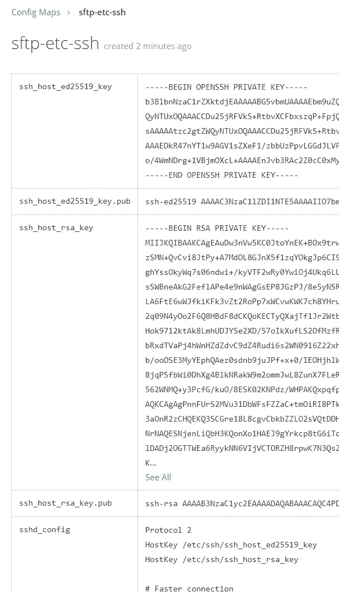

# 装载 ssh 配置图

通过转至您的部署> sftp >配置>添加配置文件，将 sftp-etc-ssh 配置映射到文件系统路径/etc/ssh:

来源:sftp-etc-ssh
挂载路径:/etc/ssh

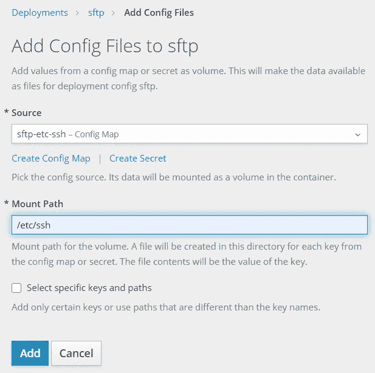

确保您的 pod 已重新启动(重新部署或缩小到 0，然后再放大到 1)。

接下来，您应该会看到如下错误消息:

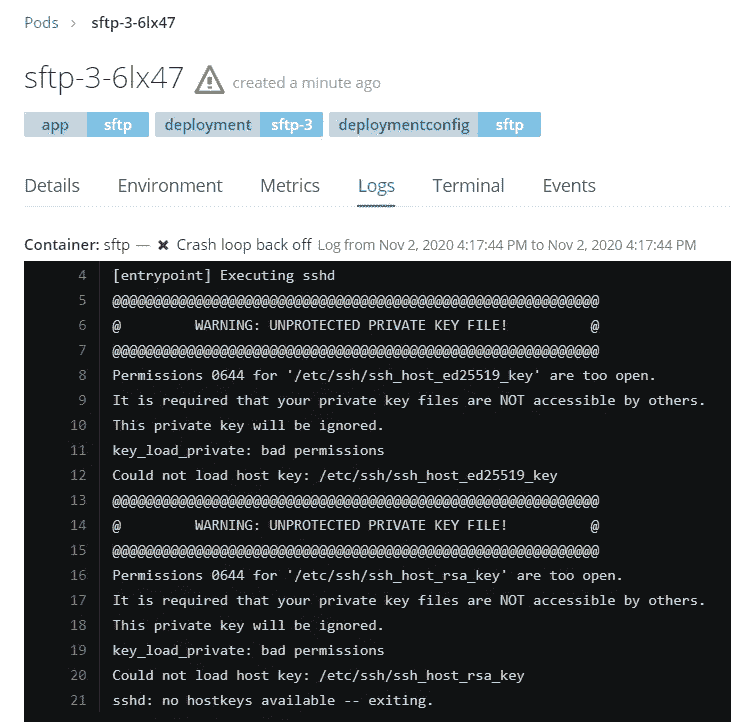

我们需要限制 ssh 密钥文件的权限。转到部署> sftp >编辑 YAML:

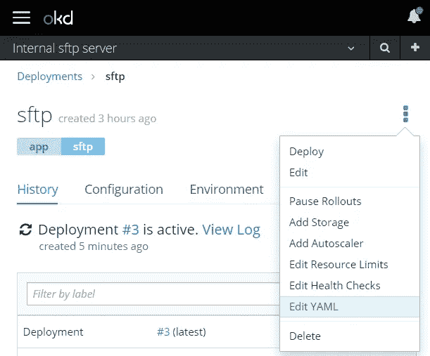

更改为 sftp-stc-ssh 的**默认模式:384** 设置:

```
spec:
  template:
    spec:
      volumes:
        - configMap:
          defaultMode: 384
          name: sftp-etc-ssh
```

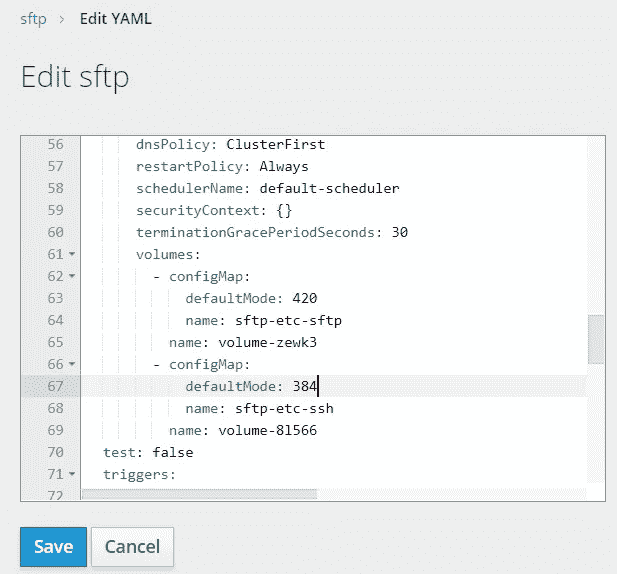

> 384 十进制= 600 八进制= user+rw【http://permissions-calculator.org/】(参见[)](http://permissions-calculator.org/))

# 测试 SSH 配置映射

确保 pod 重新启动。新的启动日志现在应该看起来像这样:

```
[entrypoint] Parsing user data: “foo:123:1001:100:upload”
Creating mailbox file: No such file or directory
[entrypoint] Creating directory: /home/foo/upload
[entrypoint] Parsing user data: “bar:abc:1002:100:upload”
Creating mailbox file: No such file or directory
[entrypoint] Creating directory: /home/bar/upload
[entrypoint] Parsing user data: “baz:xyz:1003:100:upload”
Creating mailbox file: No such file or directory
[entrypoint] Creating directory: /home/baz/upload
[entrypoint] Executing sshd
Server listening on 0.0.0.0 port 22.
Server listening on :: port 22.
```

# 公开服务端口

为了能够从外部机器访问 SFTP 服务器，我们需要创建一个节点端口。已经自动创建了一个默认值，但是我们需要做一些更改。前往服务> sftp >编辑 YAML:

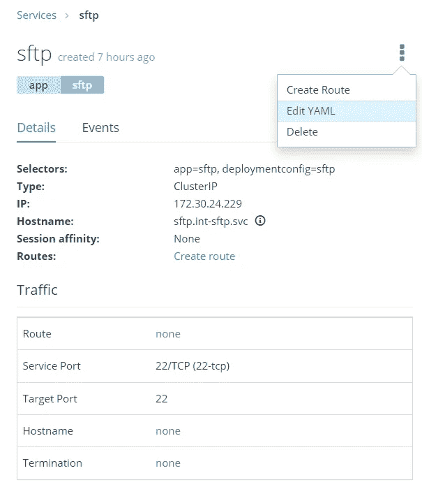

做两处修改:

1.  将类型从集群 IP 更改为**节点端口**:
2.  将'**节点端口:30022** '添加到端口定义部分

您应该会得到这样的结果:

```
spec:
  ports:
    - name: 22-tcp
      **nodePort: 30022**
      port: 22
      protocol: TCP
      targetPort: 22
  type: **NodePort**
```

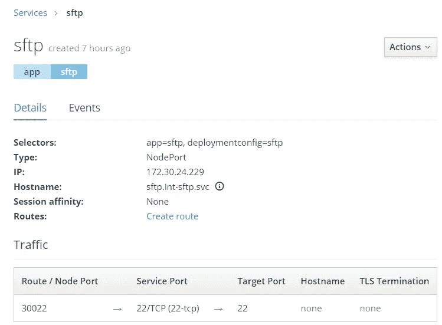

# 测试暴露的端口

现在应该可以通过 SFTP 访问 OpenShift 节点服务器的外部地址了。

```
sftp -P 30022 bar@myopenshiftserver.com
bar@myopenshiftserver’s password:
Connected to bar@myopenshiftserver.com.
sftp>
sftp> ls
upload
sftp> cd upload
sftp> lls
…
```

# 持久卷

我们需要创建一个永久卷(PV)来永久存储用户上传的文件。直到现在，所有上传的文件都会在 pod 重启后消失。

目前，我只为一个用户创建了一个 PV 声明(挂载在:/home/bar/upload)。您需要为每个用户重复这个过程。

转到存储>创建存储:

名称:sftp-bar-storage
访问方式:共享访问(RWX)
大小:10 GiB

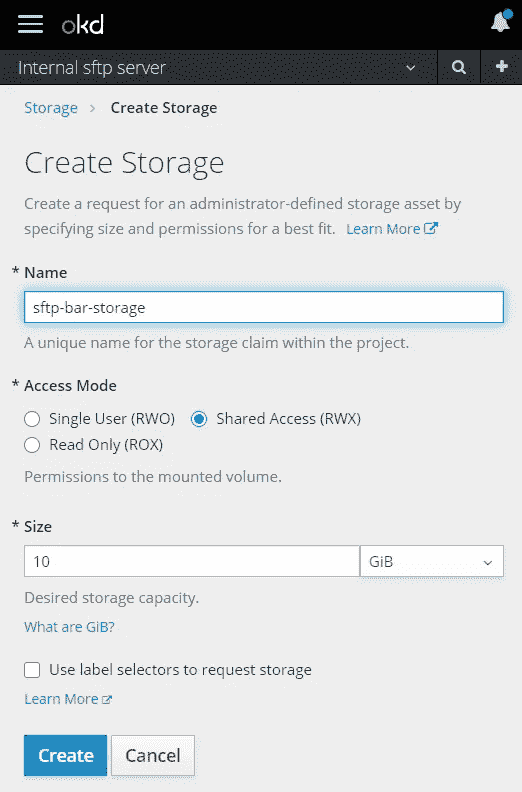

点击创建按钮。

然后转到部署> sftp >添加存储:

选择:
存储:sftp-bar-storage
挂载路径:/home/bar/upload

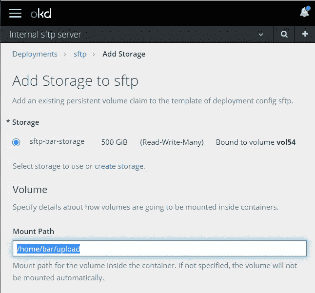

按添加按钮。

确保 pod 重启。将文件上传到目录/home/bar/upload，然后再次重启 pod。确认文件仍然在那里。

# 结论

这是一个复杂的安装，特别是 CRLF 字符潜入我的配置和脚本文件，给出奇怪的错误信息。希望这篇文档有帮助。

# 未来的工作

使用机密而不是配置映射。

加密用户的密码。

所有用户使用一个永久卷(PV)。

启动时取消显示密码。如果使用集中式日志记录系统，这是一个安全问题。