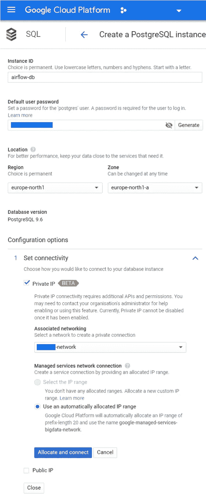
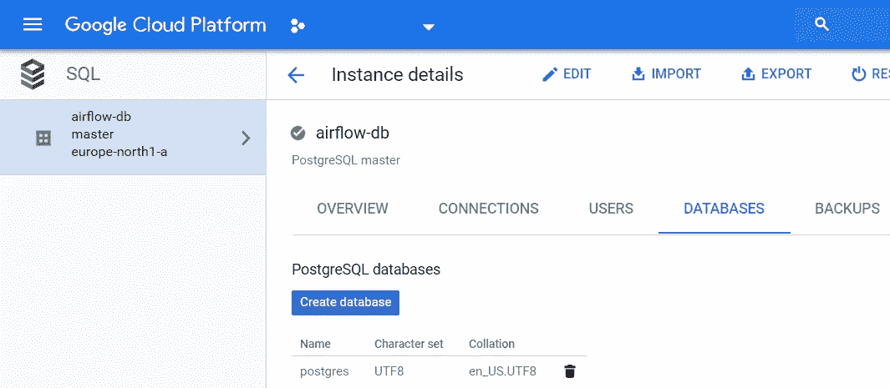
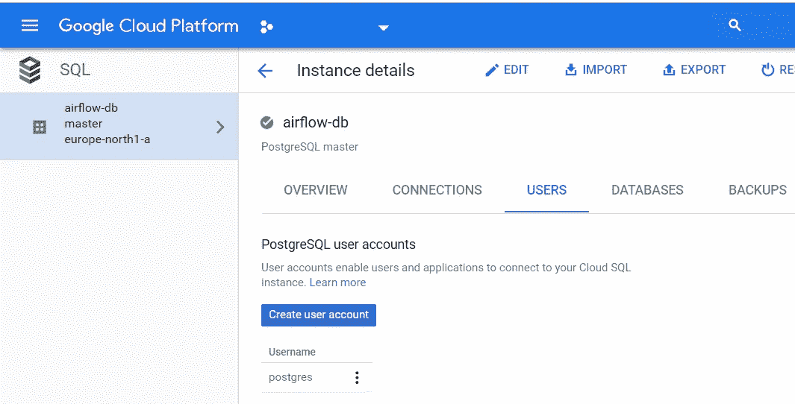

# 在谷歌云平台虚拟机上安装 Apache Airflow

> 原文：<https://medium.com/compendium/install-apache-airflow-on-a-google-cloud-platform-virtual-machine-f9a5b01b6c33?source=collection_archive---------1----------------------->


Three Wind Turbines — Photo: Vera Kratochvil ([CC0 Public Domain](http://creativecommons.org/publicdomain/zero/1.0/))

从头开始安装 Airflow 是 Google 提供的托管版本 Cloud Composer 的替代方案。这是我的安装说明。

一个新的更新版本可以在这里找到:[GCP 的气流(2020 年 5 月)](/grensesnittet/airflow-on-gcp-may-2020-cdcdfe594019)

# 模块

Ubuntu 18.04 LTS —已经启动并运行，未涵盖
Python 3.6 —默认为 Ubuntu 18.04 LTS
Apache air flow 1 . 10 . 1
PostgreSQL 9.6—托管云 SQL 版本
Nginx 1.14.0 —用作前端和 TLS 终止
让我们加密 HTTPS 证书
Systemd 服务—自动启动

# 安装气流

下面的命令安装所需的包，在`/srv`下创建一个 Python 虚拟环境，创建一个服务器将作为其运行的 airflow 用户，并设置所有者和权限。

# 安装数据库

使用没有公共 IP 地址的托管云 SQL 数据库。降低成本，选择所有最低资源(1 个 CPU、3.75 GB RAM、10 GB HDD)。

我们希望以以下内容结束:

*   实例 ID 为:airflow-db 的数据库实例(服务器)
*   数据库名称:气流
*   数据库用户名:airflow-user
*   气流用户的数据库密码:<db-password></db-password>
*   数据库 IP 地址:

从 Google 控制台，转到存储| SQL |选择“创建新实例”，然后“选择 PostgreSQL”。选择“专用 IP”并关联到您的虚拟机可以访问的现有网络。



Database installation. Note the password and select an associated network that your VM can access.

完成数据库向导后，您应该创建一个新数据库“airflow”和一个新用户“airflow-user”。



Create the new “airflow” database in your airflow-db instance.



Create a new user account “airflow-user” and take note of the password.

您需要从实例详细信息概述窗格中找到“专用 IP 地址”。

此时，您应该能够连接新的数据库了。

```
$ psql -h **<db-server-ip>** -U airflow-user -d airflow
Password for user airflow-user:
psql (10.6 (Ubuntu 10.6–0ubuntu0.18.04.1), server 9.6.10)
SSL connection (protocol: TLSv1.2, cipher: ECDHE-RSA-AES128-GCM-SHA256, bits: 128, compression: off)
Type “help” for help.airflow=>airflow=> grant usage on schema public to “airflow-user”;
```

## 初始化数据库和配置文件

运行`airflow initdb`将创建配置文件和元数据数据库。因为我们使用 PostgreSQL 数据库，所以我们必须在配置文件中修改数据库连接字符串，然后重新运行`airflow initdb`命令。

```
sudo su airflow
cd /srv/airflow
source bin/activate
export AIRFLOW_HOME=/srv/airflow
export AIRFLOW__WEBSERVER__RBAC=trueairflow initdb
```

查看`/srv/airflow/airflow.cfg`文件并更改连接字符串和模拟用户:

查看文件`/srv/airflow/webserver_config.py`,确保设置了以下内容:

编辑配置文件后，初始化 PostgreSQL 数据库(激活虚拟环境):

```
airflow initdb
```

添加新的气流管理员用户(激活的虚拟环境):

```
airflow create_user -r Admin -u jon -e jon@exampl.com -f Jon -l Snow
```

现在，您可以启动 airflow web 服务器:

```
airflow webserver -p 8080
```

和调度程序:

```
airflow scheduler
```

# Nginx 和让我们加密证书

要使用 Nginx 作为具有 HTTPS 终端的 web 前端，让我们加密您的 Airflow 服务器需要拥有的证书:

*   公共 IP 地址
*   指向公共 IP 地址的服务器域名(airflow.example.com)的 DNS 条目
*   允许流量从任何地方进入端口 80 和 443 的防火墙

如果以上都是真的，那么您可以安装以下存储库和软件包:

```
sudo su# Nginx as TLS terminator and reverse proxy for Airflow
*apt* install nginx# Needed added repositories and packages for certbot
*apt* update
*apt* install software-properties-common -y
*add-apt-repository* ppa:certbot/certbot -y
*apt update
apt upgrade
apt* install python-certbot-nginx -y
```

在新计算机上运行一次以创建新的 dhparam.pem 文件:

```
sudo su
cd /etc/ssl/private
openssl dhparam -out dhparam.pem 4096
chmod o-rwx dhparam.pem
```

编辑`/etc/nginx/nginx.conf`并在 http 部分的 SSL 设置中添加/编辑以下内容:

```
ssl_session_timeout 10m;
ssl_session_cache shared:SSL:10m;
ssl_protocols TLSv1.2;
ssl_ciphers ‘EECDH+AESGCM:EDH+AESGCM:AES256+EECDH:AES256+EDH’;
ssl_dhparam /etc/ssl/private/dhparam.pem;
ssl_prefer_server_ciphers on;
```

为你的气流站点
`sudo nano /etc/nginx/sites-available/airflow.example.com`创建一个新的 Nginx 配置文件，如下所示:

此配置取决于 Airflow web 服务器侦听 127.0.0.1:8080。通过重新加载 nginx 应用您的配置更改:

```
sudo service nginx reload
```

然后在交互模式下运行`certbot`:

```
sudo certbot --nginx
```

Certbot 成功运行后，您应该得到两个服务器部分，一个用于 HTTP，一个用于 HTTPS。您需要添加位置部分:

如果成功，检查 nginx 配置并重新加载 nginx。

```
sudo nginx -t
sudo service nginx reload
```

你现在应该可以用 HTTPS 访问你的网站了。点击这里查看你的考试成绩:[https://www.ssllabs.com/ssltest/analyze.html?d = air flow . example . com&hide results = on&最新](https://www.ssllabs.com/ssltest/analyze.html?d=bigdata.bbl.no&hideResults=on&latest)

# 系统 d 服务

使用 systemd 设置 Airflow web 服务器和调度程序，以允许在服务器启动时自动启动。

将上述文件复制到`/lib/systemd/system`:

```
sudo cp airflow-webserver.service /lib/systemd/system/
sudo systemctl daemon-reload
sudo systemctl enable airflow-webserver.service
sudo systemctl start airflow-webserver.service
sudo systemctl status airflow-webserver.service
```

同`airflow-scheduler.service`到:

然后，您应该能够使用`systemctl`命令启动和停止服务:

```
sudo systemctl stop airflow-webserver
sudo systemctl stop airflow-scheduler
sudo systemctl stop nginx
```

我使用环境来设置调度程序使用的路径。我只使用 BashOperator 和 DummyOperator，并使用以下命令设置我的 Python 作业:

```
task = BashOperator(
    task_id='my_task',
    bash_command=f’/srv/<virtualenv>/bin/python3 src/transfer.py’,
    ...
)
```

# 混杂的

请给我反馈。这是一个复杂的装置，有许多活动部件。

## 注意事项/问题

必须创建目录/home/airflow，即使我使用了安装目录/srv/airflow，一些服务总是想检查/home/airflow 目录。我从来没有找到一种方法，使气流不检查该目录。

您应该添加防火墙规则，只允许来自您自己的已知站点的流量。