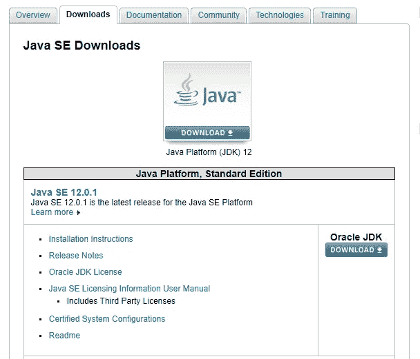
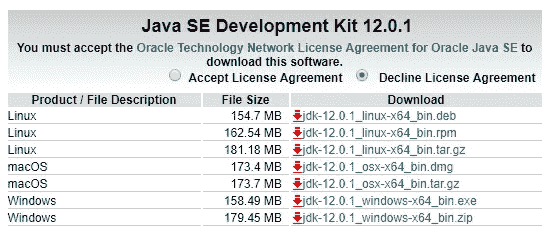
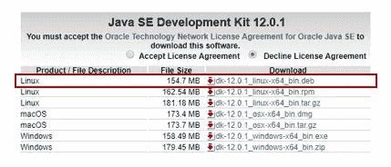

# 如何在 Ubuntu 18.04 上安装 Java/JDK 12？

> 原文：<https://medium.com/edureka/install-java-jdk-12-on-ubuntu-41c0e21af46a?source=collection_archive---------4----------------------->

**Oracle Java JDK(Java Development Kit)**是基于 **Java** 开发应用和工具的开发环境。这是一个多用途的工具包，可用于使用 Java 编程语言测试应用程序和程序开发。这将是初学者如何在 **Ubuntu 18.04** 上下载和安装 java 的简要指南。这对任何寻找工作机会的专业人士来说都是至关重要的。

你也可以使用 **apt-get 命令**非常容易地安装**开放 Java JDK / JRE** (一个开源的替代方案)。有大量的教程可以向您展示如何通过第三方 PPA 工具安装 Java。然而，本文主要关注两种简单的方法，即从原始存储库下载 Java，而不是通过第三方下载开源版本的 Java。

所以，如果你遵循这几个简单的步骤，你应该能够下载和安装 JDK 在你的操作系统上，完全没有麻烦。

*   甲骨文网站
*   方法 1:使用 tarball 在 Ubuntu 上下载并安装 Java/JDK
*   方法 2:使用 deb 包在 Ubuntu 上下载并安装 Java/JDK
*   在您的系统上配置 Java
*   创建 Java 环境变量

# 甲骨文网站

*   要在 Ubuntu 上安装 JDK，首先要登录甲骨文官网。
*   前往屏幕左上角的 ***菜单*** 按钮(看起来像 3 条短线条堆叠在一起)并进入 ***产品> > Java > >下载面向开发者的 Java(JDK)***。

## 步骤 1:访问甲骨文网站

*   你也可以直接从登录甲骨文官方网站*的 下载页面开始。*
*   *单击上面有 Java 徽标的下载按钮。*

**

## *步骤 2: Java SE 开发工具包*

*   *向下滚动，你可能会看到一个类似下图的方框。你会看到一堆不同的选项来为 Linux、MacOS 和 Windows 下载 JDK。*

**

*   *在盒子的顶部，您会看到一个名为 ***的选项，接受许可协议*** 。选择它旁边的复选框。*

# *使用 tarball 在 Ubuntu 上下载并安装 Java(方法 1)*

## *步骤 1:下载目标文件*

*   *在 Oracle 网站的下载页面，选择 **Linux x64** 的 **.tar.gz 包**并下载。*

**

*   *下载后，你可以去解压下载的软件包，在 Ubuntu 上安装 JDK。*

## *步骤 2:提取文件*

*   *既然您已经为您的系统下载了正确的存档包，运行下面的命令来提取它。*

*`*tar -zxvf ~/Downloads/jdk-12.0.1_linux-x64_bin.tar.gz*`*

*   *接下来，创建一个目录来存储 Java 编译器包。您可以随意命名，但最好以您正在安装的 Java 版本命名。*

*`*sudo mkdir -p /usr/lib/jvm/jdk-12.0.1/*`*

*   *接下来，运行下面的命令，将提取的 Java 内容复制到新创建的目录中。*

*`*sudo mv jdk-12.0.1_linux-x64 /usr/lib/jvm/jdk12.0.1/*`*

# *使用 deb 包在 Ubuntu 上下载并安装 Java(方法 2)*

***第一步:下载 deb 包***

*   *你也可以在官方网站上选择另一个选项。确保您正在下载的版本号。如果有比我提到的版本号更新的版本号，请选择它。*

**

*   *你也可以通过运行下面的命令来轻松安装 DEB 包。*

*`*cd /tmp*`*

*`*wget --no-cookies --no-check-certificate --header "Cookie: oraclelicense=accept-securebackup-cookie"* [*https://download.oracle.com/otn-pub/java/jdk/12.0.1+33/312335d836a34c7c8bba9d963e26dc23/jdk-12.0.1_linux-x64_bin.deb*](https://download.oracle.com/otn-pub/java/jdk/12.0.1+33/312335d836a34c7c8bba9d963e26dc23/jdk-12.0.1_linux-x64_bin.deb)`*

***第二步:安装 Oracle Java***

*   *现在你已经为你的系统下载了正确的存档包，运行下面的命令在 Ubuntu 上安装 JDK。*

*`*sudo dpkg -i jdk-12.0.1_linux-x64_bin.deb*`*

***步骤 3:在您的系统上配置 Java***

*   *之后，运行下面的命令将 Java 12.0.1 配置为 Ubuntu 的默认版本。下面的命令配置 Ubuntu 使用 Java 替代品。*

*`*sudo update-alternatives --install /usr/bin/java java /usr/lib/jvm/jdk-12.0.1/bin/java 2*`*

*`*sudo update-alternatives --config java*`*

*假设您安装了其他版本的 Java，并且运行了上面的命令，那么您应该会看到一个提示，要求您选择想要作为默认版本的 Java 版本。如果您没有安装其他版本的 Java，那么这些命令将不会返回任何内容。*

*   *接下来，运行以下命令，使最新版本的 Java 成为 Ubuntu 桌面的默认 Java 编译器。*

*`*sudo update-alternatives --install /usr/bin/jar jar /usr/lib/jvm/jdk-12.0.1/bin/jar 2*`*

*`*sudo update-alternatives --install /usr/bin/javac javac /usr/lib/jvm/jdk-12.0.1/bin/javac 2*`*

*`*sudo update-alternatives --set jar /usr/lib/jvm/jdk-12.0.1/bin/jar*`*

*`*sudo update-alternatives --set javac /usr/lib/jvm/jdk-12.0.1/bin/javac*`*

*这应该可以安装和配置 Java。*

*   *运行下面的命令，看看 Ubuntu 是否能识别 Java。*

**java 版本**

***步骤 4:创建 Java 环境变量***

*   *要设置 JAVA 环境变量，请在/etc/profile.d 目录中为 JDK 创建一个新文件。*

*`*sudo nano /etc/profile.d/jdk12.0.1.sh*`*

*   *然后将这些行复制并粘贴到文件的末尾并保存。*

*`*export J2SDKDIR=/usr/lib/jvm/java-12.0.1*`*

*`*export J2REDIR=/usr/lib/jvm/java-12.0.1*`*

*`*export PATH=$PATH:/usr/lib/jvm/java-12.0.1/bin:/usr/lib/jvm/java-12.0.1/db/bin*`*

*`*export JAVA_HOME=/usr/lib/jvm/java-12.0.1*`*

*`*export DERBY_HOME=/usr/lib/jvm/java-12.0.1/db*`*

*   *接下来，运行下面的命令*

*`*source /etc/profile.d/jdk12.0.1.sh*`*

*   *上面的命令应该可以配置 Java 来和 Ubuntu 一起工作。要测试 JDK 是否正确安装在 Ubuntu 上，运行下面的命令。您应该看到 Java 已经安装好了。*

*`***java -version***`*

*恭喜你！您刚刚在 Ubuntu 18.04 上成功安装了 ***Java/JDK 12.0.1。****

*如果你想查看更多关于人工智能、DevOps、道德黑客等市场最热门技术的文章，那么你可以参考 [Edureka 的官方网站。](https://www.edureka.co/blog/?utm_source=medium&utm_medium=content-link&utm_campaign=types-of-shells-in-linux)*

*请留意本系列中解释操作系统其他方面的其他文章。*

> **1。* [*Linux 命令*](/edureka/linux-commands-895d69fa4f07)*
> 
> **2。* [*Top 75+ Unix 面试问答*](/edureka/unix-interview-questions-dba26b8a13bc)*
> 
> **3。*[*Linux Mint*](/edureka/linux-mint-904d4de15c58)*

**原载于 2019 年 6 月 27 日*[*【https://www.edureka.co】*](https://www.edureka.co/blog/how-to-install-java-on-ubuntu/)*。**