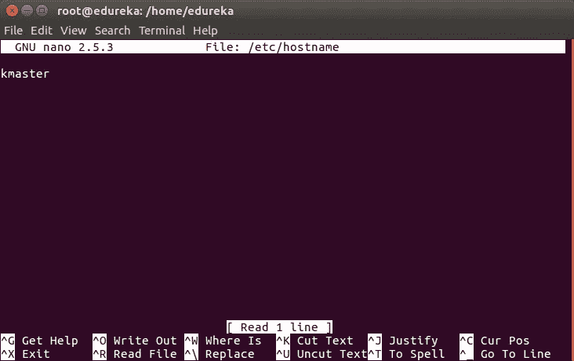
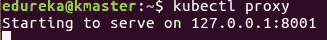

# 如何在 Ubuntu 上安装 Kubernetes 集群？

> 原文：<https://medium.com/edureka/install-kubernetes-on-ubuntu-5cd1f770c9e4?source=collection_archive---------2----------------------->


How To Install Kubernetes Cluster On Ubuntu — Edureka

这篇博客是在 Ubuntu 虚拟机上安装 Kubernetes 的逐步指南。这里，一个虚拟机将充当主虚拟机，另一个虚拟机将充当节点。然后，您可以复制相同的步骤，将 Kubernetes 集群部署到您的 prod 上。

***注*** *:对于此次安装，我们推荐一个全新的 Ubuntu 16.04 镜像，因为 Kubernetes 会占用大量资源。如果您的* ***安装在任何时候*** *失败，那么* ***在一个新的虚拟机中从头开始执行*** *提到的所有步骤，因为调试会花费更长的时间。*

要安装 Kubernetes，您必须努力遵循安装过程中的三个阶段:

1.  安装 Kubernetes 的先决条件
2.  设置 Kubernetes 环境
3.  安装 Kubeadm、Kubelet、Kubectl
4.  从主服务器启动 Kubernetes 集群
5.  让节点加入集群

# 安装 Kubernetes 的先决条件

由于我们正在处理虚拟机，因此我们建议对虚拟机进行以下设置

***大师* :**

*   2 GB 内存
*   两个 CPU 内核

***从机/节点* :**

*   1 GB 内存
*   1 个 CPU 内核

到目前为止，我假设您有 2 个普通的 Ubuntu 虚拟机导入到您的 Oracle Virtual Box 中。因此，我将继续安装过程。

# 主设备和从设备的预安装步骤(安装 Kubernetes)

必须在主计算机和节点计算机上执行以下步骤。姑且称主为' ***kmaster*** '，节点为' ***knode*** '。

首先，以' **sudo** '用户身份登录，因为下面的一组命令需要使用' **sudo** '权限来执行。然后，更新您的' **apt-get** '存储库。

```
$ sudo su 
# apt-get update
```

**注意**:以' **sudo** '用户身份登录后，注意你的 shell 符号会从' $ '变成' # '。

# 关闭交换空间

接下来，我们必须关闭交换空间，否则 Kubernetes 会开始抛出随机错误。之后，您需要打开' **fstab** '文件并注释掉提到交换分区的那一行。

```
# swapoff -a 
# nano /etc/fstab
```


要保存文件，请按' **Ctrl+X** ' > >按'**Y**'>'>'**回车**'。

# 更新主机名

要更改两台机器的主机名，请运行以下命令打开文件，然后将主机器重命名为' **kmaster** '，将节点机器重命名为' **knode** '。

```
# nano /etc/hostname
```



要保存文件，请按' **Ctrl+X** ' > >按'**Y**'>'>'**回车**'。

# 使用主节点和节点的 IP 更新主机文件

在两台机器上运行以下命令，记下每台机器的 IP 地址。

```
# ifconfig
```

记下上述命令输出中的 IP 地址。要复制的 IP 地址应该在“ **enp0s8** 下，如下图截图所示。


现在转到主节点和节点上的' **hosts** '文件，添加一个条目，指定它们各自的 IP 地址及其名称' **kmaster** 和' **knode** '。这用于在集群中引用它们。在两台机器上，它应该看起来像下面的截图。

```
# nano /etc/hosts
```


要保存文件，请按' **Ctrl+X** ' > >按'**Y**'>'>'**回车**'。

# 设置静态 IP 地址

接下来，我们将使上面使用的 IP 地址对虚拟机保持静态。我们可以通过修改网络接口文件来做到这一点。运行以下命令打开文件:

```
# nano /etc/network/interfaces
```

现在在文件中输入以下几行。

```
auto enp0s8 
iface enp0s8 inet static 
address <*IP-Address-Of-VM*>
```

它看起来会像下面的截图。


要保存文件，请按' **Ctrl+X** ' > >按'**Y**'>'>'**回车**'。

之后，重启你的机器。

# 安装 OpenSSH-Server

现在我们必须安装 **openshh-server** 。运行以下命令:

```
# sudo apt-get install openssh-server
```

# 安装 Docker

现在我们必须安装 Docker，因为 Docker 映像将用于管理集群中的容器。运行以下命令:

```
# sudo su 
# apt-get update 
# apt-get install -y docker.io
```

接下来，我们必须安装这 3 个基本组件来设置 Kubernetes 环境: **kubeadm** 、 **kubectl** 和 **kubelet** 。

在安装 Kubernetes 环境之前，运行以下命令。

```
# apt-get update && apt-get install -y apt-transport-https curl 
# curl -s https://packages.cloud.google.com/apt/doc/apt-key.gpg | apt-key add - 
# cat <<EOF >/etc/apt/sources.list.d/kubernetes.list 
deb http://apt.kubernetes.io/ kubernetes-xenial main 
EOF 
# apt-get update
```

# 安装 kubeadm、Kubelet 和 Kubectl

现在是安装 3 个基本组件的时候了。***Kubernetes***是 Kubernetes 中最低级的组件。它负责在一台单独的机器上运行什么。 ***Kuebadm*** 用于管理 Kubernetes 集群。 ***Kubectl*** 用于控制集群内部各个节点上的配置。

```
# apt-get install -y kubelet kubeadm kubectl
```

# 更新 Kubernetes 配置

接下来，我们将更改 Kubernetes 的配置文件。运行以下命令:

```
# nano /etc/systemd/system/kubelet.service.d/10-kubeadm.conf
```

这将打开一个文本编辑器，在最后一个**环境变量**后输入下面一行:

```
Environment=”cgroup-driver=systemd/cgroup-driver=cgroupfs”
```


现在，要保存文件，请按' **Ctrl+X** ' > >键，按'**Y**'>'>'**键，输入**。

***瞧！*** 您现在已经成功地在两台机器上安装了 Kubernetes！

到目前为止，只设置了 Kubernetes 环境。但是现在，是时候完全安装 Kubernetes 了，进入接下来的两个阶段，我们将在两台机器上分别设置配置。

# 仅适用于 Kubernetes 主虚拟机(kmaster)的步骤

***注意*** :这些步骤只会在主节点(kmaster VM)上执行。

**步骤 1** :我们现在将从主机器上启动我们的 Kubernetes 集群。运行以下命令:

```
# kubeadm init --apiserver-advertise-address=<ip-address-of-kmaster-vm> --pod-network-cidr=192.168.0.0/16
```

1.  您将获得以下输出。标记为(1)的命令以非 root 用户身份执行。这将使您能够从 CLI 使用 kubectl
2.  标记为(2)的命令也应该保存起来以备将来使用。这将用于将节点加入集群


**步骤 2** :如前所述，以非 root 用户的身份运行上述输出中的命令

```
$ mkdir -p $HOME/.kube 
$ sudo cp -i /etc/kubernetes/admin.conf $HOME/.kube/config 
$ sudo chown $(id -u):$(id -g) $HOME/.kube/config
```

它应该是这样的:


要验证 kubectl 是否工作，请运行以下命令:

```
$ kubectl get pods -o wide --all-namespaces
```


**步骤 3** :您会从前面的命令中注意到，所有的 pod 都在运行，只有一个除外:“kube-dns”。为了解决这个问题，我们将安装一个 pod 网络。要安装 CALICO pod 网络，请运行以下命令:

```
$ kubectl apply -f https://docs.projectcalico.org/v3.0/getting-started/kubernetes/installation/hosted/kubeadm/1.7/calico.yaml
```

一段时间后，您会注意到所有 pod 都转换到运行状态


**第四步**:接下来，我们将安装仪表板。要安装仪表板，请运行以下命令:

```
$ kubectl create -f https://raw.githubusercontent.com/kubernetes/dashboard/master/src/deploy/recommended/kubernetes-dashboard.yaml
```

它看起来会像这样:


**步骤 5** :您的仪表板现在准备好了，它的 pod 处于运行状态。


**步骤 6** :默认情况下，仪表板在主虚拟机上不可见。在命令行中运行以下命令:

```
$ kubectl proxy
```

然后你会得到这样的东西:



要在浏览器中查看仪表板，请在主虚拟机的浏览器中导航到以下地址:http://localhost:8001/API/v1/namespaces/kube-system/services/https:kubernetes-dashboard:/proxy/

然后，此页面会提示您输入凭据:


**第 7 步**:在这一步中，我们将为仪表板创建一个服务帐户，并获取它的凭证。
**注意**:在新的终端中运行所有这些命令，否则您的 **kubectl** 代理命令将会停止。

运行以下命令:

1.此命令将在默认命名空间中为仪表板创建服务帐户

```
$ kubectl create serviceaccount dashboard -n default
```

2.此命令会将群集绑定规则添加到您的仪表板帐户

```
$ kubectl create clusterrolebinding dashboard-admin -n default \ 
  --clusterrole=cluster-admin \ 
  --serviceaccount=default:dashboard
```

3.此命令将为您提供登录仪表板所需的令牌

```
$ kubectl get secret $(kubectl get serviceaccount dashboard -o jsonpath="{.secrets[0].name}") -o jsonpath="{.data.token}" | base64 --decode
```

您应该得到这样的令牌:


4.通过选择**令牌**选项，复制该令牌并将其粘贴到仪表板登录页面


5.您已成功登录您的仪表板！


# 仅适用于 Kubernetes 节点虚拟机(knode)的步骤

是时候获得您的节点，加入集群了！在节点上安装 kubernetes 之后，这可能是您将在节点上执行的唯一步骤。

当您在主服务器上运行' **kubeadm init** '命令时，运行您保存的 join 命令。

**注意**:用 **sudo** 运行该命令。

```
sudo kubeadm join --apiserver-advertise-address=<ip-address-of-the master> --pod-network-cidr=192.168.0.0/16
```


***宾果！*** 如果您得到类似上面截图的东西，那么您的 Kubernetes 集群就准备好了。

关于如何在 Ubuntu 16.04 上安装 Kubernetes 的博客到此结束。如果你想查看更多关于人工智能、Python、道德黑客等市场最热门技术的文章，那么你可以参考 [Edureka 的官方网站。](https://www.edureka.co/blog/?utm_source=medium&utm_medium=content-link&utm_campaign=install-kubernetes-on-ubuntu)

请留意本系列中的其他文章，它们将解释 Kubernetes 的各个方面。

> 1.[什么是 Kubernetes？](/edureka/what-is-kubernetes-container-orchestration-tool-d972741550f6)
> 
> 2. [Kubernetes 教程](/edureka/kubernetes-tutorial-fe6de6a20325)
> 
> 3. [Kubernetes 仪表板安装&视图](/edureka/kubernetes-dashboard-d909b8b6579c)
> 
> 4. [Kubernetes 建筑](/edureka/kubernetes-architecture-c43531593ca5)
> 
> 5. [Kubernetes 网络](/edureka/kubernetes-networking-a46d9f994bab)
> 
> 6.[Kubernetes vs Docker Swarm](/edureka/kubernetes-vs-docker-45231abeeaf1)
> 
> 7. [Kubernetes 面试问题](/edureka/kubernetes-interview-questions-c9790e5abddb)
> 
> 8.[与亚马逊 EKS 合作开发 Kubernetes 应用](/edureka/amazon-eks-ac646c23abf8)
> 
> 9.[在 AWS 上设置 Kubernetes 入口控制器](/edureka/kubernetes-ingress-controller-nginx-c5cf9e8ff031)
> 
> 10.[如何用 Elasticsearch 和 Kibana 可视化 Kubernetes 集群](/edureka/logging-monitoring-elasticsearch-fluentd-kibana-e2cd477a576b)

*原载于 2018 年 5 月 25 日 www.edureka.co*[](https://www.edureka.co/blog/install-kubernetes-on-ubuntu)**。**