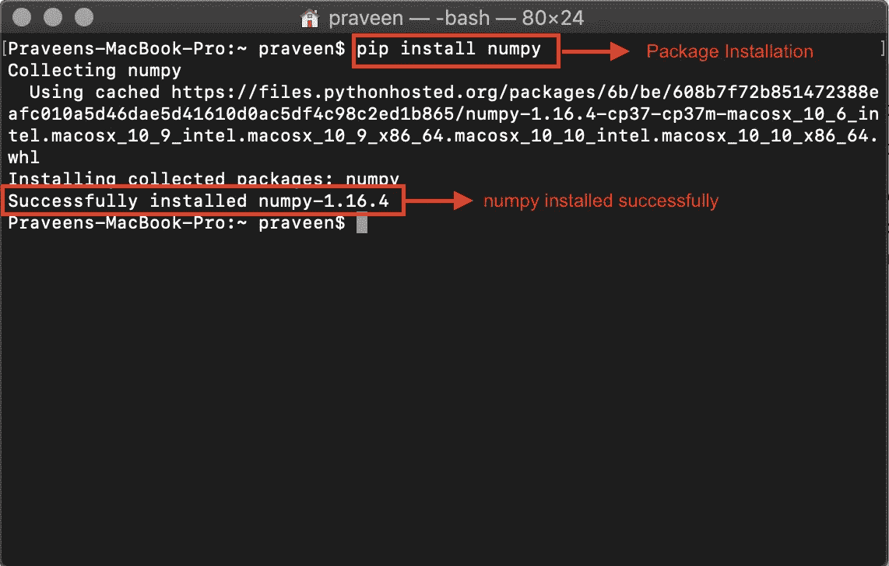

# 如何在 Python 中安装 NumPy

> 原文：<https://medium.com/edureka/install-numpy-in-python-b218b7accea9?source=collection_archive---------1----------------------->

NumPy 是 Python 编程不可或缺的一个库。在本文中，我们将学习如何在 Python 中安装 NumPy。本文将涉及以下几点:

*   什么是 NumPy？
*   如何在 Mac 操作系统上安装 NumPy
*   在 Windows 操作系统上安装 NumPy
*   Ubuntu 操作系统上的 NumPy 安装
*   如何在 Fedora 操作系统上安装 NumPy

我们开始吧！

# 什么是 NumPy？

Python 是一种开源的面向对象的解释语言。在众多特性中，让 python 成为强大编程语言的一个重要特性是 Python 包。很多外部包都是用 python 写的，你可以根据自己的需求来安装和使用。

Python 包只不过是 python 脚本的目录。每个脚本都是一个模块，可以是函数、方法或为特定功能创建的新 python 类型。NumPy 就是这样一个重要的包，创建它是为了简化 python 中的数组计算。

在这篇博客中，我们将解释下载和安装 NumPy 包的过程，以及如何在 mac、windows、ubuntu 和 fedora 操作系统上的 python 环境中使用它们。python 编程语言的基础知识不在这个博客中讨论。对于初学者来说，python 编程语言的基础知识在这个 Edureka 博客中有所涉及。

所有 python 包都是使用 pip——Python 的包安装程序安装的。您可以查看所有 python 包的详细信息，并从 Python 包索引(PyPI)下载它们。但是，当您从 python.org 或任何其他 python 集成环境下载并安装 python 时，会自动安装 pip。请阅读最佳 python 集成平台的博客，它还提供了许多其他功能。pip 是从命令行直接从 PyPI 下载包的最简单的方法。

继续这篇 Python 文章中的安装数字

# Mac 操作系统上的 NumPy 安装

现在让我们看看如何在 mac 操作系统上安装 NumPy。本节详细介绍了 python 2.7 和最新版本的 python 3.7。

## PYTHON 2.7

在 MacBook 中打开一个终端，输入 python 进入 python 提示符。
1。按下 command (⌘) +空格键以打开 Spotlight 搜索。键入 Terminal，然后按 enter 键。

2.在终端中，使用 pip 命令安装 NumPy 包。

3.软件包安装成功后，输入 python 进入 python 提示符。请注意，python 版本也显示了出来。使用 import 命令包含 NumPy 包并使用它。您还可以为包设置别名(快捷方式)。

## Python 3

类似地，您也可以在 python 3 中安装 numpy。按照上面步骤 1 中的详细说明打开终端后，使用 pip3 命令安装 NumPy。请注意，我们使用 pip3 命令，而不是 pip。pip3 命令用于让我们的系统知道我们正在使用 python3。

继续这篇用 Python 安装 NumPy 的文章，我们将看到如何在 Windows 操作系统上安装 NumPy

# Windows 操作系统上的 NumPy 安装

默认情况下，Python 不会安装在 Windows 操作系统中。你可以从 python.org 下载所需的 python 版本。python 安装成功后，打开命令提示符，使用 pip 安装 NumPy。

继续这篇 Python 文章中的安装数字

# Ubuntu 操作系统上的 NumPy 安装

Python 默认安装在 Ubuntu 系统上。但是，没有安装 pip。如果你想要完整的包，从 python.org 下载 python 并使用 apt install 命令将其安装在你的 ubuntu 操作系统上。或者，你可以在 Ubuntu 上安装 pip，然后安装 NumPy，这是两种方法中比较容易的一种。
您需要系统的 root 权限才能安装 pip 和 NumPy。在 ubuntu 中打开一个终端，使用 apt 安装 pip 和 pip3。

一旦 pip 被设置，您可以使用相同的命令

继续这篇 Python 文章中的安装数字

# 如何在 Fedora 操作系统上安装 NumPy

类似 Ubuntu 操作系统 Python 默认安装在 fedora 中。使用 pip 命令安装

请注意 python3 的 pip 命令在 fedora 操作系统中的不同。其次，要知道用 pip 安装 NumPy，是自动为 Python2 和 Python3 安装的。这就把我们带到了本文的结尾。

如果你想查看更多关于人工智能、DevOps、道德黑客等市场最热门技术的文章，那么你可以参考 [Edureka 的官方网站。](https://www.edureka.co/blog/?utm_source=medium&utm_medium=content-link&utm_campaign=install-numpy)

请留意本系列中的其他文章，它们将解释 Python 和数据科学的各个方面。

> *1。*[*Python 中的机器学习分类器*](/edureka/machine-learning-classifier-c02fbd8400c9)
> 
> *2。*[*Python Scikit-Learn Cheat Sheet*](/edureka/python-scikit-learn-cheat-sheet-9786382be9f5)
> 
> *3。* [*机器学习工具*](/edureka/python-libraries-for-data-science-and-machine-learning-1c502744f277)
> 
> *4。* [*用于数据科学和机器学习的 Python 库*](/edureka/python-libraries-for-data-science-and-machine-learning-1c502744f277)
> 
> *5。*[*Python 中的聊天机器人*](/edureka/how-to-make-a-chatbot-in-python-b68fd390b219)
> 
> *6。* [*Python 集合*](/edureka/collections-in-python-d0bc0ed8d938)
> 
> *7。* [*Python 模块*](/edureka/python-modules-abb0145a5963)
> 
> *8。* [*Python 开发者技能*](/edureka/python-developer-skills-371583a69be1)
> 
> *9。* [*哎呀面试问答*](/edureka/oops-interview-questions-621fc922cdf4)
> 
> *10。* [*一个 Python 开发者的简历*](/edureka/python-developer-resume-ded7799b4389)
> 
> *11。*[*Python 中的探索性数据分析*](/edureka/exploratory-data-analysis-in-python-3ee69362a46e)
> 
> 12。 [*蛇与蟒蛇的游戏*](/edureka/python-turtle-module-361816449390)
> 
> *13。* [*Python 开发者工资*](/edureka/python-developer-salary-ba2eff6a502e)
> 
> *14。* [*主成分分析*](/edureka/principal-component-analysis-69d7a4babc96)
> 
> *15。*[*Python vs c++*](/edureka/python-vs-cpp-c3ffbea01eec)
> 
> *16。* [*刺儿头教程*](/edureka/scrapy-tutorial-5584517658fb)
> 
> *17。*[*Python SciPy*](/edureka/scipy-tutorial-38723361ba4b)
> 
> *18。* [*最小二乘回归法*](/edureka/least-square-regression-40b59cca8ea7)
> 
> *19。* [*Jupyter 笔记本小抄*](/edureka/jupyter-notebook-cheat-sheet-88f60d1aca7)
> 
> *20。* [*Python 基础知识*](/edureka/python-basics-f371d7fc0054)
> 
> *21。* [*Python 模式程序*](/edureka/python-pattern-programs-75e1e764a42f)
> 
> *22。* [*用 Python 进行网页抓取*](/edureka/web-scraping-with-python-d9e6506007bf)
> 
> *23。* [*Python 装饰器*](/edureka/python-decorator-tutorial-bf7b21278564)
> 
> *24。*[*Python Spyder IDE*](/edureka/spyder-ide-2a91caac4e46)
> 
> *25。*[*Python 中使用 Kivy 的移动应用*](/edureka/kivy-tutorial-9a0f02fe53f5)
> 
> *26。* [*十大最佳学习书籍&练习 Python*](/edureka/best-books-for-python-11137561beb7)
> 
> *27。* [*机器人框架与 Python*](/edureka/robot-framework-tutorial-f8a75ab23cfd)
> 
> 28。[*Python 中的贪吃蛇游戏*](/edureka/snake-game-with-pygame-497f1683eeaa)
> 
> *29。* [*Django 面试问答*](/edureka/django-interview-questions-a4df7bfeb7e8)
> 
> 30。 [*十大 Python 应用*](/edureka/python-applications-18b780d64f3b)
> 
> 31。[*Python 中的哈希表和哈希表*](/edureka/hash-tables-and-hashmaps-in-python-3bd7fc1b00b4)
> 
> *32。*[*Python 3.8*](/edureka/whats-new-python-3-8-7d52cda747b)
> 
> 33。 [*支持向量机*](/edureka/support-vector-machine-in-python-539dca55c26a)
> 
> *34。* [*Python 教程*](/edureka/python-tutorial-be1b3d015745)

*原载于 2019 年 9 月 23 日*[*https://www.edureka.co*](https://www.edureka.co/blog/install-numpy/)*。*