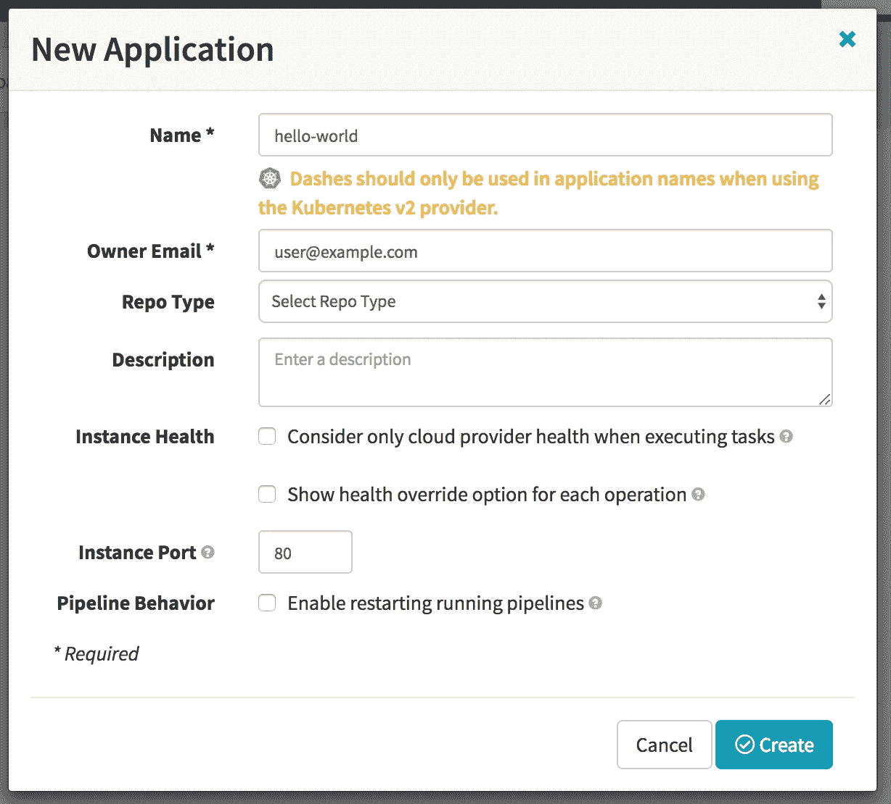
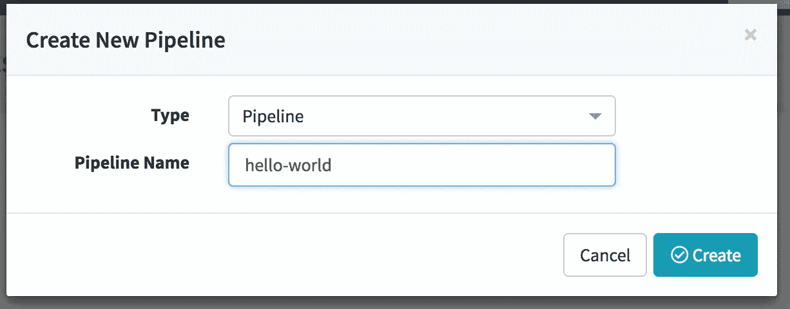
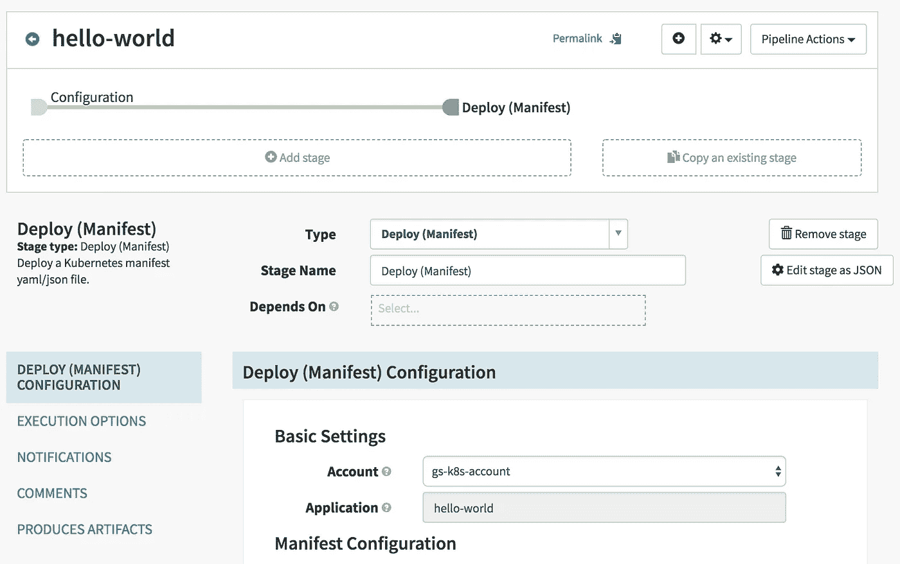
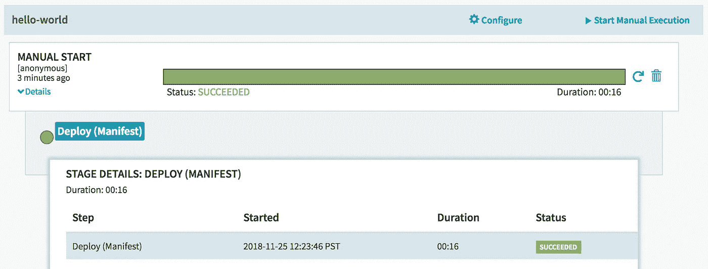
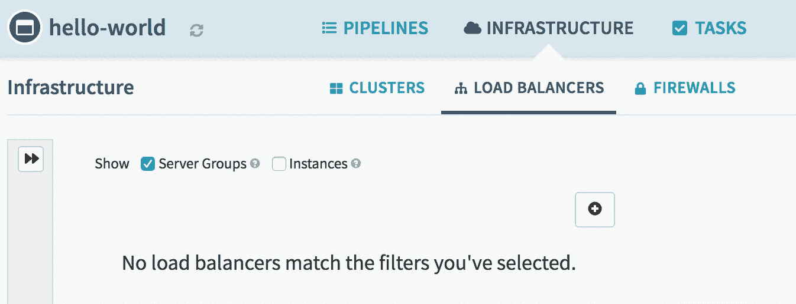

# 在 Kubernetes 上安装带升降索的三角帆

> 原文：<https://medium.com/oracledevs/install-spinnaker-with-halyard-on-kubernetes-88277bd61d59?source=collection_archive---------0----------------------->


“Amante” 10 A 1983 Peterson designed Choate 48 sailboat photo D Ramey Logan

本文将带您了解在 Kubernetes 上安装和设置一个 [Spinnaker](https://www.spinnaker.io/) 实例的步骤，该实例位于一个企业*代理*之后。我们将使用 docker 上的[升降索](https://www.spinnaker.io/setup/install/halyard/#install-halyard-on-docker)来管理我们的 Spinnaker 部署。

> 对于超级快速的安装，你可以使用 Spinnaker 的舵图[图](https://github.com/helm/charts/tree/master/stable/spinnaker)

# 先决条件

在安装 Spinnaker 之前，请确保满足以下先决条件:

*   配置了代理的 Docker 17.x(点击[此处](/oracledevs/install-docker-and-kubernetes-on-oracle-linux-behind-a-proxy-aa73a8977b6f)进行 OL 设置)
*   Kubernetes 集群(点击[此处](/oracledevs/install-docker-and-kubernetes-on-oracle-linux-behind-a-proxy-aa73a8977b6f)进行 OL 设置)
*   启用 RBAC 的头盔(点击[此处](https://docs.helm.sh/using_helm/#installing-helm)进行通用设置)

# 在码头上安装升降索

Halyard 用于安装和管理 Spinnaker 部署。事实上，所有生产级 Spinnaker 部署都需要 Halyard 来正确配置和维护 Spinnaker。让我们用 Docker 安装升降索。

创建一个 docker 卷或创建一个主机目录来保存 Halyard 使用的持久数据。出于本文的目的，让我们创建一个主机目录并授予用户完全访问权限:

```
mkdir halyard && chmod 747 halyard
```

Halyard 需要与您的 Kubernetes 集群进行交互。所以我们将$KUBECONFIG 文件传递给它。一种方法是将主机目录挂载到包含 Kubernetes 集群详细信息的容器中。让我们创建目录“k8s ”,复制$KUBECONFIG 文件，并使它对 Halyard 容器中的用户可见。

```
mkdir k8s && cp $KUBECONFIG k8s/config && chmod 755 k8s/config
```

下载和运行 Halyard docker 映像的时间:

```
docker run -p 8084:8084 -p 9000:9000 \
    --name halyard -d \
    -v /sandbox/halyard:/home/spinnaker/.hal \
    -v /sandbox/k8s:/home/spinnaker/k8s \
    -e http_proxy=http://<proxy_host>:<proxy_port> \
    -e https_proxy=https://<proxy_host>:<proxy_port> \    
    -e JAVA_OPTS="-Dhttps.proxyHost=<proxy_host> -Dhttps.proxyPort=<proxy_port>" \
    -e KUBECONFIG=/home/spinnaker/k8s/config \
    gcr.io/spinnaker-marketplace/halyard:stable
```

确保用您的公司代理值替换“<proxy_host>”和“<proxy_port>”。</proxy_port></proxy_host>

登录“halyard”容器，测试与 Kubernetes 集群的连接:

```
docker exec -it halyard bash
kubectl get pods -n spinnaker
```

或者，如果您希望命令完成，请在升降索容器中运行以下命令:

```
source <(hal --print-bash-completion)
```

# 将提供者设置为“Kubernetes”

在 Spinnaker 术语中，为了部署应用程序，我们使用到特定云平台的集成。我们必须配置 Halyard 并将云提供商设置为 Kubernetes v2(基于清单),因为我们希望将 Spinnaker 部署到 Kubernetes 集群上:

```
hal config provider kubernetes enable
```

接下来，我们创建一个帐户。在 Spinnaker 中，帐户是一个命名的凭证，Spinnaker 使用它来验证集成提供者——在我们的例子中是 Kubernetes:

```
hal config provider kubernetes account add <my_account> \
    --provider-version v2 \
    --context $(kubectl config current-context)
```

确保用您选择的帐户名称替换“<my_account>”。将帐户名保存在环境变量$ACCOUNT 中。接下来，我们需要让升降索使用神器:</my_account>

```
hal config features edit --artifacts true
```

# 将部署类型设置为“分布式”

Halyard 支持多种类型的 Spinnaker 部署。让我们告诉 Halyard，我们需要 Spinnaker 的分布式部署:

```
hal config deploy edit --type distributed --account-name $ACCOUNT
```

# 将持久性存储设置为“Minio”

Spinnaker 需要一个持久存储来保存连续的交付管道和其他配置。Halyard 让您从多个存储提供商中进行选择。出于本文的目的，我们将使用“ [Minio](https://www.minio.io/) ”。

让我们使用 Helm 安装一个简单的 Minio 实例。在能够访问 Kubernetes 集群和 Helm 的节点上，从 Halyard docker 容器外部运行该命令:

```
helm install --namespace spinnaker --name minio --set accessKey=<access_key> --set secretKey=<secret_key> stable/minio
```

确保用您选择的值替换“<access_key>和“<secret_key>”。</secret_key></access_key>

> 如果您正在使用没有真正持久卷支持的本地 k8s 集群，您可以将“persistence.enabled=false”作为一个集合传递给前面的 Helm 命令。如标志所示，如果 Minio 关闭，您将丢失所做的更改。

根据 Spinnaker 文档，Minio 不支持版本控制对象。因此，让我们在升降索配置下禁用版本控制。回到 Halyard docker 容器，运行以下命令:

```
mkdir ~/.hal/default/profiles && \
  touch ~/.hal/default/profiles/front50-local.yml
```

将以下内容添加到 front50-local.yml 文件中:

```
spinnaker.s3.versioning: false
```

现在运行以下命令来配置存储提供程序:

```
echo $MINIO_SECRET_KEY | \
     hal config storage s3 edit --endpoint http://minio:9000 \
         --access-key-id $MINIO_ACCESS_KEY \
         --secret-access-key
```

确保将$MINIO_ACCESS_KEY 和$MINIO_SECRET_KEY 环境变量设置为安装 MINIO 时使用的<access_key>和<secret_key>值。</secret_key></access_key>

最后，让我们启用 s3 存储提供商:

```
hal config storage edit --type s3
```

# 将版本设置为“最新”

您必须选择 Spinnaker 的特定版本并配置 Halyard，以便它知道要部署哪个版本。您可以通过运行以下命令来查看可用版本:

```
hal version list
```

从列表中选择最新的版本号(或您想要部署的任何其他版本)并更新 Halyard:

```
hal config version edit --version <version>
```

# 部署三角帆

此时，Halyard 应该拥有部署 Spinnaker 实例所需的所有信息。让我们通过运行以下命令来部署 Spinnaker:

```
hal deploy apply
```

请注意，首次部署可能需要一段时间。

# 使 Spinnaker 可达

我们需要公开 Spinnaker UI 和网关服务，以便与 Spinnaker 仪表板交互并开始创建管道。当我们使用 Halyard 部署 spinnaker 时，在“Spinnaker”名称空间中创建了许多 Kubernetes 服务。默认情况下，这些服务在集群中公开(类型为“ClusterIP”)。让我们将面向 Spinnaker 的 UI 和 API 服务器的服务的服务类型更改为“NodePort ”,使它们对 Kubernetes 集群之外的最终用户可用。

通过运行以下命令编辑“spin-deck”服务:

```
kubectl edit svc spin-deck -n spinnaker
```

将类型更改为“NodePort ”,并选择性地指定您希望服务公开的端口。以下是服务定义的快照:

```
...
spec:
  type: NodePort
  ports:
  - port: 9000
    protocol: TCP
    targetPort: 9000
    nodePort: 30900
  selector:
    app: spin
    cluster: spin-deck
  sessionAffinity: None  
status:
...
```

接下来，通过运行以下命令编辑“spin-gate”服务:

```
kubectl edit svc spin-gate -n spinnaker
```

将类型更改为“NodePort ”,并选择性地指定希望 API 网关服务在哪个端口上公开。

> 请注意，Kubernetes 服务可以通过多种方式公开。如果您想将 Spinnaker 公开到公共互联网上，可以使用负载平衡器或打开 https 的入口。您应该配置[认证](https://www.spinnaker.io/setup/security/authentication/)来锁定未授权用户的访问。

将用于访问 Spinnaker 的节点主机名或其 IP 地址保存在环境变量$SPIN_HOST 中。使用 Halyard，配置 UI 和 API 服务器以接收传入的请求:

```
hal config security ui edit \
    --override-base-url "http://$SPIN_HOST:30900"
hal config security api edit \
    --override-base-url "http://$SPIN_HOST:30808"
```

重新部署 Spinnaker，以便它能够获得配置更改:

```
hal deploy apply
```

您可以通过“http://$SPIN_HOST:30900”访问 Spinnaker UI

# 创建一个“hello-world”应用程序

让我们带着 Spinnaker 兜一圈(双关语)。使用 Spinnaker 的 UI，让我们创建一个“hello-world”应用程序。使用“操作”下拉菜单并单击“创建应用程序”:



创建应用程序后，导航到“管道”选项卡，然后单击“配置新管道”:



现在，向管道添加一个新阶段，以创建基于清单的部署:



在“清单配置”下，添加以下内容作为清单源文本:

```
apiVersion: apps/v1
kind: Deployment
metadata:
  labels:
    app: hello-world
  name: hello-world
spec:
  replicas: 1
  selector:
    matchLabels:
      app: hello-world
  template:
    metadata:
      labels:
        app: hello-world
    spec:
      containers:
        - image: '<docker_repository>:5000/helloworld:v1'
          name: hello-world
          ports:
            - containerPort: 80
```

用 Kubernetes 集群可以使用的内部 docker 注册中心的名称替换“<docker_repository>”。</docker_repository>

让我们快速浏览一下，创建一个“hello world”docker 图像。我们将创建一个基于“nginx”的映像，其中包含一个“index.html”文件，该文件包含:

```
<h1>Hello World</h1>
```

然后，我们将在保存上一步中的“index.html”文件的同一目录中创建相应的“Dockerfile ”:

```
FROM nginx:alpine
COPY . /usr/share/nginx/html
```

接下来，我们通过运行以下命令构建 docker 映像:

```
docker build -t <docker_repository>:5000/helloworld:v1 .
```

确保将“<docker_repository>”替换为 Kubernetes 集群可用的内部 docker 注册中心的名称。将 docker 映像推送到“<docker_repository>”，使其对 Kubernetes 集群可用。</docker_repository></docker_repository>

```
docker push <docker_repository>:5000/helloworld:v1
```

回到 Spinnaker UI，让我们手动运行“hello-world”管道。成功执行后，您可以深入到管道实例的详细信息:



为了快速测试我们的 hello-world 应用程序，我们可以在 Spinnaker UI 中创建一个基于清单的“负载平衡器”。单击“+”图标:



添加以下服务定义以创建负载平衡器:

```
kind: Service
apiVersion: v1
metadata:
  name: hello-world
spec:
  type: NodePort
  selector:
    app: hello-world
  ports:
  - protocol: TCP
    port: 80
    targetPort: 80
    nodePort: 31080
```

一旦 Spinnaker 提供了负载平衡器，在浏览器中点击 hello-world 应用程序的 URL“http://$ SPIN _ HOST:31080”。瞧啊。你看，“你好，世界”被渲染了。

# 结论

Spinnaker 是一个高速度发布软件的多云连续交付平台。我们使用 Halyard 在 Kubernetes 集群上安装了 Spinnaker，并部署了一个简单的 hello-world 管道。当然，就 Spinnaker 提供的功能而言，我们仅仅触及了皮毛。前往[指南](https://www.spinnaker.io/guides/)了解更多关于 Spinnaker 的信息。