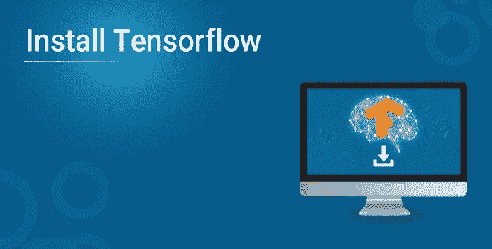
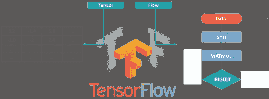
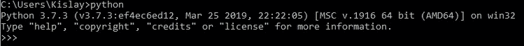
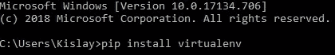

# 安装 TensorFlow 的分步指南

> 原文：<https://medium.com/edureka/install-tensorflow-15c4855b92ab?source=collection_archive---------6----------------------->

深度学习是 2020 年最热门的话题之一，这是有充分理由的。工业的进步使得机器/计算机程序真正取代人类成为可能。人工智能将在 2020 年前**创造【2020 万**个工作岗位，而这其中很大一部分是通过 TensorFlow 实现的。因此，在这篇安装 TensorFlow 的文章中，我将讨论以下主题:

*   什么是张量流？
*   TensorFlow 应用
*   TensorFlow 安装流程

# 什么是张量流？

TensorFlow 是谷歌的开源机器学习框架，用于跨一系列任务的数据流编程。图中的节点表示数学运算，而图边表示它们之间通信的多维数据数组(**张量**)。

张量只是多维数组，是二维表向更高维数据的扩展。TensorFlow 有许多特性，这使它适合深度学习。

# TensorFlow 应用

现在 TensorFlow 已经帮助很多公司建立了世界级的模型来解决实际问题。所以，在安装 TensorFlow 之前，我们先来看看它的一些应用。

**Airbnb:** 它通过使用 TensorFlow 对图像进行分类，并按比例检测物体，从而改善了客人体验。

**可口可乐:**tensor flow 的进步使可口可乐最终实现了长期寻求的无摩擦购买证明能力。

**GE Healthcare:** GE 使用 TensorFlow 训练了一个神经网络，以在大脑磁共振成像期间识别特定解剖结构，从而帮助提高速度和可靠性。

**Twitter:** Twitter 使用 TensorFlow 构建了他们的“排名时间轴”，让用户即使关注了一千个其他用户，也不会错过任何一条推文。

# 安装 TensorFlow:步骤

在我们安装 Tensorflow 之前，有几个先决条件:

*   [安装 Python](https://www.python.org/)

*   [安装 Pip](https://pip.pypa.io/en/stable/installing/)

从 python 3.5.x 开始，Pip 就已经存在了。

*   设置虚拟环境

要设置虚拟环境，请执行以下操作:

在此之后，使用以下命令

然后，你就完了。继续，在你安装 TensorFlow 之后，只需导入它并开始使用它令人惊叹的深度学习能力并创造一些新的东西。

至此，我们结束了这篇关于数据科学与机器学习的博客。就这样，我们到了这篇文章的结尾。如果你对这个话题有任何疑问，请在下面留下评论，我们会尽快回复你。如果你想查看更多关于 Python、DevOps、Ethical Hacking 等市场最热门技术的文章，你可以参考 Edureka 的官方网站。

请留意本系列中解释数据科学各个方面的其他文章。

> *1。* [*数据科学教程*](/edureka/data-science-tutorial-484da1ff952b)
> 
> *2。* [*数据科学的数学与统计*](/edureka/math-and-statistics-for-data-science-1152e30cee73)
> 
> *3。*[*R 中的线性回归*](/edureka/linear-regression-in-r-da3e42f16dd3)
> 
> *4。* [*数据科学教程*](/edureka/data-science-tutorial-484da1ff952b)
> 
> *5。*[*R 中的逻辑回归*](/edureka/logistic-regression-in-r-2d08ac51cd4f)
> 
> *6。* [*分类算法*](/edureka/classification-algorithms-ba27044f28f1)
> 
> *7。* [*随机森林中的 R*](/edureka/random-forest-classifier-92123fd2b5f9)
> 
> *8。* [*决策树中的 R*](/edureka/a-complete-guide-on-decision-tree-algorithm-3245e269ece)
> 
> *9。* [*机器学习入门*](/edureka/introduction-to-machine-learning-97973c43e776)
> 
> *10。* [*朴素贝叶斯在 R*](/edureka/naive-bayes-in-r-37ca73f3e85c)
> 
> *11。* [*统计与概率*](/edureka/statistics-and-probability-cf736d703703)
> 
> *12。* [*如何创建一个完美的决策树？*](/edureka/decision-trees-b00348e0ac89)
> 
> *13。* [*关于数据科学家角色的 10 大误区*](/edureka/data-scientists-myths-14acade1f6f7)
> 
> *14。*[*5 大机器学习算法*](/edureka/machine-learning-algorithms-29eea8b69a54)
> 
> 15。 [*数据分析师 vs 数据工程师 vs 数据科学家*](/edureka/data-analyst-vs-data-engineer-vs-data-scientist-27aacdcaffa5)
> 
> 16。 [*人工智能的种类*](/edureka/types-of-artificial-intelligence-4c40a35f784)
> 
> *17。*[*R vs Python*](/edureka/r-vs-python-48eb86b7b40f)
> 
> *18。* [*人工智能 vs 机器学习 vs 深度学习*](/edureka/ai-vs-machine-learning-vs-deep-learning-1725e8b30b2e)
> 
> 19。 [*机器学习项目*](/edureka/machine-learning-projects-cb0130d0606f)
> 
> 20。 [*数据分析师面试问答*](/edureka/data-analyst-interview-questions-867756f37e3d)
> 
> *21。* [*面向非程序员的数据科学和机器学习工具*](/edureka/data-science-and-machine-learning-for-non-programmers-c9366f4ac3fb)
> 
> *22。* [*十大机器学习框架*](/edureka/top-10-machine-learning-frameworks-72459e902ebb)
> 
> *23。* [*用于机器学习的统计*](/edureka/statistics-for-machine-learning-c8bc158bb3c8)
> 
> *24。* [*随机森林中的 R*](/edureka/random-forest-classifier-92123fd2b5f9)
> 
> *25。* [*广度优先搜索算法*](/edureka/breadth-first-search-algorithm-17d2c72f0eaa)
> 
> *26。*[*R 中的线性判别分析*](/edureka/linear-discriminant-analysis-88fa8ad59d0f)
> 
> *27。* [*机器学习的先决条件*](/edureka/prerequisites-for-machine-learning-68430f467427)
> 
> *28。* [*互动 WebApps 使用 R 闪亮*](/edureka/r-shiny-tutorial-47b050927bd2)
> 
> *29。* [*机器学习十大书籍*](/edureka/top-10-machine-learning-books-541f011d824e)
> 
> *三十。* [*无监督学习*](/edureka/unsupervised-learning-40a82b0bac64)
> 
> *31.1* [*0 最佳数据科学书籍*](/edureka/10-best-books-data-science-9161f8e82aca)
> 
> 32。 [*监督学习*](/edureka/supervised-learning-5a72987484d0)

*原载于 2019 年 4 月 22 日*[*https://www.edureka.co*](https://www.edureka.co/blog/install-tensorflow)*。*