# 如何安装 Ubuntu:完全指南

> 原文：<https://medium.com/edureka/install-ubuntu-e1f87c52d377?source=collection_archive---------1----------------------->

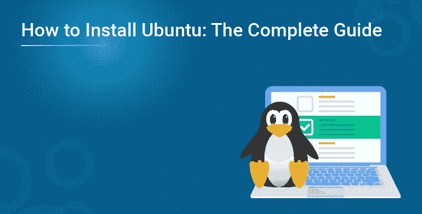

Ubuntu 桌面版是一个 T2 Linux 发行版，包含了你运行一个组织、企业、机构或家庭所需的一切。它易于使用、易于安装，并且是您开始使用的第一批发行版之一。它还是开源的、可访问的、安全的，最棒的是可以免费下载！

所以，下面是你在你的系统或者虚拟机上安装 Ubuntu 需要遵循的步骤。

*   **先决条件**
*   **将 Ubuntu 下载到您的 DVD/闪存驱动器上**
*   **从 DVD/闪存驱动器启动**
*   **安装 Ubuntu 的准备工作**
*   **分配驱动器空间**
*   **开始安装**
*   **选择位置**
*   **登录**
*   **后台安装**
*   **完成安装**
*   **在你的虚拟机上下载 Ubuntu**

**步骤 0:先决条件**

因此，在开始安装之前，您必须考虑一些事情:

*   确保您的笔记本电脑已连接到电源。
*   您的磁盘上必须至少有 25 GB 的可用存储空间(在最小安装的情况下为 5 GB)。
*   你必须有 DVD 或 USB (8GB+)闪存盘，里面有你需要的 Ubuntu 版本。

***♠Note:*** *确保你最近备份了你的数据。虽然出问题的可能性极小，但预防总是胜于治疗。*

**第一步:将 Ubuntu 下载到你的闪存盘**

可以烧 Ubuntu ***。iso 镜像*** 放入旧 u 盘。你也可以按照这些步骤来做。

1.  从 [***Ubuntu 发布页面***](http://releases.ubuntu.com/) 下载 Ubuntu 图片。
2.  下载 UNetbootin。对于 Ubuntu，从 [***软件中心***](http://unetbootin.sourceforge.net/) ***安装即可。***
3.  插入 u 盘。
4.  你现在应该启动 UNetbootin，烧了 ***。iso 镜像*** 到你的 u 盘。

**步骤 2:从 DVD/闪存驱动器启动**

现在，只需几步就可以在 Linux 上运行您的 ***命令*** 。使用 DVD /USB 安装 Ubuntu 其实很容易。基本上，你需要做的就是下面这些；

*   将 Ubuntu DVD 放入光驱。如果你使用的是闪存盘，你可以把它插到 USB 接口上。
*   然后，重新启动计算机。一旦你的电脑启动，你将会看到一个欢迎窗口，如下图所示。

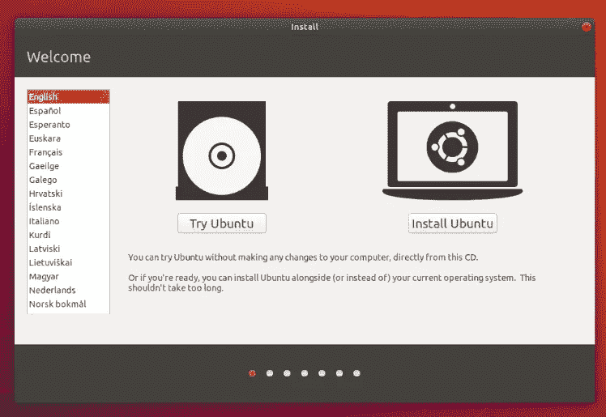

现在，从你左边列出的一大堆语言中选择你喜欢的选项，然后，你可以选择直接安装 Ubuntu 或者先在桌面上试试。

*   现在，您将看到一个大的语言窗格，您可以使用光标键/鼠标/触摸板在其中导航，或者一个简单的安装菜单。但这完全取决于你的电脑配置。

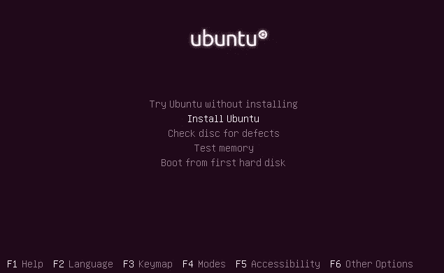

*   你可能会找到一个选项叫做 ***安装 Ubuntu*** 。单击该选项，然后按 return 键自动启动桌面安装程序。
*   *或者，你也可以选择第一个选项，* ***不安装*** *试运行 Ubuntu。*

几秒钟后，当桌面载入后，你会看到一个新窗口。这是欢迎窗口。在这一点上，你可以从左边的列表中选择你的语言，并在直接安装 Ubuntu 或先尝试桌面之间做出选择。

**第三步:安装 Ubuntu 的准备工作**

*   张贴语言选择，你将被要求选择你的键盘布局。如果安装人员没有正确猜测默认布局，您可以使用 ***检测键盘布局*** 按钮运行一个简短的配置程序，然后选择 ***继续*** 。
*   接下来，你会被问到 ***你想先安装什么应用？*** 有两个选项可供你选择； ***正常安装*** 和 ***最小安装*** 。
*   第一个选项相当于旧的默认实用程序、应用程序、游戏和媒体播放器捆绑包。对于任何 Linux 安装来说，这都是一个很好的启动平台。
*   第二个选项占用的存储空间要少得多，并且只允许您安装您需要的东西。
*   在安装类型问题下面有两个复选框；我估计你同时启用了 ***下载*** 和 ***安装第三方软件*** 。

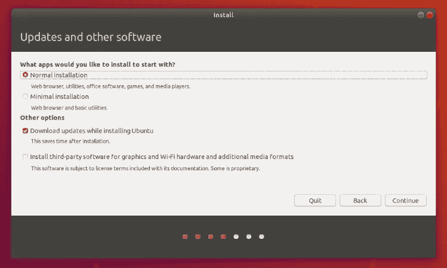

假设您没有连接到互联网，您将被要求选择一个无线网络(如果可用)。在安装过程中，最好始终保持与互联网的连接，以便更新您的计算机。

**步骤 4:分配驱动器空间**

*   如下图所示，将有几个复选框可供选择。所以你可以做出选择，如果你想把 Ubuntu 和另一个操作系统一起安装，删除你现有的操作系统，换成 Ubuntu，或者 ***或者别的什么*。**

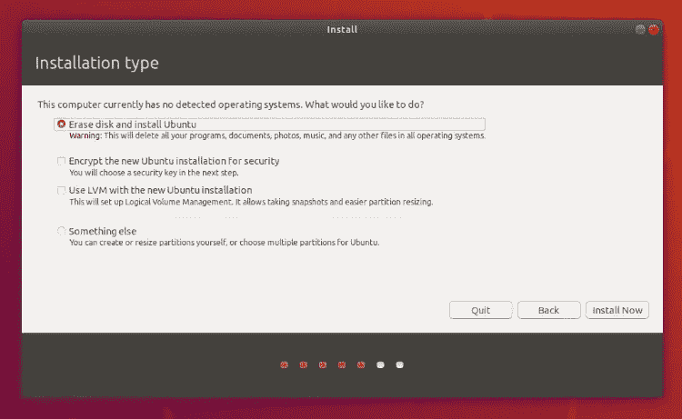

*   现在点击 ***安装*** 。

**步骤 5:开始安装**

*   一个类似于图中所示的小窗格将出现在你面前，它将概述你所选择的存储选项，如果细节不正确，还有机会返回。
*   点击 ***继续*** 以修复这些更改并开始安装过程。

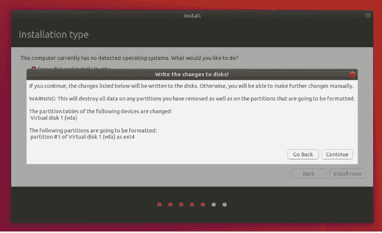

**第六步:选择位置**

*   如果您连接到互联网，将会自动检测到您的位置。检查你的位置是否准确。如果是，点击 ***前进*** 继续。

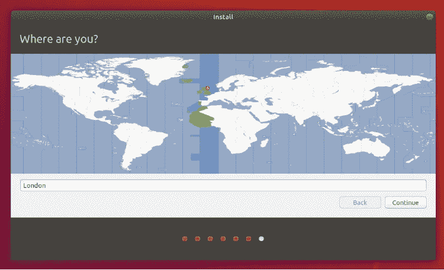

第七步:登录

*   一旦你输入你的名字，安装程序会自动建议一个计算机名和用户名。根据你的喜好，这些很容易改变。 ***电脑名称*** 是您的电脑在网络上的显示方式，而您的 ***用户名*** 将是您的登录名和帐户名。
*   接下来，设置一个强密码。它可以包括大写字母、小写字母、数字和特殊字符。

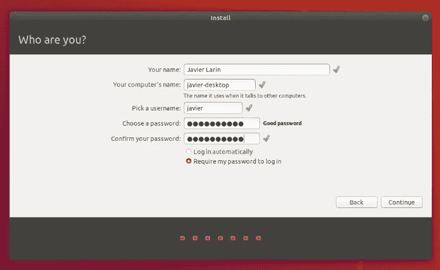

*   您也可以选择启用 ***自动登录*** 和 ***主文件夹加密*** 。这可以防止人们在机器丢失或被盗的情况下访问您的个人文件。

但是如果你启用了个人文件夹加密，而你碰巧忘记了你的密码， ***你将无法检索任何存储在你的个人文件夹中的个人数据*** ，这是一个骗局。我不是想吓唬你，我保证！

**第八步:后台安装**

*   安装程序首先告诉你 Ubuntu 有多棒，然后在后台完成。这应该只需要几分钟。

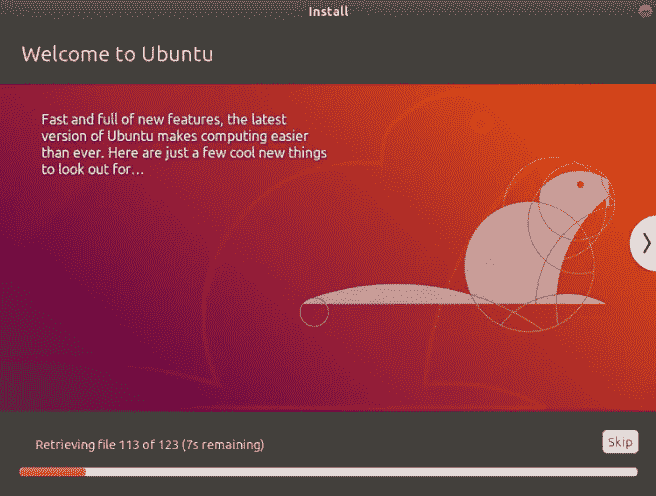

**第 9 步:安装完成！**

*   现在您的发行版已经安装并配置好了。一个小窗口会出现在你面前，要求你 ***重启你的机器*** 。点击 ***立即重启*** ，当出现提示时，取出您插入的 DVD 或闪存盘。

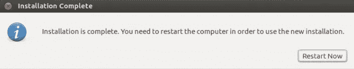

太棒了。您现在已经成功安装了世界上最流行的 Linux 操作系统！

# 替代方法:在你的虚拟机上下载 Ubuntu

安装 Ubuntu 有几种方法。如果你想在不改变 Windows 系统的情况下使用 Ubuntu，你可以选择虚拟机的方式。基本上，您可以像任何常规的 Windows 应用程序一样安装和使用这个发行版。当您只想尝试有限使用的 Linux 发行版(这里是 Ubuntu)时，虚拟机提供了一个更舒适的选择。

# 1.下载并安装虚拟盒子

*   前往甲骨文虚拟盒子 [***官网***](https://www.virtualbox.org/) 获取最新稳定版本。

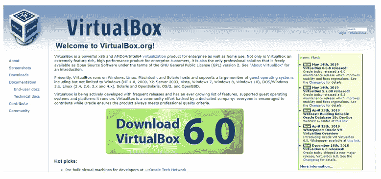

*   安装虚拟盒子不是火箭科学。只需双击下载的。exe 文件来运行它，并按照屏幕上的指示。这就像在 Windows 上安装常规软件一样。

2.下载 Linux ISO

*   接下来，您需要下载 Linux 发行版的 ISO 文件，即 Ubuntu。你可以从 [***这个链接***](https://ubuntu.com/download/desktop) 得到这个图像。

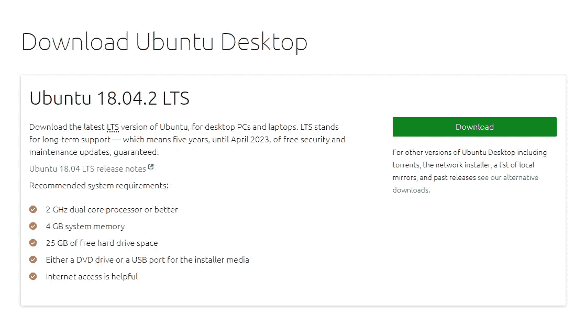

# 3.使用虚拟盒子安装 Ubuntu

现在，您已经安装了 Virtual Box 并下载了 Linux 的 ISO。您现在已经准备好在 Virtual Box 中安装 Linux 了。

*   启动虚拟框，点击 ***新建符号*** (看起来像蓝色的星星)。给虚拟操作系统起一个相关的名字，我想你应该给你将要安装的发行版起一个名字——Ubuntu。

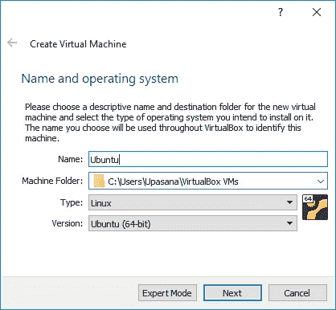

*   给虚拟操作系统分配内存。我的系统有 8 GB 的内存，我决定给它分配 4 GB 的内存。如果您的系统有更多的内存，您可以使用额外的内存。

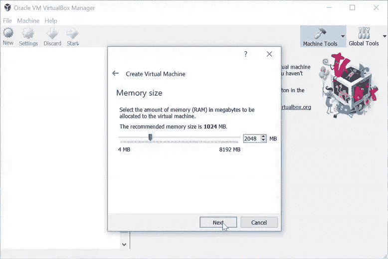

*   创建虚拟磁盘。这就像虚拟 Linux 系统的硬盘一样。这是虚拟系统存储文件的地方。我个人会选择这里的 ***VDI 类型*** 文件。

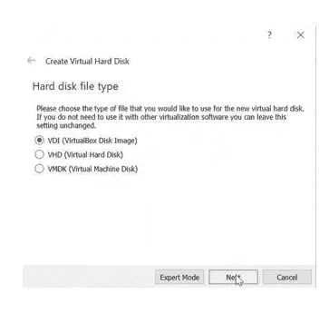

*   您可以选择 ***动态分配*** 或 ***固定大小*** 选项来创建虚拟硬盘。 ***建议大小为 10 GB。***

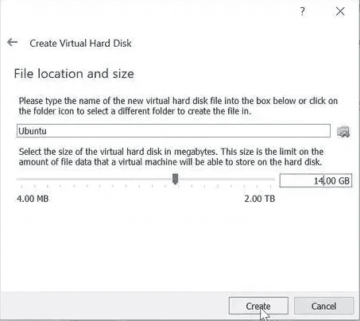

*   一旦一切就绪，就该启动 ISO 并安装 Ubuntu 作为虚拟操作系统了。如果 Virtual Box 没有检测到 Linux ISO，请通过单击如图所示的文件夹图标浏览到它的位置。

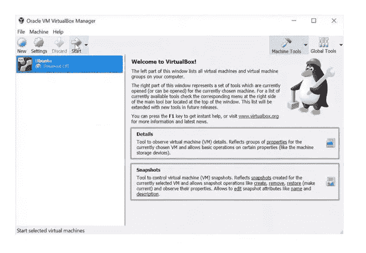

*   很快你就会发现自己在 Linux 里面。您将最终选择安装它。

这里的东西是 Ubuntu 特有的。从这里你可以继续 ***步骤 2*** 。

我希望这个指南对你有所帮助。如果你需要，你可以很容易地改变启动顺序，让 Ubuntu 成为你的默认操作系统。但那是以后的事了。现在，您可以继续尝试并享受这个漂亮的、初学者友好的 Linux 发行版。

如果你想查看更多关于人工智能、DevOps、道德黑客等市场最热门技术的文章，你可以参考 Edureka 的官方网站。

请留意本系列中解释操作系统其他方面的其他文章。

> *1。* [*Linux 命令*](/edureka/linux-commands-895d69fa4f07)
> 
> *2。* [*Top 75+ Unix 面试问答*](/edureka/unix-interview-questions-dba26b8a13bc)
> 
> *3。*[*Linux Mint*](/edureka/linux-mint-904d4de15c58)

*原载于 2019 年 6 月 26 日 https://www.edureka.co**的* [*。*](https://www.edureka.co/blog/how-to-install-ubuntu/)