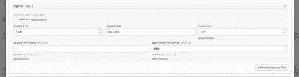
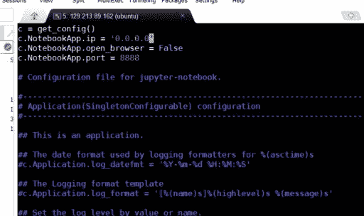
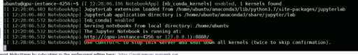
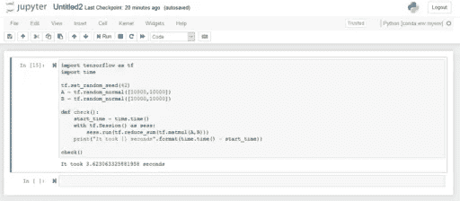

# 在 OCI GPU 实例中安装蟒蛇

> 原文：<https://medium.com/oracledevs/installing-anaconda-in-oci-gpu-instance-6a46c6b5ead9?source=collection_archive---------0----------------------->

现在您已经知道如何创建 Oracle 云基础设施 GPU 实例，接下来的步骤是安装 Anaconda 并使用 Jupyter 笔记本来开发或测试您的人工智能项目。

首先，转至您的 Oracle Cloud Account，并将以下入口规则添加到您的安全列表中(*联网>虚拟云网络>虚拟云网络详细信息>安全列表>安全列表详细信息*)。



使用终端，访问您的 Ubuntu 实例并下载最新版本的 Ananconda。今天最新的版本是[蟒蛇 2018.12](https://www.anaconda.com/download/#linux) 。

```
curl -O [https://repo.continuum.io/archive/Anaconda3-2018.12-Linux-x86_64.sh](https://repo.continuum.io/archive/Anaconda3-2018.12-Linux-x86_64.sh)
```

下载完成后，开始安装。

```
bash Anaconda3-2018.12-Linux-x86_64.sh -b
```

运行以下命令来使用 conda 命令。

```
echo -e '\nexport PATH="$HOME/anaconda3/bin:$PATH"' >> $HOME/.bashrcsource ~/.bashrc
```

蟒蛇已经被安装了！我们可以继续配置环境。

使用 Python 3.6、Tensorflow (GPU 版本)和 Keras 创建一个新环境。

```
conda create -n myenv python=3.6 tensorflow-gpu keras -yconda install nb_conda -y
```

使用 iptables 更新防火墙以打开端口 8888。

```
sudo iptables -I INPUT -p tcp -s 0.0.0.0/0 --dport 8888 -j ACCEPTsudo service netfilter-persistent save
```

生成 Jupyter 配置并将其打开。

```
jupyter notebook --generate-configvi /$HOME/.jupyter/jupyter_notebook_config.py
```

在文件的开头添加以下代码。

```
c = get_config()
c.NotebookApp.ip = '0.0.0.0'
c.NotebookApp.open_browser = False
c.NotebookApp.port = 8888
```



运行以下命令添加密码以访问 Jupyter 环境。

```
jupyter notebook password
```

启动 Jupyter 笔记本。

```
jupyter notebook &
```

完成！要访问您的 Jupyter 环境，请将 URL 复制并粘贴到浏览器中(不要忘记使用公共 IP)。



现在你有一个测试你的项目的环境了！



祝你玩得开心！

*原载于 2019 年 1 月 14 日*[*https://waslleysouza.com.br*](https://waslleysouza.com.br/en/2019/01/installing-anaconda-in-oci-gpu-instance/)*。*