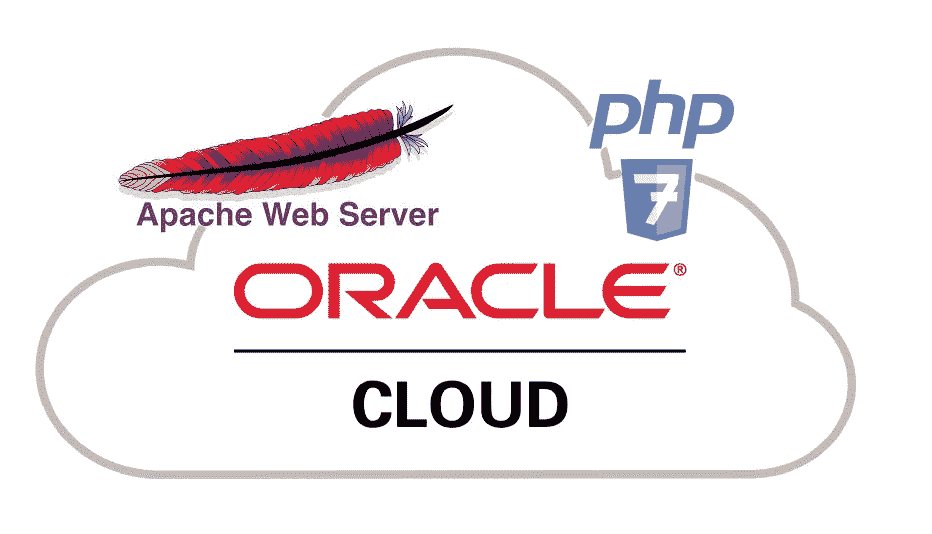
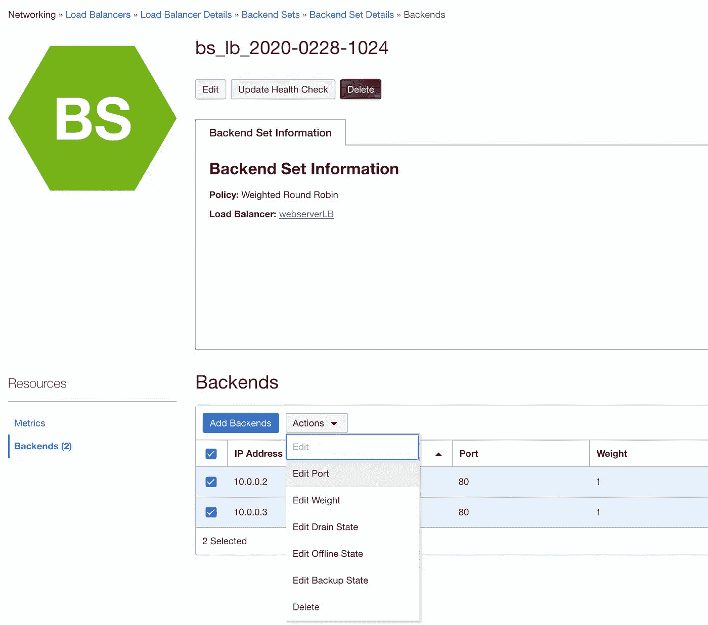
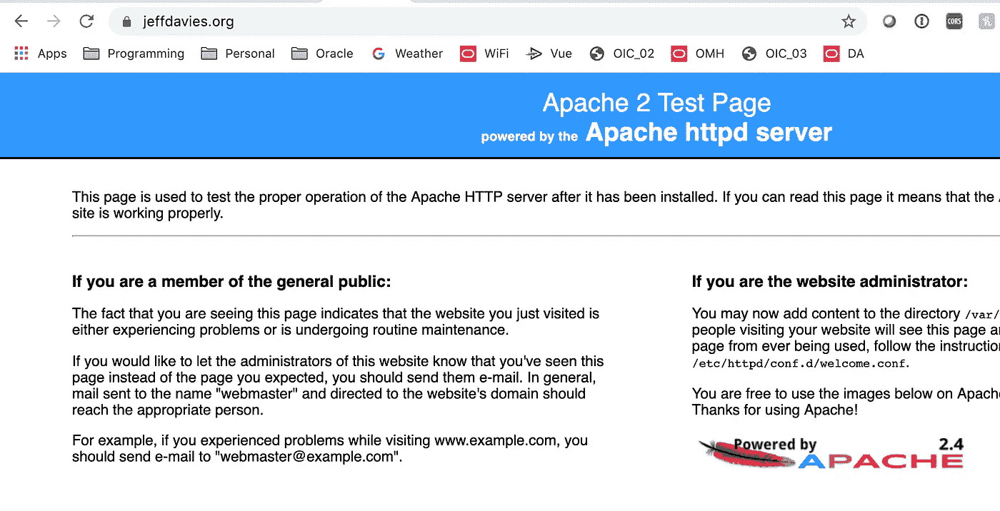
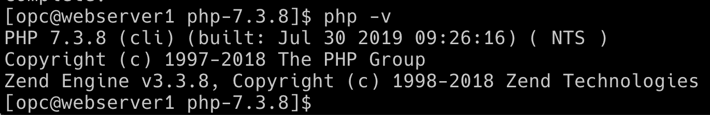
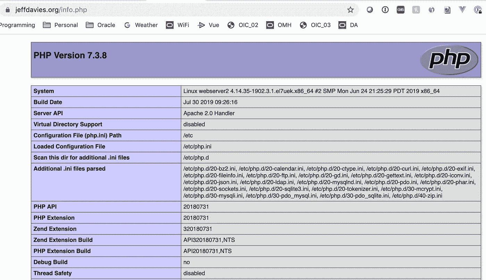

# 在 OCI 上安装 Apache 和 PHP 7

> 原文：<https://medium.com/oracledevs/installing-apache-and-php-7-on-oci-c0ccc2c8409d?source=collection_archive---------0----------------------->



Installing Apache web server with PHP 7 on Oracle Cloud Infrastructure

**2020 年 2 月 28 日—我更新了这篇文章，以适应 OCI 当前的用户界面和流程。**

到目前为止，我们已经能够使用 Node.js 作为我们的网络服务器。这是因为我们的网络服务器并不复杂。然而，随着我们准备进入 Oracle 云基础设施的更高级主题，我们将成为托管网页的更好平台。由于 Apache HTTPD 目前享有大约 60%的 web 服务器市场份额，所以我们使用 Apache 作为我们的 web 服务器是有意义的。此外，我们将使用 PHP 和 Apache 来处理我们对动态网页的需求。在这篇文章中，我将涵盖以下内容:

1.  停止我们当前的节点 Web 服务器
2.  安装 Apache Web 服务器
3.  配置我们的 OCI 环境
4.  为 Apache 安装 PHP

# 停止我们当前的节点 Web 服务器

我们需要停止在端口 3000 上运行的现有 web 服务器。为此，我们需要关闭并禁用现有的 node.js web 服务器，这些服务器监听该地址并在服务器重启时自动启动。

SSH 到您的每个计算实例，并执行以下命令:

```
cd /etc/systemd/system
sudo systemctl disable starthelloserver.service
sudo rm starthelloserver.service
cd ~
```

下次我们重新启动服务器时，helloServer 将不会启动。这为我们自动启动新的 Apache web 服务器腾出了空间。

# 安装 Apache Web 服务器

为了安装 Apache 软件，我们需要 SSH 到当前托管 Node.js web 服务器的两个计算实例。安装命令非常简单:

```
sudo yum install httpd -y
```

之后，如果计算实例重启，我们需要确保服务器默认启动。以下命令将会解决这个问题:

```
sudo systemctl enable httpd
```

让我们用下面的命令强制启动 Apache 服务器:

```
sudo systemctl restart httpd
```

确保对两个计算实例都这样做。此时，Apache 已经安装并正在运行。现在我们只需要配置 OCI，允许通过负载均衡器对其进行 web 访问。

# 配置我们的 OCI 环境

在我们能够通过负载平衡器访问 web 服务器之前，我们需要配置现有的后端集来监听端口 80。为此，只需从负载均衡器中找到您的负载均衡器(在 ***网络*** 菜单项下)。单击负载平衡器，然后找到并单击后端的链接。选择两个现有的计算实例，并使用 Actions 按钮编辑端口号。



How to edit the port for a backend set

现在，使用以下命令对每个实例进行 SSH，并在防火墙中打开端口 80:

```
sudo firewall-cmd --permanent --add-port=80/tcp
```

既然我们在这里，我们不妨去掉旧的 3000 端口。

```
sudo firewall-cmd --permanent --remove-port=3000/tcp
```

现在让我们激活这些更改:

```
sudo firewall-cmd --reload
```

**注意:**这些防火墙命令可能与其他平台上的命令不同。

现在，您应该能够打开浏览器到`https://<your domain name>`并看到 Apache 主页:



# 为 Apache 安装 PHP

这遵循为 Apache 安装 PHP 的标准过程。

```
sudo yum install [https://dl.fedoraproject.org/pub/epel/epel-release-latest-7.noarch.rpm](https://dl.fedoraproject.org/pub/epel/epel-release-latest-7.noarch.rpm)sudo yum install [http://rpms.remirepo.net/enterprise/remi-release-7.rpm](http://rpms.remirepo.net/enterprise/remi-release-7.rpm)sudo yum install yum-utilssudo yum-config-manager --enable remi-php73sudo yum install php php-mcrypt php-cli php-gd php-curl php-mysql php-ldap php-zip php-fileinfo
```

请注意，这些命令中有许多需要您在终端中键入`y`来接受。现在，您可以从命令行检查已经安装的 PHP 版本:

```
php -v
```

这将向您显示以下内容:



## 测试 PHP 安装

使用 ssh 连接到您的每个服务器实例，导航到/var/www/html 并使用以下命令创建一个名为【info.php】*和的文件:*

```
sudo vi /var/www/html/info.php
```

编辑文件以包含以下内容:

```
<?php
phpinfo();
?>
```

保存文件，并在另一个计算实例中做同样的事情。现在，您可以将 web 浏览器指向`https://<your domain name>/info.php`，查看 Apache 和 PHP 安装的详细信息:



您可以通过刷新浏览器并查看 info.php 页面顶部系统行上的服务器名称来验证负载平衡器是否正常工作。

**注意:**如果您没有看到正确显示的页面，而是看到了实际的 PHP 代码，请重启 compute 实例并重试。有时需要重启 Apache

# 结论

希望这有助于揭开在 OCI 上运行 PHP 的神秘面纱。自然，如果我们有大量的 web 服务器需要管理，手动进行这些更改将是一种浪费。更好的大规模方法是创建一个完全配置的服务器映像，并使用该映像创建新的计算实例，并将它们添加到负载平衡器的备份集中。

在我的下一篇文章中，我将向您展示如何创建一个简单的 PHP 网站，该网站利用 OCIs 内置身份云服务(IDCS)通过要求用户登录网站来帮助您控制对网站内容的访问。

一如既往，我希望你喜欢这篇文章，并发现它很有用。如果是的话，请给我一个掌声，像往常一样，随时问任何问题。