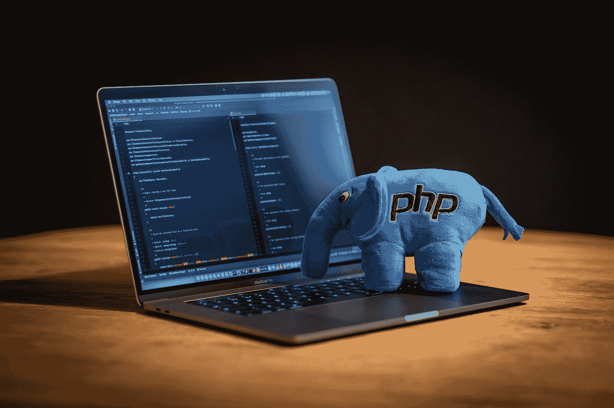
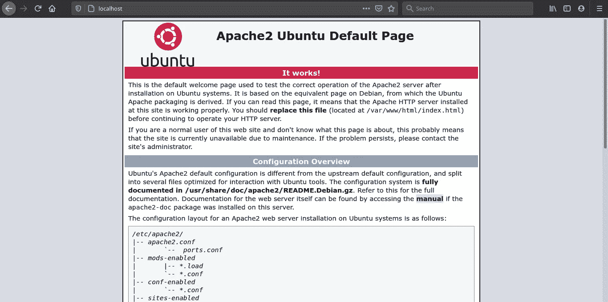
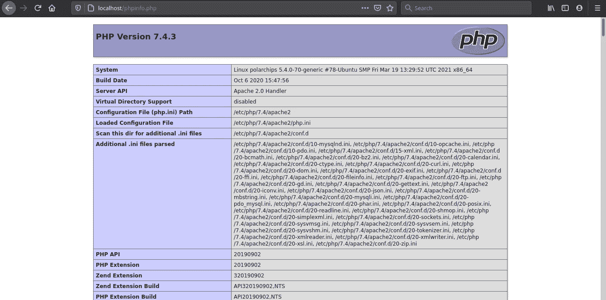
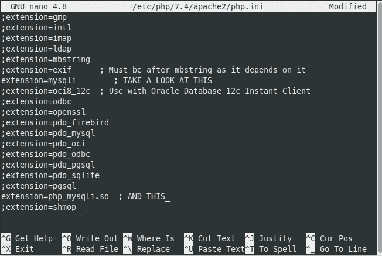
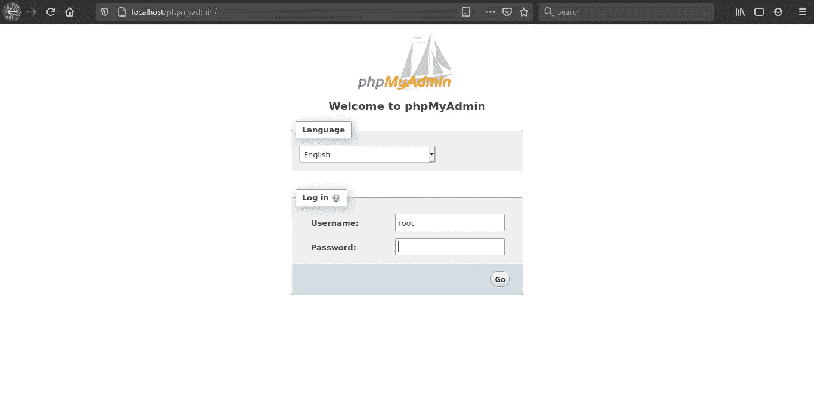

# 在 Linux Mint 上安装 LAMP 栈(Linux Apache、MySQL、phpMyAdmin 和 PHP)

> 原文：<https://medium.easyread.co/installing-lamp-stack-linux-apache-mysql-phpmyadmin-and-php-on-linux-mint-12f7c7fce033?source=collection_archive---------0----------------------->

## 在 Linux Mint 20 +上安装 Apache2，MySQL 和 PHP 7 求解 PHP 代码显示在页面上但没有执行

本教程解释了如何在 Linux 操作系统中安装 LAMP (Linux Apache、MySQL 和 PHP ),特别是针对 Linux Mint 发行版。正如我们所知，Apache2 是 web 服务器，MySQL 是数据库，PHP 是制作网页的处理/编程语言。我目前使用的是 PHP 7.4(PHP 7 的最新版本，目前在 4 月份)，因为我认为它比新版本的 PHP 8 更容易使用。



Photo by [Ben](https://unsplash.com/@benofthenorth?utm_source=medium&utm_medium=referral) on [Unsplash](https://unsplash.com?utm_source=medium&utm_medium=referral)

# **更新你在 Linux 上的所有包**

在我们安装 LAMP stack 之前，请确保您已经更新和升级了您的 Linux 软件包数据库。首先打开您的 Linux 终端(*应用程序>附件>终端*，在终端中键入这些命令并按回车键:

```
sudo apt-get update -y && sudo apt-get upgrade -y
```

终端会要求你输入密码。键入您的 Linux 用户密码，然后按 enter 键。

# 安装 Apache2 (Web 服务器)

在您的包数据库更新和升级之后，键入以下命令来安装 Apache2:

```
sudo apt-get install apache2 -y
```

要检查它是否已经安装，请在终端中键入以下命令，然后按回车键:

```
*apache2 -v*
```

你会在终端得到类似这样的东西。

要确保 Apache2 正常工作，请打开任何网络浏览器(例如:Google Chrome 或 Mozilla Firefox ),并在浏览器网址中输入以下内容:

```
*http://localhost/*
```

你可能会看到“有用！”恭喜你🎉🎉



# 安装 PHP 7

打开 yout 终端，键入或复制/粘贴以下命令:

```
*sudo apt-get install php7 libapache2-mod-php7 -y*
```

然后重启 Apache2，这样 PHP 就可以工作并兼容 Apache2 web 服务器。

```
*sudo /etc/init.d/apache2 restart*
```

## 确保 PHP 运行良好

要测试检查 PHP 是否正常工作，先在 */var/www/html* 目录下做一个名为【phpinfo.php*的文件，写上 *<？PHP phpinfo()；？>* 在文件里面或者如果你喜欢用 CLI 制作它你可以在终端里用下面的命令制作文件:*

```
*sudo nano /var/www/html*
```

然后复制/粘贴这段代码

```
<?php phpinfo(); ?>
```

按 ctrl+x，y，回车。

打开浏览器，输入以下内容:

```
*http://localhost/testphp.php*
```

您应该会看到类似这样的内容，然后开始编码。



## PHP 代码显示在页面上，但不执行

我在 Linux Mint 20 中第一次安装 LAMP 时遇到了这个问题。如果你有同样的问题，我给你一个小教程。也许能解决你的问题(希望如此)。

您只需要(再次)打开终端，并向 */etc/apache2* 目录中的 *apache2.conf* 添加一些代码。您可以通过命令行这样做:

```
*sudo nano /etc/apache2/apache2.conf*
```

并在文件末尾添加以下代码(通过键入或复制/粘贴):

```
<FilesMatch "\.ph(p?|tml)$"> 
    SetHandler application/x-httpd-php74
</FilesMatch>
```

重点看一下*“application/x-httpd-PHP 74”*我写 74 是因为我用的是 PHP 7.4 版本。在编写代码之前，确保您已经在终端中通过 *php -v* 检查了您的 PHP 版本。

之后按 ctrl+X，Y，回车。我希望它能解决你的问题。

# 通过命令行界面安装 MySQL 数据库

首先打开您的终端，然后复制/粘贴或在终端中键入:

```
*sudo apt-get install mysql-server -y*
```

然后通过以下方式运行 MySQL:

```
*mysql -u root*
```

您将得到类似这样的结果，这意味着您的 MySQL 工作正常。

如果您想为 MySQL root 用户设置密码，请对终端执行以下命令:

## 安装 phpMyAdmin

phpMyAdmin 是一个用 PHP 编写的免费软件工具，旨在通过 Web 处理 MySQL 的管理。你可以称之为 MySQL 的 GUI 版。

要安装它，只需执行以下命令:

```
*sudo apt-get install libapache2-mod-auth-mysql php7-mysql phpmyadmin -y*
```

确保你写的 *php*-mysql* 基于你使用的 php 版本。

要让 PHP 与 MySQL 一起工作，需要通过删除分号(；)在:

```
;extension=mysql
```

并添加 *php_mysqli* 扩展:

```
extension=php_mysqli.so
```



之后，按 ctrl+X，Y 并输入。重新启动 Apache，一切都准备好了！🎉🎉

打开浏览器，在网址中输入以下内容

```
[http://localhost/phpmyadmin](http://localhost/phpmyadmin)
```

你会看到这个。



## 访问[http://localhost/phpmyadmin](http://localhost/phpmyadmin)时出现错误 404

通过 apache2.conf 文件配置 Apache2:

```
*sudo nano /etc/apache2/apache2.conf*
```

将下面的代码复制/粘贴到文件末尾。

```
Include /etc/phpmyadmin/apache.conf
```

然后重新启动 Apache2 Web 服务器。

```
*sudo /etc/init.d/apache2 restart*
```

好了，你们终于都准备好了。希望对你有帮助:)