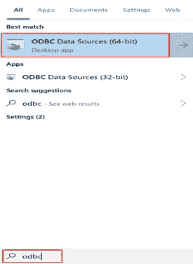
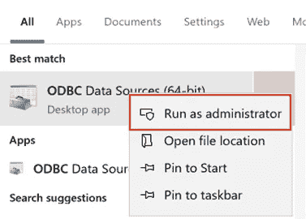
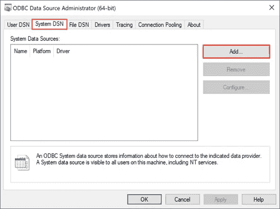
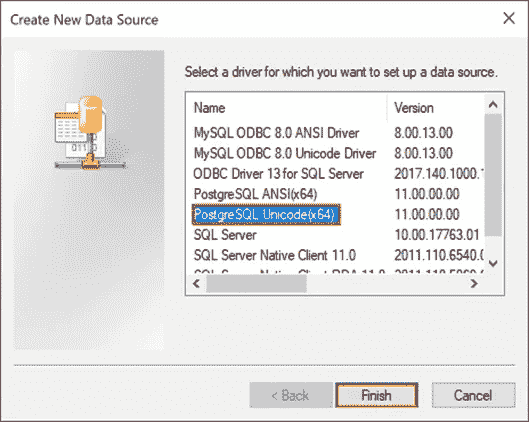
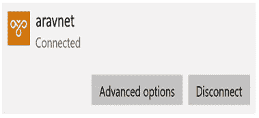
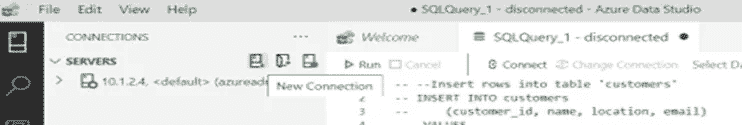
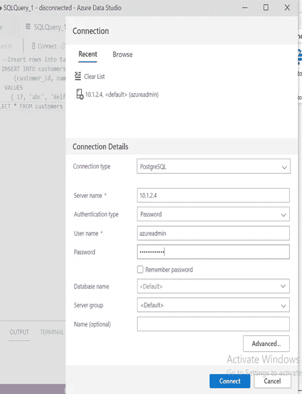
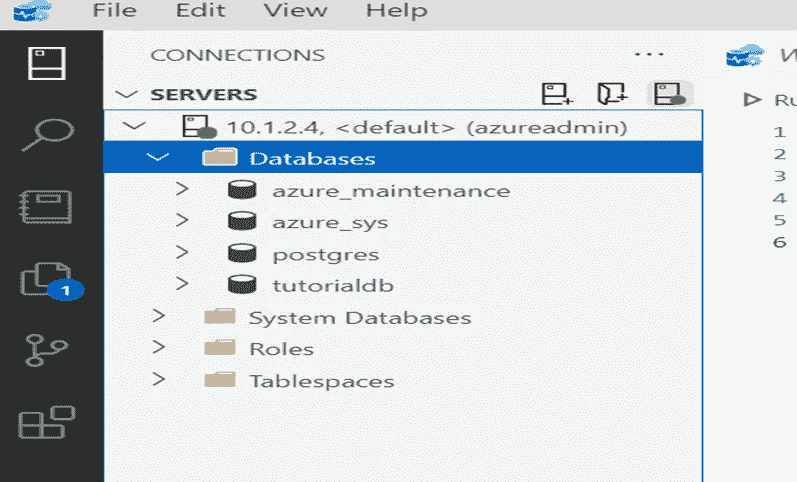

# 正在安装远程连接到 PostgreSQL 数据库的 ODBC 驱动程序

> 原文：<https://medium.com/version-1/installing-odbc-driver-for-remote-connection-to-postgresql-db-9b8d496e50e4?source=collection_archive---------3----------------------->

开放式数据库连接(ODBC)是访问 DBMS 的标准 API。ODBC 被设计成独立于数据库和操作系统。

要为 PostgreSQL 设置新的 ODBC 数据源:

1.  安装最新的 PostgreSQL ODBC 驱动程序:

> *从 [psqlodbc 下载站点](https://www.postgresql.org/ftp/odbc/versions/msi/)下载最新的 64 位驱动程序安装程序(压缩的 msi 文件)。
> 
> *解压缩文件。
> 
> *运行 msi 安装程序并接受默认值。

2.打开 64 位 ODBC 管理器:

Windows 10 (64 位版本)支持 32 位和 64 位 ODBC 源—请始终使用 64 位 ODBC 管理器。

> *搜索 ODBC 并选择 ODBC 数据源(64 位):

> *右键选择**以管理员身份运行**:

3.打开**系统 DSN** 选项卡，点击**添加**:

4.选择最新的 PostgreSQL ODBC 驱动，点击**完成**:

5.使用 **Azure Data Studio 测试连接。**

I)确保我们连接到 VPN。

**ii)** 打开 **Azure Data Studio** 点击**新建连接。**

**iii)** 填写需要连接的 postgresql 的必要详细信息(输入 PostgreSQL 的**私有 IP** 而不是 dns 名称)。点击**连接。**

iv)一旦**连接**成功，**数据库**被加载。

**这是一个四部分系列的第三部分，可以在下面查看:**
[第 1 部分—创建虚拟网络和 PostgreSQL](/version-1/vnet-integratedpostgresql-integration-with-power-bi-app-12950039e687)
[第 2 部分—创建和配置虚拟网络网关(点到点)](/version-1/creating-and-configuring-virtual-network-gateway-point-to-site-using-azure-certification-7a5b61839e54)
[第 4 部分—在 Power BI 中配置数据网关](/version-1/configuring-of-data-gateway-in-power-bi-f7f95882f19)

如果你对此感兴趣或有任何反馈，请在评论区告诉我。

**关于作者:** Raghavendra BN 是一名 DevOps 工程师，目前在 Version 1 的 Foundation 的团队工作。关注版本 1 和 Raghavendra BN，了解更多关于 Microsoft Azure 和 Azure DevOps 的博客。