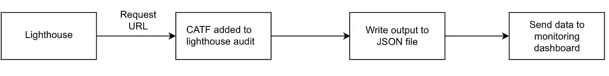
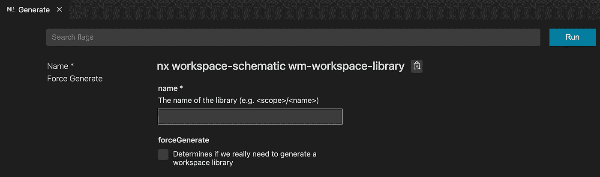
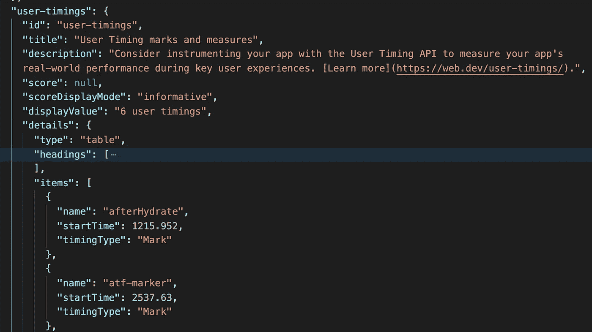
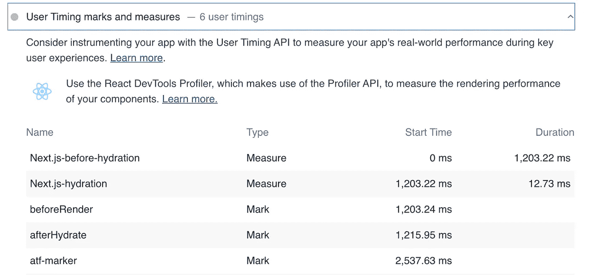

# 整合 CATF 时间和灯塔审计

> 原文：<https://medium.com/walmartglobaltech/integrate-catf-time-with-lighthouse-audit-2cc4852d0698?source=collection_archive---------2----------------------->

## 检查灯塔报告中的性能指标和 CATF 时间

## 什么是 CATF？

折叠上方的内容(CATF)是指观众在向下滚动之前看到的内容。
在这里，我们测量在文件夹上方呈现内容所需的时间。


图片来源:【https://www.walmart.com/ 

## 为什么 CATF 时间很重要？

根据研究，如果用户在网页上长时间看到加载器，离开该网站的概率更高，因为这降低了用户的兴趣。为了改善用户体验，减少 CATF 时间是很重要的，以便内容尽快可见。

## 问题陈述

如果你真的认为改善 CATF 是一次性的活动，那么你错了。随着代码的增长，CATF 往往会随着时间而退化。如果没有适当的常规检查点来测量、跟踪和修复性能下降，就会发生这种情况。

## 建议

计算拉式请求(PR)合并流的 CATF 时间，并将其上传到监控仪表板，以便我们将来参考。

## 如何测量 CATF 时间？

我们可以用灯塔来测量。它是一个开源的自动化工具，用于提高网页质量。它为我们提供了一些与网站性能检查相关的指标。但默认情况下，CATF 时间不存在。Lighthouse 为我们提供了创建定制审计的灵活性，即我们可以根据自己的需求添加或编辑各种指标。我们可以通过添加自定义审计来扩展它的功能。我们可以从 Lighthouse 的文档[中读到更多关于 light house 架构的细节。](https://github.com/GoogleChrome/lighthouse/blob/master/docs/architecture.md)

现在，作为一个开发者，这个问题浮现在脑海中，在折痕上方标记的点应该是什么？由于每个设备的屏幕高度不同，折叠内容上方和下方之间的分叉点应该是什么？

对于这一点，让我们从沃尔玛网站的主页上举个例子。在移动设备上，直到顶部横幅的内容都包含在文件夹上方的内容中。

在本教程中，我们将讨论如何将 CATF 指标融入灯塔审计。

## 流程图



## 标记 CATF 时间

我们创建了一个 React 组件，ATFMarker。我们将在这里为 CATF 设定时间。我们使用了`[performance.mark](https://developer.mozilla.org/en-US/docs/Web/API/Performance/mark)`函数，它在名称`atf-marker`和`performance.clearMarks`下创建一个时间戳来清除之前的值。

```
useEffect(() => {
  performance.clearMarks("atf-marker");
  performance.mark("atf-marker");
},[]);
```

我们将在文件夹上方的内容末尾包含一个 ATFMarker 组件。

```
<div>
  <TopBanner/>
</div>
<ATFMarker/>
```

只要 ATFMarker 组件在客户机上呈现，它就标记时间戳。它表示 ATFMarker 完成客户端渲染的时刻，我们认为这是在折叠内容之上进行渲染所花费的时间。因为我们已经标记了`atf-marker`时间戳，所以在 Lighthouse 报告中它将位于`user-timings`下。

## 配置 NX 计算 CATF 时间？

在沃尔玛，我们使用 [nx](https://nx.dev/) 来管理我们的 monorepo 架构。我们创建了一个执行程序[来运行我们的代码。
我们已经创建了一个`wm-workspace-library`生成器，用于生成一个空的基于工作空间的库。它扩展了`@nrwl/workspace:library`生成器，并添加了一些沃尔玛特有的变化。
我们可以使用 NX 扩展创建一个库。我们将在工作空间库中生成它，因为它用于管理我们的代码库。](https://nx.dev/latest/angular/executors/using-builders)

点击 NX 扩展->生成-> WM-工作空间-库



提供范围和名称，然后单击 Run。这里我们提供名称为`performance`，范围为`workspace`。它在 workspace 下创建一个名为 *performance* 的库。在性能库中，我们将编写代码。

或者我们也可以使用 shell 命令来生成它。

```
pnpm g wm-workspace-library -- --name=<scope>/<name> --forceGenerate
```

我们在`workspace.json`中配置我们的工作空间。该文件包含工作空间项目及其架构师目标。假设我们有一个`demo-app`，我们将为它定义一个`browser-perf`目标。每个目标都使用一个运行该目标的执行器。

```
"demo-app": {
  "root": "apps/demo/app",
  "sourceRoot": "apps/demo/app",
  "projectType": "application",
  "targets": {
    "browser-perf": {
      "executor": "./libs/workspace/performance/src/executors:run",
      "options": {
        "urls": ["/url1","/url2"],
        "serveTarget": "demo-app:serve"
      }
     },....
```

当我们运行下面的命令时，性能库下的代码被执行。

```
nx run demo-app:browser-perf
```

在选项内部，我们提供了一个 URL 数组，我们将在上面运行灯塔。
在 executors 文件夹中创建一个 [schema.json](https://nx.dev/latest/angular/executors/using-builders#defining-an-executor-schema) 文件，以定义一个模式来验证输入。

## 与灯塔 CI 集成

使用 Lighthouse CI，我们可以将其自动化，并进一步增强该功能。
Lighthouse CI 通常通过以下方式使用:

*   作为持续集成的一部分运行 Lighthouse CI。
*   使用 Lighthouse CI GitHub 操作运行并评论每个 pull 请求。
*   通过 Lighthouse Server 提供的仪表板跟踪性能。

## 如何在本地机器上运行 Lighthouse CI

在继续之前，我们先讨论几个命令:

[lhci collect](https://github.com/GoogleChrome/lighthouse-ci/blob/main/docs/configuration.md#collect)——它用于运行灯塔并将其结果收集到本地`.lighthouseci/`文件夹中。

```
Options: --url  A URL to run Lighthouse on. Use this flag multiple times to evaluate multiple URLs.
To run on multiple URLs
lhci collect --url=https://example-1.com --url=[https://example-2.com](https://example-2.com)
```

[lhci 断言](https://github.com/GoogleChrome/lighthouse-ci/blob/main/docs/configuration.md#assert) —在这种情况下，我们可以定义聚合结果的多种策略，以及在哪个结果下我们需要显示警告、错误等。

[lhci 上传](https://github.com/GoogleChrome/lighthouse-ci/blob/main/docs/configuration.md#upload) —将`.lighthouseci/`文件夹中的运行结果保存到所需的目标
`Options: --outputDir [filesystem only] The directory in which to dump Lighthouse results.`

[lhci 自动运行](https://github.com/GoogleChrome/lighthouse-ci/blob/main/docs/configuration.md#autorun) **—** 自动运行，使用合理的默认值， [lhci 收集](https://github.com/GoogleChrome/lighthouse-ci/blob/main/docs/configuration.md#collect)， [lhci 断言](https://github.com/GoogleChrome/lighthouse-ci/blob/main/docs/configuration.md#assert)和 [lhci 上传](https://github.com/GoogleChrome/lighthouse-ci/blob/main/docs/configuration.md#upload)，具体取决于您配置中的选项

Lighthouse CI 配置可以通过配置文件、环境变量和 CLI 标记覆盖来管理。如果您想为灯塔提供一些特定的配置，在根目录下创建一个包含与灯塔相关的[配置](https://github.com/GoogleChrome/lighthouse-ci/blob/main/docs/configuration.md)的`.lighthouserc.js`文件。

现在要在本地运行 lhci，需要三个步骤。添加 lhci/cli 包。
2。启动服务器
3。运行 lhci 命令

让我们来讨论这些步骤:

在本地代码库中添加 lhci/cli 包。

```
npm install -g @lhci/cli
Let’s write code to start the server and run lhci on different URLs.
From the workspace.json , we have provided URLs.
```

我们可以使用调用执行器的`[runExecutor](https://nx.dev/l/a/executors/using-builders)`实用程序来启动服务器。它将在配置中找到目标，找到执行器，构造选项(就像您在终端中调用它一样)并调用执行器。它返回一个 iterable，我们可以从这里评估基本 URL。

现在我们运行 lhci 命令`autorun`
我们使用`[execa](https://www.npmjs.com/package/execa)`来执行带有参数的命令

```
const args = [“autorun”,`--collect.url=${url1}` `--collect.url=${url2}`]const lhResult = await execa(lhciPath, args, {stdio: “inherit”});
```

在`.lighthouseci`文件夹中，记录了输出的 HTML 和 JSON 文件。我们可以从那些 JSON 文件中读取数据。您可以在[默认灯塔配置](https://github.com/GoogleChrome/lighthouse/blob/master/lighthouse-core/config/default-config.js#L424)中看到所有预定义的审计。



atf-marker in JSON file



atf-marker in html file

在 JSON 输出文件中，我们也有`atf-marker`数据。我们可以根据自己的需求来使用。我们已经提取了所需的数据并将其写入一个文件，比如 demo.json.
在 CI 合并流中，我们读取 demo.json 文件并将数据发送到监控仪表板。

## 未来的工作

我们也将把它添加到 CI 的 PR 流中，这样开发者就可以在他们的 PR 合并之前知道 CATF 时间。

## 潜在问题

由于 Lighthouse 加载页面来查找指标，随着 URL 的增加，这变成了一个耗时的过程。要解决这个问题，我们应该批量运行 URL。

## 结论

为了检查与性能相关的数据，Lighthouse 为我们提供了一些默认的指标。我们可以通过添加自定义指标和更新审计来扩展它们。