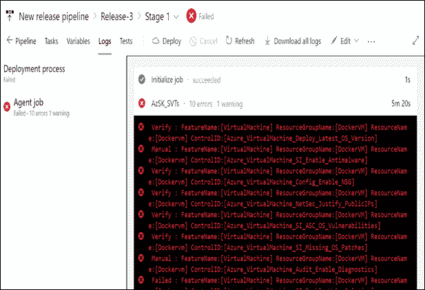

# 将基础架构安全性与 Azure Devops 集成

> 原文：<https://medium.com/globant/integrate-infrastructure-security-into-devops-a31c8d83cc7?source=collection_archive---------0----------------------->

# **简介**

在现代世界中，公司正在将他们的服务转移到云中，在云中，灵活性和速度对于希望获得强大竞争优势的组织来说很有吸引力。但是在云中工作也带来了一系列的安全问题，因为在云中要分担责任。对于所有云部署类型，您都是数据和身份的所有者。无论部署类型如何，您都要对数据的安全性负责，以下职责始终由您承担:

*   数据
*   端点
*   账户
*   存取管理

**本文涵盖以下几点:**

1.  云基础架构安全性对组织的重要性。
2.  Azure 安全开发工具包(AzSK)。
3.  azure DevOps 管道中的 AzSK 配置。
    3.1 为你的 Azure DevOps 启用 AzSK 扩展。
    3.2 在发布管道中增加 AzSK
    3.3 优点
    3.4 缺点

4.结论

5.参考

# **1。云基础设施安全对组织的重要性**

在采用云技术时，将保护云基础架构视为一项重要责任至关重要。有许多组织仍然不确定他们的数据在云环境中的安全性。

*2019 年，*[*Capital one # 1*](https://www.nytimes.com/2019/07/29/business/capital-one-data-breach-hacked.html)*发生大规模数据泄露事件，导致超过 1 亿份信用卡申请的数据集受损，其中包括社保和银行账号。30 GB 的信贷申请数据存储在云存储服务上。*

上述臭名昭著的数据泄露的例子证明，像云这样的存储服务提供商需要一致的安全管理。当我们谈到云基础架构的安全性时，许多企业错误地认为他们的数据受到了很好的保护，是安全的，并且对于网络犯罪分子来说是不可见的。但不幸的是，事实是这些网络罪犯是通过使用不道德的方法寻找易受攻击的数据库来收集暴露的易受攻击数据的专家。

2019 年，超过 41 亿条记录被曝光

78%的记录是由于错误配置而被发现的

来源: [IBM，基于风险的安全](https://www.ibm.com/security/digital-assets/strategy-risk-management-ebook/)

错误配置的协议和安全措施是当今数据泄露的头号来源。全球情报公司 IDC 代表 Ermetic 对 300 名高级 IT 决策者进行了调查，证实了 Bitdefender 研究人员关于当今网络犯罪分子最常用的 IT 错误配置的调查结果。

根据与[调查](https://www.businesswire.com/news/home/20200603005175/en/Ermetic-Reports-80-Companies-Experienced-Cloud-Data)相关的 CISOs 的说法，**安全错误配置**是云环境的最大安全威胁，67%的受访者提到了这一点。

62%的安全专业人员认为错误配置是最大的安全威胁。

来源:2018 云安全报告，[网络安全内部人士](https://crowdresearchpartners.com/)

几乎所有对云服务的成功攻击都是客户错误配置、管理不善和失误的结果。安全和风险管理负责人应该投资云安全状态管理流程和工具，以主动和被动地识别和补救这些风险。

*-Gartner，云安全态势管理创新洞察，2019 年 1 月 25 日*

# **2。用于 Azure (AzSK)的安全 DevOps 套件**

云服务提供商安全地构建云基础架构/服务，客户有责任安全地对其进行配置。但是，云基础架构/服务会立即发生变化，时间点安全性和合规性评估不再显示真实情况。

AzSK 是一个免费的开源工具包，它从云服务提供商那里收集实际配置，将它们与云安全最佳实践进行比较，识别错误配置，分析风险并进行修复。AzSK 在这 6 个重点领域帮助实施安全开发运维

*   保护订阅。
*   支持安全开发。
*   将安全融入 CICD。
*   持续保证。
*   警报和监控。
*   云风险治理。

# **3。Azure DevOps 管道中的 AzSK 配置**

**3.1 为您的 Azure DevOps 启用 AzSK 扩展**

这个扩展已经发布到 Azure DevOps gallery 的“构建和发布”类别下，现在你可以直接从 [Marketplace](https://marketplace.visualstudio.com/items?itemName=azsdktm.AzSDK-task) 安装这个扩展。

**3.2 在发布管道中添加 AzSK**

**步骤 1:** 创建一个发布定义或打开一个现有的发布定义。

**第二步:**

2.1.将 AzSK 安全验证测试(SVT)发布任务添加到管道中。点击“添加任务”，选择“AzSK 安全验证测试”。

2.2.点击“添加”和“关闭”。

**步骤 3:** 指定 AzSK_SVT 任务的输入参数。

在手动运行 AzSK 时，我们已经指定了一些选项。

1.  在**选择参数设置**中，您可以看到两个选项；第一个是**资源组名**，第二个是**标记名值对**。

a.如果选择 ResourceGroupName，则应在下面提到的文本框中提供资源组名称。

b.如果您选择第二个选项 TagNameValuePair，那么您将能够看到两个不同的空文本框，一个用于标记名，另一个用于标记值。

2.提及订阅 Id。

**步骤 4:** (可选)将日志分析配置到 CICD 中。

要启用日志分析工作区，您需要将两个变量添加到相应的发布管道中。

1.日志分析工作区 Id。

2.日志分析工作区密钥。

**注意:**确保使用的变量名与上面完全相同，并且值对应于*您的*日志分析工作区。

**步骤 5:** 启动释放管道。

**步骤-5.1:** 验证释放管道已经启动。一旦发布被触发，我们将通过点击“发布”看到它正在进行中。

**步骤 5.2:** 查看发布输出。一旦发布管道完成，我们可以看到如下所示的输出(在下面的图片中，我们可以看到发布管道已经失败)。

**步骤 5.3:** 查看“问题”以确定发布失败的原因。您需要点击**日志**按钮，总结结果显示故障原因。

**步骤-5.4:** 查看发布管道执行的 AzSK 部分的完整结果日志。

**步骤 6:** 参见 AzSK SVTs 的摘要“Excel”和详细“LOG”输出文件。

打开/解压缩“AzSK _ Logs”ZIP 文件，将看到相应资源组的所有日志。当您打开 securityReport.csv 文件时，您需要特别注意失败和验证结果。在此报告中，您可以看到故障的严重程度(高影响、中)。CSV 还包含“建议”栏，您可以在其中看到解决每个问题应该采取的步骤。

**注:-** 不提供任何问题的自动补救。该工具为您提供了补救步骤，其用户有责任遵循这些步骤并解决问题。

**3.3 优点**

1.  帮助维护 Azure 中的安全状态。
2.  有助于发现基础设施中的安全漏洞。

**3.4 缺点**

1.  多重云支持不可用。

# **4。结论**

本文解释了使用 AzSk 实现 Azure 云基础设施安全的重要性。它很容易与 Azure DevOps 集成。为了克服云基础设施中存在的漏洞，将云服务的安全性作为高度优先事项是极其重要的。使用最好的云计算安全工具来获得更好的结果并保护数据安全。

# **5。参考文献**

*   [azsk/DevOpsKit-docs](https://github.com/azsk/DevOpsKit-docs)
*   [devpskit-docs/readme . MD at master azsk/devpskit-docs git hub](https://github.com/azsk/DevOpsKit-docs/blob/master/03-Security-In-CICD/Readme.md)