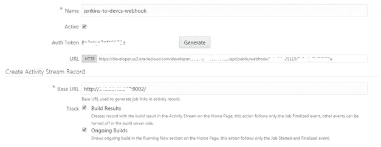
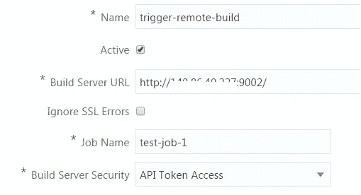
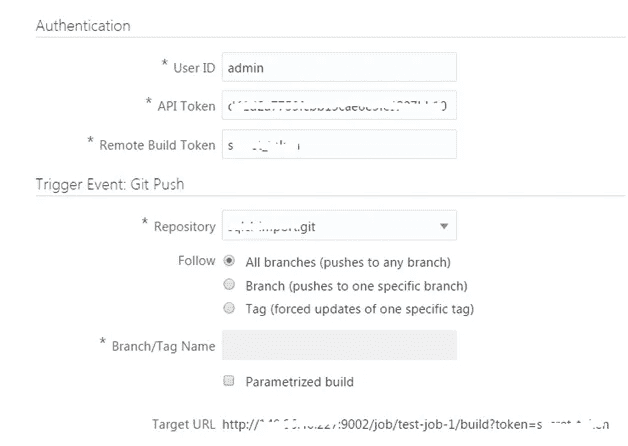
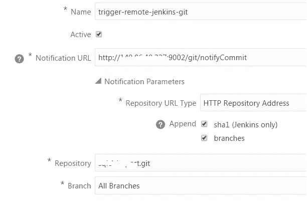

# 将您现有的 Jenkins 基础架构与 Oracle 开发人员云相集成

> 原文：<https://medium.com/oracledevs/integrate-your-existing-hudson-jenkins-infrastructure-with-oracle-developer-cloud-469114d06099?source=collection_archive---------1----------------------->

借助 **Oracle Developer Cloud** 服务，您可以集成现有的 Jenkins 设置，无论它们是内部部署还是基于云。目前，有三个不同的集成点可以使用 **Webhooks 来实现。**让我们来看看每一项

# Jenkins 构建通知

这是通过一个**入站** Webhook 实现的，它接受来自远程 Jenkins 服务器的构建通知

## 配置摘要

*   在开发者云中创建一个 Webhook(类型: **Jenkins —通知插件**)
*   将您的外部 Jenkins 配置为使用开发者云服务 Webhook 配置中提供的 URL

这是 Oracle 开发人员云中的配置快照

这就是 Oracle 开发人员云中产生的**活动流**的样子。点击活动流中可用的超链接会将您重定向到远程 Jenkins 实例中的工件，例如构建、提交、git 存储库等。

您可以参考本[文档章节](https://docs.oracle.com/en/cloud/paas/developer-cloud/csdcs/configuring-webhooks-oracle-developer-cloud-service.html#GUID-2E1A1251-4768-4BB0-A129-ECE89EFBBDBE)了解更多详情

# Jenkins 构建触发器集成

您可以配置一个**出站** Webhook，当开发者云中的选定存储库中发生 **Git 推送**时，它会触发远程 Jenkins 构建服务器上的构建

## 配置摘要

*   配置外部 Jenkins 以允许远程调用构建
*   创建一个类型为 **Jenkins 的 Webhook 构建触发器**
*   提供基本信息，配置验证和触发

这是 Oracle 开发人员云中的配置快照

您可以参考[本文档章节](https://docs.oracle.com/en/cloud/paas/developer-cloud/csdcs/configuring-webhooks-oracle-developer-cloud-service.html#GUID-37040541-F8B0-4023-957F-845FDF11905D)了解更多详情。

# Jenkins Git 插件集成

这是另一个**出站** Webhook，它可以通知另一个 Jenkins 构建作业，以响应开发者云服务中的 Git 推送。这与之前的 Webhook 的区别在于，这将触发为 Webhook 有效负载中发送的相同 Git 存储库(在开发者云服务中)配置的所有作业的构建

## 配置摘要

*   创建一个类型为**的 Webhook Jenkins Git 插件**
*   提供 Git 存储库细节作为外部 Jenkins 配置的一部分，并激活 SCM 轮询

您可以参考本[文档](http://docs.oracle.com/en/cloud/paas/developer-cloud/csdcs/configuring-webhooks-oracle-developer-cloud-service.html#GUID-6C142CFC-F829-4D59-921F-E2AD0317B00F)部分了解更多详情。

> 本文表达的观点是我个人的观点，不一定代表甲骨文的观点。