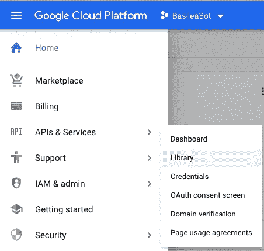
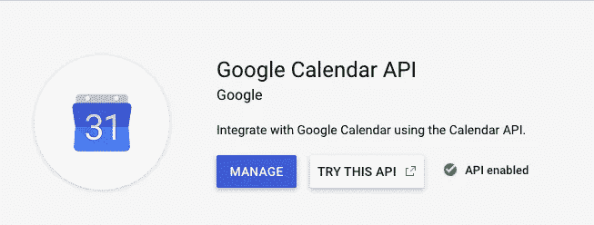
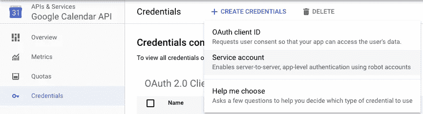
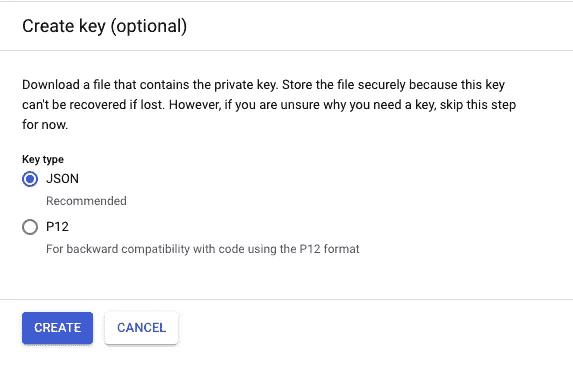
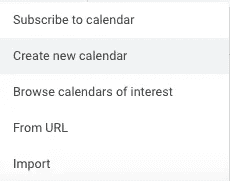
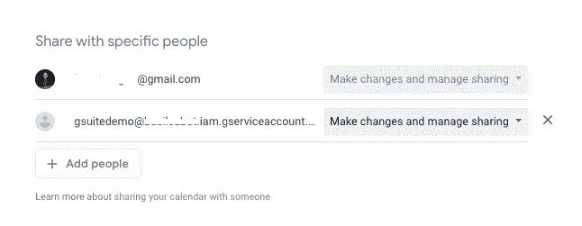
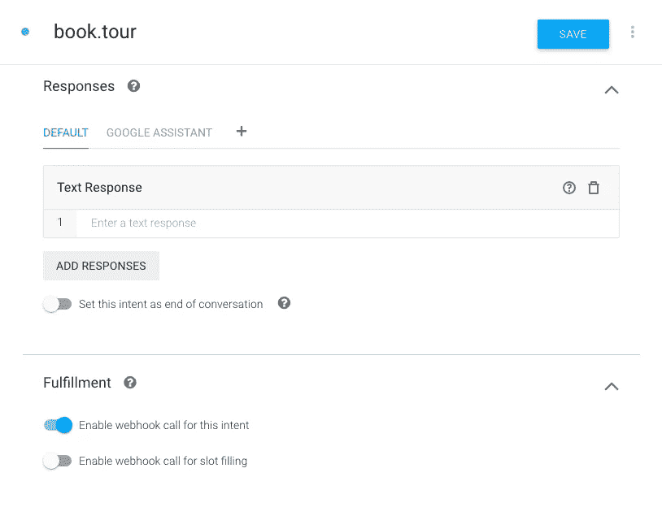
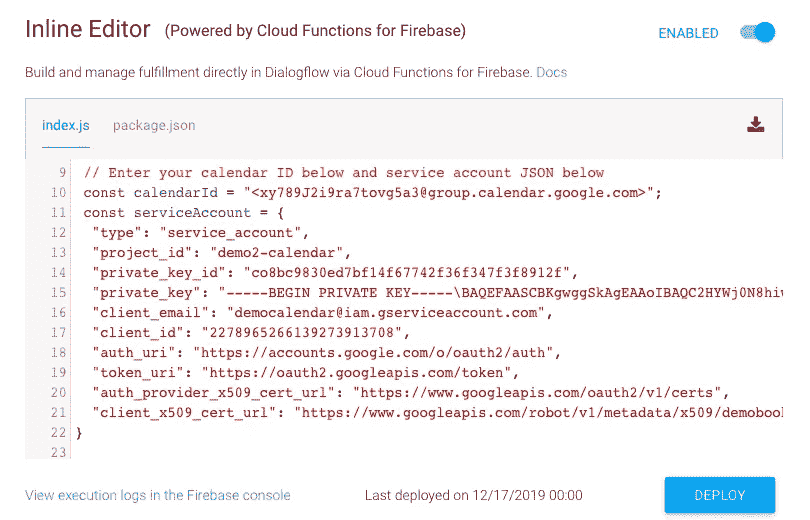

# ️Integrate 是你的虚拟助手🤖🗓

> 原文：<https://medium.com/google-developer-experts/integrate-your-virtual-assistant-with-g-suite-%EF%B8%8F-8aa2c4f9ff14?source=collection_archive---------4----------------------->

在这篇文章中，我们将学习如何将 G Suite 产品(如工作表和日历 API)与您的虚拟助理集成在一起。对于我们代理的自然语言处理和‘智能’，我们将使用 Dialogflow 所以，‘嘿，谷歌，让我们开始吧！’🏁

1.  **谷歌日历 API:** 在谷歌云☁️平台控制台启用您的日历 API️🗓:[http://console.cloud.google.com/](http://console.cloud.google.com/)️you 将能够集成日历来创建和读取事件，例如在日历上安排约会。

[https://console.cloud.google.com/apis/library/](https://console.cloud.google.com/apis/library/calendar-json.googleapis.com)

在控制台进入菜单图标☰> API 和服务>**库** > **启用** **谷歌日历 API**️️🗓️[https://console . cloud . Google . com/APIs/library/calendar-JSON . Google APIs . com](https://console.cloud.google.com/apis/library/calendar-json.googleapis.com)

[https://console.cloud.google.com/apis/library/calendar-json.googleapis.com](https://console.cloud.google.com/apis/library/calendar-json.googleapis.com)

配置服务帐户🔐

进入菜单图标☰> API 和服务>创建凭证>**服务账户**

一旦选择了服务帐户键，将您的项目命名为 ***GSuiteDemo*** 并点击创建一个新的服务帐户。在弹出窗口中，选择 Create Without Role，一个 JSON 文件将被下载到您的计算机中(我们将在接下来的步骤中使用它)。)

Once the credentials are created, it would download a JSON file.

**设置日历:**进入谷歌日历 https://calendar.google.com/[🗓️](https://calendar.google.com/)
>添加日历>创建新日历>命名您的项目 **GSuiteDemo** >点击创建日历

Add client_email downloaded as a JSON file.

打开上一步中的 JSON 文件，从 **client_email** 变量中复制电子邮件地址:

[https://gist.github.com/leoaiassistant/cef0a838f49f7b48fcf68de117b76ff4](https://gist.github.com/leoaiassistant/cef0a838f49f7b48fcf68de117b76ff4)

现在，转到日历设置，粘贴带有权限的 client_email，以便**进行更改和管理共享。**

Share with specific people> Make changes to event

**将日历整合到您的 NLP 培训中:**要将日历 API 与 Dialogflow 相连接，请前往 console.d️ialogflow.com🤖现在创建一个项目，并将其命名为 ***GSuiteDemo，*** 然后转到 Export 和 Import 部分，使用包含意向 ***book.tour*** 的 [GSuiteDemo.zip](https://github.com/leoaiassistant/AssistantCalendar/blob/master/GSuiteDemo.zip) 来恢复该项目，并在意向的 Fulfillment 部分启用 webhook 调用以获得动态响应。

现在用以下函数更新文件 **index.js** 和**package . JSON**:

Github Repo:[https://github.com/leoaiassistant/AssistantCalendar](https://github.com/leoaiassistant/AssistantCalendar)

在 index.js 中，更新您在上一步中复制的日历，并将其替换为您的日历 ID:<insert_your_calendar_id></insert_your_calendar_id>

[https://gist.github.com/leoaiassistant/45890c2d6e128a09328c218e6ef24d3e](https://gist.github.com/leoaiassistant/45890c2d6e128a09328c218e6ef24d3e)

还要用 JSON 文件更新常量“serviceAccount”。更换

 [## 助理日历

### 为在日历中的预约和创造事件的谷歌日历的虚拟集成的储备](https://github.com/leoaiassistant/AssistantCalendar/blob/master/index.js) 

(可选)如果您不在 PST，您也可以更改日历的时区，例如，如果您在 CST，您可以使用:

***const timeZone = '美洲/芝加哥'；
const 时区偏移量= '-05:00 '；***

现在，您已经准备好在内嵌编辑器中部署您的功能，并且准备好尝试您的虚拟助手并在日历中创建事件🤖 🗓️

2.Google Sheets:Sheets API 让你可以完全控制电子表格数据的内容和外观。最新版本的 Sheets API 允许开发人员:

*   读取和写入数据
*   构建数据透视表
*   应用高级公式
*   创建图表、数据可视化…等等！

**Ingrate Sheets API:** 为了集成此服务，我们将使用[https://sheetdb.io/apis](https://sheetdb.io/apis)这将允许我们创建自己的 API webhook url。

转到对话流程[console.d️ialogflow.com](http://console.d️ialogflow.com)🤖现在创建一个项目，将其命名为 ***GSuiteDemo。*** 现在创建一个新的 Google 工作表，包含以下几列:姓名(A1)、年龄(B1)、电子邮件(C1)、电话(D1)，并在每一列中添加示例。

创建您的 API url，例如:[https://sheetdb.io/api/v1/xirgfp569xwov](https://sheetdb.io/api/v1/xirgfp569xwov%E2%80%98)，并在您的内嵌编辑器中运行以下函数:

[https://gist.github.com/leoaiassistant/0910f3db4d11817dca6be97da2b8dd39](https://gist.github.com/leoaiassistant/0910f3db4d11817dca6be97da2b8dd39)

现在在 package.json 中添加最新的 Axios 版本:【https://www.npmjs.com/package/axios 

 [## axios

### 基于 Promise 的浏览器和 node.js 的 HTTP 客户端

www.npmjs.com](https://www.npmjs.com/package/axios) 

最后，在您的默认欢迎意向培训短语中启用回复姓名、年龄、电子邮件或电话号码。现在在内嵌编辑器中部署您的函数。现在，您可以尝试您的代理了！

I/O 2019

# 放弃

意见是我自己的，而不是公司或他们的计划。每位 Google 开发者专家对他们的服务完全负责，不隶属于 Google，也不代表 Google 提供服务。客户对其使用的服务(如果有)负全责。

# 许可证

见[牌照](https://github.com/priyankavergadia/AppointmentScheduler-GoogleCalendar/blob/master/LICENSE)。

# 条款

您使用本示例时应遵守[Google API 服务条款](https://developers.google.com/terms/)，并且通过使用或下载示例文件，您同意遵守这些条款。