# 将 Oracle 云基础架构与 Oracle Access Manager 12c 集成

> 原文：<https://medium.com/oracledevs/integrating-oracle-cloud-infrastructure-with-oracle-access-manager-12c-aafbb16108ca?source=collection_archive---------1----------------------->

*一份技术白皮书，2019 年 8 月*

Oracle 云基础设施(OCI)是一套互补的云服务，使您能够在高度可用的托管环境中构建和运行广泛的应用程序和服务。在过去的几年中，OCI 的功能迅速增加，其中一项是安全部门通过 SAML 2.0 联盟增强了与外部身份提供者(IdPs)的集成。

本文档重点介绍了作为身份提供者与 Oracle Access Manager 12c (OAM)的集成，并为其实施提供了分步说明。

## 实施集成

以下产品用于演示集成:

*   Oracle Access Manager 12c(12 . 2 . 1 . 3 . 0)，请参见 Oracle 技术支持[文档 ID 736372.1](http://support.oracle.com/rs?type=doc&id=736372.1) 了解最新补丁历史的详细信息。
*   具有管理访问权限的 Oracle 云基础设施租赁。

**第一步:**以管理员权限登录 OCI 控制台。点击位于左上角的抽屉图标，打开**治理和管理**下的侧栏菜单，选择**身份- >联盟**。

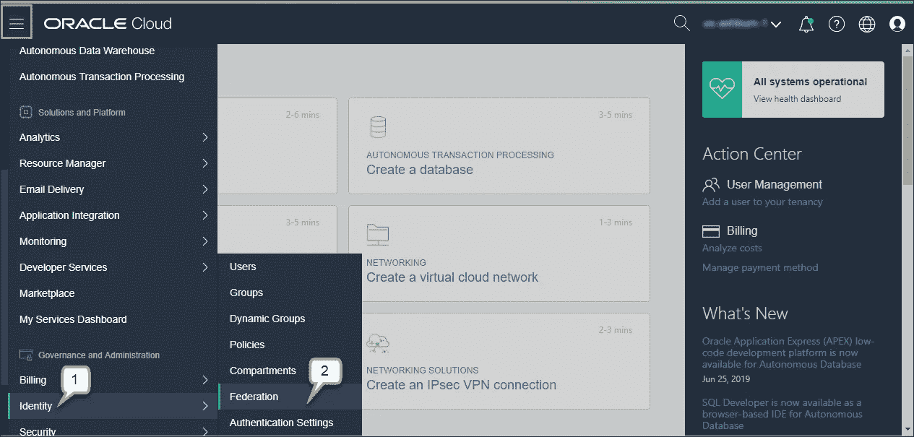

Figure 1\. OCI Management Console

**第二步:**在**联盟**页面中，找到关于 OCI 联盟元数据的文字说明，点击**下载本文档**链接，在浏览器中打开内容，继续保存为 XML 文档，例如 **oci-metadata.xml** 。

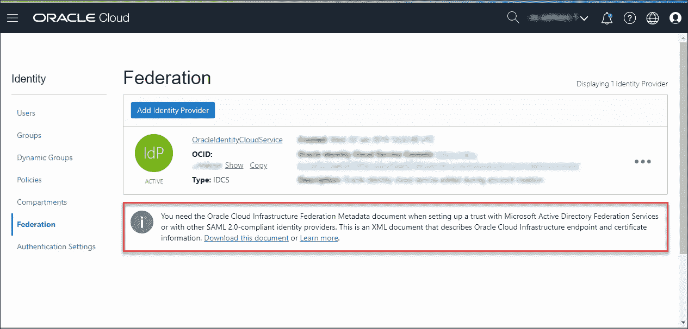

Figure 2\. OCI Federation Page

**步骤 3:** 使用具有管理员权限的用户登录 OAM 控制台。点击**配置**，显示**发射台**页面，在**设置**磁贴下，点击**查看- >联盟**。在**联盟设置**页面点击**导出 SAML 2.0 元数据**下载 OAM 元数据文件，重命名为 **oam-metadata.xml** 。编辑文件并删除部分**<MD:role descriptor…</MD:role descriptor>**。

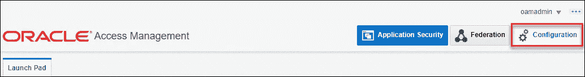

Figure 3\. Accesing Configuration Launch Pad

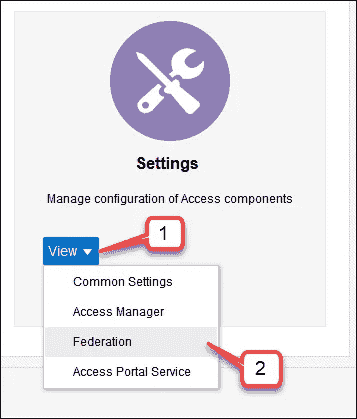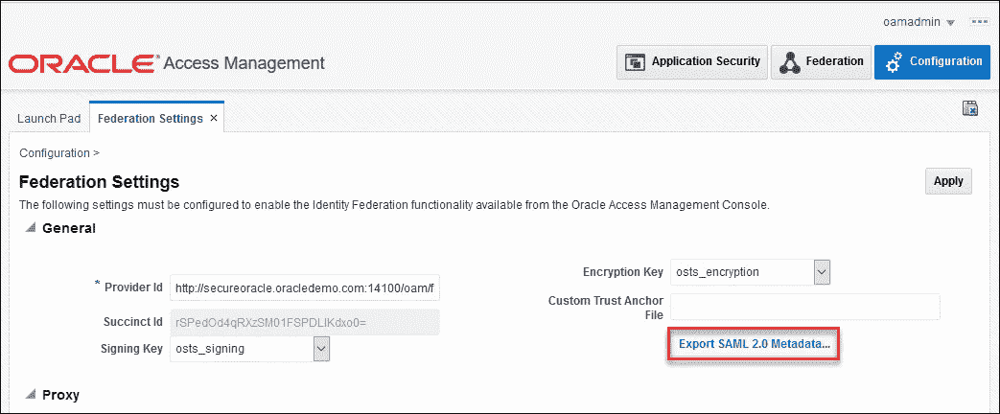

Figures 4 and 5\. Accesing Federation Settings Page

**步骤 4:** 在 OAM 控制台中点击**联盟**，显示**发射台**页面，在**联盟**磁贴下，点击 **+ - >创建服务提供商合作伙伴**，显示服务提供商页面，继续将 OCI 租赁定义为服务提供商，例如:

*   输入 **MyOCI** 作为名称
*   点击标签**元数据文件**旁边的**浏览**按钮，继续选择 **oci-metadata.xml** 文件。
*   对于 NameID 格式，选择**持久**
*   对于 NameID 值，选择**用户 ID 存储属性**，并输入**邮件**
*   对于属性配置文件，确认默认值**sp-属性配置文件**
*   点击**保存**保存更改

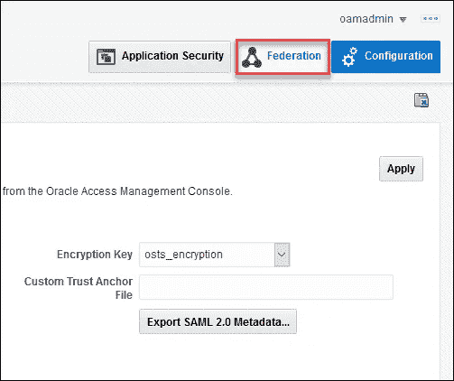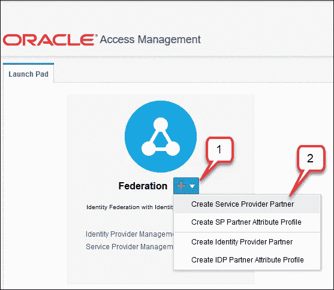

Figures 6 and 7\. Accesing Federation Launch Pad and Create Service Provider Partner Page

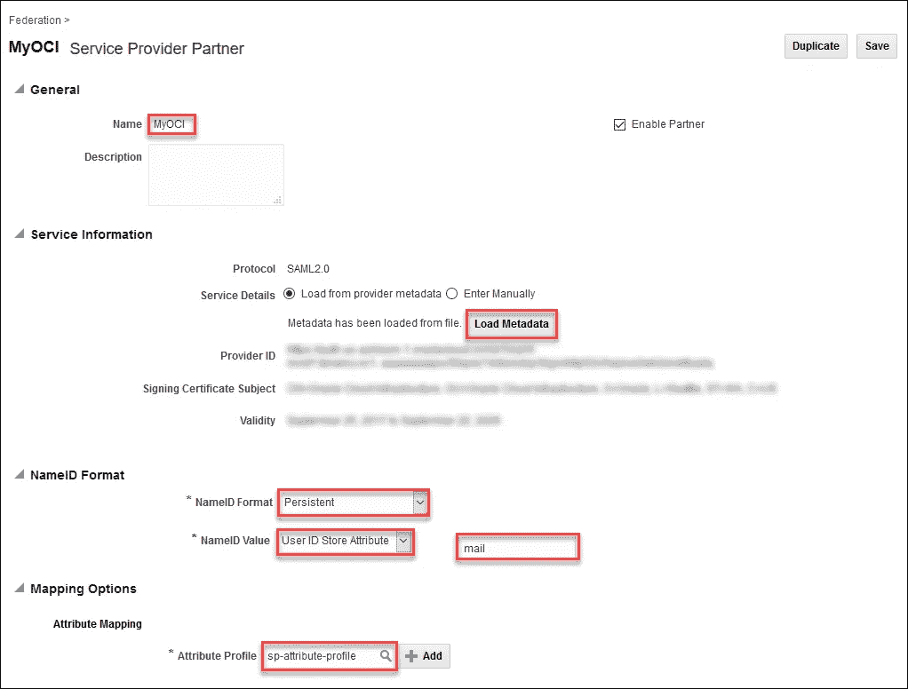

Figure 8\. Defining OCI Tenancy as Service Provider Partner

**步骤 5:** 返回**发射台**页面，在**联盟**板块下，点击**身份提供商管理**链接。在**身份提供者管理**页面中，点击**服务提供者属性配置文件**选项卡，然后点击**搜索**按钮。

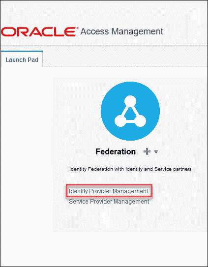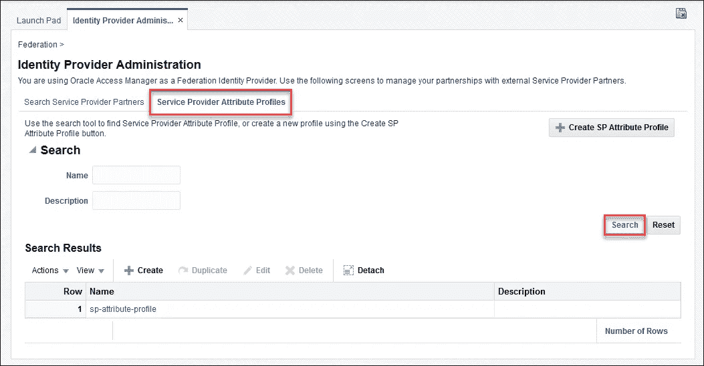

Figures 9 and 10\. Accessing Service Provider Attribute Profiles Page

**第六步:**从搜索结果中点击**sp-属性-档案**链接。在 **SP 属性配置文件**页面中，点击**创建**按钮，继续添加属性映射，例如:

*   在**消息属性名**中，输入**https://auth.oraclecloud.com/saml/claims/groupName**
*   在**值**中，选择**用户**，然后选择**组**。OAM 会自动将这个选择转换成一个表达式值，比如 **$users.groups**
*   点击**确定**按钮确认，然后点击**保存**保存更改

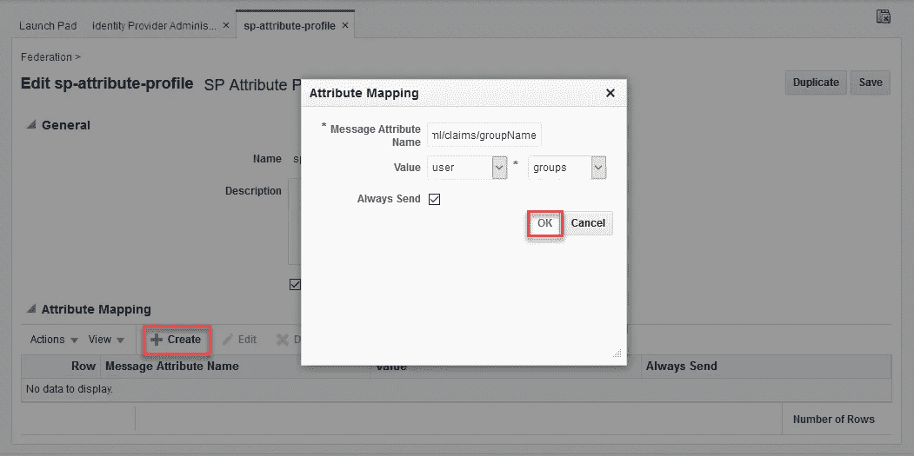

Figure 11\. Creating Attribute Mapping

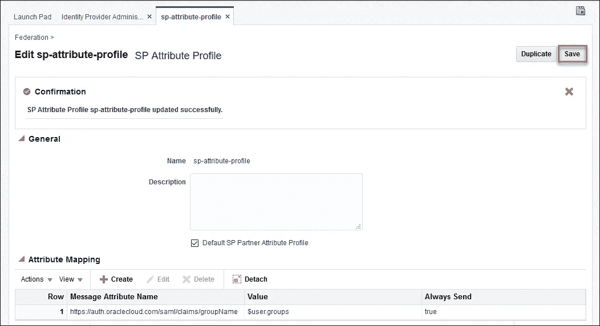

Figure 12\. Saving Attribute Mapping

**步骤 7:** 从 OAM 控制台注销，然后重新启动 OAM 服务器。

**第 8 步:**使用具有管理员权限的用户登录 OCI 控制台。点击位于左上角的抽屉图标，打开**治理和管理**下的侧栏菜单，选择**身份- >联盟**。在**联盟**页面中，单击**添加身份提供者**按钮定义新的身份提供者。

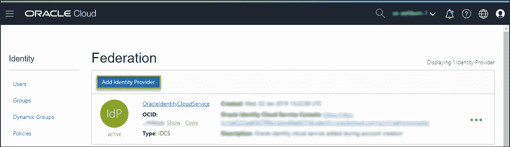

Figure 13\. Federation Page

**步骤 9:** 在**添加身份联盟**页面中，输入将 OAM 定义为身份提供者所需的信息，例如:

*   对于**名称**，输入 **MyOAM**
*   对于**描述**，输入**我的 OAM IdP**
*   对于**类型**，选择**微软活动目录联合服务(ADFS)或 SAML 2.0 兼容身份提供商**
*   在 **XML** 部分，点击**浏览**按钮，继续选择 **oam-metadata.xml** 文件。
*   点击**继续**按钮。

**步骤 10:** 在**映射**部分，继续将现有 OAM 组映射到现有 OCI 组，例如:

*   对于**身份提供者组**，输入 **OAMAdministrators**
*   对于 **OCI 组**，选择**管理员**
*   点击**继续**按钮保存更改。

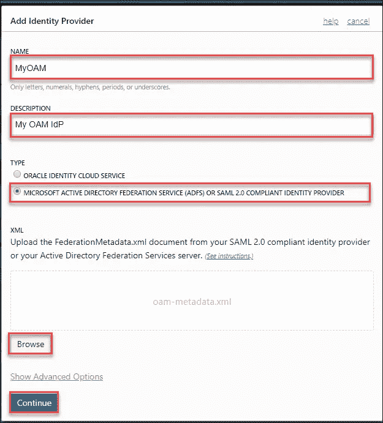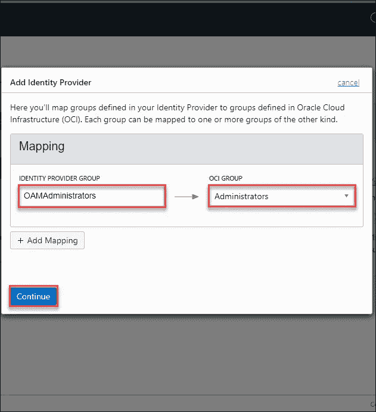

Figure 14 and 15\. Defining OAM as Identity Provider

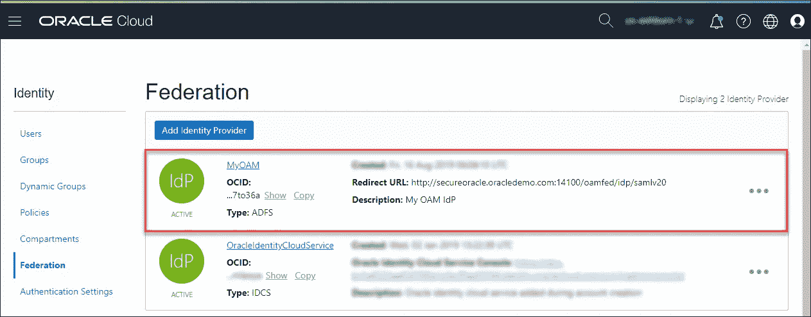

Figure 16\. OAM as Identity Provider

## 测试集成

配置完成后，我们可以通过执行以下步骤来测试集成。

**步骤 1** :从 OCI 和 OAM 控制台注销，然后继续登录 OCI 控制台。在 OCI **登录**页面中，在**单点登录(SSO)** 部分下，选择 **myoam** 作为身份提供者，并点击**继续**按钮。

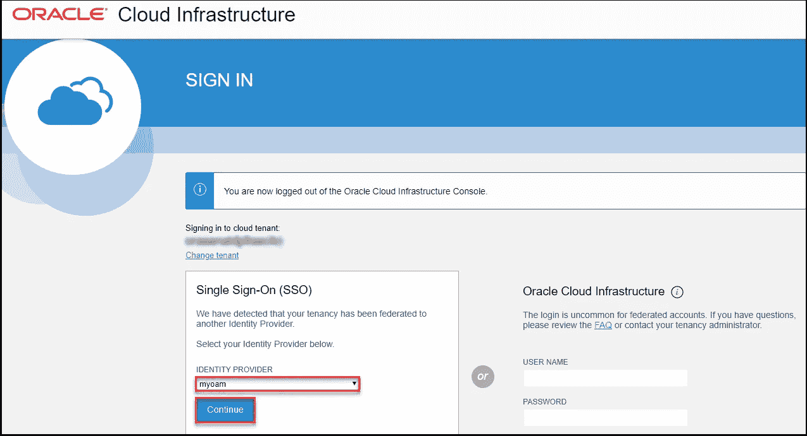

Figure 17\. OCI Sign-In Page

**第 2 步:**您将被重定向到 OAM 登录页面，继续输入 OAM 用户凭证并单击**登录**按钮。**注意:**所选用户必须属于一个或多个映射到 OCI 组的 OAM 组。

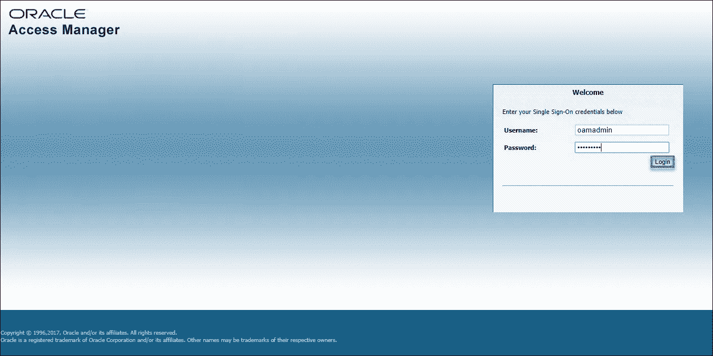

Figure 18\. OAM Login Page

**步骤 3:** 通过身份验证后，您将被重定向到 OCI 控制台。根据 OCI 组成员身份，继续验证您的用户名和权限。该图显示了用户 **oamadmin** ，它是 OAM 组 **OAMAdministrators** 的成员，映射到 OCI 组 **Administrators** ，因此在 OCI 租赁中具有管理特权。

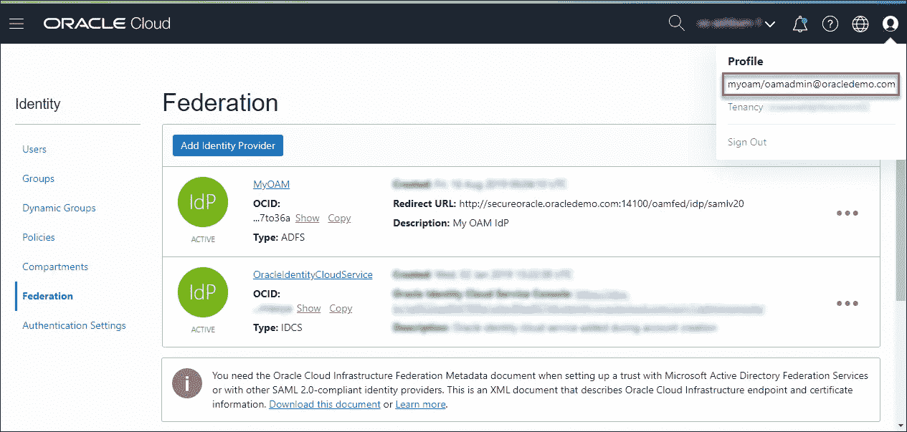

Figure 19\. OCI Console

## 结论

OCI 继续执行积极的路线图，提供新的功能和服务，支持 Oracle 应用程序，并结合 Oracle 数据库云服务器和 Oracle 自治数据库提供裸机服务器性能。

## 关于作者

Ricardo Gutierrez 是 Oracle 的首席安全架构师，擅长云基础设施、混合和本地解决方案、身份和访问管理、数据库和应用程序安全。在业余时间，Ricardo 使用新技术进行研究和开发，并且是[电子商务套件声明者(EBS Asserter)](https://www.oracle.com/webfolder/technetwork/tutorials/obe/cloud/idcs/ebs_asserter_obe/ebs-asserter.html) 的创建者，这是一个与 Oracle Identity Cloud Service 一起分发的单点登录应用程序。