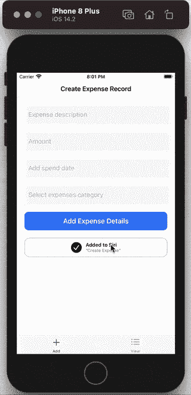

# 在 iOS 14 中使用自定义意图和界面集成 Siri 快捷方式

> 原文：<https://medium.com/globant/integrating-siri-shortcuts-using-custom-intent-and-interface-in-ios-14-d3a84a933103?source=collection_archive---------0----------------------->

Handling Siri shortcuts — iOS 14.2

快捷方式允许用户从 Spotlight 搜索、锁屏和 Siri 手表界面访问应用程序的功能。可以使用快捷方式应用程序自动执行例行程序。快捷方式可让您通过提供应用程序操作的快捷方式，将应用程序的主要功能展示给 Siri。

在本文中，我们将创建自定义意图，并为 iOS 添加意图和 IntentsUI 扩展。我们将为 Siri 响应定制用户界面。

# 创建快捷方式的步骤

1.  **定义快捷方式:**定义应用程序中的哪些功能将被公开，以便 Siri 了解应用程序中的功能。
2.  **捐赠快捷方式:**这有助于 Siri 理解何时建议特定的快捷方式。当执行特定操作时，为应用程序中的特定功能提供快捷方式。
3.  **处理快捷方式:**实现/定义快捷方式的处理。

让我们看看如何在演示项目中实现这些步骤。

首先，创建一个包含框架和应用目标的项目。所有共享代码，如意图定义文件、符合意图处理协议的类、数据管理器等，都可以添加到共享框架中。

要在应用程序中添加对快捷方式的支持，应该启用 Siri 功能。对于包含 Intents 应用程序扩展的 iOS 或 watchOS 应用程序，App Store 需要此权限来处理除快捷方式请求之外的任何 Siri 请求。

# 定义快捷方式

意图可用于提供关于可在应用中执行的动作的细节。如果除了可用的系统意图之外，还要提供定制的功能，我们可以创建定制的意图。我们将从创建意图定义文件开始。

创建新文件并选择以下模板:

Create an Intent Definition file

*   单击下面的“+”符号，在意图定义文件中添加自定义意图。使用动词名词惯例来命名你的意图。
*   意图类别应该与处理程序提供的功能相匹配。这将定义在处理意图时作为响应显示的默认 Siri 对话框。
*   通过单击参数字段中的加号按钮创建一个新参数。可以为传递参数创建自定义类型。可以为每个参数解析结果定制 Siri 对话框。

*   可以从以下部分设置自定义响应消息。意向反应是意向行动的结果。在*响应模板*中定义成功和失败响应。可以添加属性来将数据传递到 Siri 对话框或快捷方式输出中。在 HomePod、CarPlay 和 AirPods 上只使用语音对话。

Xcode 自动为自定义意图创建以下响应代码:*未指定、就绪、继续应用、进行中、成功、失败和失败请求鼓掌*。

既然我们已经为定制意图和响应消息定义了所有必需的细节，让我们理解创建快捷方式的下一步。

# **捐赠快捷方式**

Siri 通过您的应用程序向 Siri 捐款来了解您的应用程序可用的快捷方式。然后，可以在 Spotlight 搜索、锁屏和 Siri 手表界面中向用户建议这些快捷方式。

*   可以在交互中使用**类型的交互对象来提供快捷方式。意图对象可以被设置为交互对象。**
*   使用 INIntent 的**suggestedInvocationPhrase**属性，我们可以为短语提供默认值。使用以下代码片段，可以通过交互来提供快捷方式:

*   我们可以提供功能，使用户能够使用协议**INUIAddVoiceShortcutButtonDelegate、INUIEditVoiceShortcutViewControllerDelegate**和**INUIAddVoiceShortcutViewControllerDelegate**从应用程序本身添加/编辑/删除快捷方式。
*   从 IntentsUI 添加**inuiaddvoiceshortcut button**并将 delegate 设置为 ShortcutsManager 的对象。

Add Shortcut from the app

Delete shortcut from the app

# 处理快捷方式

添加 intents 应用程序扩展。选择“文件”>“新建”>“目标”,然后从 iOS 的“应用程序扩展”组中选择“意图扩展”。

在项目编辑器的扩展或 UI 扩展目标的支持的意图部分添加扩展支持的意图。这将在 Info.plist 中为适当的目标添加意图。选择意图所需的适当身份验证。该值应该与在意图定义文件中为特定意图指定的身份验证相同。

SiriKit 使用您的分机的 Info.plist 文件中的信息来确定将哪些意图路由到您的分机。

当收到用户请求时，SiriKit 会加载 intents 应用程序扩展，并创建一个 **INExtension** 子类的对象。扩展返回意图的处理程序。

对于每个意图对象，创建一个意图处理协议。

将意图定义文件添加到将访问意图的所有目标中。将为框架生成公共意图类，对于其他目标，选择“不生成类”。

Intent definition target membership

一个意向按以下 3 个步骤处理:
1 .**解析**:解析每个参数，如果收到所有参数，从 SiriKit 澄清。一旦解析了参数，就验证该值，并返回成功或失败的结果。
2。**确认**:一旦所有参数都通过验证，返回意向响应。意向可以通过打开 app 或者意向扩展来处理。
3。**处理:**在这个阶段，将处理意图，并将响应对象发送给 SiriKit。

意图处理协议还包含一种在快捷方式应用程序中配置意图参数时提供参数选项的方法。这些自定义参数类型被添加到意图定义文件中。对于示例项目中类型为 *ExpenseResponse* 的 *expense* 参数，提供选项方法返回一个选项集合。为输入的每个搜索项调用此方法。一般来说，下面代码片段中的这个功能应该适用于大型列表，但它只是作为参考添加的。以下代码片段实现了所讨论的句柄意图步骤的方法:

现在所有的意图处理代码都完成了，我们需要返回类的对象来确认*意图处理协议。*

创建 Intents 扩展时，还会创建***intent handler . swift**文件。该文件包含一个符合**扩展协议的类。**从**处理程序**方法返回正确的处理程序对象，如下所示:*

*当应用程序必须启动来处理意图时，可以实现与用户活动相关的 UISceneDelegate 方法。*

*创建**intens UI 应用程序扩展**是可选的。*

*要设置每个意图 UI 应用程序扩展，您必须向 Xcode 项目添加一个自定义目标，并在项目编辑器的 UI 扩展目标的“支持的意图”部分添加扩展支持的意图。这将在 Info.plist 中为适当的目标添加意图。*

*在向用户显示界面之前，Siri 构建了一个代表它想要显示的数据的 **INParameter** 对象列表。稍后，SiriKit 会创建一个或多个视图控制器实例，并调用 **configureView** 方法。按如下方式配置自定义界面:*

*完成实现后，创建并测试快捷方式。
感谢阅读！*

# *参考*

*   *[https://developer . apple . com/documentation/ui kit/uiscenedelegate](https://developer.apple.com/documentation/uikit/uiscenedelegate)*
*   *[https://developer . apple . com/documentation/sirikit/soup _ chef _ accelerating _ app _ interactions _ with _ shortcut s](https://developer.apple.com/documentation/sirikit/soup_chef_accelerating_app_interactions_with_shortcuts)*