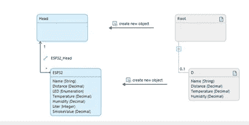

# 将 IBM Watson IOT 平台与 Mendix 集成

> 原文：<https://medium.com/mendix/integrating-the-ibm-watson-iot-platform-with-mendix-622cc71f9766?source=collection_archive---------2----------------------->


Integrating the IBM Watson IOT platform with Mendix

# 物联网(IoT)为公司提供了无数的可能性，以进行更智能的运营。将嵌入了电子设备、软件和传感器的日常用品连接到互联网，使它们能够收集和交换数据。连接的设备/资产实际上配备了传感器，将数据传输到云。潜在的革命性想法并不缺乏，但仍然很少有物联网例子可以从中汲取灵感。

Bluemix 是 IBM Watson 的云平台，支持许多产品和服务，包括计算基础设施和服务、物联网、数据分析、移动应用服务、存储等。它兼容 MQTT 协议、HTTP 和 REST APIs。

在这篇博客中，让我们看看如何设置一个 IBM Watson 帐户，并在您的 Mendix 应用程序中接收来自 IBM Watson 的数据。在这篇博客中，我将向你解释如何用 IBM Watson 连接水位传感器。

## 为什么要将水位传感器连接到互联网？

我们需要将水位传感器连接到互联网，因为我们有一个用例来监控家中的水箱，以确保我们知道自己的用水量。由于我们不知道水箱什么时候会空，在这个场景中，我们将连接一个传感器来检测水，并在我们的移动设备上显示水箱的数据。

## **实现**的步骤

**第一步**:你需要有一个传感器在手，用来测试和识别来自传感器的**设备 ID、设备类型和认证令牌**。

例如:

```
Device Type: ‘WaterLevel’Device ID: **00:00:5e:00:53:af**Authentication Token: 123456789
```

**第二步**:创建 IBM Watson 账户进入[https://cloud.ibm.com/login](https://cloud.ibm.com/login)&点击 ***创建账户*** 如下图，


**步骤 3** :要使用 IBM 平台上的任何服务，我们需要一个资源列表。从 ***目录*** 部分或右上角 ***创建资源列表*** 按钮创建一个物联网平台资源，选择 ***物联网平台。***


> 注意:记下您的位置名称(OrgID)，将来会用到


**第四步**:从**资源列表→服务和软件- >中选择物联网平台资源，点击启动**


**步骤 5** :选择组织 id，输入用户名(IBMid)和密码，启动我们的物联网平台。您现在应该会看到我们物联网平台的仪表盘，如下图所示。


**步骤 6:** 要启用 Mendix、sensors 和 IBM Watson 之间的通信，请进入安全选项卡，将安全级别设置为 ***TLS 可选*** 。


**第 7 步:**现在，我们需要一个可以在沃森 IOT 平台中设置的设备，为此**单击“添加设备”。**


**步骤 7** :在**身份向导中输入设备类型和设备 ID，这是您的物联网设备的信息。**


**步骤 8** :在设备信息中，会有一些预填的数据，**保持原样，点击下一步**。在安全页面&上输入设备的设备**认证令牌** (8 位数长)点击下一步。


**第 9 步**:点击 Finish 完成设备设置，记下你所有的设备凭证。


单击“完成”后将显示设备凭据，记下所有值。

**步骤 10:** 打开你的传感器，让它连接 Wi-Fi，发送数据到你的 IBM Watson 账户。您可以看到数据作为一个事件传入 IBM Watson。


**步骤 11** : **点击导航中的从应用程序生成 API 密钥**。


**第 12 步**:描述您的选择，然后点击下一步。


**第十三步:**在权限页签中，选择**标准应用**，点击**生成 API**


**步骤 14** :记下您的 API 密钥和认证令牌**，这是来自 Mendix 中 MQTT** 客户端的用户名和密码

例如:

```
API Key: a-xxxx-xxxxxAuthentication Token: xxxxxxxxxxxx
```


## 通过 IBM Watson IOT 平台订阅您的 Mendix 应用程序(订阅活动)

**步骤 1:** 从 Mendix 市场下载 MQTT 客户端。

> 【https://marketplace.mendix.com/link/component/3066 

**步骤 2:** 我们需要通过 IBM Watson 订阅设备，因此创建一个微流并添加 Mqtt 订阅活动- >将这个微流连接到主页上的一个按钮。

按如下方式配置 MQTT 订阅活动:

```
Broker Host: ‘messaging.internetofthings.ibmcloud.com’Broker port : 1883Broker Organization: You’re Organization IDTime Out: 6000Username: a-xxxxx-xxxxxPassword: xxxxxxxxxxxxTopic Name: ‘iot-2/type/” DeviceType”/id/”DeviceID”/evt/status1/fmt/json’Qos : At_Least_Once_1
```


**第三步:** **在消息微流上创建**:用映射活动创建**导入，并调用导入映射**


**步骤 4** :创建 JSON 结构，这是我们从 IBM Watson 收到的 JSON 格式。

> 将您的 Mendix 应用程序的 REST 发布日志级别设置为 trace，以便查看传入的消息及其数据。


**步骤 5:** 使用我们从 IBM Watson 收到的 JSON 结构创建**导入映射**。



第 6 步:单击 subscribe 按钮，这样它将连接到 IBM Watson 并开始接收数据。您可以在日志中看到结果。


**第 6 步:**使用图形显示 Mendix 中的数据，但是您可能希望将数据可视化，这里是我的应用程序的一些截图。


最后，我们能够看到水箱水位的实况转播！

## 结论

Mendix 允许我们连接来自 **AWS IOT 平台、IBM Watson、物联网等的物联网设备**。使用传感器传输数据，每个对象都可以连接到互联网，Mendix 提供了更多功能，以更少的步骤连接设备，这使得我们作为开发人员的生活更加轻松。

下一篇文章再见！

## 阅读更多

 [## IBM Watson 连接器

### 描述如何在 Mendix 中使用连接器来简化各种 IBM Watson 服务的使用

docs.mendix.com](https://docs.mendix.com/appstore/connectors/ibm-watson-connector/)  [## MQTT

### 描述 MQTT 连接器的配置和用法，该连接器可从 Mendix 市场获得。

docs.mendix.com](https://docs.mendix.com/appstore/connectors/mqtt/) [](https://mqtt.org/) [## MQTT——物联网消息标准

### MQTT 客户机非常小，需要最少的资源，因此可以在小型微控制器上使用。MQTT 消息头…

mqtt.org](https://mqtt.org/) 

*来自发布者-*

*如果你喜欢这篇文章，你可以在我们的* [*中页*](https://medium.com/mendix) *找到更多喜欢的。对于精彩的视频和直播会话，您可以前往*[*MxLive*](https://www.mendix.com/live/)*或我们的社区*[*Youtube PAG*](https://www.youtube.com/c/MendixCommunity/community)*e .*

*希望入门的创客，可以注册一个* [*免费账号*](https://signup.mendix.com/link/signup/?source=direct) *，通过我们的* [*学苑*](https://academy.mendix.com/link/home) *获得即时学习。*

有兴趣更多地参与我们的社区吗？加入我们的 [*Slack 社区频道*](https://join.slack.com/t/mendixcommunity/shared_invite/zt-hwhwkcxu-~59ywyjqHlUHXmrw5heqpQ) *。*