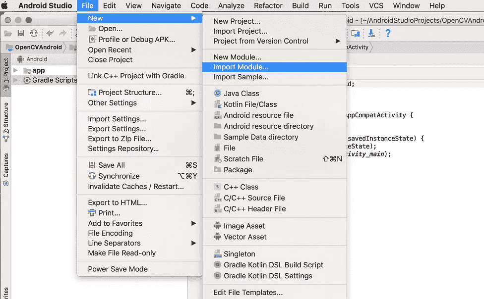
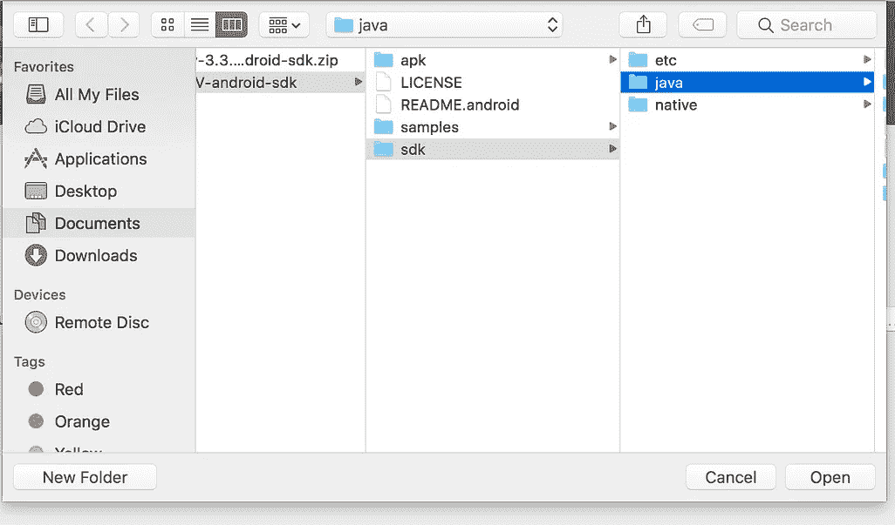
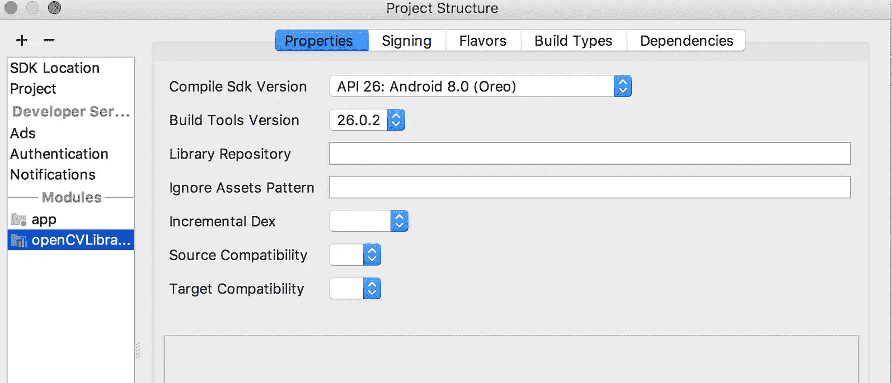
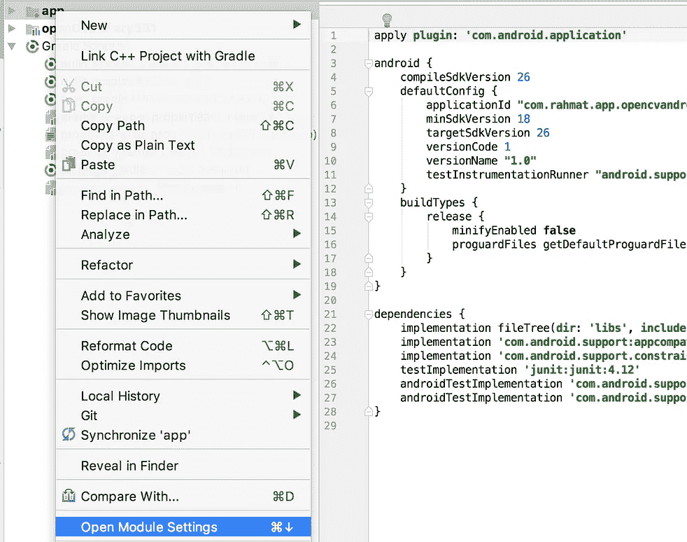
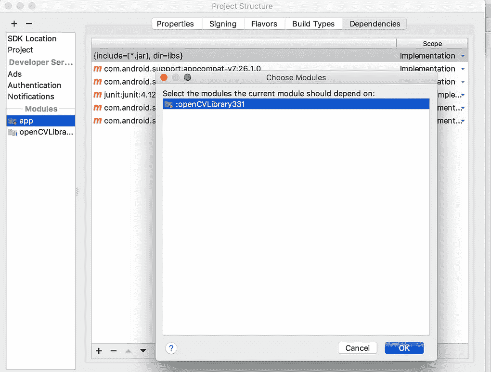
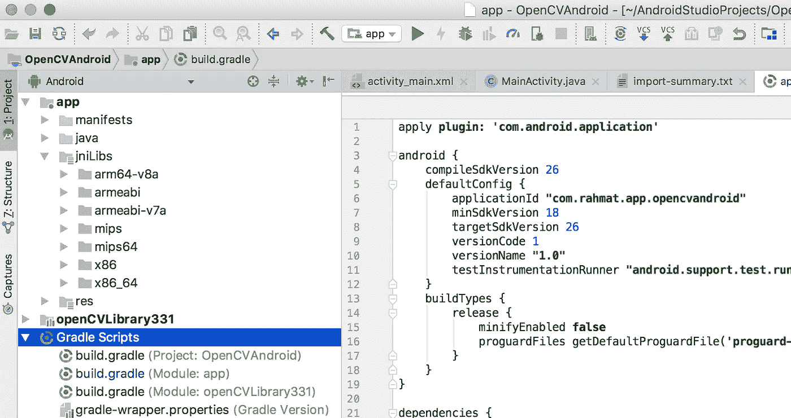

# 将您的 Android 应用程序与 OpenCV 库集成

> 原文：<https://medium.easyread.co/integrating-your-android-app-with-opencv-library-266b2ea913d3?source=collection_archive---------2----------------------->


source : [https://unsplash.com/photos/QRawWgV6gmo](https://unsplash.com/photos/QRawWgV6gmo)

我一直在为我的小型论文项目搜索一些计算机视觉库，我的讲师建议我使用 OpenCV 库，我认为这是非常强大的计算机视觉开源库。

基本上 OpenCV 是一个开源的计算机视觉和机器学习软件库。根据文档，这个库中有超过 2500 个优化算法。

这些算法可用于检测和识别人脸、识别物体、对视频中的人类动作进行分类、跟踪摄像机运动、跟踪运动物体、提取物体的 3D 模型、从立体摄像机生成 3D 点云、将图像拼接在一起以生成整个场景的高分辨率图像、从图像数据库中查找相似图像等等。你可以在这里了解更多关于 openCV 的信息

由于我需要某种图像质量增强算法和图像匹配算法，OpenCV 是一个很好的选择。

我早些时候告诉你的项目基本上是一个移动应用程序，这是 android 应用程序，经过研究，遵循一些教程和试错的东西。我已经设法将它与我的 android 项目整合在一起。

我认为为这个集成写一个教程会很棒，它可能会在将来帮助像我这样的人:)

ps:下面的教程将向您展示如何在原生 Android 项目中集成 OpenCV，这意味着在 Android Studio(版本 3.0.0)中集成 OpenCV

> pps:如果你懒得看这个教程，我已经在这里提供了一些样本。享受的同时别忘了给个星:)！

1.  **下载 Android 版 OpenCV 库**

进入 OpenCV 页面，下载 android 最新的 sdk(软件开发工具包)。到目前为止的最新版本(2017 年 12 月 3 日)是 3.3.1，你可以跟随这个[链接](https://opencv.org/releases.html)点击 android pack，完成后解压文件。

**2。在 Android Studio 中创建新项目**

在你的 android 工作室中创建一个新项目，你可以简单地命名为 OpenCV Android 或任何你想要的名字。在 Android Studio 完成设置您的项目后，现在是时候将 OpenCV 库集成到您的 Android 应用程序中了，方法是单击文件->新建->导入模块并打开您下载的解压缩文件夹，在这里您会看到 sdk 文件夹，打开它并选择 java。选择后，只需点击下一步并完成。



**3。导入**后修复常见错误

导入模块后，您很可能会遇到一个错误(就像我经历的一样)，但是请记住，这个错误只会在您第一次导入 OpenCV sdk 时出现。所以当你有另一个使用 openCV 的项目时，你将不再面临同样的错误。

常见的错误会出现是因为 **build.gradle** 文件，当你第一次使用 openCV 时它会改变:

*   编译版本
*   构建工具版本
*   minSdkVersion
*   目标版本

你可以简单地将这四个东西更新到你最新的 android sdk 中，这样就可以修复错误了。如果你发现除了上述错误之外的其他错误，也许你需要安装一些东西，但不要害怕，只要确保你的笔记本电脑/PC 连接到互联网，它会自动安装所需的东西。您还需要将 OpenCV 模块设置更新为最新的 compiledSdkVersion，如下所示



update to latest version

**4。添加模块依赖**

现在，我们需要为 openCV 添加模块依赖关系，这很简单，只需右键单击您的应用程序目录，然后单击并转到依赖关系选项卡，单击加号图标(+)并单击模块依赖关系，然后选择 openCV，然后单击确定。



add module dependency

**4。复制 Libs 文件夹**

只需一步，你就可以用 OpenCV 构建你的 android 应用了。打开 OpenCV 的解压文件夹，导航到 sdk/native，复制 libs 文件夹并粘贴到 src/main 下的 android 项目中，复制后重命名为 jniLibs。这是你的项目目录复制后的样子。



project structure

完成这些步骤后，您就可以使用 openCV 了，只需在活动的 onCreate 中写下这一行。

```
System.loadLibrary("opencv_java3");
```

您现在可以使用强大的 OpenCV 库提供的计算机视觉算法:)

接下来呢？这取决于你，也许你可以尝试简单的图像处理，如将 RGB 图像转换成灰度或边缘检测，就像这个 [one](https://github.com/muhrahmatullah/OpenCV-Android-Base) :)。

敬请期待，我将在 android 开发中撰写更多教程:)。

*Artikel thi di tulis oleh*[*Muhammad Rahmatullah*](https://medium.com/u/665385af59ff?source=post_page-----266b2ea913d3--------------------------------)*beliau sering menikel Meng ai Android and 人工智能。我的个人资料更新了一个新的版本。*

*如果这是一件艺术品，他们就可以购买。*