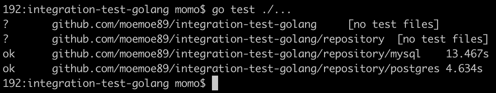
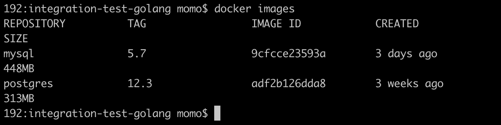

# 使用 Dockertest 在 Golang 中进行集成测试(数据库)

> 原文：<https://medium.easyread.co/integration-test-database-in-golang-using-dockertest-59ed3b35240e?source=collection_archive---------0----------------------->

## 我们如何使用 Dockertest 在 Golang 中进行集成测试


Photo by [pixabay.com](https://pixabay.com/illustrations/feedback-satisfaction-employee-3240007/)

大家好！又是我，还是想分享一些关于软件工程领域技术相关的经验、思考或者看法。今天，我要和你分享的话题是关于我在 Golang 中使用 Dockertest 进行集成测试的经历。这个集成测试将集中在使用数据库的代码上。

在继续之前，集成测试的定义是什么？在我看来，根据我的经验，如果单元测试将在模拟数据上测试我们的代码库，那么集成测试将集中在使用真实数据上。事实上，真正的数据不仅仅是关于数据库，有时我们可以为我们的应用程序提供外部服务。但是，我们的应用程序通常会有一个数据库，那么在本文中，我们将重点关注与数据库的集成测试。

工程师通常是如何解决这种集成测试的？根据我的经验，通常，他们会这样做:

*   在虚拟机或服务器上设置真实数据库测试
*   使用 Docker 这样的容器设置数据库测试

我认为第 2 点对于现在来说已经足够简单了，但是我意识到我们可以在 Go 中使用 Dockertest 使它更简单。

## 什么是 Dockertest？为什么呢？

基于他们在[https://github.com/ory/dockertest](https://github.com/ory/dockertest)的项目，实际上 Dockertest 将拥有与第 2 点相同的机制。但是 Dockertest 库提供了易于使用的命令来旋转 Docker 容器并在测试中使用它们，正如他们所说的。然后，我们不需要通过 Dockerfile 或 docker-compose 手动设置 docker。

还是不知道吗？让我们试着写测试！

Dockertest 支持多种数据库，如 MySQL、PostgreSQL、MongoDB、Redis、Cassandra 等。但是，在本文中，我们将尝试使用 PostgreSQL。首先，像这样创建项目结构:

```
*+ your_gopath/
|
+--+ src/github.com/moemoe89
|  |
|  +--+ integration-test-golang/
|     |
|     +--+ main.go
|        + repository/
|        |
|        +--+ repository.go
|        |
|        +--+ mysql
|        |  |
|        |  +--+ mysql.go
|        |     + mysql_test.go
|        |
|        +--+ postgres
|           |
|           +--+ postgres.go
|              + postgres_test.go
|
+--+ bin/
|  |
|  +-- ... executable file
|
+--+ pkg/
   |
   +-- ... all dependency_library required*
```

我们需要制作 3 个文件:`**repository**`目录下的`**repository.go**`和`**repository/postgres**`目录下的`**postgres.go**`和`**postgres_test.go**`

`**repository.go**`只包含数据模型的实现和结构的接口。

接下来，`**postgres.go**`会有`**repository**`接口的实现，包括迁移和 CRUD 功能。如果您已经熟悉了干净架构的概念和依赖注入，那么代码对您来说就很容易了。

最后，测试文件`**postgres_test.go**`将使用 Dockertest 测试存储库代码。我将对这一部分进行更多的解释，因为我们将在这个实现中使用 Dockertest 代码。

首先，我们需要创建一个池。如果要使用默认值，请将 string 参数留空。

```
pool, err := dockertest.NewPool(**""**)
**if** err != nil {
   log.Fatalf(**"Could not connect to docker: %s"**, err)
}
```

其次，我们将在这里开始运行容器。这就是为什么我们应该定义像图像库、标签、环境变量以及暴露端口这样的选项。

```
opts := dockertest.RunOptions{
   Repository: **"postgres"**,
   Tag:        **"12.3"**,
   Env: []string{
      **"POSTGRES_USER="** + user,
      **"POSTGRES_PASSWORD="** + password,
      **"POSTGRES_DB="** + db,
   },
   ExposedPorts: []string{**"5432"**},
   PortBindings: **map**[docker.Port][]docker.PortBinding{
      **"5432"**: {
         {HostIP: **"0.0.0.0"**, HostPort: port},
      },
   },
}resource, err := pool.RunWithOptions(&opts)
**if** err != nil {
   log.Fatalf(**"Could not start resource: %s"**, err.Error())
}
```

接下来，我们需要为包装在池重试中的 Postgres db 模型创建一个存储库接口的表示。为什么我们需要这个机制？因为有时候我们需要等待 Docker 准备好服务 db 连接。

```
**if** err = pool.Retry(**func**() error {
   repo, err = postgres.NewRepository(dialect, dsn, idleConn, maxConn)
   **return** err
}); err != nil {
   log.Fatalf(**"Could not connect to docker: %s"**, err.Error())
}
```

最后一步是净化。清除将从 docker 中删除 docker 容器和链接的卷。

```
**if** err := pool.Purge(resource); err != nil {
   log.Fatalf(**"Could not purge resource: %s"**, err)
}
```

好吧！是时候进行测试了。使用`**go test ./...**`执行测试用例。



Picture 1 Integration Test Result

很好，我们通过了测试！！在上面的图 1 中，我也写了 MySQL 测试。因此，当我们检查 docker 图像时，会显示 MySQL 和 Postgres 图像，如下图 2 所示。



Picture 2 Docker Images

有趣的是，我们可以在像 Travis CI 这样的 CI 服务上做到这一点。在我的存储库中，您可以看到我正在使用 Travis CI 来执行测试！

这是`**.travis.yml**`文件的例子。

如果您想查看这个测试的完整示例项目，您可以访问我在 GitHub 上的这个项目的资源库。也许我会添加另一个数据库，如果我有时间！

[](https://github.com/moemoe89/integration-test-golang) [## moe moe 89/集成测试-golang

### 通过在 GitHub 上创建帐户，为 moe moe 89/integration-test-golang 开发做出贡献。

github.com](https://github.com/moemoe89/integration-test-golang) 

希望你喜欢它，我很高兴如果这篇文章对你有用！测试愉快！

谢谢大家！