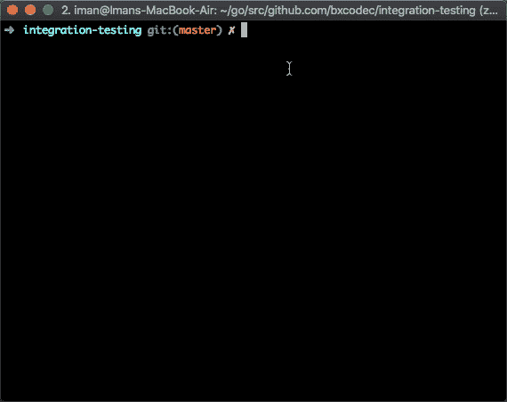
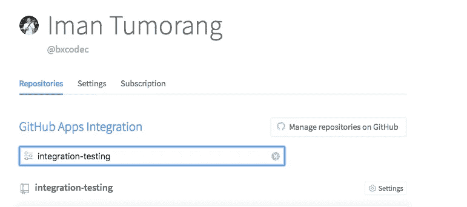

# Golang 数据库集成测试

> 原文：<https://medium.easyread.co/integration-test-with-database-in-golang-355dc123fdc9?source=collection_archive---------1----------------------->

## 在 Go 项目中使用真实的实时数据库/服务制作测试套件


Photo by [ShareGrid](https://unsplash.com/@sharegrid?utm_source=medium&utm_medium=referral) on [Unsplash](https://unsplash.com?utm_source=medium&utm_medium=referral)

软件测试是一个用来识别开发的计算机软件的正确性、完整性和质量的过程。软件测试有很多种。从单元测试、负载测试、压力测试、集成测试、UI 测试、e2e 测试等等开始。

每一种测试都有不同的目的，单元测试的目的是测试单一的功能单元。负载测试的目的是测量我们的系统在巨大的请求下有多可靠。集成测试的目的是确保我们的系统可以毫无问题地与外部服务集成。

## Go 中的集成测试

在本文中，除了集成测试之外，我不会告诉任何其他测试。正如我前面所说，这种测试是为了确保我们的系统可以毫无问题地集成到外部服务中。

因此，通过这个测试，我们希望在将我们的应用程序部署到服务器时，无论其环境如何(试运行、生产)，我们都可以避免任何不必要的错误或缺陷

所以，在移动 Golang 如何做之前，在我解释下面的许多事情之前，让我澄清几件事情。事实上，我不知道这种测试对很多人来说是否是好的，但这就是我们如何在我们的公司 [Kurio](https://kurio.co.id) (写这篇文章时我现在的公司)进行集成测试的。如果你有任何更好的想法，请在下面的评论中告诉我们。

## 准备工作和工具

在这篇文章中，为了清楚起见，我列出并准备了一些东西作为我的工具和助手。

*   安装了 Docker(特别是 docker-compose)
*   `github.com/stretchr/testify`用于测试包工具
*   `github.com/go-redis/redis`对于 Redis 驱动程序
*   `github.com/golang-migrate/migrate`办理移民包
*   go.mod 中列出的 etc

因此，我将使用两种数据库，我的简单应用程序将连接到这个数据库。我要解释的是，如何对我的两个数据库进行集成测试。

所以我会使用 MySQL 和 Redis，技术上我们也可以说 Redis 是一个数据库，但是 NoSQL，如果不是，我们就假设它是一个数据库

## 测试套

假设我有一个依赖于这两个数据库的项目，你可以在这里查看我的整个简单项目:[https://github.com/bxcodec/integration-testing](https://github.com/bxcodec/integration-testing)

如果你查看包`mysql`和`redis`，你会发现我的函数处理程序连接到每个数据库本身和它的文件测试。每个测试都是一个套件测试。将测试我的处理程序的捆绑测试。做一个套件测试很容易，多亏了`github.com/stretchr/testify`，我可以轻松地完成它。

比如你可以看看我的`redis`套餐。在`suite_test.go`,我定义了一个可被任何测试文件重用的可重分解结构。

```
package redis_testimport (
 "github.com/go-redis/redis"
 "github.com/stretchr/testify/suite"
)type RedisSuite struct {
 suite.Suite
 Host     string
 Password string
 DB       int
 Client   *redis.Client
}func (r *RedisSuite) SetupSuite() {
 r.Client = redis.NewClient(&redis.Options{
  Addr:     r.Host,
  Password: r.Password,
  DB:       r.DB,
 })
}func (r *RedisSuite) TearDownSuite() {
 r.Client.Close()
}
```

感谢`testify`包，它真的有助于创建一个套件测试。后来有了这个结构，我可以很容易地把它嵌入到我的测试文件中。你可以在我的`cache_test.go`看到

如果你看一下 cache_test.go 文件，它与普通的 file-test 有点不同。如果在正常的测试文件中，我们通常有这样的模式:

```
func TestXXXX (**t *testing.T**){} // with testing param
```

它在每次测试中都有测试参数。这是必须的。但是在这种情况下，因为我使用了`testify`包，所以测试方式有点不同。这真的很重要。要添加一个测试用例，我们必须遵循这个模式:

```
func (s TestSuite) TestXXXX(){} //without testing param
```

例如，在我的 redis 测试文件(cache_test.go)中，您可以看到我有两个测试，它们是:`TestSet`和`TestGet`。

## 运行测试

运行测试，它仍然和往常一样。用:`go test`运行。但是，因为这个测试需要实时数据库(MySQL 和 Redis)，所以首先，我们需要在我们的测试环境中运行一个实时数据库。

如果我们在本地运行测试，那么确保我们需要的数据库是活动的，并且可以从我们的本地 pc 访问。如果我们在 CI/CD 服务器上运行测试，那么我们必须提供一个实时数据库来完成测试。

幸运的是，在这个现代软件工程时代，有一个像 Docker 这样的工具存在。我们可以在 docker 容器中运行我们的数据库，所以我们不必为了测试需要而拥有一个真实的数据库。

为了简单起见，我将使用`docker-compose`功能，看看我的`docker-compose.yaml`。

只需使用命令`docker-compose up -d`，我就可以在 docker-container 中运行一个 2 数据库，这样我就可以用它直接测试了。

为了减轻我，我只是把它做成一个 Makefile。所以在运行我的集成测试之前，我需要我的数据库已经存在于容器中。

现在，为了进行测试，我只需要一个命令:

```
$ make integration-test //for integration test
$ make unittest // just for unit-testing
```



demo integration testing command with make file

# 与 CI/CD 一起使用(Travis)

每个配置项/CD 可能有不同功能。实际上，在我目前的公司( [Kurio](https://kurio.co.id) )我们使用 BuddyWorks 作为我们的 CI/CD 工具，但是如果我在这里使用 BuddyWorks，这看起来非常容易做到，因为，在 BuddyWorks 中，我们只是拖放没有脚本:d。

因此，为了使它更有趣，更“hacky”和“geeky ”,看起来非常终端为基础，因为许多人看到我们的工程师，只与终端和爱黑屏:D，所以我决定使用特拉维斯 CI/CD 这篇文章:D

## 设置 travis.yml 脚本

在继续之前，首先，我们需要将我们的项目添加到 travis-ci.com，并在那里启用 CI/CD 管道。

稍后，我们只需要在我们的项目中添加我们的`.travis.yml`。对于我的项目，你可以在我的资源库中查看`.travis.yml`的所有完整脚本。

然后，在 Travis 中启用它，



find and enable our repo in Travis

所有人都将在特拉维斯进行测试。

# 样板！！！

我们只是将基于数据库提供者和驱动库的测试套件样板文件添加到单独的包中:你可以在这里查看:[https://github.com/golangid/testada](https://github.com/golangid/testada)

要使用这个包，比如你想做一个 MySQL 集成测试，可以直接导入 testada/mysql 包。并直接嵌入 MySQL 套件结构。

```
import "github.com/golangid/testada/mysql"type youItemMysqlTestSuite struct {
 mysql.MysqlSuite **//embed from testada/mysql**
}func TestYourItemMysqlSuite(t *testing.T) {
 if testing.Short() {
  t.Skip("Skip you item mysql repository test")
 }
 dsn := os.Getenv("MYSQL_TEST_URL")
 if dsn == "" {
  dsn = "root:root-pass@tcp(localhost:3306)/testing?parseTime=1&loc=Asia%2FJakarta&charset=utf8mb4&collation=utf8mb4_unicode_ci"
 }
 yourItemSuite := &youItemMysqlTestSuite{
  MysqlSuite{
   DSN:                     dsn,
   MigrationLocationFolder: "migrations",
  },
 }suite.Run(t, yourItemSuite)
}
```

至少，这个包已经做了样板文件，比如设置迁移(如果使用迁移的话)或者处理测试套件设置，这将帮助您更快地工作。:D

此外，在像我们一样实现您自己的集成测试之前，需要理解`testify/suite`是如何工作的。

再一次，正如我在本文开始时所说的，这是我们如何在我们的公司 [Kurio](https://kurio.co.id) (写这篇文章时我现在的公司)进行集成测试的。如果你有任何更好的想法，如果你能在下面的评论中告诉我，我会很高兴的。但是如果你发现这非常有用，请与任何可能需要它的人分享。^_^