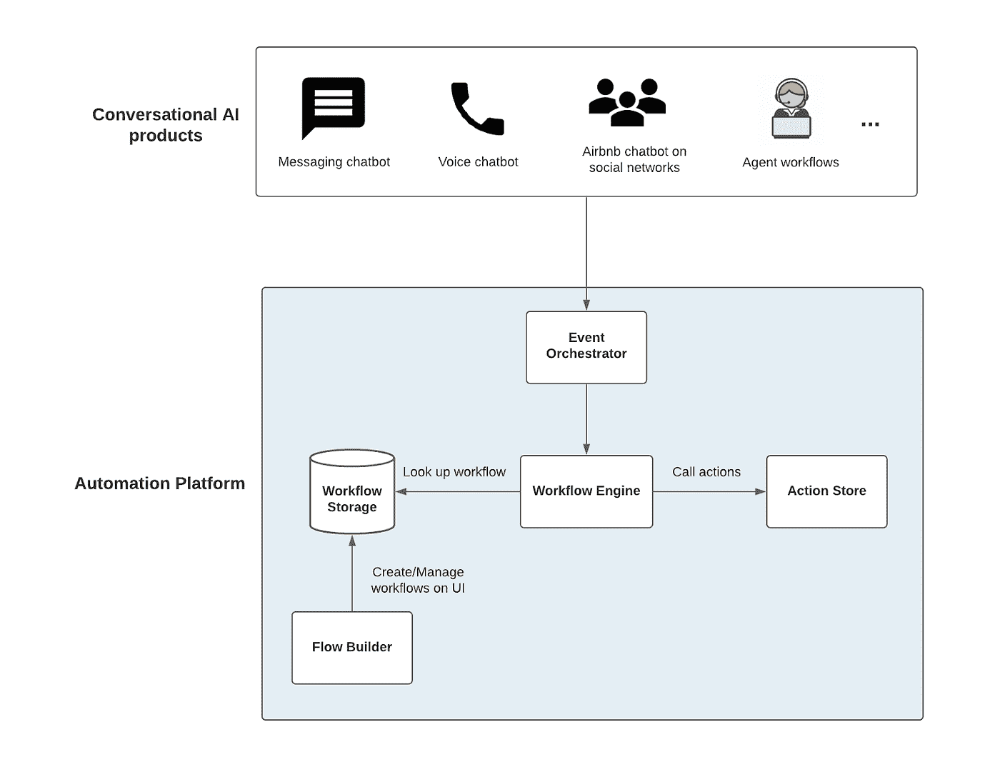
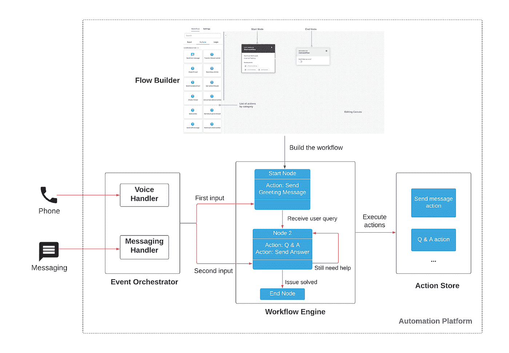
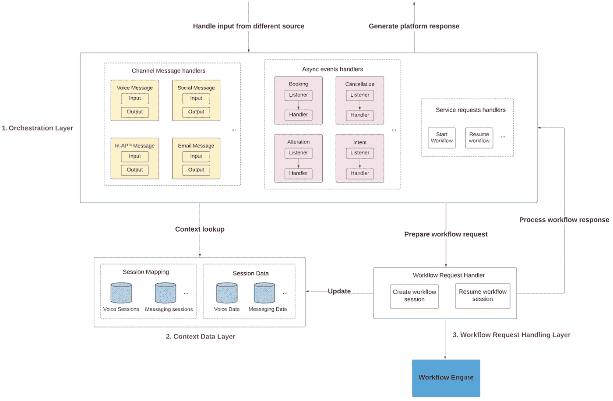
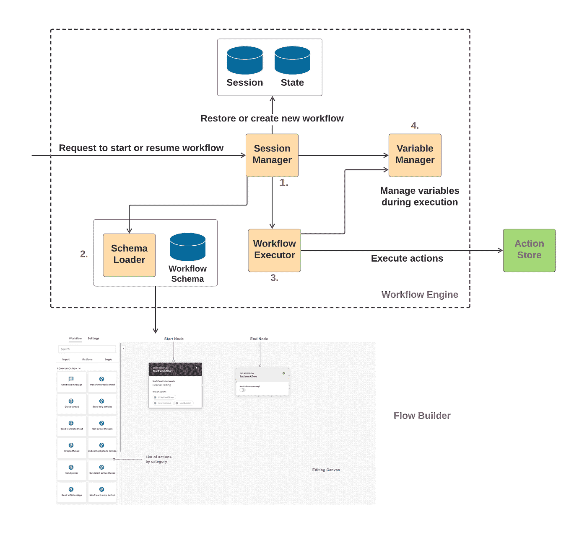
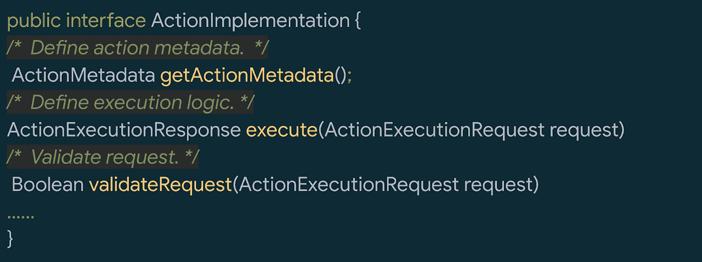
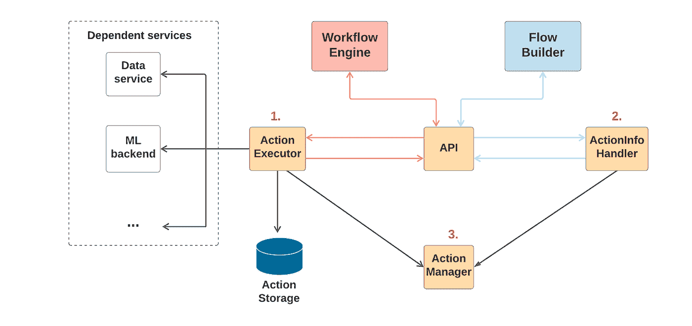
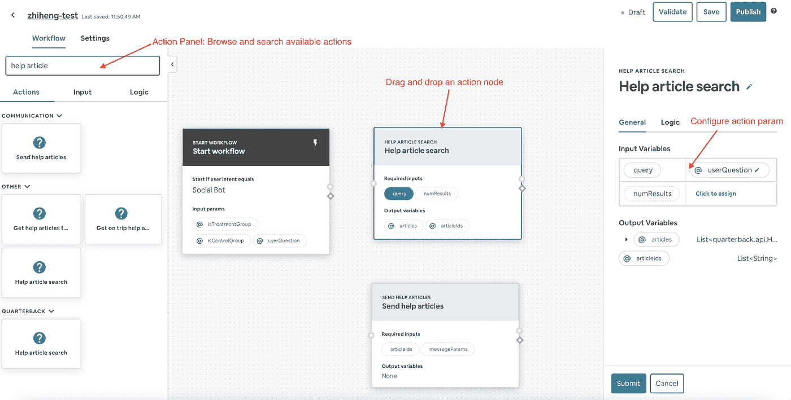
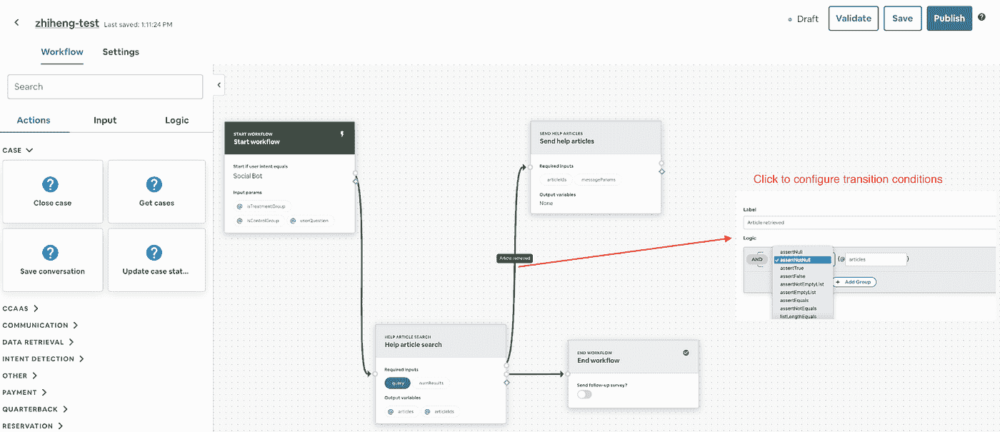
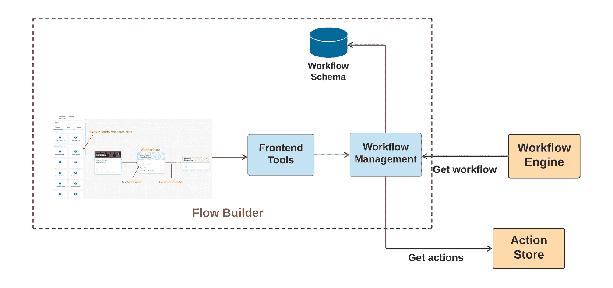
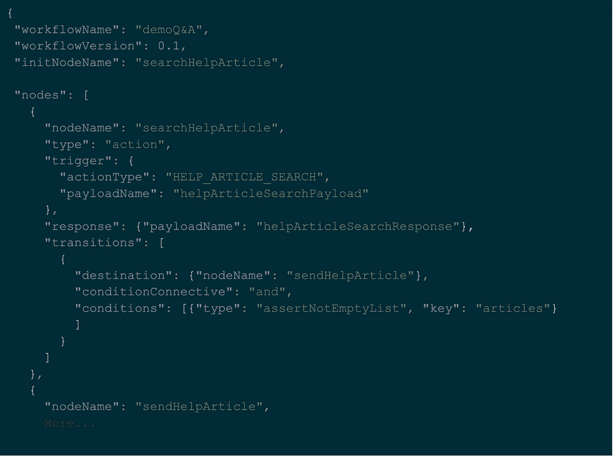

# 智能自动化平台:在 Airbnb 增强对话式人工智能及其他能力

> 原文：<https://medium.com/airbnb-engineering/intelligent-automation-platform-empowering-conversational-ai-and-beyond-at-airbnb-869c44833ff2?source=collection_archive---------0----------------------->

智能自动化平台如何支持对话式人工智能和代理自动化以改善 Airbnb 客户体验

由[徐志恒](https://www.linkedin.com/in/zhiheng-xu-50249b31/)、[周浩宇](https://www.linkedin.com/in/yi-alex-zhou-1284651b/)、[王书豪](https://www.linkedin.com/in/chutianwang/)、[徐泽成](https://www.linkedin.com/in/zecheng-xu-11bb778a/)、[王紫逸](https://www.linkedin.com/in/ziyi-wang-6651b5b1/)、[贾雨露](https://www.linkedin.com/in/jiayu-lou-337ba785/)、[张](https://www.linkedin.com/in/liuming-zhang-4b120894/)、[加里潘](https://www.linkedin.com/in/fengjian-pan/)、赵九思、[普里扬克辛哈尔](https://www.linkedin.com/in/priyanksinghal/)、[克莱尔熊](https://www.linkedin.com/in/clairexiong/)、[张大大](/@waynezhang511)、

随着机器学习和自然语言处理技术的快速发展，对话式人工智能近年来吸引了巨大的关注。越来越多的对话式人工智能应用程序，如虚拟助手、智能扬声器和客户支持聊天机器人，已经被开发出来，以帮助人们的日常生活。

在 Airbnb，我们开发了多种对话式人工智能产品，以增强我们的主人和客人体验。例子包括我们的[聊天机器人系统](/airbnb-engineering/using-chatbots-to-provide-faster-covid-19-community-support-567c97c5c1c9)，它通过应用内消息或自动电话呼叫支持用户，我们的[面向任务的 ML 框架](/airbnb-engineering/task-oriented-conversational-ai-in-airbnb-customer-support-5ebf49169eaa)用于问题检测和自动解决问题，以及各种旅行支持产品，以主动帮助客人改善他们的旅行体验。

在这篇博文中，我们介绍了 ***智能自动化平台*** (AP)，这是由 Airbnb 开发的通用企业级平台，用于支持一套对话式 AI 产品。从这一点开始，智能自动化平台将被称为“AP”。

通过将对话式人工智能产品建模为[马尔可夫决策过程](https://en.wikipedia.org/wiki/Markov_decision_process) (MDP)工作流，AP 提供了工作流和动作的统一表示，以促进工作流合并和动作重用。此外，该平台提供了一个 GUI 开发工具，以支持拖放式工作流创建，促进产品的快速迭代，并使非技术团队能够构建对话式人工智能产品。

# **1。平台架构**

Figure 1: AP Architecture

图 1 显示了 AP 的高级架构，它由 4 个主要组件组成:

1.  **事件编排器**，平台的事件编排层。它翻译客户端和工作流引擎之间的输入/输出消息，以确保 AP 上的工作流可以以通用的方式构建和执行。
2.  **工作流引擎**，平台的“大脑”。它负责管理和执行平台支持的所有工作流。
3.  **动作库**，平台的动作执行引擎。它支持工作流执行期间的操作请求。Action Store 是一个开放的平台，开发人员可以创建新的操作或重用现有的操作。通过使用动作存储中的动作，我们基于不同的系统和后端来标准化任务执行，并确保不同产品之间的一致用户体验。
4.  **Flow Builder** ，平台的工作流创建 GUI 工具。这是一个协作式拖放界面，简化了工作流的创建和管理。Flow Builder 的输出是可由工作流引擎加载和执行的工作流。

图 2 显示了 AP 上的一个演示“Q & A”工作流的例子。通过 Flow Builder 配置的演示工作流可以从不同的渠道(如消息传递或电话)回答用户的问题。

Figure 2: A Demo Q&A Workflow on AP

当平台收到对“问答”工作流程的请求时，它会触发:

1.  Event Orchestrator 规范化请求并查找相应的工作流会话(如果存在)(工作流会话是工作流的单个实例)，然后将请求转发给工作流引擎。
2.  工作流引擎恢复工作流的先前状态或从开始节点(状态)创建新的状态，然后执行工作流:a)执行为当前工作流状态定义的操作。b)基于动作结果或其他条件将工作流移动到下一个状态。c)如果需要，暂停工作流程并等待下一次输入。
3.  用于执行工作流引擎所需的所有操作的操作存储。

# 2.智能自动化平台的关键组件

## 2.1 事件协调器

AP 的设计原则之一是提供与通道无关的问题解决能力(通道代表请求的来源，如应用内聊天机器人或电话)。工作流和操作旨在不受渠道限制，专注于问题的核心，无论用户选择通过哪种渠道联系我们来解决他们的问题。

***事件编排器*** 是 AP 的事件编排层。它将平台的输入和输出标准化，以确保对话式工作流能够以一种与通道无关的方式构建和执行。图 3 提供了 Event Orchestrator 的体系结构，它包含 3 层:编排层、上下文数据层和工作流请求层。

Figure 3: Event Orchestrator Architecture

编排层处理所有的请求和响应。它目前支持 3 种类型的输入:

1.  **频道消息**。这些信息来自不同的渠道，如电话、电子邮件或应用内消息。
2.  **异步事件**。这些是由不同的 Airbnb 内部系统生成的异步事件(如 [Kafka](https://kafka.apache.org/intro) 事件)，如取消事件。
3.  **内部服务请求**Event Orchestrator 还提供了一些端点来直接处理来自其他 Airbnb 内部服务的工作流请求。

上下文数据层存储与平台请求相关的所有上下文信息。在向*工作流引擎*创建工作流请求之前，上下文数据层:a)通过查找会话映射表来识别请求是关于新的工作流会话还是关于现有的工作流会话。b)通过读取会话数据表来恢复工作流执行的关键上下文信息。

工作流请求层准备给*工作流引擎*的请求以执行工作流，并处理来自*工作流引擎*的响应。它确保来自不同来源的平台请求被转换成相同的工作流引擎请求，以便*工作流引擎*能够以通用方式处理所有工作流。

## 2.2 工作流引擎

***工作流引擎*** 是 AP 的“大脑”，负责执行和监控平台支持的所有工作流。

Figure 4: Workflow Engine Architecture

图 4 显示了工作流引擎的整体架构，它由 4 个主要组件组成:

1.  **会话管理器**。会话管理器管理整个工作流执行的生命周期。在接收到工作流执行请求后，它将恢复工作流的先前状态(如果工作流被恢复)或从开始状态创建新的工作流(如果新的工作流被创建)。当工作流需要暂停并等待用户响应时，会话管理器会将当前状态和所有工作流变量存储到数据库中，以便在同一会话的下一次请求时恢复。
2.  **模式加载器**。模式加载器加载由 AP 的工作流创建 UI 工具 *Flow Builder* 生成的工作流模式。工作流模式是由*流构建器*自动生成的 JSON 模式文件(参见*流构建器*部分的更多细节)。
3.  **工作流执行人**。工作流执行器根据工作流模式执行工作流，从工作流的当前状态开始。它通过向*动作存储器*发送请求来处理当前状态中定义的动作，处理响应，并将变量保存到变量管理器。之后，它根据转移条件将工作流转移到下一个状态，并开始处理下一个工作流状态。工作流执行者将不断重复该过程，直到工作流需要暂停(并等待用户响应)，或者直到它到达工作流的结尾。
4.  **变量管理器**。变量是支持工作流执行的数据。变量管理器管理所有变量，可由工作流执行器访问，以在工作流执行期间读取和更新变量。

## 2.3 行动商店

***动作库*** 是 AP 的动作执行引擎，支持来自*工作流引擎*的动作执行请求。它也是一个开放的平台，开发者可以创建新的动作或者重用现有的动作。动作库中的所有动作都可以在 *Flow Builder* 上用于创建工作流。

如图 5 所示，动作库中的所有动作都实现了一个公共接口，以便在动作执行期间(由*工作流引擎*处理)和工作流创建期间(由*流程构建器*处理)能够以相同的方式处理它们。一个动作可以像获取用户的预订数据一样简单，也可以像问题预测一样复杂，这可能涉及多个机器学习模型和特征生成管道。

Figure 5: Action Interface

图 6 显示了 Action Store 的高层架构，它包含 3 个主要组件:

1.  **动作执行者**。动作执行器支持动作执行请求。当收到请求时，动作执行器将根据动作类型从动作管理器加载动作实现，并调用实现中定义的执行函数。许多动作依赖外部服务来完成执行，动作执行器将负责发送这些外部请求并处理响应。
2.  **ActionInfo 处理程序**。ActionInfo 处理器通过序列化所有操作信息(例如，元数据、有效负载、结果等)来支持用于工作流创建的*流构建器*。)到 *Flow Builder* 来呈现 UI 上的动作，并在创建工作流时支持动作配置。更多详情可在*流程构建器*部分获得。
3.  **动作管理器**。动作管理器注册和管理在动作存储中创建的所有动作。它根据动作类型向动作执行器和 ActionInfo 处理程序提供动作实现。

Figure 6: Action Store Architecture

## 2.4 流量生成器

***流程构建器*** 是 AP 的工作流创建 UI 工具，支持拖拽式工作流创建。它与*动作库*集成，以检索所有动作信息，并在工作流执行期间将生成的工作流模式发送给*工作流引擎*。

Figure 7: Flow Builder UI (Action Configuration)

图 7 展示了在工作流中配置操作时 Flow Builder 的 UI。左侧是动作面板，列出了*动作库*中所有可用的动作，并支持按动作名称或描述进行搜索。工作流创建者可以在工作流面板中拖放任何操作，然后通过单击操作节点来配置操作负载。

Figure 8: Flow Builder UI (Configure the Workflow Graph)

图 8 显示了配置工作流图时的 UI。工作流创建者可以通过创建节点之间的链接和配置转移条件来创建工作流节点之间的转移(每个节点都可以被视为工作流的一个步骤或状态)。配置完所有工作流节点和链接后，工作流就可以进行测试和发布了。

Figure 9: Flow Builder Architecture

图 9 是 Flow Builder 的高层架构。它包含两个主要组件:

1.  前端层使用第三方库 [React-diagrams](https://github.com/projectstorm/react-diagrams) 构建，支持 UI 和 UI 上的所有操作。
2.  后端层，工作流管理服务，负责:a)从*动作库*获取所有动作信息，并传递给前端层。b)从 UI 上配置的工作流图中生成可由*工作流引擎*执行的工作流模式。c)在工作流执行期间向*工作流引擎*提供工作流模式。

图 10 给出了一个可以由*工作流引擎*执行的自动生成的工作流模式的例子。

Figure 10: Example of Auto Generated Workflow Schema

# 3.结论

在这篇文章中，我们介绍了我们的智能自动化平台，这是一个通用的、业务友好的企业平台，支持 Airbnb 的一套对话式人工智能产品，包括客户聊天机器人、旅行支持产品和代理自动化。借助智能自动化平台，我们可以简化和加快对话式人工智能产品开发，将人工智能技术普及到业务团队，并扩大越来越多的智能解决方案，以改善 Airbnb 客户体验。

# 承认

感谢、、刘、、、杨、、周、、彭、陈昊然、巴特布、卡特阿普尔顿、沙哈夫阿比利亚、马丽尔杨、张硕、魏吉、刘嘉瑜、凯文荣格梅斯蒂斯、普拉蒂克沙阿、孟晓宇、迈克尔周、朱浩然、乔恩桑德内斯和康纳达西为产品合作。

感谢 Tina Su、Andy Yasutake、Joy Zhang、Raj Rajagopal、Navjot Sidhu、James Eby 和 Julian Warszawski 对智能自动化平台的领导支持。

*有兴趣在 Airbnb 工作吗？看看这些角色:*

[CSP 软件工程师——联系人解决方案](https://grnh.se/7de3db391us)

[社区支持平台高级软件工程师](https://grnh.se/29257d691us)