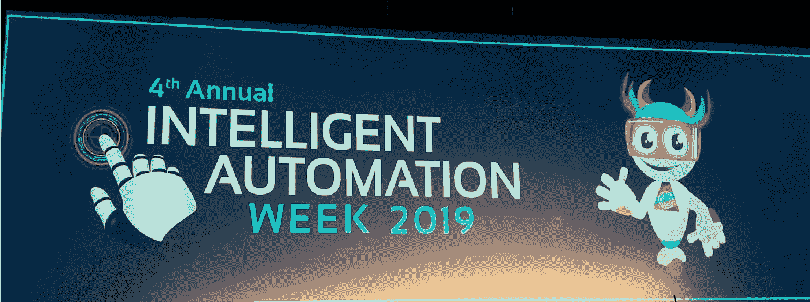
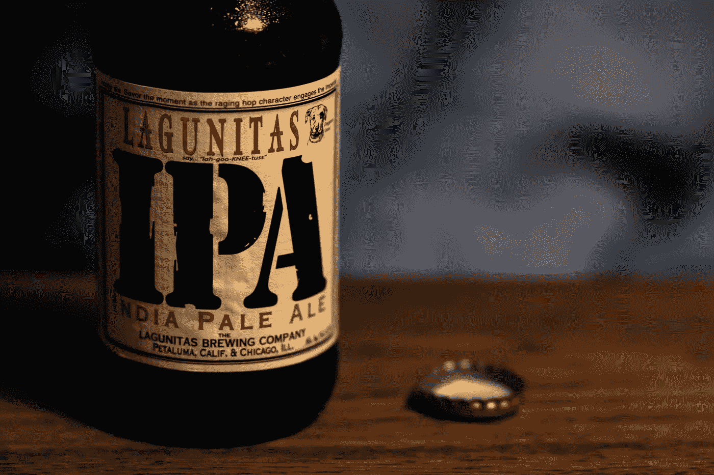
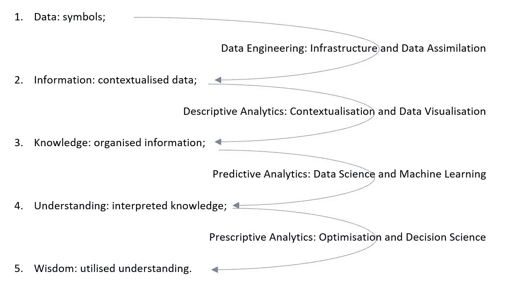

# 智能自动化周:探索人工智能和 RPA 的伦理、技术和战略挑战

> 原文：<https://medium.com/version-1/intelligent-automation-week-exploring-the-ethical-technical-and-strategic-challenges-of-ai-and-70f19db91394?source=collection_archive---------0----------------------->

去年，作为第 1 版创新实验室 IT 顾问的一部分，我参加了 2019 年智能自动化周。这是在伦敦 Twickenham 体育场举行的为期三天的活动，60 位行业领先的演讲人讨论了机器人过程自动化(RPA)、认知计算和人工智能(AI)。大多数演讲者是来自阿迪达斯、宜家、谷歌、爱立信、NHS、Ocado、沃达丰等公司的 C-Level 高管，他们讨论了以下话题:

*   人工智能工具和技术
*   数据
*   橡胶胶溶剂（Rubber Peptizing Agent 的缩写）
*   领导与 AI 文化

在我的第一篇媒体文章中，我将讨论我从这个 RPA 和 AI 聚焦事件中获得的主要收获。

Twickenham Stadium

**艾应该是有道德的**

公司被迫利用大数据。如果标准和法规发展缓慢(与新技术的发展速度相比)，伦理原则必须指导企业战略，以避免机器学习(ML)和人工智能(AI)所涉及的风险。涉及风险的一些例子是自动化贫困或用非一般化的数据训练 ML，导致性别或种族偏见。

由于人工智能算法的复杂性，理解输入和生成的输出之间的关系并不简单。这就是为什么一些从业者开始推荐一种叫做 [*责任人工智能设计*](https://arxiv.org/abs/1909.12838) 的方法，以最小化人工智能不良后果的风险。

这个问题如此重要，以至于欧盟委员会在 2019 年发布了一份文件，其中包含了[可信人工智能的道德准则(欧盟委员会，2019)](https://www.lexology.com/library/detail.aspx?g=e1f9d4a1-1518-42e5-86a8-950edc4f3648) 。

**文化必须改变**

关于前一点，人工智能需要文化和技术的改变。技术已经准备好了，但是组织和其中的人还没有准备好。有时，RPA 被视为锤子，公司内部的任何问题都被视为钉子:这是**错误的！** RPA 实施可以改善业务，但有时它们只是权宜之计，事实上，最佳解决方案是更好地集成到业务中。选择自动化的内容是关键；如果一个过程不好，就不应该自动化。**反而应该改。**

同样，大多数改进都是战术性的，而不是战略性的。创新应该是现有战略的一部分，而不是替代/新战略。需要自上而下的支持。当业务开始智能自动化之旅时，IT 必须得到 C-Level 高管的全力支持。另一方面，企业内部的信息技术必须教育员工，使他们理解人工智能的好处，并理解如何在他们的角色中有效地使用人工智能。用微软的话说(2019 年，第 12 页):

> 采用人工智能文化将使所有级别的员工都感到被赋予了权力，并不仅创建了一个采用人工智能解决方案的企业，还创建了一个真正支持人工智能的组织。

**公共部门智能自动化**

所示的案例研究是东萨福克和北埃塞克斯 NHS 基金会信托(ESNEFT)最近实施的 RPA 系统，该系统采用自动化来改进和验证医疗专业人员正在做出的决策。其想法是增强而非取代员工的能力，最大限度地提高员工技能，提高工作效率，让他们有更多的时间陪伴患者。

这个过程充满挑战。如前所述，高层的支持对如此规模的创新项目至关重要，但如果没有董事会的批准以及医疗行业没有其他 RPA 的例子，就没有什么可向高级管理层展示的了。尽管如此，首席技术官还是利用微软云计算平台中的智能自动化平台(Thoughtonomy)，在几天内完成了一个自动化发票处理的案例研究。第一个月，系统发布了 300 小时，1 年后增长到*每月 4500 小时。考虑到员工现在可以利用这段时间来陪伴患者并执行他们最喜欢的任务，该使用案例是一个很好的例子，说明了智能自动化如何提高流程效率，同时让员工的生活更轻松！*

**IPA 不仅仅是一种啤酒！**

Photo by [Haus of Zeros](https://unsplash.com/@hausofzeros?utm_source=medium&utm_medium=referral) on [Unsplash](https://unsplash.com?utm_source=medium&utm_medium=referral)

尽管受雇于啤酒行业，IPA 也是**智能过程自动化的首字母缩略词。**那么，在这种情况下，IPA 到底意味着什么呢？投资促进机构是一个通用概念，包括并结合了:

*   数字流程自动化(DPA):使业务和流程数字化，以提高响应速度和以客户为中心。
*   机器人过程自动化(RPA):无需人工干预即可处理大量重复任务。
*   人工智能:在这种情况下，机器学习允许系统访问数据，自己学习并做出自主决定。

这可通过以下公式进行总结:

如今，RPA 主要在任务级别工作，而它应该在战略级别进行规划和设计。IPA 是一个更普遍的概念:一个理想的通向数字生态系统的端到端过程。将信息技术视为成本中心的公司还没有为投资促进机构做好准备——业务和信息技术必须共同努力实现一个共同的目标。

**从数据到智慧**

数据是智能自动化正在推动的新经济的核心。数据驱动决策(DDDM)等新方法的词汇选择突出了数据在决策过程中的中心地位，决策过程必须有硬数据支持，而不是基于直觉或观察。

为了引导业务决策取得更好的结果，必须对原始数据进行转换，使其比提取时更加丰富。以下步骤概述了这一数据之旅。

**光学字符识别(OCR):挑战和未来趋势**

光学字符识别技术面临几个挑战:

*   无限制和多种多样的布局:关键信息可以在要处理的文档、图像或消息中的任何位置
*   扫描源质量差，有时会绕轴旋转
*   不同格式:JPEG、PNG、PDF、Word 或 Excel 文档
*   没有严格格式或遵循明确定义的规则的文件:例如，理解借方和贷方之间的区别。

由于从文档中提取信息的方式，传统的 OCR 技术难以解决上述问题:逐行读取，包括无用的信息，按照特定于每种文档类型的手工规则执行后处理检查。

另一方面，认知 OCR 采用深度学习和长短期记忆(LSTM)以同样的方式处理任何类型的文档。先进的字符检测和识别算法允许一次扫描整个文档(而不是逐行扫描)，只关注相关信息，提高准确性并缩短处理时间。不用说，这就是 OCR 技术的未来。

**参考文献**

*欧盟委员会(2019 年)，《可信人工智能的道德准则》，*

*欧盟委员会【在线】。可在:*[*【https://ec.europa.eu/futurium/en/ai-alliance-consultation*](https://ec.europa.eu/futurium/en/ai-alliance-consultation)*(19/12/19 访问)*

*微软(2019，第 12 页)，加速与人工智能的竞争优势，微软公司*