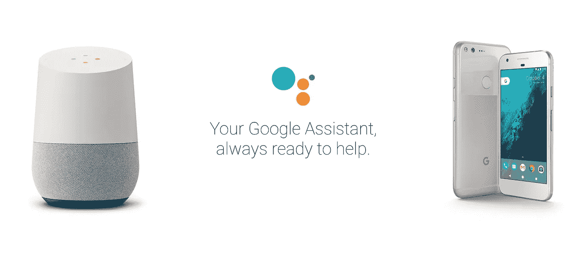
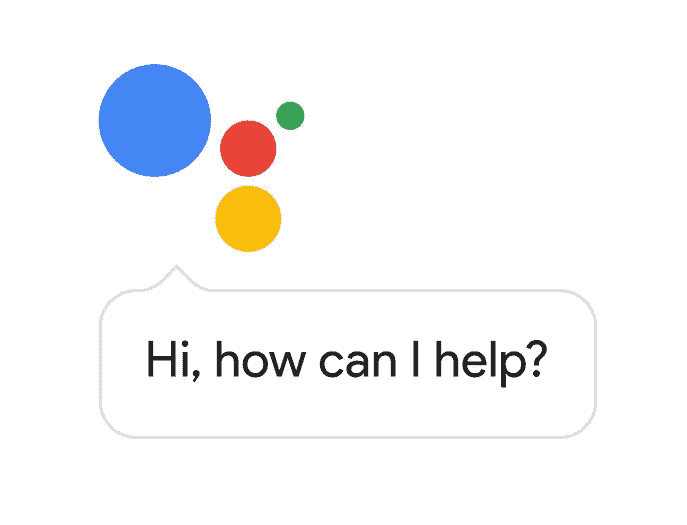
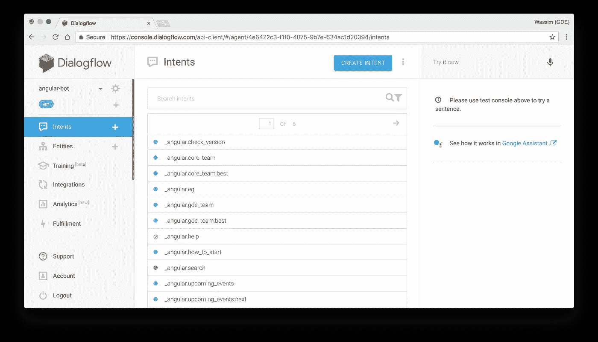
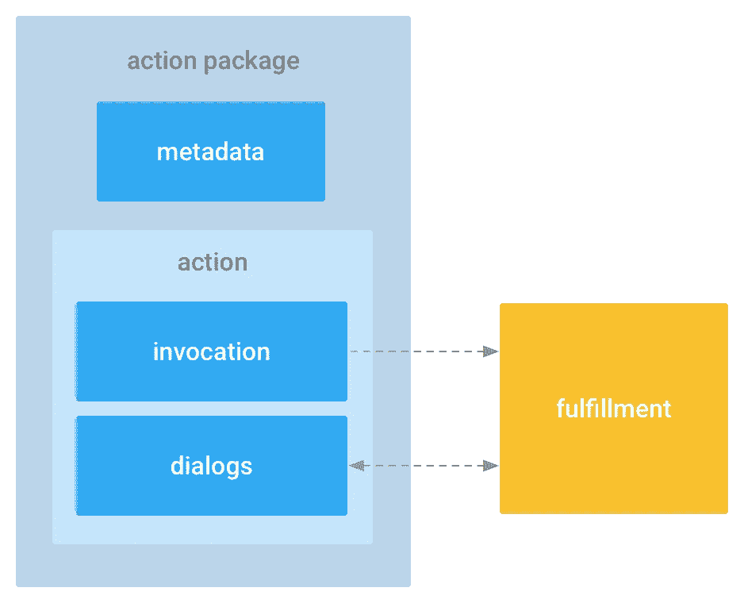
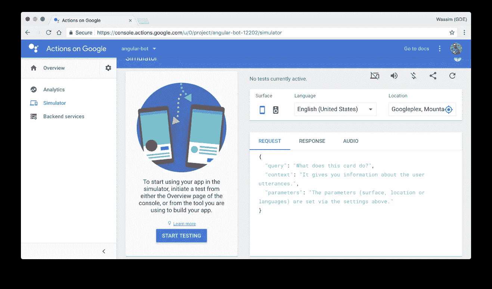

# 智能聊天机器人词汇—101

> 原文：<https://medium.com/google-developer-experts/intelligent-chatbots-vocabulary-101-6aa4f646cb7c?source=collection_archive---------3----------------------->

如果我必须对 2019 年做出任何科技预测，我会说我们将会听到很多关于[聊天机器人](https://chatbotslife.com/)，尤其是*智能健谈者*。原因如下。2016 年末，我是最幸运的 [GDEs](https://developers.google.com/experts/people/wassim-chegham) 之一，获得了一台早期的谷歌 Home 设备(由谷歌善意提供)。所以我决定用我自己的“行动”来扩展这个平台，我惊讶于它是如此的简单和有趣！我一直在做黑客，并最终在去年开始为企业开发 [VUI](https://developers.google.com/actions/design/) 应用。我可以清楚地看到大大小小的公司对这种新媒体的兴趣。因此，我预计这种浓厚的兴趣将在今年及以后大幅增长。

此外，对于我们开发人员来说，让我们承认:这是一个非常有趣和好玩的平台。对吗？

现在，让我猜猜，你是圣诞节得到一台谷歌 Home 设备的最幸运的开发者之一——或者也许你已经有一台了。如果没有，就去买一个，准备好构建你的第一个应用。然而，在此之前，我想和你分享理解聊天机器人生态系统所需的*必要的*词汇。

> 我将特别关注 Google Assistant 平台，但是正如你将看到的，大多数“机器人”提供商使用相同的术语。

# 谷歌主页和谷歌助手

当你听说 **Google Home** 和**Google Assistant**时，请记住:

1.  [谷歌助手](https://assistant.google.com/):是智能的个人**助手。**你可以问它问题，告诉它做事。
2.  [Google Home](https://madeby.google.com/home/) :这个**声控音箱**是由谷歌助手驱动的吗？

这里首先要注意的是，Google Home 依赖于 Google Assistant 来工作。Google Assistant 实际上是支持 Google Home 设备、Google Allo、Android TV、Android Wear 2.0+等的底层运行时。事实上，谷歌助手可以让你以更“自然”的方式与你的任何 Android 设备互动，甚至是你自己的定制硬件:

1.  通过 Google Home 或 Android TV 与您的设备通话。
2.  通过 Google Assistant 与您的助理交谈(即说话或发短信)。

另一方面，谷歌助手依靠**动作**(又名谷歌上的动作)来吸引用户。你会有一个检查天气的动作，另一个检查你的新闻订阅，可能还有一个打开/关闭你的灯的动作…等等。

我有打开/关闭我的圣诞树的动作…

为了用额外的动作扩展 Google Assistant，你可以用 Actions SDK 或者 Dialogflow 之类的在线工具，甚至两者的组合来实现。

# 对话流

[Dialogflow](https://dialogflow.com/) 是一个在线应用程序，允许你在谷歌和其他平台如 Facebook Messenger、微软 Cortana、Slack、Twitter 和[等](https://dialogflow.com/docs/integrations/)上为[的行为构建和部署对话应用程序。所有这一切都很容易，几乎不需要任何编程技能——真的。使用 Dialogflow，您可以创建和管理使您的对话应用程序的意图、实体和上下文。](https://developers.google.com/actions/)

dialogflow.com

# 动作 SDK

这种方法包括使用动作 SDK。它当然需要一点设置，但是更灵活。

官方的 Google Actions [SDK](https://developers.google.com/actions/develop/sdk/) 基本上允许你:

1.  提供一个带有一些元数据的动作包。
2.  编写“调用”和“对话”组件。

这个 SDK 给了你一个相当低级的 API 来帮助你构建你的动作。API 提供了从创建意图和注册意图到发送 [SSML](https://www.w3.org/TR/speech-synthesis/) 指令给代理的一切，这样代理就可以把它们说回来。

当构建任何对话应用程序时——不仅仅是谷歌助手——你会遇到特定的术语和概念。值得庆幸的是，大多数“聊天机器人”提供商(谷歌、亚马逊、微软)确实同意相同的概念，并使用相同的 SSML 标准进行语音合成。让我们来看看这些概念。

# 动作模拟器

[动作模拟器](https://developers.google.com/actions/tools/simulator)是官方在线工具，允许你尝试你的动作。虽然这是一个尝试和调试你的操作的好方法，但我建议使用一个真实的设备:谷歌主页或你的 Android 或 iOS 手机上的谷歌助手。

The Actions Simulator

# **ASR→NLP→NLU→NLG→TTS**

这可能是最容易混淆的概念了。让我们揭开它们的神秘面纱(用简单的词语):

1.  **ASR** 或**自动语音识别**是将语音(声音)信号作为输入，然后找出实际说出的单词的过程。
2.  **NLP** 或**自然语言处理**是一个总括术语，描述机器操纵(句法分析、文本分类等)人类语言(英语、法语等)的能力。
3.  **NLU** 或**自然语言理解**是 NLP 的子集，负责语义解析和分析、实体提取等。NLU 试图将输入数据结构化，以便机器能够容易地理解。
4.  **NLG** 或**自然语言生成**是机器尝试将结构化(来自 NLU)数据转换为人类可读语言的步骤。
5.  **TTS** 或**文本到语音合成**，**，**简单来说，**，**从 NLG 中取出生成的文本，转换成语音。

> 当有人谈到 NLU 时，大概是指: **ASR→NLP→NLU→NLG→TTS。**

## 代理(又名动作)

这是您构建(或用 Dialogflow 创建)的程序片段。它的作用是处理用户的意图(请求)并处理完成的响应。这就是我们通常所说的“机器人”。

## 语境

上下文基本上是一个讨论线索:两个(或多个)参与者之间的思想交流。当构建 bot 的逻辑时，上下文将是您的“对话状态”，这是您想要存储特定任务或请求的重要信息(通常是实体)的地方。

## 意图(又名话语)

意图代表用户的“意图”。在真实的对话中，你的意图是由你所说的来定义的。在对话式应用程序中，这是相同的工作流程。你将为给定的意图提供一组基本句子。比如，*吃东西*，*要东西*或者*叫人*。您的代理应该足够聪明，能够从这些句子中学习，以便理解您想要实现的目标，即使您没有说或写相同的*基本*短语。

> *注意:Dialogflow 在这方面非常擅长，因为它允许您使用机器学习来训练您的代理更好地理解您。*

## 实体(又名插槽)

大多数现代聊天机器人依靠自然语言处理和 NLU 来处理和理解人类语言。多亏了 NLU，聊天机器人能够从用户的意图中提取一些重要信息。这个提取的信息就是所谓的实体(或槽)。

实体可以基于您的特定用例来定义，例如，一个业务产品名称或一个车辆型号列表；实体也可以表示流行的普通概念，如“名人”、“日期和时间”、“颜色”、“GPS 地址”、“单位数量”、“地理位置”等。这些流行的概念被大多数 NLU 引擎自动提取出来，这要归功于[知识图](https://www.google.com/intl/bn/insidesearch/features/search/knowledge.html)和[本体](https://protege.stanford.edu/publications/ontology_development/ontology101-noy-mcguinness.html)的力量。

> 参见 [dialogflow 内置实体](https://dialogflow.com/docs/reference/system-entities)。

## 对话用户界面

这是一种描述不需要图形用户界面交互的用户界面的现代方式。这些也称为“语音用户界面”。

## 实现

这通常是指处理用户意图的逻辑。换句话说，这是聊天机器人逻辑所在的代码。您将在某个地方托管这些代码，并将其公开到互联网上，这样聊天机器人平台(Google Assistant，Alexa…)就可以访问并请求它(通过 HTTPS)。

# 就是这样🤖

这是作为开发者你需要知道的最基本的词汇，以便开始为谷歌助手构建你的下一步行动——甚至更多。

# 我为谷歌助手做的一些有趣的动作

*在 Twitter 上关注我*[*@ manekinekko*](https://twitter.com/manekinekko)*了解更多关于聊天机器人和网络平台的信息。*