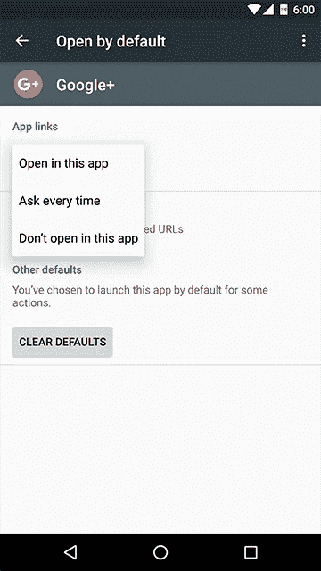

# Android M 中的意图解析

> 原文：<https://medium.com/google-developer-experts/intent-resolving-in-android-m-c17d39d27048?source=collection_archive---------1----------------------->

警告！Android 棉花糖中“隐含意图”的解析不再像以前一样工作。这可能会破坏你的应用程序的行为。

让我解释一下预期的行为以及为什么不起作用:

我最近一直在做一个名为“ [*与*](https://github.com/tasomaniac/OpenLinkWith/) 开放链接”的小型开源项目。它将有希望很快出现在游戏商店。

我的应用程序让您能够在其他应用程序之间切换。当你与我分享一个链接时，我基本上抓取链接并查询所有可以处理该链接的活动。最后，我模仿系统对话框，让你切换应用程序。


Switching from already opened youtube web-page to Youtube app.

我一直使用下面的方法:

```
List<ResolveInfo> infos = packageManager
        .queryIntentActivities(intent, MATCH_DEFAULT_ONLY);
```

这是几乎所有 Android 开发人员都熟悉的方法，我确信它目前正在许多应用程序中使用。

我的手机里有 **2 浏览器**。"*使用 Google+ URL* 的意图预计会给出一个 *3 ResolveInfo* 对象的列表(Google+应用程序和 2 个浏览器)。

嗯，不再是了！

欢迎来到安卓棉花糖！

*安卓棉花糖*引入 [App 链接。](https://www.youtube.com/watch?v=LQoohRwojmw)系统基本上对你的网页进行认证，并使用你的应用程序自动打开那些 URL，而不询问用户任何事情。或者，您可以进入系统设置、应用程序，单击某个应用程序，单击*“默认打开”*，然后设置*“在此应用程序中打开”*以始终使用该应用程序。



Application default setting page in Marshmallow

在这种情况下，*queryintactivities*方法将为开发者提供一个只有 **1 个活动**(在本例中是 Google+)的列表。

即使这是期望的行为，也应该记录下来，因为它破坏了公共 API 的行为。

我稍微研究了一下，发现 *MATCH_ALL* flag。它的文档说，它将禁用所有系统级过滤器。

```
*/**
 * Querying flag: if set and if the platform is doing any filtering of the results, then
 * the filtering will not happen. This is a synonym for saying that all results should
 * be returned.
 */*
public static final int *MATCH_ALL* = 0x00020000;
```

它对我没有任何作用。我打开了[源代码](https://github.com/android/platform_frameworks_base/blob/marshmallow-release/services/core/java/com/android/server/pm/PackageManagerService.java)(至少我们有那个！)并调查了方法。

看起来他们优先考虑域验证的应用程序。他们不仅在内部系统中划分优先级，还在公共 API 中划分优先级。

如果有一个*域验证的应用程序*，它不返回任何其他内容。 *MATCH_ALL* 标志移除一些系统过滤器，但仅当没有验证的应用程序时。

我找不到任何方法来解决这个问题。它只是排除浏览器应用程序，即使它们的*意图过滤器*匹配。

没有解决办法，因为它是一个内部组件(我们无法访问)，Android SDK 使用 AIDL 通过 IPC 通信与它进行通信。

大多数开发人员使用这种方法来确定是否至少有一个活动来处理隐含的意图。在大多数情况下，列表中的第一项就是你想要的。

在花了几个小时了解发生了什么并试图找到一个解决方法后，我认为每个人都应该知道这一点。

Android M 中有很多行为变化，Google 实际上提供了一个行为变化列表。这里可以找到[。我确信就像这样，有许多隐藏的行为变化可能会破坏应用程序。](https://developer.android.com/intl/zh-cn/about/versions/marshmallow/android-6.0-changes.html)

所以要小心这一点，如果你使用 *PackageManager* 方法，检查你的情况。

*感谢校对本文的人:* [*亚古穆尔·达尔曼*](https://twitter.com/yagmurdalman)*[*塞巴斯蒂安·波吉*](https://medium.com/u/9706138c9bfb?source=post_page-----c17d39d27048--------------------------------)[萨利姆·卡亚巴希](https://medium.com/u/73761c65c602?source=post_page-----c17d39d27048--------------------------------)[哈桑·凯克利克](https://medium.com/u/24a0490cd588?source=post_page-----c17d39d27048--------------------------------)*

*关注我的[@塔斯曼尼亚克](https://twitter.com/tasomaniac)和 [+SaidTahsinDane](https://plus.google.com/+SaidTahsinDane/posts)*