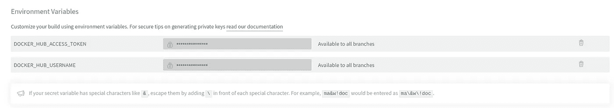

# 与 Docker 互动

> 原文：<https://medium.easyread.co/interact-with-docker-b7f99e7ca26c?source=collection_archive---------0----------------------->

## 使用 Spring Boot、GitHub 和 TravisCI

Photo by [Dominik Lückmann](https://unsplash.com/@exdigy?utm_source=medium&utm_medium=referral) on [Unsplash](https://unsplash.com?utm_source=medium&utm_medium=referral)

嗯… Docker，Docker 是什么？

在本文中，我们将尝试熟悉并立即动手操作 Docker。在此之前，我将尝试给出 Docker 是什么的一点概念。

Docker 是一个平台，旨在使我们更容易构建应用程序，并且我们可以在各种环境中运行该应用程序。为了实现这一点，docker 为我们提供了一个称为隔离容器的容器，然后我们可以将我们的应用程序与所需的依赖项/库捆绑在一起。这样，我们的应用程序也可以在各种操作系统中运行，而不会受到任何干扰。

如果还不清楚，你可以在这里的[访问文档，那里会有更多的解释。](https://docs.docker.com/get-started/overview/)

在我们使用 Docker 之前，请确保您已经在各自的语言环境中安装了 Docker。如果没有，请遵循[这一](https://docs.docker.com/get-docker/)指南。

这次我们将使用 spring boot 作为一个示例项目。如果没有可以作为参考的项目，也许可以创建一个简单的 REST API。如果这是你第一次使用弹簧靴，你也可以遵循这个指南。完成后，记得将项目推送到 GitHub。

在这篇文章中，我将使用我以前做过的一个项目，你可以在这里检查它[也作为你的参考。](https://github.com/mariesto/book-reservation_tdd)

所以，现在我们将尝试使用 docker。

我们要做的第一件事是添加一个没有任何扩展名的名为`**Dockerfile**`的文件。这是 Docker 自己确立的惯例。下面是`**Dockerfile**`我们的内容。

*   **FROM** :这意味着我们将要求 Docker 使用基础映像 **openjdk** 作为我们容器的基础。由于我们使用的是 java，所以我们将使用 image **openjdk** 。
*   **添加:**这意味着我们将添加我们的应用程序(。jar 文件)添加到容器中。
*   这意味着我们将要求 Docker 在我们指定的端口上运行我们的应用程序。
*   **入口点:**这意味着我们将请求 Docker 运行我们的应用程序。为了运行一个 spring boot 应用程序，我们通常使用命令
    `java -jar [app-name].jar`，所以我们将做同样的事情，以便 Docker 可以在容器中运行我们的应用程序。

我们需要。供 docker 使用的应用程序的 jar 文件。运行`mvn clean install`命令来生成。jar 文件。

一切都设置好了，现在是我们使用命令来建立我们的形象的时候了。

标签 **-f** ，意味着我们指定 Docker 将用来构建指令的文件。

标签 **-t，**简单，这是为了给我们的最终图像命名。因为我们将我们的映像命名为 book-reservation-spring-boot，所以稍后在运行映像时可以使用这个名称作为参考。

在命令的最后，我们打算告诉 docker 使用当前目录中的`**Dockerfile**`。

在我们的映像构建过程完成之后，我们可以使用这个命令进行验证。

要运行我们的映像，我们使用以下命令。

Tag **-p，**用于将主机端口之间的端口映射到容器端口(根据`**Dockerfile**`中的配置)。

既然我们已经成功地构建了我们的应用程序映像，是时候分享它了。目标是我们构建的映像可以在各种环境中使用。为了共享图像，我们可以使用 Docker 注册表。默认情况下，Docker Hub 是我们使用的所有图像的来源，我们会将我们的图像发布到 Docker Hub，以便其他人也可以使用我们创建的图像。

第一步是请先登录 Docker Hub。如果您没有 Docker Hub 帐户，请在此处创建一个[。](https://hub.docker.com/)

拥有 Docker Hub 帐户后，创建一个用于存储我们图像的存储库。我们建议您将这个存储库的名称与构建的映像等同起来(例如 book-reservation-spring-boot)，并确保它的可见性是公开的。

在我们发布图像之前，您需要使用以下命令通过控制台登录 Docker Hub。

登录后，我们将使用 Docker Tag 命令给我们一个新的图像名称，它将被用作我们的存储库的名称。以下是编写 docker 标签的格式。

现在我们可以使用下面的命令将图像发布到这个存储库中了。

或者您可以复制页面右侧的 **Docker 命令**。

[下面的](https://docs.docker.com/get-started/04_sharing_app/)是文档中的一个指南，万一您遗漏了什么，您可以遵循它。

而且，我们的 yuppp 图像已经成功发布在注册表中🎉🎉

到目前为止，您已经成功地使用 Docker 从本地开发到在注册表中发布映像。

酪。。。

此时，如果我们在应用程序中进行更改，称之为添加功能或其他，我们发布的图像将不会更新，直到我们重新发布该图像。当然，如果我们手动操作，这将非常耗时。当然，有一个自动化的解决方案😏

是的，我们将使用 CI/CD 来自动化映像构建过程，并将我们的映像发布到注册中心。在这种情况下，由于我们的项目已经在 GitHub 上，我们将使用 TravisCI。GitHub 允许我们非常容易地使用 TravisCI，因为它集成得很好。

确保您已经拥有 TravisCI 帐户，我们将继续下一阶段。

现在，请创建一个名为`**.travis.yml**` 的文件，我们的项目将自动与 TravisCI 同步。

`**.travis.yml**`文件包含 TravisCI 稍后将执行的配置和步骤。这里需要注意的是 **build_docker** 部分。因为我们需要登录 Docker Hub，所以我们需要 Docker Hub 凭证，我们将把它存储在 TravisCI 环境变量中。出于安全原因和 TravisCI 推荐的方式，我们将凭证保存在环境变量中，而不是将凭证存储在属性文件中。

要获得 DOCKER_HUB_ACCESS_TOKEN，您可以遵循[以下](https://gist.github.com/mariesto/ae26426079f30a901b5809a18ddabe1a)步骤。生成令牌后，我们可以将它添加到我们的项目环境变量中，如下所示。

TravisCI Environment Variable

您还可以向该环境变量添加其他变量。

之后，只需将更改推送到存储库，TravisCI 就会完成这项工作。您还可以从 TravisCI 查看构建日志，以确保一切运行良好。通过这一过程，我们在注册表中的图像将一直更新，您现在可以自由地进行实验🎉🎉

这对于这篇文章来说已经足够了，希望你们能理解我们所做的简短练习。享受吧。
非常感谢 [fade](https://www.linkedin.com/in/faderosyad/) 和 [rizky](https://www.linkedin.com/in/rizkyrw/) 的真知灼见和点评。