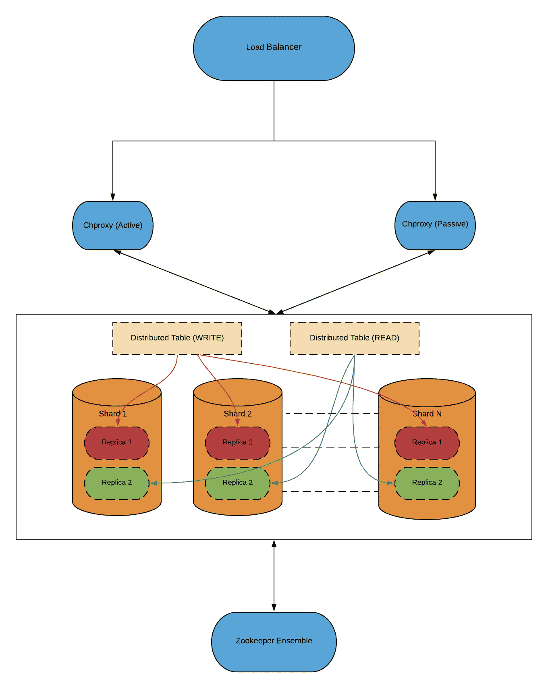

# 大规模交互式分析

> 原文：<https://medium.com/walmartglobaltech/interactive-analytics-at-scale-c8e32dd0e910?source=collection_archive---------1----------------------->

# **简介**

在 WalmartLabs，我们需要一个平台，使我们的业务用户能够通过对庞大数据集进行交互式分析，做出明智的数据驱动型决策。这个用例需要一个可以交互处理大块数据的 OLAP 系统。为了做到这一点，我们决定利用 ClickHouse(一种开源的面向列的数据库管理系统)，它可以在几秒钟内对数十亿行数据运行分析查询。

然而，建立和维护一个存储和处理万亿字节数据的数据库集群可能是一项艰巨的任务。通过这篇博客文章，我将分享一些最佳实践，通过重新访问我们平台的架构，这些实践可能对建立 ClickHouse 的分布式集群有用。沃尔玛内的许多消费者正在共享我们的集群，以构建仪表板，使他们能够做出更明智的业务决策。

# **建筑**

该平台以高可用性和易于扩展的方式设计。它还确保底层基础设施的细节对最终用户隐藏起来。它使我们能够在不停机或不影响用户的情况下对基础架构进行更改。

我将通过下面给出平台概述的体系结构图来探讨细节:

System Architecture

以下是对关键组件以及它们如何与系统其他部分交互的说明:

## **1 .负载平衡器**

TCP 负载平衡器是我们的客户端和平台之间的接口。负载平衡器将流量导向 Chproxy 服务器，后者进一步与 ClickHouse 集群通信。

负载平衡器以**主动/被动**方式配置。已配置运行状况检查，以便 LB 不断轮询 Chproxy 服务器，以确保流量定向到运行状况良好的服务器，并在主服务器不可用时切换到故障转移服务器。

## **2 .Chproxy**

Chproxy 是为 ClickHouse 数据库开发的一个开源第三方代理层。它是用 GO 语言开发的，在其 [Github 信息库](https://github.com/Vertamedia/chproxy)中有详细信息。

Chproxy 为我们提供以下优势:

*   **用户特定路由**:由于 ClickHouse 集群由许多消费者共享，Chproxy 使我们能够将用户请求路由到拥有处理请求所需数据的适当节点。由于整个物理集群中可能只有几个节点拥有特定用户的数据，因此来自该用户的所有请求都可以映射到这些特定节点。
*   **缓存:**我们已经将 Chproxy 配置为缓存来自特定用户的查询，尤其是那些数据刷新不频繁的用户。这使得底层 ClickHouse 集群不必重复执行繁重的查询，也使用户能够更快地获得结果，因为它们是直接从缓存中读取的。
*   Chproxy 充当客户端应用程序和 ClickHouse 集群之间的抽象层。它使我们能够在不影响消费者的情况下对 ClickHouse 基础设施进行更改。客户端应用程序与在 Chproxy 中创建的用户进行交互，这些用户被映射到 ClickHouse 用户，因此最终用户不知道实际的数据库用户和密码。

Chproxy 进程在我们的计算机上被配置为定制的 Linux 服务，在任何失败的情况下都会自动启动。

## **3。点击屋集群**

点击之家集群是平台的心脏和灵魂。这是一个共享群集，被我们的许多消费者用于不同的使用情形。设置该集群时遵循了以下实践:

*   **可扩展性:**

在设计任何分布式系统时，轻松扩展系统并确保我们的用户没有任何停机时间的能力是极其重要的。

这种系统处理万亿字节的数据是很常见的。在这种情况下，建议在多个节点之间分割数据，这是数据库世界中的一个常见原则，称为**分片**。分片允许水平扩展集群，并将多个服务器的能力结合起来，共同处理资源密集型查询。随着流量的增长，横向扩展群集也很有帮助。

*   **高可用性:**

为了确保高可用性，我们为每个碎片创建了**跨 DC 副本**。它确保服务器或整个 DC 的故障不会使平台崩溃。异步复制是使用 ClickHouse 平台的复制引擎实现的。

*   **单独读取&写入副本:**

在我们平台的初始阶段，我们曾经遵循在服务器节点之间循环复制碎片的方法。ClickHouse 集群中的每个节点携带一个碎片的主要数据以及另一个碎片的副本。但是，采用这种方法会对读取查询产生不可预测的影响，因为以不同时间表运行的多个 ETL 作业(流/批处理)会降低它们的速度，从而导致违反 SLA。

为了解决这个问题，我们决定在集群中分离为读取和写入流量提供服务的副本。来自执行繁重写入操作的 ETL 作业的所有流量在写入集群中的副本之间共享。ClickHouse 将写入写副本的数据异步复制到读副本。使用 ClickHouse 中的 **first_or_random** 负载平衡，读取查询由读取集群中的副本处理，但是，如果一个碎片的读取副本不可用，它将由写入集群中的副本处理。

总而言之，这种方法具有以下优点:

*   阅读变得更加可预测。由于 ETL 作业正在运行而必须执行的所有繁重处理都是在写节点上执行的。
*   这种架构更容易扩展。如果读取流量急剧增加，可以通过在读取集群中添加更多副本来水平扩展系统，并且可以在它们之间共享流量。
*   读取副本可以利用速度更快、IOPS 更高的磁盘(本地 SSD ),这可以进一步提高读取查询的性能。

## **4。动物园管理员合奏**

ClickHouse 使用 Apache ZooKeeper 来执行数据复制。ZooKeeper 存储副本的元数据，用于确保所有副本同步。

ZooKeeper ensemble 由三台运行在不同机器上的 ZooKeeper 服务器组成。这确保了在任何一个 ZooKeeper 服务器崩溃的情况下 ZooKeeper 服务是可用的。

# **结论**

该平台使企业用户能够在几秒钟内根据大量数据做出明智的商业决策。它的设置方式确保了它的高可用性和易于扩展。有了代理层，消费者的应用程序就可以保持与底层数据库基础设施无关。

*感谢* [*阿米特·夏尔马*](https://medium.com/u/e334247ec344?source=post_page-----c8e32dd0e910--------------------------------)