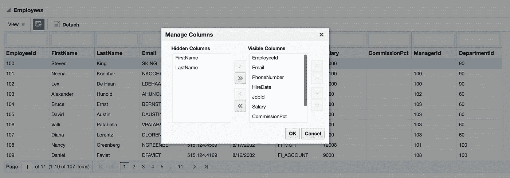
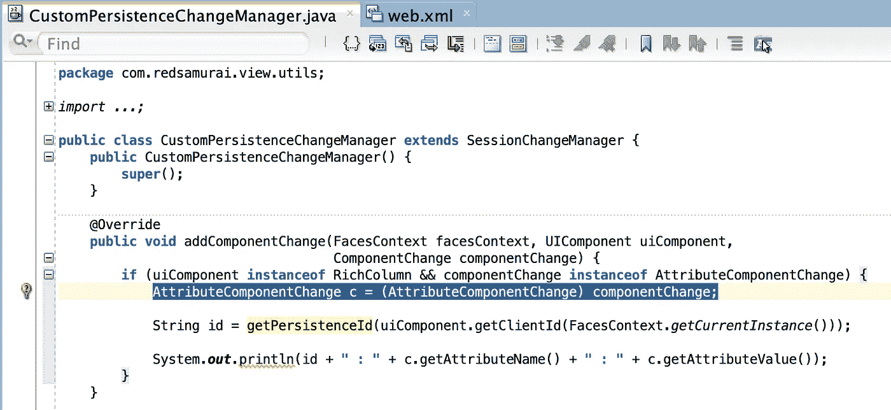
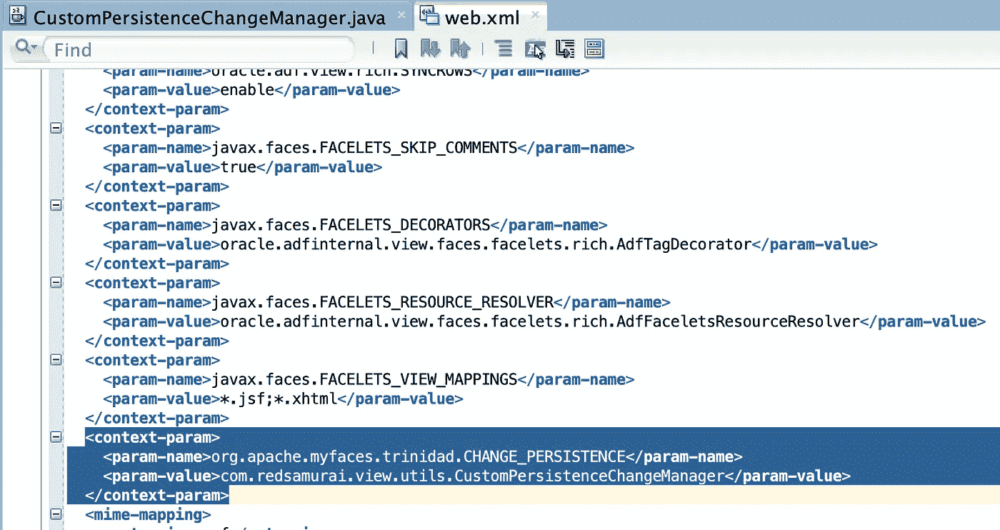
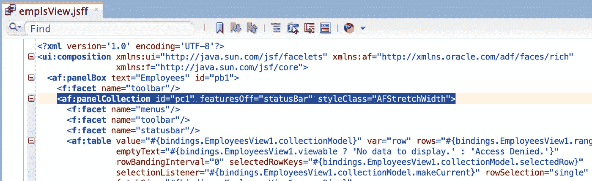
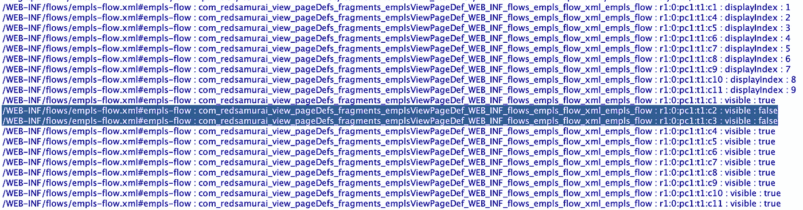

# 使用自定义更改管理器类截取 ADF 表列显示/隐藏事件

> 原文：<https://medium.com/oracledevs/intercepting-adf-table-column-show-hide-event-with-custom-change-manager-class-d8d264979979?source=collection_archive---------0----------------------->

想知道如何从 ADF 面板集合组件中截取 ADF 表列显示/隐藏事件吗？是的，您可以使用 ADF MDS 功能来存储表可见列的用户首选项。但是如果您想自己实现它而不使用 MDS 呢？实际上，这可以通过自定义持久性管理器类来实现。我会告诉你怎么做。

如果你不知道我在说什么？检查下面的屏幕截图，这个弹出框是 ADF 面板集合的一部分，它有助于管理表格的可见列。非常有用，尤其是对于大型表:

显然，我们希望存储用户首选项，下次用户返回表单时，他应该会看到以前存储的表列设置。实现这一点的一种方法是使用现成的 ADF MDS 功能。但是如果你不想用呢？仍然有可能—我们可以通过自定义变更管理器类中的管理列弹出菜单捕获所有变更。从 SessionChangeManager 扩展并只覆盖一个方法— *addComponentChange* 。这是我们截取更改并将它们记录到数据库的地方(例如，在表单加载的后面，我们可以在片段呈现之前读取表设置并应用它):

在 web.xml 中注册自定义更改管理器类:

管理列弹出窗口是 ADF 面板收集组件提供的现成功能:

方法 *addComponentChange* 将被自动调用，当更改表列的可见性时，您应该会看到类似的输出:

从我的 [GitHub](https://github.com/abaranovskis-redsamurai/TableColumnHanlderApp) 库下载示例应用程序代码。

*原载于 2019 年 2 月 20 日*[*andrejusb.blogspot.com*](https://andrejusb.blogspot.com/2019/02/intercepting-adf-table-column-showhide.html)*。*