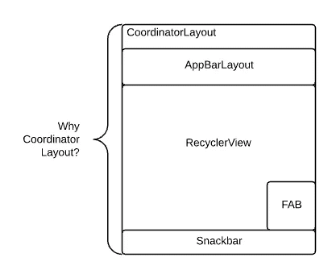

# 使用 CoordinatorLayout 行为截取所有内容

> 原文：<https://medium.com/androiddevelopers/intercepting-everything-with-coordinatorlayout-behaviors-8c6adc140c26?source=collection_archive---------0----------------------->



如果不碰到[*【coordinator layout*](http://developer.android.com/reference/android/support/design/widget/CoordinatorLayout.html?utm_campaign=adp_series_coordinatorlayoutbehavior_021716&utm_source=medium&utm_medium=blog)——设计库中的许多视图都需要一个 *CoordinatorLayout* ，你就无法深入探索 [Android 设计支持库](http://android-developers.blogspot.com/2015/05/android-design-support-library.html?utm_campaign=adp_series_coordinatorlayoutbehavior_021716&utm_source=medium&utm_medium=blog)。但是为什么呢？ *CoordinatorLayout* 本身实际上并没有做太多事情:将它与标准框架视图一起使用，它的行为就像一个常规的*框架布局*。那么魔力来自哪里呢？那就是 [*CoordinatorLayout 的地方。*s 进来的行为。**通过将*行为*附加到 *CoordinatorLayout* 的直接子节点，您将能够拦截触摸事件、窗口插入、测量、布局和嵌套滚动**。设计库大量使用行为来增强您看到的许多功能。](http://developer.android.com/reference/android/support/design/widget/CoordinatorLayout.Behavior.html?utm_campaign=adp_series_coordinatorlayoutbehavior_021716&utm_source=medium&utm_medium=blog)

## 创造一种行为

创建行为非常简单:扩展*行为*。

```
public class FancyBehavior<V extends View>
    extends CoordinatorLayout.Behavior<V> { /**
   * Default constructor for instantiating a FancyBehavior in code.
   */
  public FancyBehavior() {
  } /**
   * Default constructor for inflating a FancyBehavior from layout.
   *
   * @param context The {@link Context}.
   * @param attrs The {@link AttributeSet}.
   */
  public FancyBehavior(Context context, AttributeSet attrs) {
    super(context, attrs);
    // Extract any custom attributes out
    // preferably prefixed with behavior_ to denote they
    // belong to a behavior
  }
}
```

请注意附加到该类的泛型类型。这里，我们要说的是你可以将一个 *FancyBehavior* 附加到任何 *View* 类上。然而，如果您想只允许将*行为*附加到特定种类的*视图*上，您可以将它写成:

```
public class FancyFrameLayoutBehavior
    extends CoordinatorLayout.Behavior<FancyFrameLayout>
```

这将使您不必将方法调用中收到的许多参数从视图转换为正确的子类型——简单方便而已。

有用[*Behavior . settag()*](http://developer.android.com/reference/android/support/design/widget/CoordinatorLayout.Behavior.html?utm_campaign=adp_series_coordinatorlayoutbehavior_021716&utm_source=medium&utm_medium=blog#setTag(android.view.View,%20java.lang.Object))/[/*Behavior . gettag()*](http://developer.android.com/reference/android/support/design/widget/CoordinatorLayout.Behavior.html?utm_campaign=adp_series_coordinatorlayoutbehavior_021716&utm_source=medium&utm_medium=blog#getTag(android.view.View))保存临时数据的方法，也有用[*onSaveInstanceState()*](http://developer.android.com/reference/android/support/design/widget/CoordinatorLayout.Behavior.html?utm_campaign=adp_series_coordinatorlayoutbehavior_021716&utm_source=medium&utm_medium=blog#onSaveInstanceState(android.support.design.widget.CoordinatorLayout,%20V))/[/*onRestoreInstanceState()*](http://developer.android.com/reference/android/support/design/widget/CoordinatorLayout.Behavior.html?utm_campaign=adp_series_coordinatorlayoutbehavior_021716&utm_source=medium&utm_medium=blog#onRestoreInstanceState(android.support.design.widget.CoordinatorLayout,%20V,%20android.os.Parcelable))保存行为相关实例状态的方法。我鼓励你尽可能地构建轻量级的行为，但是这些方法有助于实现有状态的行为。

# 附加行为

当然，行为本身不会做任何事情——它们需要被附加到一个 *CoordinatorLayout* 的子视图上才能被真正调用。有三种主要方式可以做到这一点:以编程方式、以 XML 格式或通过注释自动完成。

## 以编程方式附加行为

当您将*行为*视为附加到 CoordinatorLayout 中每个视图的附加内容时，了解到**行为实际上存储在每个视图**的 *LayoutParams* 中并不奇怪(如果您已经阅读了我们的 [Layouts 博文](/@ianhlake/layouts-attributes-and-you-9e5a4b4fe32c))——这也是为什么行为需要在 *CoordinatorLayout* 的直接子元素上声明，因为只有这些子元素具有 layout 的特定行为存储子类

```
FancyBehavior fancyBehavior = new FancyBehavior();
CoordinatorLayout.LayoutParams params =
    (CoordinatorLayout.LayoutParams) yourView.getLayoutParams();
params.setBehavior(fancyBehavior);
```

在这种情况下，您会看到我们使用默认的无参数构造函数。但这并不意味着你不能有一个接受你想要的任何参数的构造函数——当用代码做事情时，你能做的没有限制。

## 在 XML 中附加行为

当然，每次都用代码做所有的事情会有点乱。与大多数定制的 *LayoutParams* 一样，有一个相应的 *layout_* 属性来做同样的事情。在本例中，那就是 ***布局 _ 行为*** 属性:

```
<FrameLayout
  android:layout_height=”wrap_content”
  android:layout_width=”match_parent”
  app:layout_behavior=”.FancyBehavior” />
```

这里，与代码案例不同的是，*fancy behavior(Context Context，AttributeSet attrs)* 构造函数总是被调用的那个。另外，您可以声明任何其他想要的自定义属性，并从 XML AttributeSet 中提取它们——如果您希望开发人员能够通过 XML 自定义您的行为功能(您确实这样做了),这一点很重要。

> **注意**:类似于父类负责解析和理解的属性的 layout_ naming 约定，**使用 *behavior_* 前缀**作为行为专用的任何属性。

## 自动附加行为

如果您正在构建一个需要自定义行为的自定义视图(例如设计库中的许多组件)，那么您可能希望默认附加该行为，而不需要每次都在代码或 XML 中手动指定它。要做到这一点，您的自定义视图只需要一个附加到其类顶部的简单注释:

```
@CoordinatorLayout.DefaultBehavior(FancyFrameLayoutBehavior.class)
public class FancyFrameLayout extends FrameLayout {
}
```

您会发现您的行为是用默认构造函数调用的，这与以编程方式附加行为非常相似。注意，任何存在的 layout_behavior 属性都将覆盖一个[*default behavior*](http://developer.android.com/reference/android/support/design/widget/CoordinatorLayout.DefaultBehavior.html?utm_campaign=adp_series_coordinatorlayoutbehavior_021716&utm_source=medium&utm_medium=blog)。

# 拦截触摸事件

一旦你把你的行为都设置好了，你就准备好实际去做一些事情了。行为可以做的事情之一是拦截触摸事件。

如果没有 *CoordinatorLayout* ，这通常会涉及到每个*视图组*的子类，正如在[管理触摸事件培训](http://developer.android.com/training/gestures/viewgroup.html?utm_campaign=adp_series_coordinatorlayoutbehavior_021716&utm_source=medium&utm_medium=blog)中所谈到的。然而，使用 *CoordinatorLayout* ， *CoordinatorLayout* 将把对其[*on interceptouchevent()*](http://developer.android.com/reference/android/view/ViewGroup.html?utm_campaign=adp_series_coordinatorlayoutbehavior_021716&utm_source=medium&utm_medium=blog#onInterceptTouchEvent(android.view.MotionEvent))的调用传递到您行为的[*on interceptouchevent()*](http://developer.android.com/reference/android/support/design/widget/CoordinatorLayout.Behavior.html?utm_campaign=adp_series_coordinatorlayoutbehavior_021716&utm_source=medium&utm_medium=blog#onInterceptTouchEvent(android.support.design.widget.CoordinatorLayout,%20V,%20android.view.MotionEvent))，**上，从而允许您的*行为*有机会拦截触摸事件**。通过在那里返回*真*，你的行为然后通过[*onTouchEvent()*](http://developer.android.com/reference/android/support/design/widget/CoordinatorLayout.Behavior.html?utm_campaign=adp_series_coordinatorlayoutbehavior_021716&utm_source=medium&utm_medium=blog#onTouchEvent(android.support.design.widget.CoordinatorLayout,%20V,%20android.view.MotionEvent))接收所有未来的触摸事件——所有这些都没有视图知道正在发生什么。例如，[*SwipeDismissBehavior*](http://developer.android.com/reference/android/support/design/widget/SwipeDismissBehavior.html?utm_campaign=adp_series_coordinatorlayoutbehavior_021716&utm_source=medium&utm_medium=blog)在任何视图上都是这样工作的。

还有另一种更严厉的触摸拦截:阻止所有的交互。只需在[*blocksInteractionBelow()*](http://developer.android.com/reference/android/support/design/widget/CoordinatorLayout.Behavior.html?utm_campaign=adp_series_coordinatorlayoutbehavior_021716&utm_source=medium&utm_medium=blog#blocksInteractionBelow(android.support.design.widget.CoordinatorLayout,%20V))中返回*真*即可。当然，你可能希望有一些交互被阻止的视觉信号(以免他们认为应用程序完全坏了)——这就是为什么 *blocksInteractionBelow()* 的默认功能实际上依赖于[*getscrimopiaty()*](http://developer.android.com/reference/android/support/design/widget/CoordinatorLayout.Behavior.html?utm_campaign=adp_series_coordinatorlayoutbehavior_021716&utm_source=medium&utm_medium=blog#getScrimOpacity(android.support.design.widget.CoordinatorLayout,%20V))的值——在这里返回一个非零值将在视图上绘制一种覆盖颜色(颜色[*【getScrimColor()*](http://developer.android.com/reference/android/support/design/widget/CoordinatorLayout.Behavior.html?utm_campaign=adp_series_coordinatorlayoutbehavior_021716&utm_source=medium&utm_medium=blog#getScrimColor(android.support.design.widget.CoordinatorLayout,%20V))，默认为黑色)并同时禁用触摸交互。方便。

# 截取窗口插入

假设您阅读了[我为什么要安装系统 Windows？博客](/google-developers/why-would-i-want-to-fitssystemwindows-4e26d9ce1eec?utm_campaign=adp_series_coordinatorlayoutbehavior_021716&utm_source=medium&utm_medium=blog)。在那里，我们深入讨论了 fitsSystemWindows 实际上是做什么的，但归结起来就是为您提供避免在系统窗口(如状态栏和导航栏)下绘制所需的窗口插入。行为在这里也得到了自己的机会——如果您的视图*符合 SystemWindows="true"* ，那么任何附加的*行为*都将获得对[*on applywindowsets()*](http://developer.android.com/reference/android/support/design/widget/CoordinatorLayout.Behavior.html?utm_campaign=adp_series_coordinatorlayoutbehavior_021716&utm_source=medium&utm_medium=blog#onApplyWindowInsets(android.support.design.widget.CoordinatorLayout,%20V,%20android.support.v4.view.WindowInsetsCompat))的调用，使其优先于视图本身。

> **注意**:在大多数情况下，如果你的行为没有消耗整个窗口 Insets，它应该通过[viewcompt . dispatchapplywindowsets()传递 insets，以确保任何子视图都有机会看到窗口 insets。](http://developer.android.com/reference/android/support/v4/view/ViewCompat.html?utm_campaign=adp_series_coordinatorlayoutbehavior_021716&utm_source=medium&utm_medium=blog#dispatchApplyWindowInsets(android.view.View,%20android.support.v4.view.WindowInsetsCompat))

# 截取测量和布局

尺寸和布局是 Android 如何绘制视图的关键组成部分。因此，行为作为所有事物的拦截者，也通过[*【onMeasureChild()*](http://developer.android.com/reference/android/support/design/widget/CoordinatorLayout.Behavior.html?utm_campaign=adp_series_coordinatorlayoutbehavior_021716&utm_source=medium&utm_medium=blog#onMeasureChild(android.support.design.widget.CoordinatorLayout,%20V,%20int,%20int,%20int,%20int))和[*onLayoutChild()*](http://developer.android.com/reference/android/support/design/widget/CoordinatorLayout.Behavior.html?utm_campaign=adp_series_coordinatorlayoutbehavior_021716&utm_source=medium&utm_medium=blog#onLayoutChild(android.support.design.widget.CoordinatorLayout,%20V,%20int))回调首先获得度量和布局才有意义。

例如，让我们取任意一个通用视图组，并为其添加一个 maxWidth:

编写适用于所有情况的通用行为是有用的，但是请记住，您通常可以通过假设应用程序内部的行为是如何使用的来简化您的生活。(不是每个*行为*都需要完全通用！)

# 了解视图之间的依赖关系

所有上述功能只需要一个视图。但是行为的真正力量在于建立视图之间的依赖关系——也就是说，当另一个视图改变时，您的*行为*可以得到回调，根据外部条件改变其功能。

行为可能以两种不同的方式依赖于视图:当它的视图锚定到另一个视图时(一种隐含的依赖)，或者当您在[*layoutDependsOn()*](http://developer.android.com/reference/android/support/design/widget/CoordinatorLayout.Behavior.html?utm_campaign=adp_series_coordinatorlayoutbehavior_021716&utm_source=medium&utm_medium=blog#layoutDependsOn(android.support.design.widget.CoordinatorLayout,%20V,%20android.view.View))中显式返回 *true* 时。

当您的视图利用 *CoordinatorLayout* 的 [*layout_anchor*](http://developer.android.com/reference/android/support/design/widget/CoordinatorLayout.LayoutParams.html?utm_campaign=adp_series_coordinatorlayoutbehavior_021716&utm_source=medium&utm_medium=blog#getAnchorId()) 属性时，就会发生锚定。这与[*layout _ anchor gravity*](http://developer.android.com/reference/android/support/design/widget/CoordinatorLayout.LayoutParams.html?utm_campaign=adp_series_coordinatorlayoutbehavior_021716&utm_source=medium&utm_medium=blog#anchorGravity)属性相结合，允许您有效地将两个视图的位置联系在一起。例如，您可以将*浮动操作按钮*锚定到 *AppBarLayout* 和*浮动操作按钮。如果 *AppBarLayout* 滚动出屏幕，行为*将使用隐式依赖来隐藏 FAB。

在任一种情况下，当一个依赖视图被删除时，您的*行为*获得对[*ondependtviewremoved()*](http://developer.android.com/reference/android/support/design/widget/CoordinatorLayout.Behavior.html?utm_campaign=adp_series_coordinatorlayoutbehavior_021716&utm_source=medium&utm_medium=blog#onDependentViewRemoved(android.support.design.widget.CoordinatorLayout,%20V,%20android.view.View))的回调，并且每当该依赖视图发生变化时(即，调整自身大小或重新定位自身)，获得对[*ondependtviewchanged()*](http://developer.android.com/reference/android/support/design/widget/CoordinatorLayout.Behavior.html?utm_campaign=adp_series_coordinatorlayoutbehavior_021716&utm_source=medium&utm_medium=blog#onDependentViewChanged(android.support.design.widget.CoordinatorLayout,%20V,%20android.view.View))的回调。

这种将视图联系在一起的能力是设计库的大部分更酷的功能——以*浮动操作按钮*和*小吃条*之间的交互为例。FAB 的*行为*依赖于 *Snackbar* 的实例被添加到 *CoordinatorLayout* 中，然后使用 o*nDependentViewChanged()*回调将 FAB 向上平移以避免与 *Snackbar* 重叠。

> **注意**:当您添加一个依赖关系时，无论子视图的顺序如何，*视图*总是在依赖视图布局之后进行布局。

# 嵌套滚动

啊，嵌套滚动。一篇博文，我将在这里简单介绍一下。有几件事要记住:

1.  您不需要声明嵌套滚动视图的依赖关系。 *CoordinatorLayout* 的每个子节点都有机会接收嵌套的滚动事件
2.  嵌套滚动不仅可以源自 *CoordinatorLayout* 的直接子视图，还可以源自**任何**子视图(例如 *CoordinatorLayout* 的子视图的子视图)
3.  我称之为嵌套滚动，但这实际上涵盖了滚动(1:1 移动到滚动)和投掷

因此，声明您对嵌套滚动事件的兴趣从[*onStartNestedScroll()*](http://developer.android.com/reference/android/support/design/widget/CoordinatorLayout.Behavior.html?utm_campaign=adp_series_coordinatorlayoutbehavior_021716&utm_source=medium&utm_medium=blog#onStartNestedScroll(android.support.design.widget.CoordinatorLayout,%20V,%20android.view.View,%20android.view.View,%20int))开始。您将接收滚动轴(例如水平或垂直——很容易忽略某个方向的滚动),并且**必须返回 *true* 以接收该方向的进一步滚动事件**。

在将 *true* 返回到 *onStartNestedScroll()* 之后，嵌套滚动分两步运行:

*   [](http://developer.android.com/reference/android/support/design/widget/CoordinatorLayout.Behavior.html?utm_campaign=adp_series_coordinatorlayoutbehavior_021716&utm_source=medium&utm_medium=blog#onNestedScroll(android.support.design.widget.CoordinatorLayout,%20V,%20android.view.View,%20int,%20int,%20int,%20int))*onNestedScroll()在滚动视图时被调用——你会得到视图滚动了多少以及未消耗(过度滚动)的数量。*

*对于 fling 操作也有一个等价的方法(尽管预 fling 回调必须消耗全部或者不消耗 fling——没有部分消耗)。*

*当嵌套滚动(或投掷)完成时，您将得到对[*onStopNestedScroll()*](http://developer.android.com/reference/android/support/design/widget/CoordinatorLayout.Behavior.html?utm_campaign=adp_series_coordinatorlayoutbehavior_021716&utm_source=medium&utm_medium=blog#onStopNestedScroll(android.support.design.widget.CoordinatorLayout,%20V,%20android.view.View))的调用。这标志着滚动的结束——在下一次滚动开始之前，期待对 *onStartNestedScroll()* 的新调用。*

*举个例子，你想在向下滚动的时候隐藏一个 FloatingActionButton，在向上滚动的时候显示它——这只涉及到重写 *onStartNestedScroll()* 和 *onNestedScroll()* ，如这个[*fabawarescrollingviewphabehavior*](https://github.com/ianhanniballake/cheesesquare/blob/scroll_aware_fab/app/src/main/java/com/support/android/designlibdemo/FABAwareScrollingViewBehavior.java?utm_campaign=adp_series_coordinatorlayoutbehavior_021716&utm_source=medium&utm_medium=blog)所示。*

## *这仅仅是开始*

*虽然一个行为的每个部分都很有趣，但是当它们都聚集在一起时——这就是奇迹发生的地方。我强烈建议您查看设计库的源代码以了解更多高级行为——[Android SDK 搜索 Chrome 扩展](https://chrome.google.com/webstore/detail/android-sdk-search/hgcbffeicehlpmgmnhnkjbjoldkfhoin?utm_campaign=adp_series_coordinatorlayoutbehavior_021716&utm_source=medium&utm_medium=blog)仍然是我探索 AOSP 代码的最喜欢的资源之一(尽管包含在*<Android-SDK>/extras/Android/m2 repository*中的源代码总是最新的)。*

*有了*行为*能做什么的坚实基础，让我知道你如何使用它们来# BuildBetterApps*

*加入关于 [Google+帖子](https://plus.google.com/+AndroidDevelopers/posts/WojFEkDdFNe?utm_campaign=adp_series_coordinatorlayoutbehavior_021716&utm_source=medium&utm_medium=blog)的讨论，关注 [Android 开发模式集](https://plus.google.com/collection/sLR0p?utm_campaign=adp_series_coordinatorlayoutbehavior_021716&utm_source=medium&utm_medium=blog)了解更多！*

**