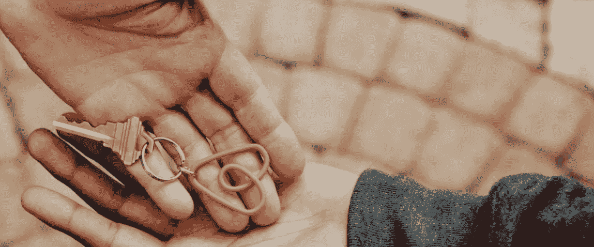

# 带着残疾在 Airbnb 实习

> 原文：<https://medium.com/airbnb-engineering/interning-at-airbnb-with-a-disability-78567997c9a4?source=collection_archive---------2----------------------->

## 作为一个残疾人，我是如何在 Airbnb 社区中找到归属感和成长空间的。

A picture of two people’s hands as one gives a key attached to a keychain of the Rausch-colored Bélo, Airbnb’s universal symbol of belonging, to the other.

我叫 Hilary Sun，是斯坦福大学的一名硕士研究生，即将获得计算机科学的硕士学位。过去 12 周，我在信托-金融欺诈团队担任工程实习生，该团队通过最大限度地减少欺诈性财务损失，同时尽可能提供最佳用户体验，来保持 Airbnb 的业务安全。我也是 Able@的成员，这是 Airbnb 的一个航空团体，为不同残疾的员工和盟友服务。

Airfinity groups 是 Airbnb 的员工资源组，通过共同的经历和身份来培养员工的归属感。此外，Airfinity 集团推动社区和宣传活动，为校内和校外社区规划和举办活动，并将盟友与他们希望支持和了解的事业联系起来。Able@是一个旨在增强和支持其成员以及参与宣传的空间，例如满足员工的无障碍需求以及与自闭症优势等社区组织合作。

我认为自己有残疾，这是我身份的一部分，直到今年我才真正探索过。从小到大，我一直被告知残疾的定义是基于它的可见性。作为一个可以隐藏我的慢性疾病的人，我对在残疾人社区中占据一席之地感到不舒服。

我的病一直被认为是消极的、可耻的、限制性的；我的身体变成了需要“修复”的东西当我被确诊时，我在医院和治疗间来回穿梭，每个人似乎都知道我需要什么，除了我自己。我不再属于我的身体。它变成了某种陌生的、不可控制的、无法逃避的东西。

到了大学，我终于有了远离家人的空间，可以自己按照自己的节奏学习身体所需。当我在实习的第一天踏进 Airbnb 时，我刚刚开始探索能力和残疾的概念，但这足以让我决定去参加我的第一次能力@午餐。

“有能力”同时赋予了我力量和谦卑。这是我第一次可以谈论自己的残疾而不感到羞耻。我不断地被引入新的词汇——有些我已经认同，有些我知道我必须学习更多。文章、资源、事件和可访问性会议被分享，打开了我的视野，让我看到了整个社区的倡导者和参与方式。在会议和午餐上，我们谈笑风生，谈论各种事情，从 Airbnb 员工为确保平台更具包容性而开展的令人惊叹的无障碍工作，到 Ocean Vuong 和巴勃罗·聂鲁达的诗歌。我们甚至一起去了 Airbnb 体验:旧金山盲人咖啡馆体验，我们在完全黑暗的环境中用餐，听主人和其他食客分享故事。

Airbnb 吸引我的是它对归属感的奉献，在这个夏天来到这里之后，我可以说这个社区真的很特别。我正学着在我的身体里再次感到舒适——庆祝它的局限性，因为它是美丽的、独特的、与我不可分割的。我正在学习表达我的需求——今年夏天，我第一次和我的经理谈论我的需求，他给予了我支持和尊重。我正在学习扩展我的包容性观点所需的所有方法，以及我需要了解更多的我不知道的社区。所有这些，我希望在这个学年带回到我在斯坦福的社区工作中。

在盲人咖啡馆的经历最能说明我的归属感。当我坐在黑暗中，睁着眼睛却什么也看不见时，我能尝到恐惧在我喉咙里升起的冰冷感觉，并试图抑制逃跑的冲动。“我可以牵你的手吗？”我没有特别问任何人。过了一会儿，我感觉到我两侧的“能干”成员的手抓住了我的手指，我的心率稳定了下来。在那一刻，我感到踏实、平静，并有足够的勇气在几分钟后放手去找我的叉子并开始用餐。

感谢 Airbnb 和 Able@在这个夏天为我提供了这个成长和学习的空间。