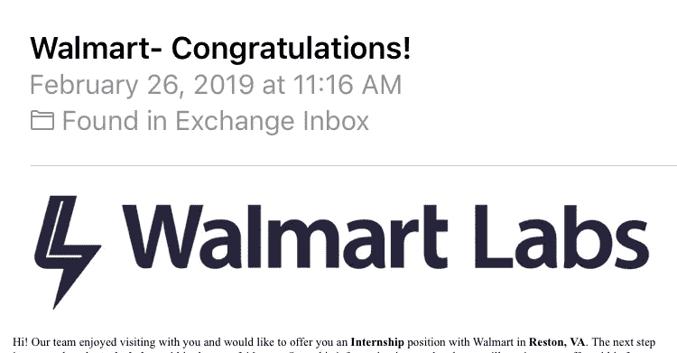

# 在美国弗吉尼亚州莱斯顿沃尔玛实验室的实习经历

> 原文：<https://medium.com/walmartglobaltech/internship-experience-with-walmartlabs-reston-va-usa-7e33c5e9082d?source=collection_archive---------5----------------------->

与 WalmartLabs 合作是我经历过的最好的经历之一。这就像在创业公司工作，每个人都超级有才华，而且很谦虚。从面试过程开始到实习的最后一天，一切都计划得很好。我们编写了大约 30，000 行代码，获得了许多关于云部署、生产级代码的最佳实践、代码审查和承担责任的知识。这不仅仅是关于代码，我们在实习期间享受了很多。查看以下内容，了解更多信息。

*   面试流程，录用函
*   第一周—股东，本顿维尔
*   团队和项目详细信息
*   发现阶段，敏捷管理
*   实施阶段
*   技术堆栈
*   民众
*   绩效报告
*   夏日野餐，绘画和啜饮，激光标签，令人敬畏的旅程

# 面试过程

沃尔玛实验室的面试流程与其他科技公司大相径庭。我总共喝了 3 杯。大多数面试将在周五进行，因为对高级软件工程师来说时间很灵活。整个过程耗时 1 个月。面试过程因人而异。

**第 1 轮** (1 小时)——我的面试官非常友好，让我用算法和数据结构解决两个基于场景的问题。

第一轮后，我收到一封电子邮件，里面有一周内要做的项目细节。这个项目有些棘手。为了解决这个项目，你需要跳出框框思考。我用操作系统算法解决了这个项目。我们需要用清晰的文档和测试来编写生产级代码。

**第二轮** (1 小时)——在这一轮中，你需要解释你从事的项目，你需要解释为什么你用一种特定的算法解决了这个问题？。面试官还让我解决几个边缘案例，他问我如何改变我的算法来解决这些边缘案例。

**第三轮**(经理轮):这一轮，面试官问我的目标，以及我感兴趣的技术。

然后……嘣！

# **第一周——本顿维尔股东大会**

这是整个实习过程中最棒的一周，沃尔玛资助所有实习生的这次旅行。作为一名东海岸实习生，我于 6 月 5 日飞往本顿维尔。我们开了两个派对，然后是股东大会。

2019 Shareholders Meeting

# 团队和项目详细信息

我的项目是基于创建一个响应式 web 应用程序来帮助资产保护团队。该项目包括 4 个主要部分:

*   检查——夜班经理每天在商场检查电动起重设备的界面。
*   审查—供值班经理审查提交的检验的界面。
*   审计——审计员生成商店绩效合规报告的界面。
*   报告—家庭办公室的仪表板，了解所有商店和区域的表现，并确定培训机会。

我和资产保护团队一起工作，还有两个实习生，这是一个非常好的团队。在两位资深软件工程师的帮助下，我的经理很好地指导我们在 10 周内构建了一个最小可行的产品，他们在 UI 和后端方面都有多年的经验。

# 发现阶段，敏捷管理

从 6 月 10 日到 6 月 21 日，我们参观了位于泰森角的沃尔玛购物中心，发现了项目需求。我们与我们的经理和产品负责人互动，以定义范围和团队，并进行积压整理和优先排序。在这个阶段，我们被告知要集思广益，找出我们想要开发服务架构的方式。高级软件工程师帮助我们消除了架构中的复杂性。

WalmartLabs 遵循敏捷方法。我们每天都有站立会议，在会上我们讨论我们已经做了什么和我们将要做什么。我们使用 JIRA 进行冲刺规划，冲刺持续时间为两周。每周我都和我的经理进行一对一的会谈。

# 实施阶段

在实习的最初几天，我在后台工作。我使用 Java Spring Boot 通过适当的文档和测试创建了 REST APIs。后来做 React JS。我们使用 Plotly 和 Nivo 通过 React JS 创建仪表板。我们在暂存云中部署了后端和前端组件。

# 技术堆栈

*   爪哇 Spring Boot:[https://spring.io/projects/spring-boot](https://spring.io/projects/spring-boot)
*   反应过来:[https://reactjs.org](https://reactjs.org)
*   react-Redux:https://Redux . js . org/basics/usage-with-react
*   axios:[https://github.com/axios/axios](https://github.com/axios/axios)
*   材料 UI:[https://material-ui.com](https://material-ui.com)
*   OneOps:[http://oneops.com](http://oneops.com)
*   liqui base:[https://www.liquibase.org](https://www.liquibase.org)
*   詹金斯: [https://jenkins.io](https://jenkins.io)
*   redux-Persist:[https://github.com/rt2zz/redux-persist](https://github.com/rt2zz/redux-persist)
*   6 月 4 日:[https://junit.org/junit4/](https://junit.org/junit4/)
*   莫奇托:[https://site.mockito.org](https://site.mockito.org)
*   阴谋地:【https://plot.ly/javascript/react/】T21
*   https://github.com/plouc/nivo

# 民众

每次冲刺，我们都向产品负责人展示我们的进展。除了这些演示，我们总共有 5 个主要的演示。

1.  中点演示—向产品负责人演示
2.  商店演示——向商店经理沃尔玛、泰森斯角展示
3.  Lightning Talk 演示——向沃尔玛美国和电子商务部的 SVP 工程、客户技术部门的 Fiona Tan 以及沃尔玛实验室的其他同事演示
4.  实习生演示日——与我们的实习生同事一起，与 WalmartLabs 同事一起进行演示和深入探讨
5.  最终演示—向产品负责人、其他业务利益相关者和我们的总监演示

# 绩效评估

绩效评估帮助我知道我在实习中的位置，也帮助我知道我需要关注和改进的领域以及我做得很好的领域。在实习期间，我收到了两份绩效报告:期中绩效评估和期末绩效评估。

# 夏日野餐，绘画和啜饮，激光标签，令人敬畏的旅程

根据我的理解， **W** almart **L** abs 的意思是 W-工作，L-生活平衡。实习期间我们玩得很开心。这里有几张照片。

Summer Outing pictures(Stephen Reasonover Photography)