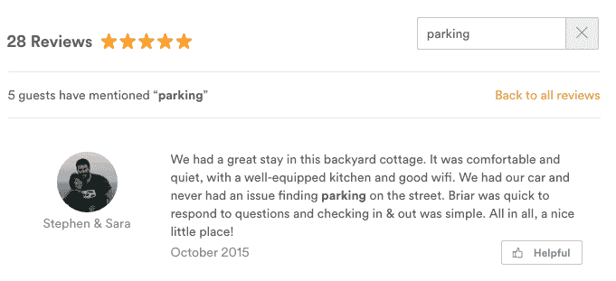
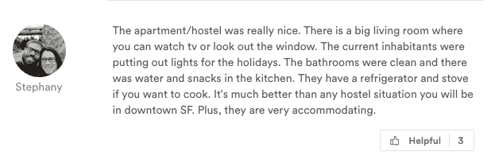

# 实习亮点:复习升级

> 原文：<https://medium.com/airbnb-engineering/internship-highlight-review-upgrades-2820c9cea56a?source=collection_archive---------1----------------------->

作者:[玛雅·艾布斯沃斯](https://www.linkedin.com/in/mayaebsworth)，[凯齐亚·普拉特纳](https://www.linkedin.com/in/keziahsonderplattner)，[伊恩·纳什](https://www.linkedin.com/in/iainpnash)，[尼古拉斯·莫斯乔普洛斯](https://www.linkedin.com/in/nicholas-moschopoulos-0b280180)

# 我们是谁？

你好！我们是 2015 年夏天加入 Airbnb 的 4 名工程实习生，在搜索体验团队工作。搜索团队负责在 Airbnb 上寻找和预订房屋的一切相关事宜。在整个夏天，我们为团队做了各种各样的项目，但我们的最后一个项目专注于改善客人消化评论和与评论互动的方式。这是一个不可思议的机会，我们帮助完成了设计，定义了 okr，并被赋予了重要的实施任务。

我们四个人分别是:玛雅·埃布斯沃斯(UPenn，2016 计算机科学学士)、凯齐亚·普拉特纳(斯坦福，2016 计算机科学学士/硕士)、伊恩·纳什(南加州大学，2016 计算机科学学士)、尼古拉斯·莫斯乔普洛斯(加州大学伯克利分校，2016 计算机科学学士)。

# 为什么我们要做评论？

点评为 Airbnb 建立了信任的基础。我们的数据科学家已经做了研究，表明评论是客人在决定是否留在某家时最重要的特征之一。客人依靠评论来做决定和设定期望，但是对于有许多评论的住宅来说，通读所有这些评论并找到相关信息变得难以管理(我们最受欢迎的住宅目前有 700 条评论)。正因为如此，点评并没有给客人带来应有的帮助。我们相信，让点评更容易理解将有助于客人决定预订哪家酒店。

# 查看升级

我们发现有几种方法可以让评论更有用:

*   允许客人搜索房屋评论
*   为每个家庭生成最佳评论的集锦
*   允许客人投票决定评论的有用程度

# 1.搜索评论

*伊恩·纳什和凯齐亚·普拉特纳*

对于有大量评论的列表，客人需要手动一页一页地筛选，以便找到他们要找的东西。例如，一个去旧金山的旅行者可能想通过阅读提到“停车”的评论来查看是否容易在家附近找到停车场。随着评论的数量呈指数级增长，这变得越来越困难。我们的解决方案是允许客人搜索给定房屋的所有评论。

我们将 Elasticsearch 用于评论搜索后端，将相关的评论 id 返回给我们的主 Rails 应用程序。Rails 应用程序获取完整的评论数据和呈现评论所需的相关对象。我们实现了一个后端服务来索引和返回来自 Elasticsearch 的结果。最初的索引步骤是通过从 S3 加载 reviews 数据库导出并运行批处理导入来填充 Elasticsearch 数据库。

为了支持更新，我们需要服务在每次插入、删除和更新评论时接收更新。Elasticsearch 被设计成接近实时的搜索，所以为了使评论在搜索服务中可见，我们所要做的就是每当数据库更新可用时，将它添加到索引中。我们使用了两个内部服务来支持实时更新:一个是静态类型事件消息的发布-订阅服务，另一个是生成这些事件以供消费的服务。我们为评论搜索服务建立了接收这些更新的渠道，并根据需要更新了 Elasticsearch。

# 2.回顾重点

尼科·莫斯乔普洛斯

这个实验的目的是让客人看到一小段对某个家有帮助的评论。为了简化这个项目，我们决定创建一个初步的过滤器来识别向客人展示的足够高质量的句子。最初的方法是使用频繁出现在访客评论中的关键词进行过滤。将来可以很容易地更新该组关键字。

然后，我们对过滤后的句子应用句子评分函数来对结果进行排名。句子评分功能是很多神奇之处，也是很多实验发生的地方。我们尝试了各种技术，包括对句子中的单词进行 TF-IDF 加权求和，对整个评论语料库中前 500 个单字进行计数，甚至只查看句子长度。随着搜索团队提高列表详细信息页面的清晰度，我们将尝试推出各种评论亮点。

在这个项目上工作是非常棒的经历。我有很大的自由来决定尝试什么，以及如何确定什么是最好的。作为一名实习生，它也给了我一个项目端到端的接触和责任，从定义范围开始，一直到架构。整个夏天，我都得到了很多帮助和指导，但它确实让我看到了作为一名全职员工会是什么样子。感谢陆！

# 3.“这有帮助吗？”投票

*玛雅·艾布斯沃斯和凯齐亚·普拉特纳*

在我们的第三个实验中，我们想看看是否可以帮助客人识别有用的评论，并改善评论的排序。我们认为添加评论投票功能可以让客人识别他们认为有帮助的评论，显示投票数可以让其他用户看到过去帮助过其他客人的内容。一旦收集到足够多的投票，我们就可以根据评论的有用性对其进行分类。

此功能的后端是通过 Airbnb 内部开发的通用后端服务框架实现的。该框架抽象出样板逻辑，并将服务逻辑封装在称为操作符的轻量级、可重用组件中。我们实现的操作符与 MySQL 数据库连接，以插入、删除和更新评论中的投票。此外，与评论相关联的计数和用户 id 被缓存以便高效检索。因为我们加载了很多评论的投票，所以我们使用 MySQL+ Memcached 来缓存结果和提高性能。

后端实现了一般的投票功能，以允许未来的其他类型的投票(否决，或将评论归类为有趣，等等)。这将允许后端非常容易扩展，如果搜索团队决定在未来试验投票功能。随着 Airbnb 继续个性化客人体验，点评有用性将作为信号纳入其他相关系统。

## 在 [airbnb.io](http://airbnb.io) 查看我们所有的开源项目，并在 Twitter 上关注我们:[@ Airbnb eng](https://twitter.com/AirbnbEng)+[@ Airbnb data](https://twitter.com/AirbnbData)