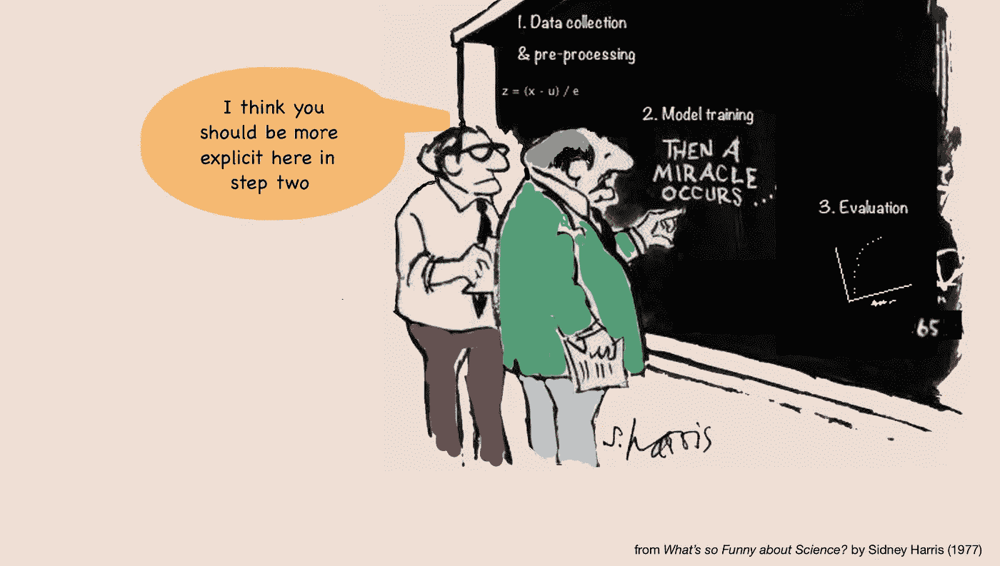
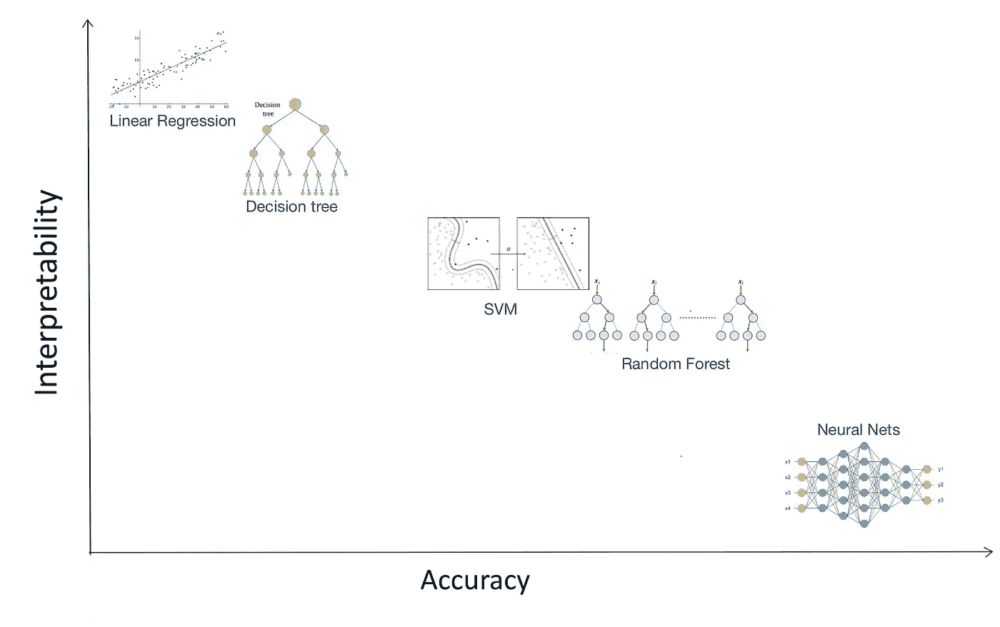
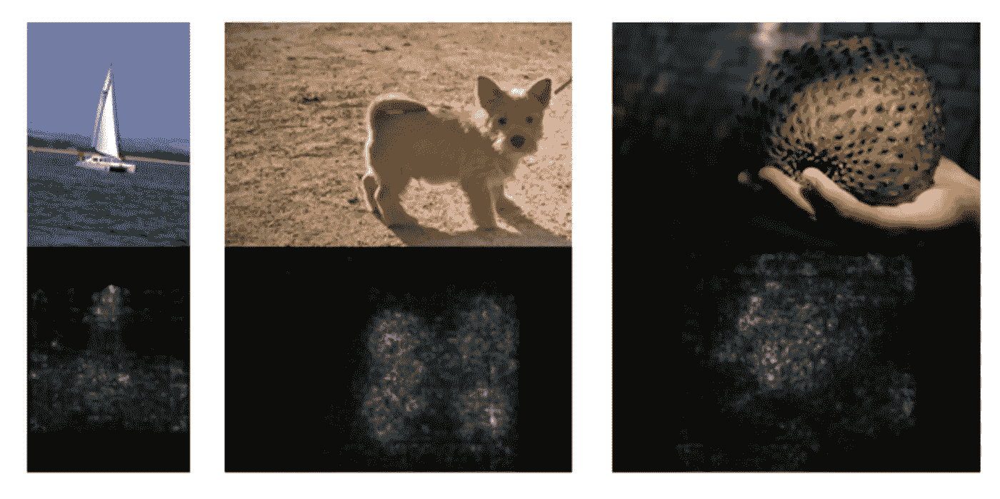
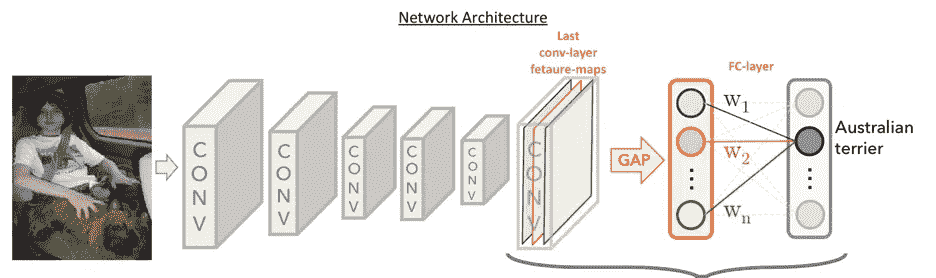
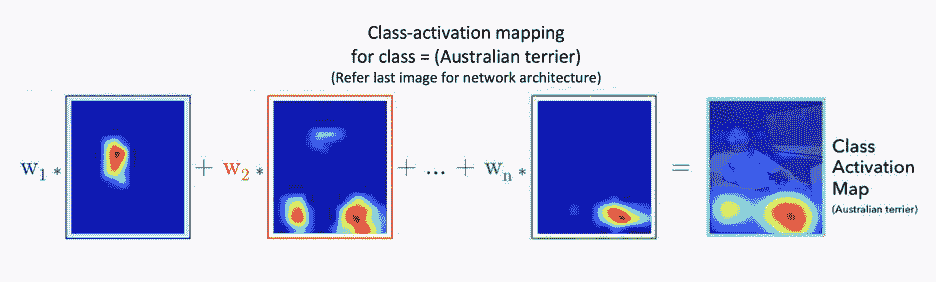
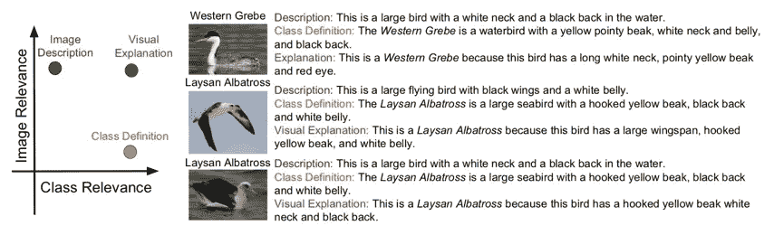

# 可解释的机器学习:第一部分

> 原文：<https://medium.com/walmartglobaltech/interpretable-machine-learning-part-i-bd1829b42b3a?source=collection_archive---------3----------------------->

现有的机器学习算法以其预测能力征服了世界。但是，他们通常不能为他们的预测提供解释。

> ML-可解释性是人类能够理解模型输出背后的原因和基本原理的程度。

它旨在回答以下问题:

1.  为什么会做出一个特定的预测，而不是其他的？
2.  模型什么时候成功？什么时候信任一个模特？
3.  它何时失败&为什么？何时忽略模型输出？

从可解释性的角度来看，现有的大多数模型都是黑盒。但是，首先为什么我们需要可解释的模型？

# 对 ML 可解释性的需求

由于缺乏对模型的信任，在较新的领域中采用 ML 技术经常面临不情愿。无论是开发模型的数据科学家、模型的用户，还是预测中涉及的利益相关者，都需要了解广泛的模型行为并对模型有信心。模型可解释性背后的主要动机是在模型中建立信任(T2)。

在涉及关键决策的应用程序中，模型的透明性更为重要。在医疗、国防、司法、教育等领域。模型必须对它们的预测严格负责。
模型可解释性旨在为模型预测提供**责任**。

很多时候，好的评估指标并不能保证好的实际性能。由于数据泄漏或有偏见的训练，模型可能正在学习一些不正确的东西。例如，当预测新闻网站上文章的性能时，我们可以选择主页上文章链接的点击率(CTR)作为性能指标/目标变量。在这种情况下，该模型将学习预测 clickbait 文章的较高点击率，这可能是不可取的。
通过揭露此类欺诈模型行为，解释有助于**检测偏差，调试&改进模型**。

可解释的模型将有助于弥合数据科学家和领域专家之间的差距，并实现有效的数据洞察**知识&交流**。此外，当模型产生洞察力而不是简单的数字时，它们可以通过跨模型的知识转移更好地促进科学的进步。

随着机器学习在更新的领域中被实验、应用和采用，ML 模型的可解释性已经成为学术界和工业界的热门话题。随着 GDPR 被欧盟采纳，机器学习的“解释权”的概念在全世界范围内得到了关注。此外，最近无人驾驶汽车造成的致命事故也引起了一些人对人工智能可信度的质疑。围绕能够愚弄模型的对立例子的研究也强调了模型需要更加健壮和合理。

# 现状

如果我们看看现有的模型，有一些可解释的模型，如决策树，线性回归等。，但它们的精确度较低。更精确的模型，如深度神经网络，往往更难解释。

Interpretability-Accuracy Tradeoff

我们可以使用过滤方法(相关性分析)、包装方法(在特征子集空间中搜索以优化模型性能)等特征选择技术来获得问题空间的重要特征。这种技术确实揭示了真实世界的数据趋势，但没有揭示模型所了解的趋势。

# 通往可解释性的道路

解释系统可以主要以两种形式提供解释:

*   影响预测的相关特征。
*   对预测至关重要的相关训练实例的最小集合。

此外，解释可以在

*   **全球级**，提供模型的高级视图，或在
*   **地方层面**，为单一预测提供正当理由。

ML-可解释性方法可以大致分为 3 类:

1.  **白盒解释** 白盒解释方法旨在开发模型特定的解释，利用模型的内部结构&洞察力。
2.  **黑盒解释** 黑盒解释方法侧重于模型不可知的解释。这种解释适用于所有现有的模型以及未来的模型。
3.  **现成的** **可解释模型** 开发内在可解释的新模型。

# 白盒解释

为了更好地理解现有的模型，人们正在进行广泛的研究，其中深度网络的可解释性备受关注。实现 ML 可解释性的白盒方法通过提取特定于模型的解释，利用模型的内部结构和洞察力来实现这一点。

剩下的帖子涵盖了一些以白盒方式理解卷积神经网络的研究成果。
大多数解释 CNN 的方法都是基于**突出有助于预测的相关图像方面**的想法。这是通过将输出信号通过网络传播回来，以某种方式理解输入图像的哪一部分具有编码的输出来实现的。

## 显著图

该技术基于计算输出分数相对于输入图像的梯度。生成的梯度图(称为显著图)突出显示了相关的输入像素，输出分数对这些像素高度敏感。对于获取输入图像 I 并输出类别 c 的得分 Sc(I)的 CNN，

Input images & their Saliency maps. [Source](https://arxiv.org/abs/1312.6034)

## 类别激活映射

CNN 中的全连接层是卷积层和分类器之间的黑盒，导致图像空间信息的丢失。这种方法用“**全球平均统筹(缺口)层”**取代 FC 层。GAP 对最后一个卷积层的“n”个特征图进行平均，产生一个 n 大小的向量。此间隙层输出向量进一步连接到完全连接的层，以产生所需的输出(分类情况下的得分)，如下所示:

[Source](https://arxiv.org/abs/1512.04150)

对跨最后一个卷积层特征图的每个空间单元进行平均，由特定类的相应全连接层权重进行加权，得到其**类激活图** ( **CAM** )。当缩放到输入图像尺寸时，该图突出显示该类别的区别图像区域。

[Source](https://arxiv.org/abs/1512.04150)

## 基于文本的解释

一些研究人员致力于基于文本的图像分类预测论证。当不能直观地捕捉到类的细微差别时，就需要这样的解释。

例如，在鸟类的图像分类中，理想的解释应该包括一些区别特征的组合，如鸟的大小、身体部位的颜色模式、喙的形状和大小。这些特征不能仅仅通过视觉来理解。

在论文[生成可视化解释](https://arxiv.org/abs/1603.08507)中提出了一个提供预测和文本解释的模型，类似于可视化描述模型。图像解释不仅应该准确地描述图像实例，而且还应该着眼于阶级区分方面。这是通过最小化图像描述损失&类别区分损失来实现的。

[Source](https://arxiv.org/abs/1603.08507)

所提出的模型在数据集上被训练，该数据集包含具有每个图像的类别和描述的图像。它由 3 个部分组成:

1.  **细粒度图像分类器**:预训练的卷积神经网络，用于预测图像的类别。它还用于提取强图像特征。
2.  **语句生成器**:递归网络，根据提取的深层特征和预测的图像类别，训练生成图像解释。
3.  **句子分类器**:基于 LSTM 的分类器，经过预训练，根据图像描述预测类别。

句子生成器被训练以最小化新的组合损失，包括:

1.  **描述损失**:基于生成真实描述的可能性。
2.  **区分损失**:基于使用句子分类器从生成的句子中预测正确类别的可能性。

除此之外，已经提出了几种其他方法来揭开神经网络的神秘面纱，如分层相关性传播、导向反向传播、Grad-CAM 等。白盒方法还包括解释其他模型的努力，如树集成、梯度推进模型等。由于在模型中建立信任和信心的需求日益增长，这一领域正在迅速发展。

下一篇文章 [***可解释机器学习:第二部分***](/walmartlabs/interpretable-machine-learning-part-ii-e328566b53f7) 详细介绍了黑盒解释和开箱即用解释方法。

**参考文献**:

1.  [DARPA XAI 项目](https://www.darpa.mil/program/explainable-artificial-intelligence)
2.  [人机交互研讨会](https://hci.iwr.uni-heidelberg.de/teaching/seminar_explainable_ML_2018)
3.  显著图:[深入卷积网络内部:可视化图像分类模型和显著图](https://arxiv.org/abs/1312.6034)
4.  类别激活图:[学习深度特征以进行区别性定位](https://arxiv.org/abs/1512.04150)
5.  基于文本的调整:[生成可视化解释](https://arxiv.org/abs/1603.08507)