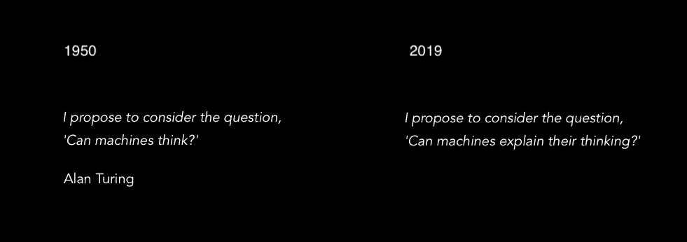
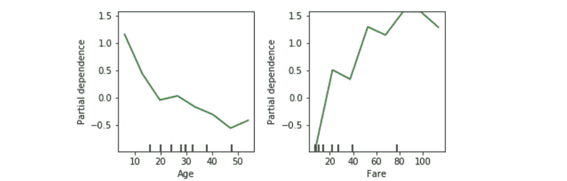
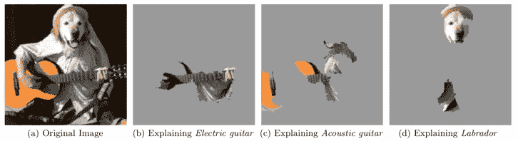
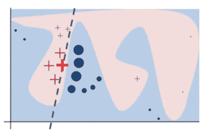
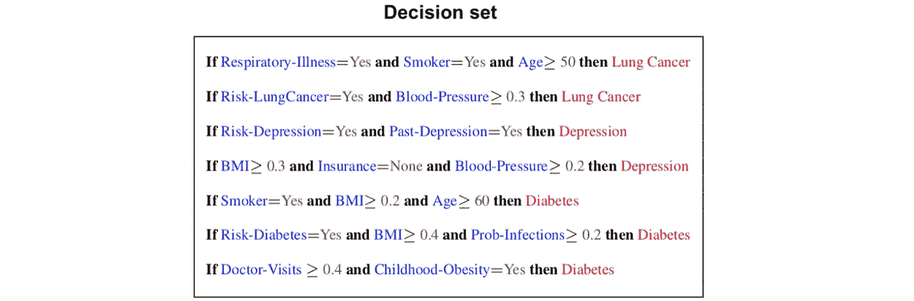
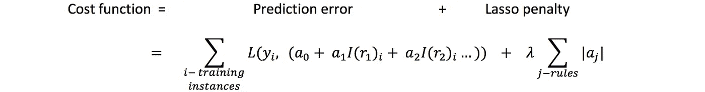
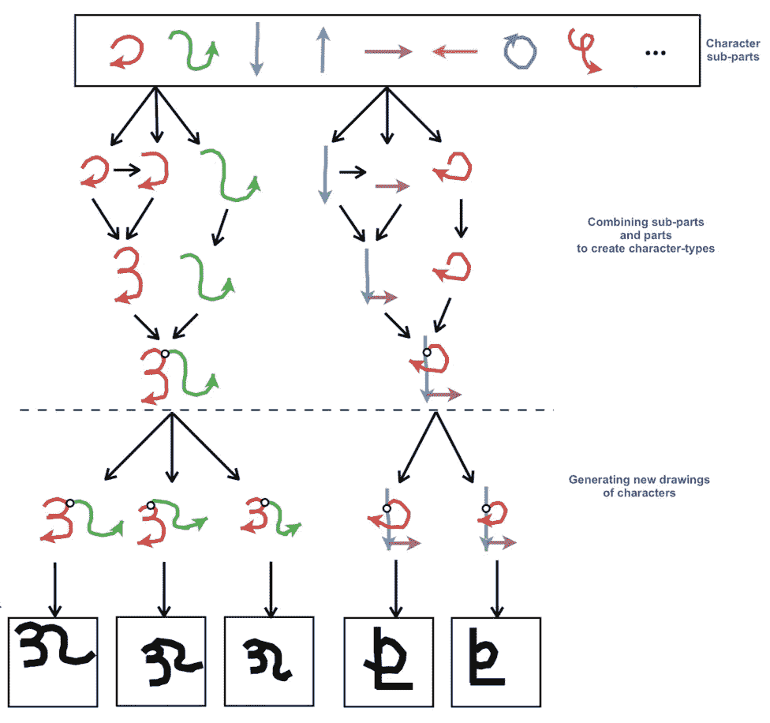
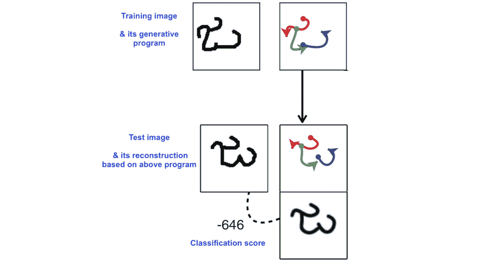

# 可解释的机器学习:第二部分

> 原文：<https://medium.com/walmartglobaltech/interpretable-machine-learning-part-ii-e328566b53f7?source=collection_archive---------5----------------------->

[***可解释的机器学习:第一部分***](/walmartlabs/interpretable-machine-learning-part-i-bd1829b42b3a) 谈到了机器学习领域对解释的需求以及对此的白盒解释方法。这篇文章涵盖了 ML 可解释性的黑盒和开箱即用的解释方法。

# 暗箱解释

理解复杂的机器学习模型已经成为它们在不同和关键领域中采用的基础。ML 可解释性的黑盒方法旨在提供**模型不可知的解释**，假设模型内部隐藏为黑盒。

1.  这样的解释系统**灵活**可以应用于任何车型，现有车型以及未来车型。每当采用一个新模型时，这就节省了构建特定于模型的(白盒)解释系统所需的努力。

2.这也允许对不同型号的行为进行简单的**比较**。

解释可以是特定于**实例的，**解释特定实例的预测，或者**全局的，**强调广泛的模型行为。

## 部分相关图

全面理解模型的基本方法之一是为每个特征绘制部分依赖图(PDP)。这有助于理解特征对模型预测的边际影响。PDP 是通过绘制各种特征值的边际平均预测值获得的。但是这些图没有捕捉到特征交互的影响。

Explaining a survival-prediction model on Titanic data: PDP for features age & fare

## Shapley 值特征贡献

**联盟博弈论**的 Shapley 值概念可用于计算各种特征对特定预测的贡献。在合作游戏的情况下，Shapley 值给出了游戏收益/奖励在团队成员中的公平分配。

为了计算特征‘I’在由总共‘N’个特征组成的实例‘x’的预测中的贡献，
设 I = 2；N = 5
S:特征的有序排列= {4，1，2，3，5}

*   p(S_till_i_exc):当只知道置换中直到‘I’(不包括‘I’)的特征时，x 的预测概率，即{4，1}
*   p(S_till_i_inc):当置换中只有‘I’(包括)的特征已知时的预测概率，即{4，1，2}

在这种置换 S = p(S _ till _ I _ Inc)—p(S _ till _ I _ exc)的情况下，特征‘I’的已知值的边际贡献

特征‘I’对总预测的贡献=
在所有可能的 N！特征排列。

Feature contribution in prediction

理解黑盒模型的另一个有趣的方式是通过在模型的预测(局部或全局)上拟合一个**可解释的代理模型**(像逻辑回归或决策树)。主模型提供精确的预测，代理模型提供相应的近似解释&帮助理解主模型。

## 石灰

基于可解释代理模型方法，**本地可解释模型不可知解释** (LIME)方法:

*   用**可解释的数据表示**来解释模型，而不是原始的实例数据。例如，根据不同图像补片的存在&不存在来解释图像分类。

Explaining image classification for the top 3 classes predicted by Inception network. [Source](https://arxiv.org/abs/1602.04938)

*   **学习实例附近的可解释模型**(类似线性模型)。这种代理模型在局部上忠实于预测模型。

例如，在下图中，复杂的分类预测函数对粉红色的特征空间给出正输出，否则给出负输出。为了解释用粗体红叉标记的实例，LIME 在相邻实例的预测上学习由虚线表示的线性模型。

LIME : Local linear model. [Source](https://arxiv.org/abs/1602.04938)

解释黑盒模型的另一条途径是突出显示**有影响的训练数据**或与被解释的实例相似的训练点。

# 现成的解释

开箱即用的可解释性方法旨在开发**内在可解释的模型**。这些方法中的大多数都是由基本的可解释模型驱动的——决策列表、决策树、线性模型、朴素贝叶斯等。
线性模型以特征和预测之间的单调关系的形式提供解释。特征交互也可以用作预测器来改善模型性能。像决策树、决策列表等模型。以映射到预测值的特征子空间的形式提供解释。

## 可解释决策集

决策集是一个基于规则的分类器，由独立的 if-then 规则集合组成。与决策表或树相比，这种方法不受任何结构的限制，具有更自然和可解释的决策边界。

[Source](https://cs.stanford.edu/people/jure/pubs/interpretable-kdd16.pdf)

一个可解释的决策集可以通过从候选规则库中找到一个最优的规则集来学习，目的是最大化准确性和可解释性。可以使用关联规则挖掘从训练数据中提取候选规则。这个组合优化问题的目标函数如下:

f-可解释性包括不同的可解释性目标:惩罚决策集中的规则数量，惩罚每个规则的长度，惩罚规则在训练数据上的适用性重叠，以及奖励规则覆盖的类别数量。
*f-accuracy* 惩罚不正确的预测，奖励对训练数据的正确分类预测。
由于目标函数是非负非单调的&子模，可以使用平滑局部搜索来找到最优集合。

## 规则匹配

为了结合规则和线性模型的优点，可以学习规则的稀疏线性组合用于预测。

例如，r1 =(年龄< 50 & gender = M) ; r2 = (BMI > 0.2)

候选规则可以通过首先学习数据上的树的集合，然后从这些树的节点中提取规则来生成。可以通过指定树的大小来限制规则的复杂性。

这些规则的线性组合通过对训练数据的正则化线性回归，通过优化下面的成本函数来学习。模型的复杂性受到套索惩罚项的惩罚。

使用规则系数可以解释模型的全局和局部行为。

## 贝叶斯程序学习

该框架旨在从有限的训练数据中学习简单的视觉概念(如手写字符)，并成功地对其进行概括(例如，生成一个字符的新图形，类似于人的手写图形)。它可以从单个训练示例中学习一个概念，这与现有的机器学习算法相反，现有的机器学习算法需要大量的训练数据来提供可接受的准确性。

这利用了来自基于训练数据开发的手写过程
*先验的更简单部分&子部分
*因果(程序)结构的手写字符的
*合成，以简化新字符的学习

它将字符概念表示为简单的概率生成模型，可以通过以新的方式组合部分和子部分来对新字符进行采样。

A generative model of handwritten characters. [Source](http://web.mit.edu/cocosci/Papers/Science-2015-Lake-1332-8.pdf)

分类和创成式任务可以通过可视化基础创成式程序来轻松解释。

Handwritten character classification. [Source](http://web.mit.edu/cocosci/Papers/Science-2015-Lake-1332-8.pdf)

随着机器学习在更新和更高风险的学科中的使用越来越多，可解释性已经成为模型的一个理想方面。这推动了揭示现有复杂模型的尝试，也促进了新模型的开发，优化了准确性和可解释性的共同目标。一些油田已经开始使用这些新的可解释模型，通常是在人在回路系统中，在使用之前由人来验证预测。由于对 ML 可解释性的广泛研究，大多数领域将开始逐渐采用这些。

**参考文献:**

1.  [部分相关图](https://statweb.stanford.edu/~jhf/ftp/trebst.pdf)
2.  Shapley 值特征贡献:[利用博弈论对个体分类的有效解释](https://dl.acm.org/citation.cfm?id=1756007)
3.  莱姆:[“我为什么要相信你？”:解释任何分类器的预测](https://arxiv.org/abs/1602.04938)
4.  有影响力的训练实例:[通过影响力函数理解黑盒预测](https://arxiv.org/abs/1703.04730)
5.  可解释决策集:[可解释决策集:描述和预测的联合框架](https://cs.stanford.edu/people/jure/pubs/interpretable-kdd16.pdf)
6.  两级决策集:[可解释的&可探索的黑盒模型的近似](https://arxiv.org/abs/1707.01154)
7.  RuleFit: [通过规则集合进行预测学习](https://arxiv.org/abs/0811.1679)
8.  贝叶斯程序学习:[通过概率程序归纳的人类级概念学习](http://web.mit.edu/cocosci/Papers/Science-2015-Lake-1332-8.pdf)